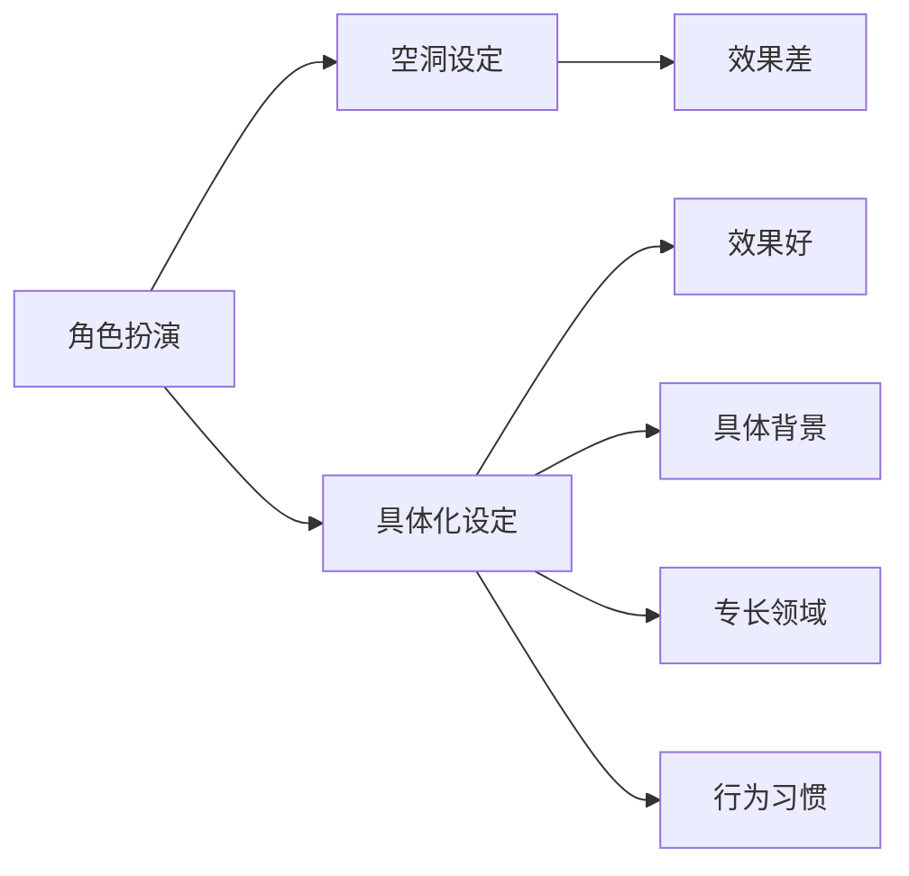

> **摘要** — 角色扮演技巧（Persona）通过在 System Prompt 中设定具体角色来提升 LLM 输出质量。核心是角色具体化（背景、专长、行为习惯），而非空洞的"你是专家"描述。



```markmap height=280
# 角色扮演技巧
## 空洞设定
- "你是专家" — 效果差
- 缺乏具体约束
## 具体化设定
- 具体背景
- 专长领域
- 行为习惯
## 效果
- 输出更专业
- 风格更一致
- 角色更鲜明
```

---

# 角色扮演技巧
