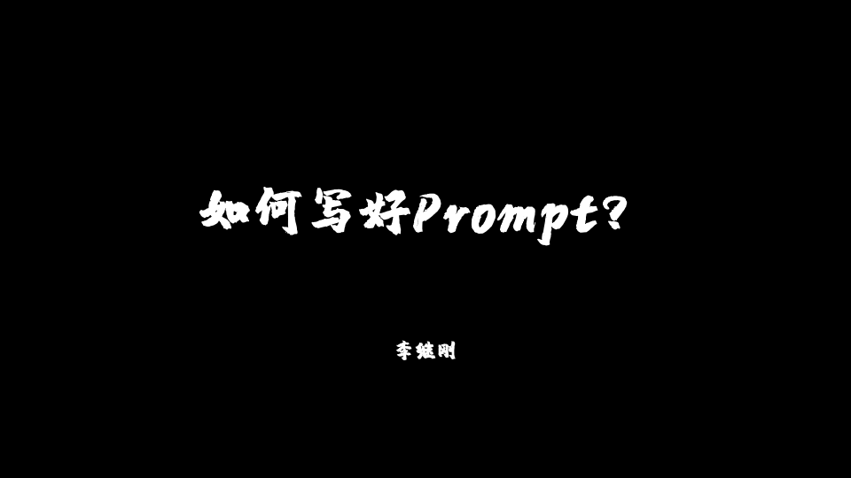
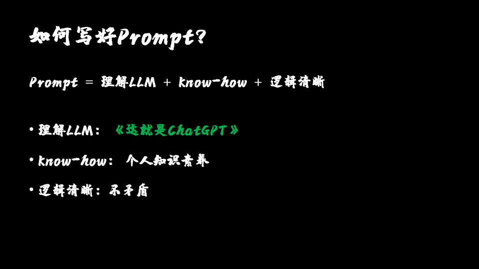
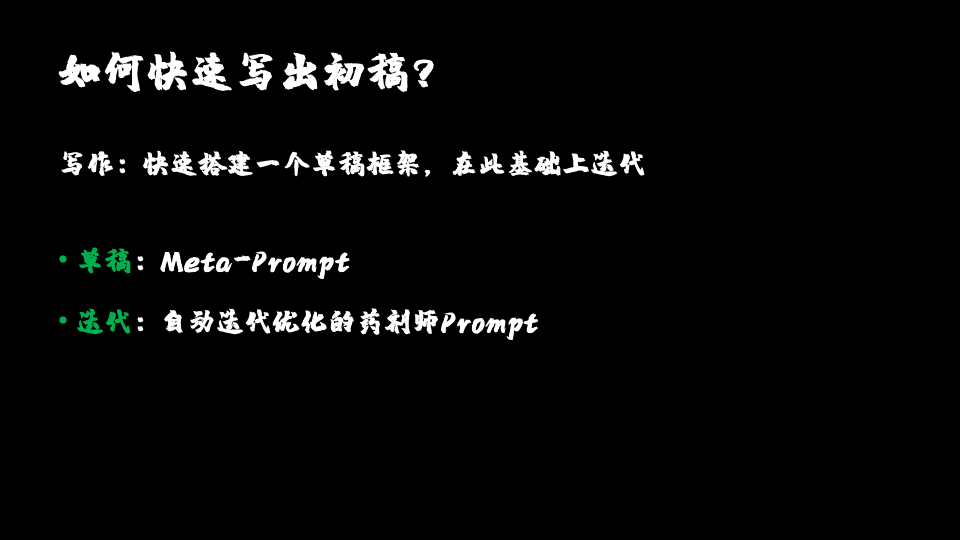
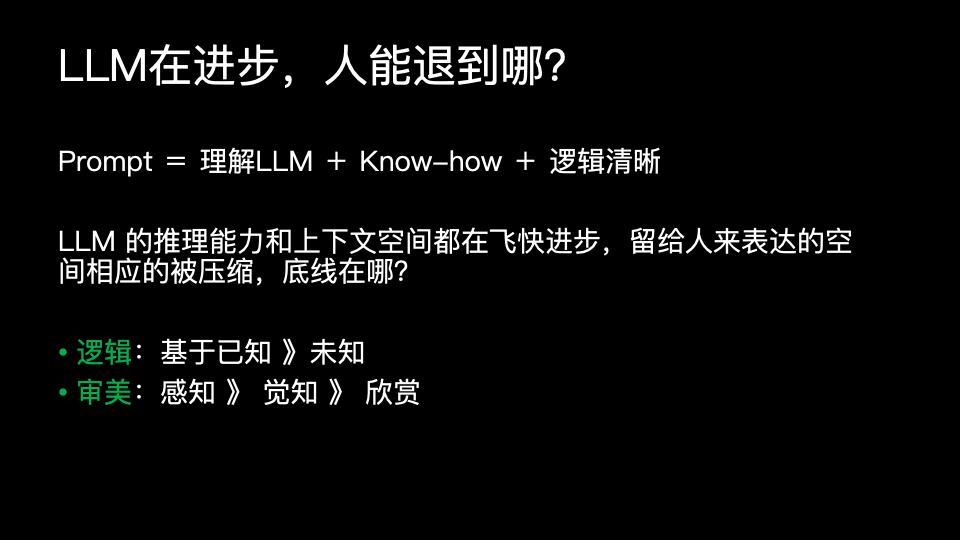

三月份的时候我们在北京举办了LangGPT第二期的线下沙龙交流，邀请了**即刻Prompt达人、“织梦师101”主理人李继刚**，刚哥给我们分享他在Prompt上的探索经验，收获很多\~

这两天终于把逐字稿整理出来分享给大家！

>

# **一、背景**

大家好，我是李继刚，平时活跃在即刻（同名“李继刚”）上，严格意义上来讲其实并不算AI圈的人，而是在互联网行业内工作，平时爱好读书，每年大概读50到100本书，是一个读书人。

在ChatGPT刚出来的时候，我在使用过程中发现一个很有意思的事：**读书的时候，书中一般都是以一个方法论、一个理论框架、一个模型，去诠释某个领域。** 

随着阅读量的积累，我们会有大量的笔记和方法论的沉淀，结合LangGPT框架或者自然语言描述，以及ChatGPT的推理能力，一个全新的视角逐渐清晰——即使是一本书，也能轻松转化为GPTs（现在叫GPTs，之前都是单独写一长段prompt），帮助我们在特定领域内实现框架的具体应用。

以前我们会跟一个没读过这本书的人去讲，这本书的理论或是方法论，它用了三步法或是六步法来解决什么问题，现在可以直接把这些知识封装交付，直接去使用。

无论是撰写一篇文章还是解决一个问题，只需选择合适的GPTs，它用的是SCQA法（基于金字塔原理的写作或表达方法，具有清晰的层次结构和逻辑性，有助于读者理解和接受信息），还是什么框架技巧，帮助我们理解核心思想。

这一方法我已实践了半年到一年，期间我在即刻平台分享了大量的prompt，逐渐大家也就慢慢地了解到我，这是我要分享的背景故事。

# **二、如何写好Prompt？**

对于如何写好Prompt，我理解有三部分构成：

## **1：理解LLM《这就是ChatGPT》**

首先，是对大型语言模型本身的深入理解。不同的模型如GPT、Claude、文心一言和智谱，即便对相同的提示词作出回应，也会展现出截然不同的结果。

这种差异源于**它们各自的参数设置、训练语料库以及微调策略的不同，最终交付出来给大家使用的模型能力自然千差万别。** 我们这里只讨论推理能力，同样的一个表述，同样的一个方法论，用同样的语言去交付，结果也是完全不同的，这个是做过对比和测试的\~

 因此，**了解每个模型的特点和能力，是构建有效prompt的基础**。

我们在写提示词的时候，针对哪个模型去写？这个问题是应该被确定下来的，在我个人使用过程中，比如选定Claude时，采用XML框架性的描述输入会带来明显的成效。但是在ChatGPT去应用XML和markdown的时候就会产生明显的区别。

所以它就会形成一种喜好，对于我个人而言，笔记都是用log或者用markdown写的比较顺手，ChatGPT也用习惯了，所以我一般会选定这个模型，然后**针对这个模型的官方文档的更新，它最近的参数、模型有没有升级，它最近有什么变化，对于这个地方有一个主线去跟着它走，我们了解了这个模型，然后也适应了针对这个模型去写Prompt，这时候，往往会得到预期效果。** 但当我们平移到其他模型，需要经过一个适应阶段，就跟换公司是相同的道理，公司文化不一样，我们需要有一个适应过程，所以理解大模型本身是写好Prompt的第一步。

我特别推**《这就是ChatGPT》** 一书。在阅读了市面上大量关于ChatGPT的书籍后，我发现这本书是对ChatGPT解释得最为透彻的一本，它原本是斯蒂芬·沃尔弗拉姆（全球最聪明的三个作者之一）所写的一篇文章，后由国内出版社引进并翻译成中文。这篇文章虽然用英文半小时即可读完，但它的深度和洞察力是其他任何书籍所无法比拟的。

这本书一直在我桌头放着，没事儿就翻一下，这本书我已经读了不下三遍，每一次读它都是有一种特别的感觉。如果有一本书能把ChatGPT讲明白，那就是它了，能把提示词就是预测下一个字符这些事情给讲透，这本书强烈推荐。

这就是理解GPT、理解LLM这个部分。

## **2、行业KnowHow(个人素养)**

此时我们已经理解了大模型，也看了一些论文技巧，比如说情绪能影响大模型的输出，比如说你指定角色可以明显提升效果等等，这些技巧性的东西其实我们总结一下，不超过十条，大概就是六条左右。**市面上主流大家讨论了这么多“骚”操作，罗列下来就是这十条。** 但这十条我们掌握了之后，发现它还是在理解LLM这个框架内的——只是说基于这个LLM这十条小技巧是生效的，我们写的时候用上了它而已。

我们完成了第一步，理解了这十条技巧是不是就一定能写好prompt？这方面在跟大家交流讨论碰撞包括我自己在写的时候就发现第二个问题，就是**Know-how**。就是说**我们对于一个领域、一个行业，一个细分场景的理解到底有多深？** 

举个例子来说，你是做制造业的，那制造业中间的整个工程链的的整个流程环节，每个环节需要注意的点都有哪些，跟不了解的人分别去问GPT这个行业要注意的哪些点，之后让他们分别去写prompt，这两者的深度是有差异的。如果是在这个行业经营非常深的人，他理解的深度是比GPT简单表述的那个框架要更深一层的。而这个层次的差异就决定着一个人最终写出来prompt的质量好坏。

这也是我想说的，大语言模型来了之后，大家都在喊“人类要下岗，人类要被灭”。因为它的能力很强，很多人的表现是远不如GPT表现的这么优秀，能有这么便捷的能力输出。因为很多人在做事情的时候，他本身就在做重复的事情，没有沉淀那个行业的know-how。

比如拿UI岗来举例，如果一个UI岗他会的仅是PS这个软件本身的功能。他知道这么操作能磨皮，那个操作能去背景，会的是功能，那他竞争力就很弱，大概率会被替代，对不对？但是如果他有的是knowhow，就是说一张图片怎么会更好看？他有**审美，知道什么是美**，知道这个颜色怎么搭，他有很多难以表述的**隐性知识**，那部分的行业knowhow才是他的真正的壁垒。

所以很多人在聊的时候就说，这个技巧我也会了，你这几本书我也读了，大模型的文档我也看了，我也知道我行业的一些东西然后我就去写了。但是同样的这个场景，为什么写出来差异还是很明显？这里边就涉及到**个人知识素养**，它是分层次的。比如同样的写程序，这个程序大家都在递归，对递归的理解，对于这个框架的体系结构设计，一个工匠和一个艺术家，对于它的理解也是不一样的。

这个地方是能最能拉开人跟人之间差异的一个东西，这就是第二部分要讨论的。

## **3、逻辑清晰（不矛盾）**

有一些朋友过来聊天，他们的工作内容，比如说写小红书，发抖音，写文稿，一些口播稿，会有一些场景，然后我们就去跟他们沟通，基于前面对于LLM的理解，使用一些技巧，拿着他们对于行业knowhow的一些总结，一些SOP，我们去写。

就会发现同样的SOP（大家都是一个公司的，三个人同时写SOP是一模一样的，大家的认知都在这一层），写出来结果还是不一样。

然后我拿出三个人的prompt列出来对比来看，发现在**逻辑**这个层面上，也就是**表达**层面会有一些区别。这个区别就是，**一个人是不是能够把一个复杂的事情给说清楚了**，就是这个知识已经在脑海里知道了，如果把它画一个圈子的话，这个圈子范围之内的信息确实能够get到，但是你get到了这些信息，能不能清晰的、不矛盾的把它给传递出来？

这个地方最是考验一个人的表达。我在看那些prompt过程中，看到大量“前后不一致”现象。比如在前边儿说“你要以轻松自在幽默的语气来向别人传递内容”。然后下半部分它在Workflow或者是其他的SOP的环节又开始说“你要严肃认真慎重的对待你的每一个字”。就是这种**前后矛盾的不一致表达，它会严重的影响整个输出的质量。**

因为它注意力是要偏移的，头和尾的注意力的权重也不一样，所以这种前后的矛盾不一致会影响结果的输出。同样一个语句，他用8个字来表达，你用18个字来表达，到底多的这个是你废话更多，还是说你的角度更丰富，表达更丰富，是需要你去认真思考进行迭代的。

## **思考**

以上三个要素综合起来是目前我觉得写好一个prompt最关键的三个环节。这也就导致了就是我现在其实是有点儿“往回退”，而不是“往前进”。

往前进的意思是说LLM大语言模型它日新月异，每天都在更新。大家睡一觉起来AI世界又发生变化，今天这个开源了，明天那个参数又突破了，这些天天在变。但是跟着它跑的过程中，我们会发现它其实是在不断侵蚀人类的表达和人类思考空间的。而真正的壁垒应该是“后边”这个部分，就是说LLM这个模型能力越来越强，怎么能为我所助，怎么成为我的杠杆。我应该做什么？

我觉得应该是要做到

* 1、**清晰表达，我们知道的东西，能不能很清晰简洁、直达内核的把那个东西给说出来？**

* 2、**我们的行业knowhow**，沉淀的东西多与少？

所以它需要“往回退”，就是打好自己的基本功，就对自己的行业是不是理解足够深刻，对自己的这个领域，感兴趣的这个课题是不是足够理解？这两者结合我认为，最后才能写出来一个比较好的prompt。

# **三、如何快速写好初稿？**

关于我之前写的那些prompt，它们如何快速生产，整个流程大概怎么做的？

我们自己写一个、两个、三个、五个，乃至更多prompt之后，会发现有很多重复的工作。而我自己是有一条原则，就是**一旦有一件事情我重复做了三次，我会停下来**。

计算机出身的我，写过代码的人多多少少都会有**复用思维**——当一个动作（日常生活也一样）如果我重复的做了三次，我就会停下来去想如何自动化，相当于封箱封装成一个函数，把它抽象成一个函数，可以一次次被当API一样调用，这样就不用每次重复的做里面的操作。

我一般在写的时候会用下面两个prompt。

## **1、Meta-Prompt**

在每次在写prompt的时候，都要分析场景，我要把这个场景按照LangGPT框架，往每个格子里填内容，它变成了一个完形填空题。但每次这个完形填空我都需要重新搭一个框架，填一些大概相同的内容的时候，它就是一种“重复”。

这时候我就会停下来，把它抽出来，抽出来的时候就形成了第一个叫**Meta-Prompt**。这个Meta其实就是元prompt，它的大概思路就是**把LangGPT或者选定的其它框架，这些框架形成一个SOP，前后加一些引导词，比如说用户会给你输出一些场景，你基于这个场景的理解进行丰富扩展，然后基于如下的框架进行填充，最终形成一个初稿的过程。**

类似于这种简单的描述，比如你想写一个抖音口播稿的文案，通过这个就可以很快的封装，形成一个三四十分左右的一个prompt出来，它就形成了一个简单的prompt版本。

而这一步的过程就写完这个enter之后，从输入到输出大概就是几秒钟的事情你就可以拿到它。比你脑海中隐约的要做的那个事情和你想到的几个词这种散漫的情况对比，其实是不同体系的，你基于这个体系可以再进行优化。

## **2、药剂师Prompt**

当我拿到Meta-Prompt产出的提示词之后，我开始去看哪里的词不精准，哪里的描述有冲突或矛盾，然后开始手动地调。但这个调的过程，调多了之后发现其实也就那几个角度。然后把这些角度抽出来，其实又可以形成第二个Prompt——药剂师。

我称它为药剂师，其实药剂师是跟盗梦空间里的一个角色有关。这个盗梦空间它其实是在筑梦，药剂师来加强这个梦境，这个地方其实就是一种**自动迭代优化**。

加强就是**我输入Meta-prompt输出的初稿给到它，然后通过它来把初稿prompt进行优化**。这个优化我们会着重把一些抽象的词展开，抽象的词我们认为它是一个压缩的词，那我现在需要把它**展开成具体的**。

比如说好看，那什么叫好看？好看的维度我们给它定义成五个维度，七个维度，这样不断的丰富扩展之后，就会形成一个优化后的prompt，这两步完成之后，基本上就能拿出来一个四五十分的prompt。

这时候**再注入我们的行业knowhow，逻辑表达的一些优化**，再稍微调一下就可以生成一版对外可发布的0.1版本。

目前我要写一个Prompt，基本上就这两步，加上第三步的那个手动的微调就可以，大概是10-20分钟就可以生成一个prompt。想写什么就看你对哪个场景感兴趣，对这个场景的knowhow了解多少，只要了解就很快就能达到这个效果了。

然后这两个的prompt我都开源在[LangGPT知识库](https://langgptai.feishu.cn/wiki/RXdbwRyASiShtDky381ciwFEnpe)里了。这个其实很好写，Meta那个更好写。其实大家一看，基于自己的认知，可以分分钟的把它变成自己的，或者比它更强，比如我选了五个模块，完完完全全可以改成七个、九个，甚至你觉得更经典的四个都无所谓。只是这个流程思路和方法只要是一致的，后边就很容易实现。

# **四、LLM在进步，人能退到哪？**

最近我一直在思考的问题就是，大语言模型一直在进步，能力一直在增强，人能退到哪？

## **LLM进步**

曾经我们用它去写一个词，或者让它达到一种境界的时候，它不理解。

比如，如果大家同时用GPT4和GPT3.5对比的话是很明显的。

我们对GPT4说，你输出一个“言简意赅”的一句话，它就能输出一个“言简意赅”的话。一看就符合我们的需求，它实现我们的效率，就是它懂你了。但如果同样一句话，你去跟3.5说，你给我一个“言简意赅”的话它就不行，它理解就不到位。

理解不到位之后你要干什么呢？你要把这个词展开，什么是“言简意赅”？

你先下个定义，加上定义一下什么是“言简意赅”，之后再说你给我一个“言简意赅”的话，效果就出来了，也就是说3.5不一定理解它。你们两者对于语言的理解不在一个层次上。那你就明确定义，把这个词诠释一下，它不理解的时候，你需要扩展解开，效果就能出来。

而现在**大语言模型的进步意味着这个理解是不断地前进的**。

也就是说之前很多情况你需要展开说，通过五个角度去描述，现在不需要了，只需要一个词就够了。

在这种时候我们的表达，**语言的表达是在被ChatGPT压缩的...**

它在往前进，你在往后退了。那这个退到极限，再设想GPT6、7、8、9、10出来的时候能够留给我们的空间还剩多少？

## **逻辑 + 审美**

**“逻辑”和“审美”**这两者是我目前的思考，是最后“退退退”剩下来两个地方。

**第一个是逻辑，第二个是审美，这两者是一旦它（GPT等LLM模型）真的到了一种言出法随的地步的时候，可以来区分人跟人前后的差异，上下的层次。** 我理解就是这两个。

我们人类的科学进步其实依赖**演绎法和归纳法**。

**演绎法**就是说只要给我一个已知的前提，一些信息小前提，我就一定能通过已知，推演出未知，我不断往前一步步走，通过实验，通过方法，我不断地知道新的信息，就能不断知道更多的东西。

另外一个是**归类**，只要看见十个信息是这样，我总结它形成一个规则，没有看见反例就认为规则成立，这两者交替着往前，人类科技一直在发展，所以我理解的科学方法就是逻辑思考，基本上这是我们的底线。

**第二个是审美，其它方面我想了很多维度，然后当尝试去比的时候，大语言模型都很容易把它给击灭击破，但是审美这个词目前我感觉还是人类可以守的一条线。**

我经历了一些事，读万卷书，行万里路，我看见了一些风景，这些会形成一个人的个人经验。而这个经验如果你有很好的词汇知识素养的话，这个经验对照着你人类的认知中的一些词。

而你对这些词是**有一些感知，是有一些觉知**，就是你不会认为这个词它代表跟大语言模型的向量存储空间一样被token化，然后存储的时候，比如你说一个好看的花，它会存储N个维度。

比如它跟阳光相关，它跟春天相关，这些词是因为理性的，而这个地方在人类大脑也可以。

而基于这个认知，基于这个觉知，你会产生一些比如说这个地方美好，那个地方丑陋，我喜欢这个地方我讨厌那个地方，它会产生一种欣赏。

而这一部分我理解是大语言模型现在再进步也还是侵蚀不到的。

大语言模型它在往前走，后边的GPT5马上要来，对吧？Sora马上要来，因为要建一个物理模型，在虚拟世界那个VR也要来，就是这一部分是不断的往前面走。

**我们人类的行业knowhow这一步，我理解也是会进一步被侵蚀的。**

绝大部分人日常或者说不那么深刻的去理解，这信息是可以被总结归纳的，会作为大语言模型语料输入训练的。这个其实是很自然的一个现象。

比如实习生进来的时候，他要读文档，他要读行业前辈给总结的SOP。遇到这种情况，这种浅层次的认知是大语言模型最容易理解的，然后他真正难以理解的，或者说**很难以token的那部分，其实是隐性的那部分**，就你说不出来的那句话才是你应该能掌握的那个knowhow。

比如骑自行车，你可以说“两脚往前蹬一下，并利用惯性往前走”，这个SOP可以写出来，可以说出来。

但是你真的自己从不会骑自行车到会骑自行车的那一刻，那个平衡感的掌握它很难用语言描述出来，**这个隐性知识是这个行业knowhow中的最后的底线。**

在这里我把它表述成逻辑信息，但我认为这个词是没有找准的。

我脑海中的那个词和我印象中的那个认知是没有匹配上的。这个逻辑清晰是没有跟那个认知是完全契合上的。

**但它大概意思是说应该还有一个逻辑推理（你对过程的掌握）以及有一个审美和对这个过程有个判断。**
留给大家一同思考\~
