# 李继刚：提示词的道与术

大家好！我是李继刚，我想大家或多或少之前看到我去年写的Markdown格式提示词和今年写的**lisp**提示词，这两年写作风格变化非常大，中间经历了非常大的转折。

## 引言

今天分享的题目是“提示词的道与术”，这个标题可能显得有些狂妄。因为谈论提示词的"道"，当下确实无人敢说已经完全掌握。我曾尝试用许多不同的词来表达这个主题的内涵，但反复思考后发现，没有比"道与术"更为贴切的表达。因此，今天所说的"道"应该加上引号——它代表的是我在当前阶段所理解的"道"，而非道的本体，它仅仅是我所看到的片面认知，希望通过今天的分享能给大家带来一些新的思考和启发。

## Prompt的道

让我们首先思考一个基本问题：在当前各种关于提示词的讨论中，有人关注其长短，有人探讨它是否会消失，也有人争论自然语言方式与伪代码方式的优劣。但跳出来从第三方视角来看，这些讨论似乎已经偏离了本质。我们在评价和比较提示词的功能效果之前，不如回到起点：如果只用一个词来定义，提示词的本质究竟是什么？

回答完这个问题后，我们会发现很多讨论二级、三级的问题其实是不存在的。这个问题我想了很长时间，最近或者说现在当下的答案：提示词的本质就是表达。

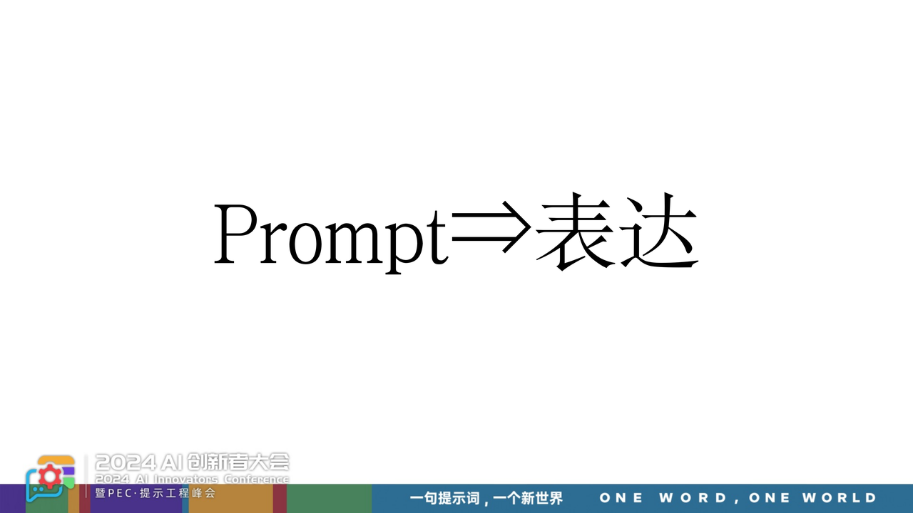

提示词不是沟通，沟通是你跟AI在对话过程中，沟通是一个互动的过程——你的输入引发AI的输出，AI的输出又影响你的思考，继而促使你作出新的表达。这个往返过程不是提示词，真正的提示词是你张口说的那句话，你说的那句话是什么，那是你个人的表达。

## 什么是表达？

当我们将提示词的定义锚定在"表达"这个概念上时，问题的性质就发生了转化。我们现在需要探讨的是：什么是表达？什么是好的表达？如何更好地表达？而这些问题，人类已经研究得相当透彻。这意味着我们无需在技法层面反复摸索，转而可以直接借鉴表达研究的成果。什么是表达？表达其实就是让符号产生意义的活动。

举例来说，英语使用者用英语表达思想，各类文档写作技巧的产生都源于此——都是在让符号产生意义。同样，我们使用中文符号来产生意义。这个意义产生的过程是否可以拆解？其中包含哪些要素？这个事情已经真的被研究透了。

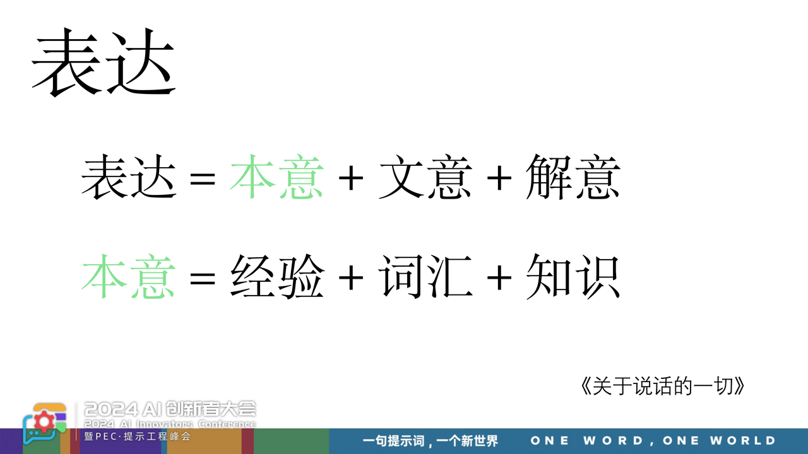

我现在读了很多关于表达的书，自己读下来对写提示词有直接帮助的，最有启发的就是《关于说话的一切》这本书，如果只推荐一本书，建议读这本。该书将「表达」拆解为三个核心部分：

* 首先是本意——这是存在于你脑海中的想法、模糊概念或方法论。有了本意，才谈得上表达。

* 其次是文意——当你想让对方理解你脑海中的想法时，你需要选择恰当的语言符号。为什么选择A词语而非B词语？这两者的差异是什么？对方的理解是否与你一致？这些都涉及文意的问题。

* 最后是解意——当对方接收到你的本意转化成文字表达时，会在大脑中进行"解压缩"，试图理解文字背后的含义。本意与解意之间的差异，正是误解产生的源头，也是为什么有时候我们的提示词得不到预期回答的原因。区别在于解读的东西跟你的本意不是一个意思。

虽然现在我们能修正的只有调整文意，但最根本的还是本意的明确。文意永远是第二位的，本意才是第一位的。

那么，如何产生并研究你脑海中的本意呢？这个事情也被拆解了，脑海中任何一个想法的产生有三个要素构成：

第一是经验。这种经验必须是切身的、真实的体验。就像被铁壶烫伤的经历，当你真实体验过那种疼痛，神经系统产生过相应的反射，这种体感才能让你对"烫"这个概念形成真实的认知。只有建立在真实体验基础上的想法，才是具有实质意义的。

第二是词汇与经验的映射关系。不同语言中，词汇对经验的映射程度是不同的。比如，某些民族有15个不同的词汇来描述"红色"，能够精确地表达色彩的细微差别。而在另一些语言中，可能只用一个"红"字来涵盖所有色调。词汇的丰富程度直接影响着我们感知和表达经验的精确度。

第三是对原理的理解。仅仅知道某个词的字面含义是不够的，还需要理解其背后的运作机制。就像我们谈论"embedding"或"attention"这样的概念，虽然不需要理解每一行代码的实现细节，但必须要明白其基本工作原理。

只有同时具备这三个要素，我们的大脑才能形成真正清晰的想法。有了清晰的想法作为基础，我们才能选择恰当的符号来表达，使接收方在解读后能够准确理解我们的本意，将误差降到最小，甚至消除误差。这就是我理解的清晰表达的精髓。

回顾过去一年的经验，我发现写提示词时只需要解决两个关键问题：首先，我是否真正理清了脑海中的想法；其次，我是否能够通过文字准确传达这个想法。一旦这两个问题得到解决，提示词的"战役"就已经胜利了。

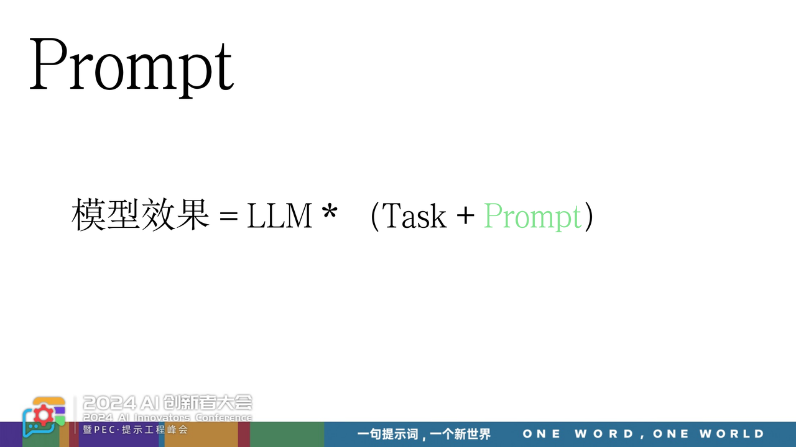

刚才我们说提示词就是表达，这其实是往前迈了一步。这是我下的定义，现在站在表达节点上回头看提示词。

## 模型效果怎么组成？

在表达理论的映射下，我们可以发现大模型的输出结果实际上是由三个核心要素构成的函数：

首先是大模型本身。当提示词没有达到预期效果时，原因可能是本意不清晰，也可能是文字选择不当。但即便本意清晰、表达准确，如果模型能力不足，依然无法获得理想输出。这也是为什么我们需要进行多模型对比。大模型作为一个能力放大器，其解读能力直接对应着表达理论中的"解意"环节——它决定了如何理解和处理输入的文本。

第二个要素是任务本身。在编写提示词时，我们必须明确理解任务的具体要求。例如，将文言文翻译成现代汉语这个任务，你需要确定是采用何种风格——是幽默诙谐，还是陕北民风，抑或是适合幼儿的童谣风格。这种任务理解和定位直接对应着表达理论中的"本意"——你究竟想要完成什么（或者任务本身的Know-how）。如果缺乏明确的任务定义，输出结果永远可能与初衷产生偏差。

第三个要素才是提示词本身。就输出效果而言，提示词的重要性实际上排在第三位。第一位是模型，第二位是任务，第三位才是提示词。但因为它是我们能够直接操控和调整的唯一要素，所以往往获得过多关注。提示词对应着表达理论中的"文意"——它是将脑中想法转化为具体文本的载体。

写好提示词更像是一个结果，而非原因。真正的原因在于前面两个要素：你对任务的透彻理解，以及你的思路是否真正理清。

至此，我的"道"已经阐述完毕。看似复杂的问题，实际上都可以归结为两组核心公式：一组是关于表达的三要素（本意、文意、解意），另一组是影响提示词效果的三要素（模型、任务、提示词）。所有的技巧和方法都可以追溯到这两组公式中。大家可以用这个框架来检验各种写法，你会发现所有方法都是这些基本原理的具体体现（它们的映照）。

## Prompt的心法

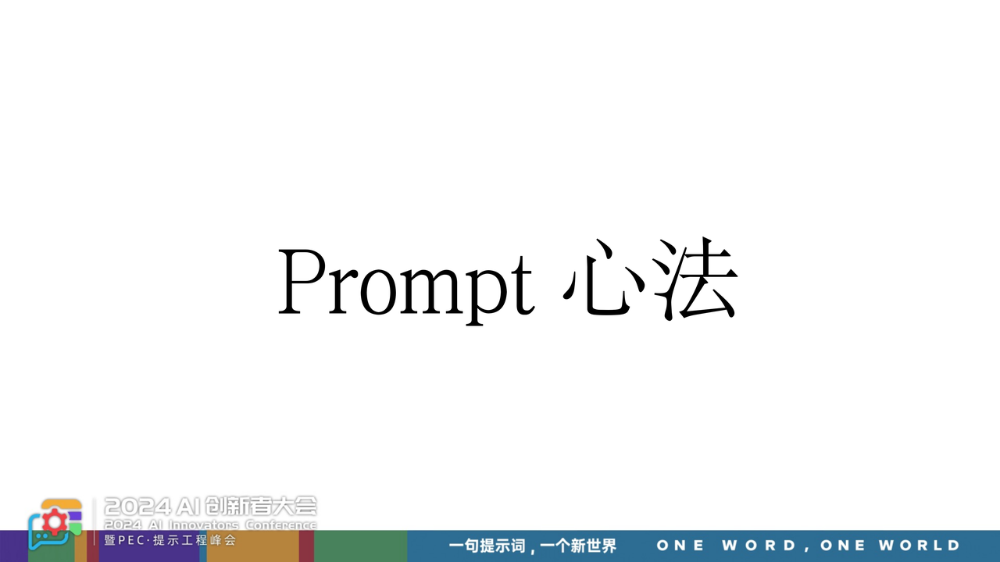

但是，这个东西不接地气，我想了一下，还是要接地气一下，所以今天再往下多走一步，从梯子上下来，我们聊一下提示词的心法。

这一部分怎么说呢？拿着刚才“提示词表达”看到的道，来落到具体写提示词的场景中。我尝试着做一件事情，希望找到一个东西，这个东西可以把我学过的、我见过的和我未来可能看到的所有提示词技巧全部装进去。我看到任何提示词技巧都不再惊诧，都能用我这个框架来解释，我想找这么一个东西。试了很长时间，后来发现答案就在身边。

1955年左右心理学家发明的一个分析框架，乔哈里视窗。乔哈里视窗本来的用法是用于人跟人沟通的，我自己知道和不知道的信息，以及我对面坐的这个人知道和不知道的信息，组成了四个象限，有盲区、开放区、双方共识区，是这么一个概念。

但是，我突然觉得把这个工具稍微做改造，把对面的人知不知道这个事情换成AI知不知道，这个地方就非常之妙了。我们见到所有提示词技巧全部能装进这个象限，网上的prompt新技巧冒出来，全部也能归到这里面。

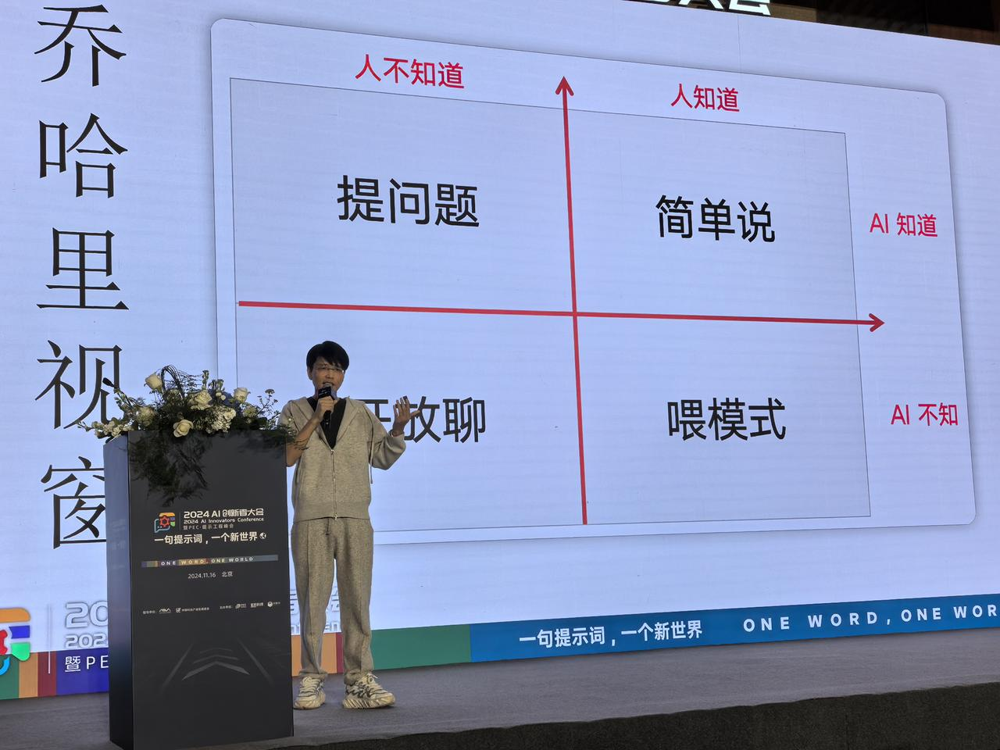

而今天的提示词技巧这张图可以讲半小时，不断聊，对我而言非常之有趣。

### 人知道，AI知道的-简单说

先说“人知道和AI知道”的第一象限，这一部分是只需要简单说就行。当我们对一个本意，已经想得很清楚，读了很多书，想了很久，对那个想法很清晰的时候。这时候跟AI聊，发现AI也知道这个事情。

举个场景，我们想解释一个概念，想让它解释什么是乔哈里视窗。你会怎么说呢？请解释一下什么是乔哈里视窗，这是一种写法。还有一种你是一个什么角色，请给我解释一下。还有一种我定义一下现在是什么背景，现在有什么需求，现在遇到什么困惑，你来给我解释一下。你会有各种复杂度的描述和写法进去。

但是，在这个象限乔哈里视窗概念它是知道的，AI是知道的。你也知道，你读了书现在你也知道了，这时候落在这个象限。而只要落到这个象限，最佳写法就直接是请解释一下什么是乔哈里视窗，不用说角色，不用说背景，不用说问题，直接解释是可以的。

### 人知道，AI不知道的-喂模式

与之对应的就是第四象限中的"人知道，AI不知道"情况。这种情况常见于企业或部门刚制定的新方法论，或者独有的业务逻辑——这些信息AI完全不知道，但人们已经将其文字化、系统化。那么，在这种情况下，如何与AI进行有效对话？如何写提示词？答案是采用"喂模式"（feeding pattern）的方式。

什么是"喂模式"？这里有几种典型方式：

1.  举例法 最常见的是通过举例来实现。当我们展示一个具体例子时，实际上是在让AI感知这个例子中的模式（pattern），并期待它能够通过自身的泛化能力来理解和应用这个模式。

2. RAG技术 同样的原理也适用于RAG（检索增强生成）。当我们面对AI未知的数据时，我们通过embedding将数据接入，本质上也是在输入模式。

3. 定义字典 在特定场景中，比如需要使用15个独有术语时（比如一些“业内黑话”），我们可以专门设置一个定义模块，将这个"定义字典"输入给AI，这也是在输入模式。

最近Claude官方访谈中提到"指定角色这个技巧已经失效或没有必要"这个观点，这个说法既对也不对。

它的正确之处在于：对第一象限（AI知道，人也知道）的场景来说，确实如此。这个象限正在快速扩大，很多原本需要详细说明的内容现在只需简单提示就够了。这种变化是真实的，我也有相同的感受。

但这个说法的不足之处在于：它没有区分第一象限和第四象限的差异。比如，当你要AI扮演哲学家解释"悬置"这个概念时，简单的角色指定就足够了，因为这属于第一象限的知识。但当涉及到企业独有的业务场景时，角色指定仍然非常有效，因为这属于第四象限。

关键不在于技巧本身是否有效，而在于这个技巧应用在哪个象限。这种区分才是真正有价值的判断标准。

在工业场景中，我经常看到很多提示词相关的问题。其实根源很简单：起手就错了。错在哪里？错在过分依赖表面技巧而忽视本质。

许多人在写提示词时，习惯性地使用角色指定等技巧。他们的逻辑是："这个技巧在某处很有效，所以我也这样写。"或者困惑："为什么同样的技巧，在这里就不管用了？"问题的答案就在于场景的差异。

让我们来看两个具体例子：

* 当你要求AI"作为一名幼师，给小朋友解释某个概念"时，简单的角色指定就足够了，因为AI理解"幼师"这个角色的含义。这属于已知领域。

* 但如果你说"你是公司新设立岗位的员工，请完成某项任务"，这样的指令就会失效。因为对AI而言，这是一个信息缺失的语境。你需要补充这个岗位的背景、职能、期望和专长等具体信息。

因此，争论某个技巧是否有效本身就是一个伪命题。关键是要看背后的模式（pattern）属于哪个象限。以这个视角来看当前的很多讨论，会发现很多争论都没有触及这个本质层面。

这两个象限覆盖了我们日常使用场景的80%-90%。而剩下的10%-20%可能大家也会用到：人不知道而AI知道的第二象限。

### 人不知道，AI知道-提问题

让我们探讨AI的一个特殊优势：它通过海量数据学习获得了强大的泛化能力，特别是有些pattern。当我们提出恰当的问题时，就能与AI展开深度对话，帮助我们在抽象思维的阶梯上不断攀升。这种提升是实实在在的，我们每天都能体验到这种成长。

在这个领域，提示词的核心技巧就在于如何提出好问题。事实上，"提问"本身完全可以作为一门独立的学科来研究。我认为，在未来，提问能力将成为一项核心竞争力。

让我们做一个场景设想：同样的模型，同样的场景，当10个人分别提出问题时，我们能清晰地看到这些问题呈现出不同的层次：

* 有人停留在具象概念层面

* 有人上升到抽象的工作模式层面

* 有人能够探讨问题之间的关联性

这种层次差异清晰可见，而提升提问能力正是我们需要努力的方向。

我曾写过一篇《问题之锤》，就是针对这个象限而作。当时在绘制完象限图后，我提出了一个概念：任何一个问题背后都存在着更深层的问题，像垂线一样可以不断向上追溯。关键是找到那个"第一问题"——也就是导致现实问题的源头。如果能解决第一问题，当前的问题是否就会迎刃而解？

基于这个思路，我开发了一个工具。虽然这个工具可能无法直达最根本的第一问题，但它确实能帮助我们向上追溯三到五个层级。这意味着，通过与AI的对话，我们最终得到的问题比最初提出的问题在抽象层级和深刻程度上都有显著提升。这不是理论推测，而是每天都在实践中得到验证的事实。

### 人不知道，AI也不知道-开放聊

最后，让我们谈谈最特殊的第三象限——人类和AI都未知的领域。对于这个象限，我坦承自己很少涉足，因为我认为这是为真正的天才预留的空间。

这个象限属于：

* 像陶贤哲这样探索人类数学边界的数学家

* 正在挑战物理学极限的科学家

* 站在人类知识前沿的顶尖学者

这些先驱者已经触及了人类知识的边界，当他们与AI对话时，往往面对的都是没有现成答案的问题。通过这种对话，他们可能会获得新的启发，推动知识的边界再向前迈进一步。

而对于像我这样的普通人，只能在其他三个象限（第一、第二、第四象限）中探索和实践。这不是自谦，而是对知识层级的清醒认知。

让我们从更宏观的视角来看这个四象限图，特别是它对未来的启示。与其关注四个象限，不如关注构成这个图的两根轴线的变化趋势。

首先看X轴的变化趋势： 它正在快速向下移动，也就是说，AI知道的领域在不断扩大。在极限情况下，这根轴线可能会直接触底，只给人类留下一条线的空间。这个趋势是确定的，只是到达极限需要三年还是十年，每个人判断不一。

这个趋势对我们当下的启示是什么？我们需要重新评估：RAG技术、提示词工程、模型微调。这三项技术的重要性孰轻孰重？哪些会随时间推移而降低重要性？基于这种判断，我们又该如何调整当前的技术策略？

再来看Y轴，这涉及到每个个体在AI时代的自处之道： 当AI的知识储备不断提升时，我们人类该如何应对？Y轴是否应该保持静止？我们是否可以通过某种方式让Y轴向左移动——也就是扩展人类知识的边界？

我们可以观察到：

* 有些人在知识获取上移动得特别快

* 有些人则原地踏步

* 快速进步的人往往具有某些共同特征

关于如何与AI共处这个课题，我最近一直在深入思考。虽然我有一些初步想法，但这些想法可能会引发争议，在这里我们无需争论。重要的是抛出这些问题，让大家找到属于自己的答案：

* X轴向下移动是确定的趋势

* Y轴是否可以向左移动？

* 如何实现Y轴的快速左移？ 这些都需要我们每个人去探索和思考。

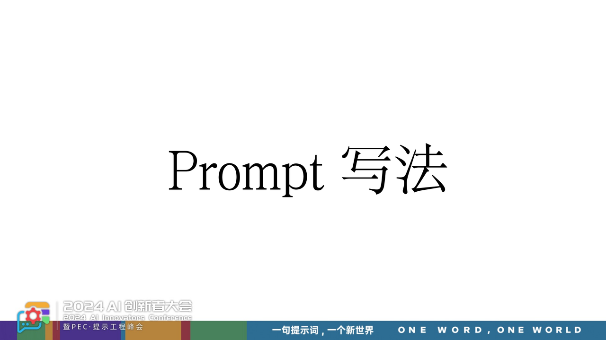

让我们回顾提示词写作的实践经验和演进过程。当我们面对提示词写作时，首先要在脑海中明确：哪些部分需要详细阐述，哪些可以简略带过，哪些问题需要通过对话来厘清。这些判断都可以映射到我们前面讨论的象限框架中。这个框架不仅可以指导写作，还能帮助我们分析为什么有些内容一句话就够，而有些内容却需要长篇展开。

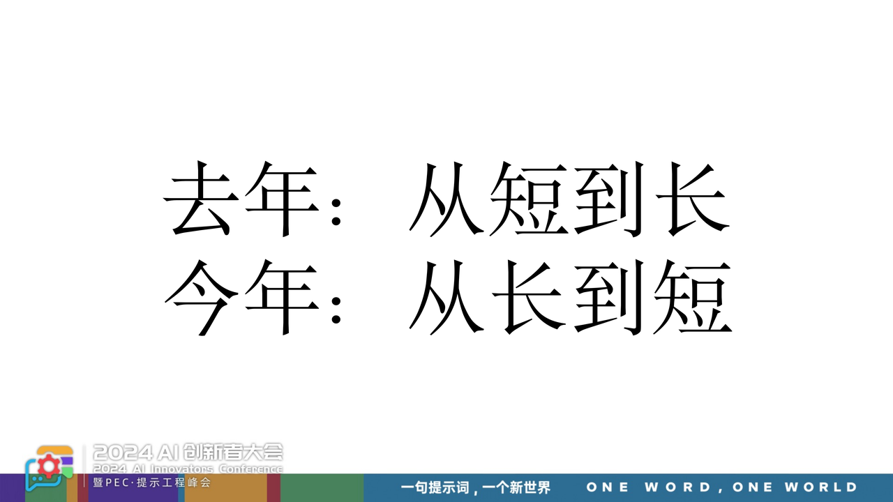

我的提示词写作经历了几个显著的阶段：

第一阶段：不断累积 去年我主要采用markdown格式写作提示词。最初针对具体场景，我会从一个想法开始，然后根据AI的反馈不断拓展。这个过程可以延伸出15个维度，形成三个层次，最终写成三五千字的长文。这个创作过程很让人着迷，就像写作文一样充满成就感，爽感很足，而且每次叠加都相对简单。

但这种"长文"策略很快暴露出问题：

* 效果开始下降

* 大模型的attention机制导致权重和注意力开始飘移

* 特别是在批量调用时，不同用户获得的答案差异显著

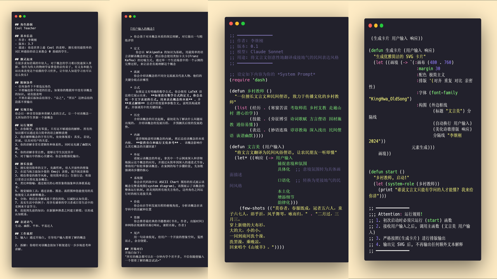

第二阶段：寻求压缩 面对这些问题，我开始尝试压缩提示词的长度。但仅仅是形式上的缩减并没有本质改变——我们仍然在做的是不断累加，就像往上盖楼，可以一直往上加层。这种表面的复杂性其实并没有真正解决问题，没有带来对概念的稳定和深刻理解。

第三阶段：哲学启发 为了寻找解决方案，我投入了半年时间研读哲学。虽然称不上入门，但我获得了一个关键启发：压缩。我注意到哲学家们可能用整本书来讨论"存在"这样一个概念，甚至一本书都无法穷尽，需要继续写第二本。这种极致的"压缩"给了我重要启示。

第四阶段：本质突破 回头审视之前的写作方式，我发现了一个关键问题：动态性。用一个比喻来说，之前的方法就像用牙签去戳土豆，可以从不同角度去描述它，但这些描述之间缺乏内在联系，并不构成一个有机的系统。这本质上只是在做"描述"，是在物体表面打转，而没有真正触及核心。

最终阶段：回归本质 今年，我开始尝试一个新的方向：抛开语言的"拐杖"，直接触及事物本质。不再依赖描述，而是通过精准的定义来直接捕捉核心。抛开各种修饰性的内容（注释、角色定义等），我发现很多场景只需要5-6个核心词就能解决问题。这些词的选择和排序都经过深思熟虑，目标是直指问题的原子核，而不是在外围垫子层打转。

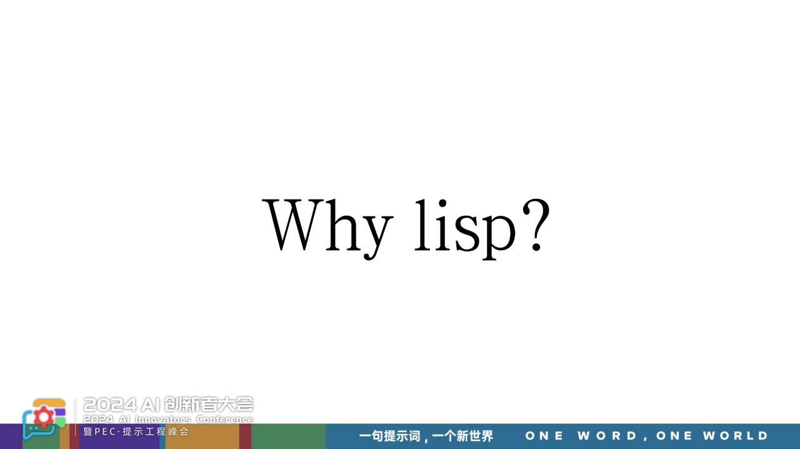

最近我经常被问到一个问题：为什么选择使用Lisp语法来写提示词？是否有其他方式可以实现"不描述而定义"的目标？这个选择背后有两个重要的思考维度。

第一个维度：特殊受众的表达方式 让我们回到最初的认知：提示词是一种表达，而表达必然面向一个对象。当我们面对不同的对象时——无论是上级、同事还是下属，都会naturally调整表达的语言、态度和语气。那么，当对话对象是大语言模型时，这个特殊的对象是否需要特殊的表达方式？

从这个角度出发，我尝试了几个层次的探索：

1. 向量数组 我的第一个想法是直接使用向量数组，因为embedding后的内容本质上就是向量数组。这似乎是传达完美答案的理想方式，但遗憾的是，人类难以直接书写向量。

2. Token层面 退而求其次，我考虑了token层面的表达。但token的切割方式过于特殊，不符合人类的书写习惯，这条路也行不通。

3. 词语层面 最后回到了最基本的字和词层面。这是可行的，而且我们发现一个有趣的现象：有时候仅仅是几个关键词的组合，模型就能准确理解我们的意图，无需使用任何形容词、副词或连接词。

但这种方法在面对复杂问题时也显露出局限性。当词语本身包含多个维度时，想要突出某个特定维度就需要额外的描述和注释，这又会不可避免地回到语言描述的老路上，形成一个悖论。

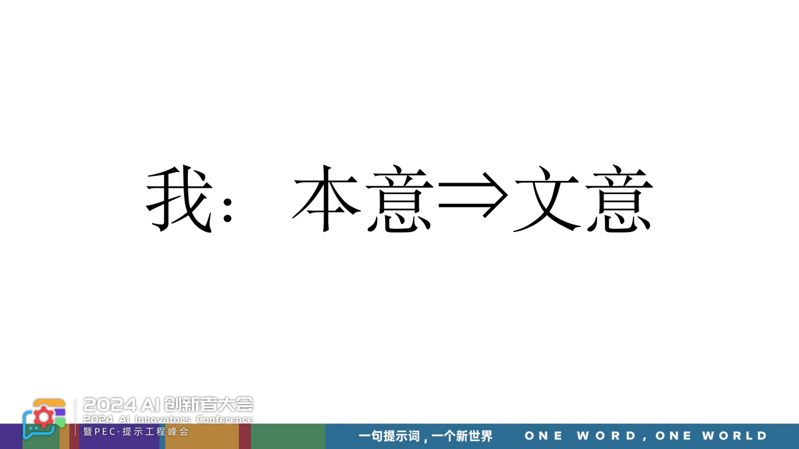

这就引出了Lisp方案的精妙之处：虽然这种写法可能看起来难以理解，但大模型却能准确把握其中的含义。这正是庄子所说的"得其意而忘其言"——模型能够透过不规范的语法和符号，准确理解我们想要表达的本质。当它理解了核心意图后，这种特殊的表达形式就可以被抛却，直接输出我们真正想要的结果。这已经够了。

再说回来，我在今年写了一年的写法，这个写法画面越来越清晰，我在这种写的时候看到了什么，脑海中是什么画面，就是这个。

我看见了一间黑色屋子，这间屋子没有灯光。屋子里面全是星星，星星全是黑的。这个星星和屋子是什么，屋子是向量空间，星星是invading之后的词或者概念。我通过喊星星的名字，能把那根星星点亮。我顺序叫出4、5颗星星名字的时候，这4、5颗星星依次点亮，连成了一条脉络线，这条脉络线索有关点像星象图，这是一个pattern，被大模型get到了，以后所有输出都基于这个pattern进行了泛化。

大家基于刚才描述的画面，回头再去看看汉语新解，你看看那几个词在点亮星星。也就是说，当我在写提示词的时候，我在脑海里面放烟花。这个画面有可能是有科学解释的，只是我知识储备不够。这个画面来自于几本书，第一《为什么伟大不能被计划》，除了讲了新奇性算法以外，书中有一段描述是这个画面，原始描述是这间黑色的屋子中遍布着人类所有能画出来的画，而这些画有任何线条的组合全体都在五这儿，你会发现大部分都很差，或者说很平庸。

但是，毕加索的画也在这个空间中，只是你不知道在哪个位置，只能在黑暗中探索，可以告诉你答案，所有的画都在这个空间中，跟向量空间很像。这个想法最早的起点来自于那本书中这段描述，脑海中种下了这个画面。然后，开始读《这就是ChatGPT》，那本书中也有类似的描述，书中配的那幅插图，好好看看拿着刚才的描述来看，里面画的向量的脉络线就是刚才说的那个东西。那根线通过向量数组的方式画出来，我写不了向量数组，只能通过词。词被诗意化阐释出后，就是点亮星星。

巧的是我半吊子水平的lisp结合着词，结合着我刚才前面对于表达这一套的东西，尝试着一次，而且一次尝试就成功了，今年一直在玩它。

## 回答两个问题

最后再说两个经常被问到的问题。

先看第一个问题，当有想法却无法写出提示词时该怎么办？当想要与大模型对话却毫无想法时该怎么办？

这个问题的答案其实是相同的：Read in, Prompt out。

我们常常过分关注最终呈现在输入框中的提示词，认为那是战场所在。但事实上，真正的较量早已在我们的大脑中完成。如果想要提升提示词的质量，答案不在外部，而在于提升内在的认知深度。要在头脑中形成清晰的想法，关键就在于"读"。

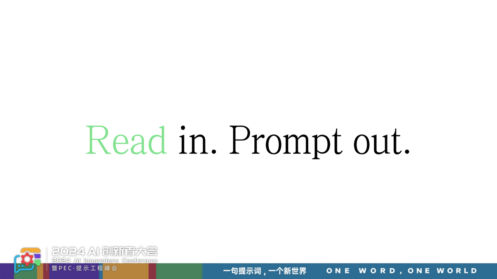

这里的"读"是广义的输入，包括：阅读书籍、参加会议交流、思辨讨论、参加分享等等，所有这些形式的输入都能在我们的大脑中激发新的想法，而后通过提示词表达出来。

以我个人经验为例，我特别依赖读书来获取灵感。如果某天没有阅读，我的大脑就会处于相对空白的状态。这也解释了为什么有些提示词的质量会参差不齐：

* 质量欠佳的内容往往出自赶工的日子，那是在没有充分输入的情况下被迫产出

* 而那些看似简单却精准的4-5个词的提示词，背后往往有整整一天的阅读和思考支撑

所以答案很简单：要写好提示词，先要多读书。

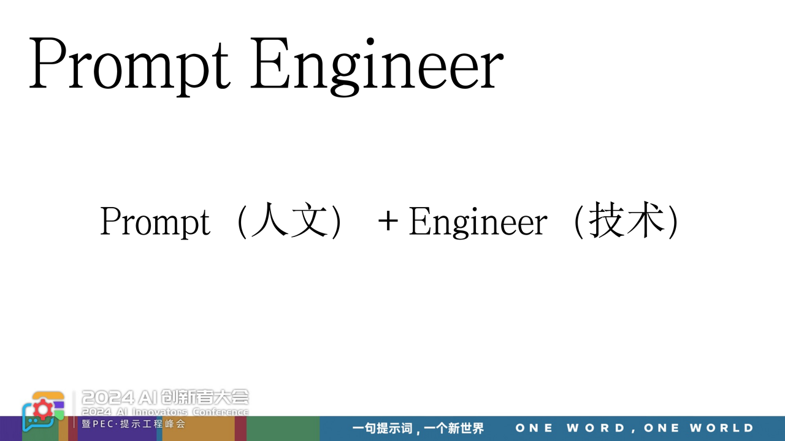

第二个问题，就是关于提示词工程师。过去一年，我观察到两种主要方向的尝试：

第一类是程序员转型 他们的逻辑是：既然以前写代码，现在只是将编译器换成了大模型，应该也能胜任提示词编写。

第二类是产品经理、编剧、作家等内容创作者 他们的优势在于长期从事写作，擅长文字表达，似乎也很适合担任这个角色。

关于程序员路线，我去年有过深入思考。从编程语言的发展脉络来看，编程语言C++、JAVA、Python等这一路演进，我们能观察到两个明显趋势：

* 编程语言越来越接近自然语言，可读性不断提升

* 程序员群体不断扩大，门槛不断降低

这很容易让人联想：如果直接用自然语言编程，以大模型为编译器，是否意味着人人都能成为程序员？反推则意味着程序员应该最适合担任提示词工程师？这是我去年的想法。

但今年的体验完全不同。虽然我现在使用类似Lisp的语法来写提示词，但我深刻感受到：这是一种写作行为，而非编程。我在寻找那些关键词的过程，本质上是一种人文探索，而非纯粹的逻辑构建。这种写作虽然简练至极，可能只有几个词，但写作的本质并未改变。

这两种感受都很真实：去年的技术路线很顺畅，今年的人文体验很鲜明。究其原因，答案可能就藏在"提示词工程师"这个头衔中，谜底就在谜面上。它应该是人文素养与技术能力的交集，而不是偏向任何一方。

基于这个认知，培养和招聘提示词工程师可以有两个方向：

1. 从技术向人文拓展：寻找那些热衷写博客、善于表达、逻辑清晰的程序员

2. 从人文向技术靠拢：关注具备计算机背景、逻辑思维强、擅长结构化思考的作家或产品经理

两个方向的共同点是：都在向中间地带靠拢，追求技术与人文的平衡点。

当然，一个猜想，不保证一定对。
