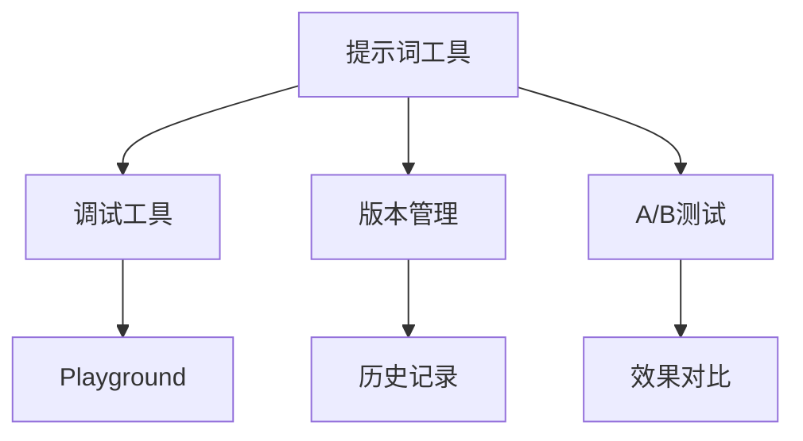

> **摘要** — 提示词工具涵盖调试、优化、版本管理等能力，帮助开发者更高效地构建和管理 Prompt。包括 Playground、版本控制、A/B 测试等工具。



```markmap height=280
# 提示词工具
## 调试工具
- Playground
- Prompt 调试器
## 版本管理
- 历史版本
- 变更追踪
## A/B测试
- 效果对比
- 性能评估
## 优化工具
- 语法检查
- 格式优化
```

---

# 提示词工具
