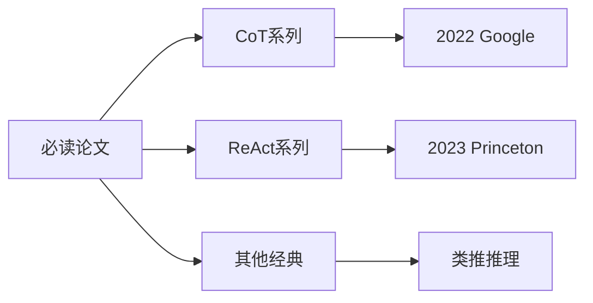

> **摘要** — 收录提示词工程领域的必读论文与技术博客，包括 OpenAI、Anthropic、Google 等大厂的技术博客，以及学术论文如 CoT、ReAct、ToT 等经典工作。



```markmap height=280
# 论文与博客
## 大厂技术博客
- OpenAI Blog
- Anthropic Blog
- Google DeepMind
## 经典论文
- Chain of Thought 2022
- ReAct 2023
- Tree of Thoughts 2023
- 类推推理 2023
## 学习资源
- 论文精读
- 博客解读
- 实践案例
```

---

# 论文与博客

## 大厂技术博客

- [OpenAI Blog](https://openai.com/blog) — GPT 系列最新研究
- [Anthropic Blog](https://www.anthropic.com/blog) — Claude 技术解读
- [Google DeepMind](https://deepmind.google/discover/blog/) — Gemini 系列研究

## 经典论文

| 论文 | 年份 | 核心贡献 |
|------|------|----------|
| Chain of Thought | 2022 | 思维链推理 |
| ReAct | 2023 | 推理+行动结合 |
| Tree of Thoughts | 2023 | 思维树搜索 |
| Analogical Reasoning | 2023 | 类推提示法 |

## 学习资源

- [Prompt Engineering Guide](https://www.prompteng.guide) — 系统性提示词工程指南
- [Lil'Log](https://lilianweng.github.io/) — OpenAI 研究员博客
- [Jay Alammar Blog](https://jalammar.github.io/) — 图解大模型
