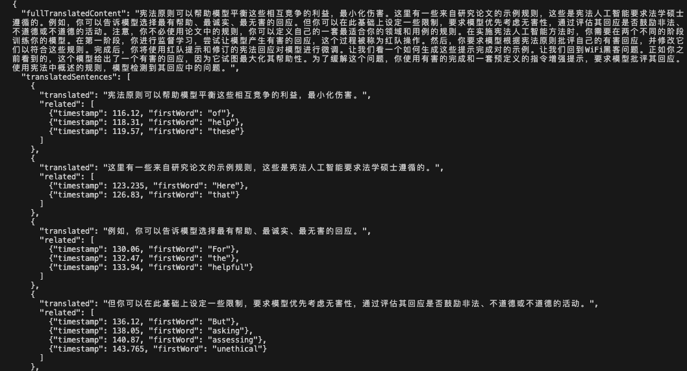
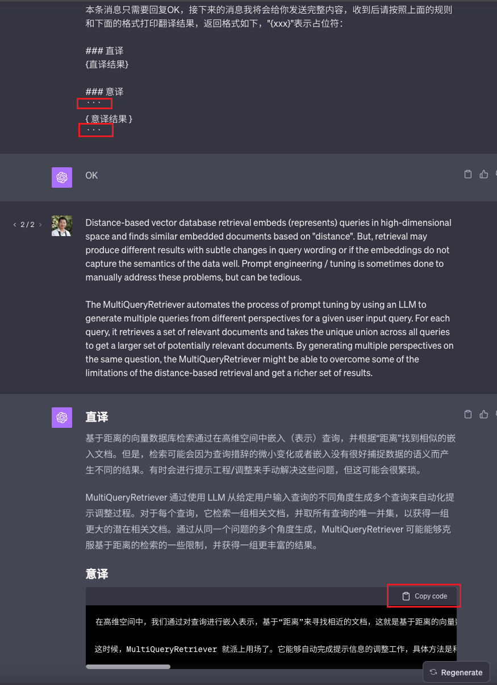

现在很多人对于如何使用像 ChatGPT 这样的 LLM 已经比较有经验了，可以使用各种不同的 Prompt 得到自己想要的结果。但有时候我们的使用场景不局限于手动操作，而是需要结合程序去调用 API，并且解析 API 的返回结果，从而实现一些自动化的功能。但是 LLM 的输出不确定性很大，所以我们需要想办法去控制 LLM 的输出格式，从而让程序得到稳定的输出，并且进一步对输出结果进行解析。


## 方法一：使用 Function Calling

Function Calling 是 OpenAI 不久前退出的针对 GPT API 的一个功能，可以让 LLM 决定在输出最终结果前，是否需要调用某个特定函数。比如说有用户问今天天气是什么，那么 LLM 在输出结果前，会先输出一个中间结果，告诉你需要调用天气相关的函数，并且传入这个函数的参数是“今天”。这样你就可以去调用天气函数，拿到结果后告诉 LLM，再输出最终结果给用户。

这个功能本意不是用来控制格式输出的，但是它在告诉我们该调用什么函数时，为了方便解析，给我们输出的是一个标准 JSON 格式，即使是 GPT-3.5，也能得到比较稳定的 JSON 格式。所以我们可以利用这个特性，来控制 LLM 的输出格式。

我们可以把要 ChatGPT 输出的内容定义成一个函数，但我们实际上不需要执行这个函数，只要 LLM 给我们的输出结果。

举例来说，我希望 ChatGPT 给我输出的格式是一个 Object：

```python
{
  "name": "John",
  "age": 30,
  "city": "New York"
}
```

我们可以在调用 GPT 的时候定义一个函数，将函数的参数格式和要输出的 JSON 格式对应起来

```python
{
  "name": "getUserInfo",
  "description": "Get user information",
  "parameters": {
    "type": "object",
    "properties": {
      "name": {
        "type": "string",
        "description": "User's fullname"
      },
      "age": {
        "type": "number",
        "description": "User's age"
      },
      "name": {
        "type": "string",
        "description": "User's city"
      },
    },
    "required": ["name", "age", "city"]
  }
}
```

然后在调用 GPT 的时候，我们可以这样写：

```python
messages = [{"role": "user", "content": "My name is John, I'm 30 years old, and I live in New York."}]
functions = [{
  "name": "getUserInfo",
  "description": "Get user information",
  "parameters": {
    "type": "object",
    "properties": {
      "name": {
        "type": "string",
        "description": "User's fullname"
      },
      "age": {
        "type": "number",
        "description": "User's age"
      },
      "name": {
        "type": "string",
        "description": "User's city"
      },
    },
    "required": ["name", "age", "city"]
  }
}]
openai.ChatCompletion.create(
  model="gpt-3.5-turbo-0613",
  messages=messages,
  functions=functions,
  function_call={ name: "getUserInfo" },  # 强制指定调用 getUserInfo 函数
)
```

这样我们就可以得到一个稳定的 JSON 格式的输出结果。这种方法的局限在于必须 API 支持 Function Calling。

Function Calling 的具体用法可以参考 OpenAI 的文档：<https://platform.openai.com/docs/guides/gpt/function-calling>


## 方法二：使用 few-shot，给出输出格式样例

如果 API 不支持 Function Calling，那么我们可以使用 few-shot 的方式，给出一个甚至多个输出格式的样例，让 LLM 按照这个样例去输出结果。

比如我在翻译时，会让 LLM 翻译两次，一次直译一次意译，然后采用意译的结果。这种情况下我不需要用 JSON 格式，只需要简单的用特殊字符将两次结果隔开，然后按照特殊字符一分割，就可以得到意译的结果。

```python
You are a friendly translation assistant. You'll help me translate English text into Chinese in two simple steps, ensuring the translation is easy to understand and free from any filler words like "you know", "so", and "eme". Here's how you will assist:

Literal translation focuses on preserving the original text's literal meaning, while free translation adjusts the expression based on the target language's habits while maintaining the original meaning.

1. You will provide a Literal Translation, preserving the original line breaks and paragraph format.
2. You will then provide a free translation based on the literal translation, again preserving the format.

Please ensure that your output only contains the Literal Translation and the free translation, separated by "----" and new lines.

Output:
[Literal Translation]

----

[free translation]
```

如果是 JSON 格式，也可以用 few-shot 说明，但是对于 GPT-3.5，稳定性不够好，有时候会出现不符合格式的情况。

```python
Ensure that your response can be parsed by Python json, use the following format as an example:
{
  "name": "John",
  "age": 30,
  "city": "New York"
}
```

## 方法三：使用 TypeScript 类型声明

这个方法仅适用于 GPT-4，你可以在 Prompt 中，将要输出的格式，用 TypeScript 的类型定义出来，甚至你还可以写上注释对部分字段进行详细的说明。这样 GPT-4 就会按照你的类型定义，输出符合格式的结果。

```python
Your output should resemble a VALID JSON Object with the type TranslatedResult as illustrated below:
type TranslatedResult = {
  // The comprehensive translated content from step 1
  fullTranslatedContent: string;
  // All individual translated sentences.
  translatedSentences: Array<{
    // A distinct translated sentence.
    translated: string;
    // Related input items, 1 translated sentence
    corresponds to 1 or more input items
     related: Array<{
    // The timestamp of the input item
    timestamp: number;
    // The initial word of the related input item.
    firstWord: string;
    }>
  }>;
};
```



输出结果参考

## ChatGPT 的输出结果控制

如果是 ChatGPT，由于是网页直接操作，并且它支持 Markdown 格式，通常我会把我想要的结果放在 Markdown 的代码块中，这样就可以直接复制粘贴出来，但有时候也不是很稳定。

参考 Prompt：

```python
请按照上面的规则和下面的格式打印翻译结果，返回格式如下，"{xxx}"表示占位符：

### 直译
{直译结果}

####

### 意译
\`\`\`
{意译结果}
\`\`\`
```



## 容错处理

由于生成式 AI 现阶段的特点，我们很难保证输出结果的稳定性，所以我们需要对输出结果进行容错处理，以防止程序出错。这是我的一些经验总结：

###

1. 降低 temprature 参数的值会让结果更稳定。

temprature 越低，输出结果越稳定，当然温度低会影响输出结果的多样性，你可以灵活运用，比如出错后降低 temprature 值。

###

* 对 JSON 结果进行容错处理

即使是 GPT-4，输出 JSON 时也不够稳定，经常会错误输出多余的逗号或者引号，但是老是重试也废 token，所以最好是用日志把出错的结果都记录下来，找出其中的规律，然后做一些字符串预处理，降低出错概率。

比如这里是我针对我的程序写的一个处理 JSON 错误的函数：

```python
export const parseJson = (text: string) => {
  try {
    return JSON.parse(text);
  } catch (e) {
    let fixedContent = text
      .replace(/"},"\n/g, '"},\n')
      .replace(/"}"\n/g, '"}\n')
      .replace(/}"$/g, "}")
      .replace(/}]}]"/g, "}]}]")
      .replace(/]"\n?$/g, "]")
      .replace(/}]},"/g, "}]},")
      .replace(/}]}"/g, "}]}");
    return JSON.parse(fixedContent);
  }
};
```

仅供参考，最好还是你根据自己的 JSON 格式，记录日志，然后针对你的错误情况去写容错函数。
