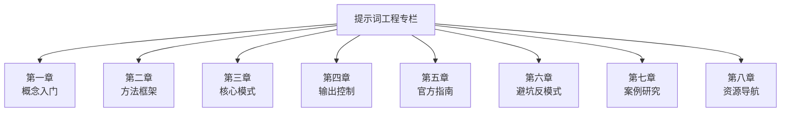

> **摘要** — 提示词工程（Prompt Engineering）是通过设计、优化输入提示词来引导大语言模型产生预期输出的实践学科。本专栏收录方法论、模式、工具与案例。



```markmap height=350
# 提示词工程专栏
## 第一章：概念入门
- 提示词工程是什么
## 第二章：方法框架
- LangGPT / CO-STAR / CRISP / ICIO
## 第三章：核心模式
- CoT / ReAct / Tree of Thoughts
- 类推提示 / 多模态提示 / 提示链
## 第四章：输出控制
- 伪代码控制 / 输出格式 / Token优化
## 第五章：官方指南
- OpenAI / 谷歌 68 页圣经
## 第六章：避坑反模式
- 常见错误与最佳实践
## 第七章：案例研究
- 李继刚系列
## 第八章：资源导航
- 提示词库 / 工具 / 论文
```

---

# 提示词工程

> 提示词工程（Prompt Engineering）是通过设计、优化输入提示词来引导大语言模型产生预期输出的实践学科。本专栏收录方法论、模式、工具与案例。

---

## 第一章：概念入门

- [提示词工程](./intro/what-is-prompt-engineering.md) — 从自然语言到控制指令的本质理解

---

## 第二章：方法框架

- [LangGPT — 人人都能写出高质量提示词](./methods/langgpt-getting-started.md) — 变量 + 模板语法，像编程一样写 Prompt
- [结构化提示词系统论述](./methods/structured-prompt-systematic.md) — 构建高性能 Prompt 的系统方法论
- [Agents 基石：提示词结构化方法论](./methods/agents-prompt-foundations.md) — 结构化 Prompt 的工程化实践
- [提示工程、RAG 和微调](./methods/langgpt-rag-finetuning.md) — 如何让 LLM 应用性能登峰造极
- [CO-STAR 框架](./co-star-framework.md) — 结构化提示词构建方法
- [CRISP 框架](./crisp-framework.md) — 批判性思维提示词框架
- [ICIO 框架](./icio-framework.md) — 指令 + 上下文 + 输入 + 输出格式

---

## 第三章：核心模式

- [Chain of Thought (CoT)](./patterns/chain-of-thought.md) — 思维链推理
- [ReAct](./patterns/react.md) — 推理与行动结合
- [Tree of Thoughts](./patterns/tree-of-thoughts.md) — 思维树搜索
- [类推提示法](./patterns/analogical-reasoning.md) — Large Language Models as Analogical Reasoners
- [多模态提示词](./patterns/multimodal-prompting.md) — 文本、图像、音频、视频的联合提示策略
- [提示链与多提示词协同](./patterns/prompt-chaining.md) — Prompt Chain、Prompt Tree、Prompt Graph

---

## 第四章：输出控制

- [借助伪代码控制 LLM 输出](./best-practices/pseudocode-control.md) — 精准控制输出结构和执行逻辑
- [控制 LLM 输出格式](./best-practices/output-format-control.md) — Function Calling / JSON Schema / Regex 解析
- [Token 优化](./token-optimization.md) — 降本增效的 Token 使用策略
- [角色扮演技巧](./persona-techniques.md) — System Prompt 角色设定

---

## 第五章：官方指南

- [OpenAI 官方提示词指南](./resources/openai-official-guide.md) — 六条核心策略官方原文
- [谷歌 68 页提示词圣经](./best-practices/google-68-prompt-bible.md) — CTF 黄金公式 + 元提示词模板

---

## 第六章：避坑反模式

- [提示词反模式](./anti-patterns.md) — 常见错误与避坑指南

---

## 第七章：案例研究

- [李继刚：如何写好 Prompt](./case-studies/li-jigang-get-started.md) — 模型理解 + 行业 KnowHow + 表达力
- [李继刚：提示词的道与术](./case-studies/li-jigang-dao-shu.md) — 从 lisp 格式到表达本质的深层思考

---

## 第八章：资源导航

- [优质提示词库](./resources/prompt-libraries.md) — 收录各平台优质提示词集合
- [提示词工具](./resources/prompt-tools.md) — 调试、优化、版本管理工具
- [论文与博客](./resources/papers-blogs.md) — 必读论文与技术博客精选
