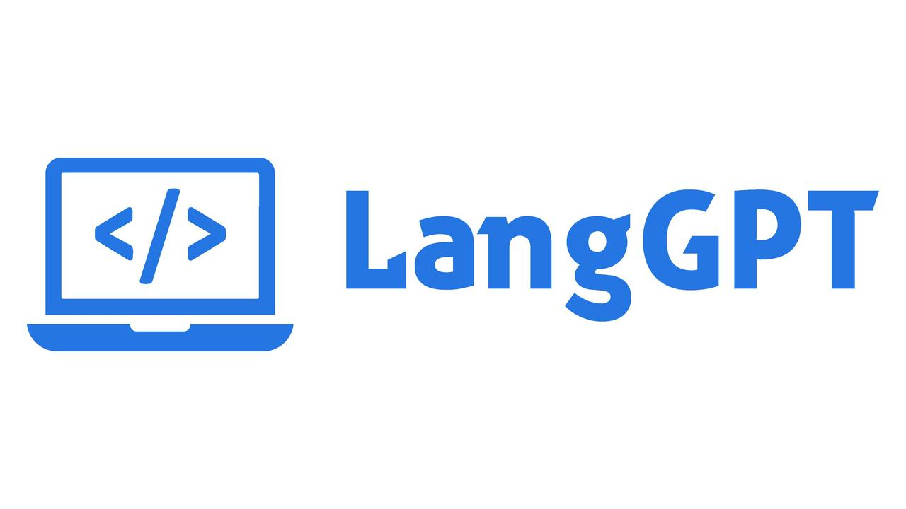

# LangGPT — 人人都能写出高质量提示词

* **作者：云中江树**

### 要用好现有大模型的能力严重依赖高质量 prompt， 然而**编写高质量 prompt 在现阶段还是个手艺活，太依赖个人经验。**

虽然也有许多个人自发分享的 prompt 方法、框架，以及吴恩达老师的 prompt 教程，但是现有 Prompt 创建方法还是有各种各样的缺点：

1. 缺乏系统性：大多是细碎的规则，技巧，严重依赖个人经验

2. 缺乏灵活性：对他人分享的优质 prompt 进行调整需要直接修改 prompt 内容

3. 缺乏交互友好性：优质 prompt 的配置和使用太复杂，有时往往还要学习 prompt 用法

4. 未充分考虑大语言模型的下列特性：

1）偏好分点、条理性叙述
2）长对话会出现遗忘问题
3）不同语言间性能存在差距

这也是为什么大家爱收集，分享一些久经考验的 prompt 的原因之一。

随着 GPT-4 模型出来，对 prompt 的依赖有所降低，同时其更强大的基础能力为编写更强大的 prompt 提供了良好的基础，优质的 prompt 能力越来越强大，也越来越复杂。

prompt 编写越来越像 AI 时代的编程语言。

那么有没有可能像学编程一样，掌握一些基础规则和概念，掌握一些编程模式（类似面向对象的编程），即可高效的编写出表现良好稳定的 prompt——即 prompt 编程？

### 
**经过初步探索和实验，我们设计了 LangGPT（项目链接：[github.com](https://github.com/yzfly/LangGPT)），希望在 prompt 的编程法上迈出一小步。**

### **使用 LangGPT 为大规模生产高质量prompt提供了可能，它有下面的优点**：

1. 系统性：提供“模板”，按照模板填鸭式写上相应内容即可

2. 灵活性：可以使用“变量”，轻松引用、设置和更改 prompt 中的内容，可编程性好

3. 使用命令，轻松设置、执行预定义行为，可以无损性能情况下轻松设置中英文切换

4. 交互友好：“工作流” 轻松定义与用户交互，角色行为等，轻松引导用户使用

5. 充分利用 大模型 能力： 1）模块化配置 2）分点条理性叙述 3）Reminder 缓解 长期记忆 缺失问题

##  LangGPT 的两个关键语法

###  **1. LangGPT 变量**

我们发现 ChatGPT 可以识别各种良好标记的层级结构内容。大模型可以识别文章的标题，段落名，段落正文等层级结构，如果我们告诉他标题，模型知道我们指的是标题以及标题下的正文内容。

这意味着我们将 prompt 的内容用结构化方式呈现，并设置标题即可方便的引用，修改，设置 prompt 内容。可以直接使用段落标题来指代大段内容，也可以告诉ChatGPT修改调整指定内容。这类似于编程中的变量，因此我们可以将这种标题当做变量使用。

Markdown 的语法层级结构很好，适合编写 prompt，因此 LangGPT 的变量基于 markdown语法。实际上除 markdown外各种能实现标记作用，如 json,yaml, 甚至好好排版好格式 都可以。

变量为 Prompt 的编写带来了很大的灵活性。使用变量可以方便的引用角色内容，设置和更改角色属性。这是一般的 prompt 方法实现起来不方便的。

###  **2.  LangGPT 模板**

ChatGPT 十分擅长角色扮演，大部分优质 prompt 开头往往就是 “我希望你作为xxx”，“我希望你扮演xxx” 的句式定义一个角色，只要提供角色说明，角色行为，技能等描述，就能做出很符合角色的行为。

如果你熟悉编程语言里的 “对象”，就知道其实 prompt 的“角色声明”和类声明很像。因此 可以将 prompt 抽象为一个角色 （Role），包含名字，描述，技能，工作方法等描述，然后就得到了 LangGPT 的 Role 模板。

使用 Role 模板，只需要按照模板填写相应内容即可。

除了变量和模板外，LangGPT 还提供了命令，记忆器，条件句等语法设置方法。

### **3. LangGPT 咒语生成器**

值得一提的是，我们基于 LangGPT 设计了 LangGPT 助手来帮助大家使用 LangGPT, 它会帮助你设计很好的咒语

LangGPT 还在探索开发阶段，有问题欢迎反馈，更欢迎更多的人参与进来！
