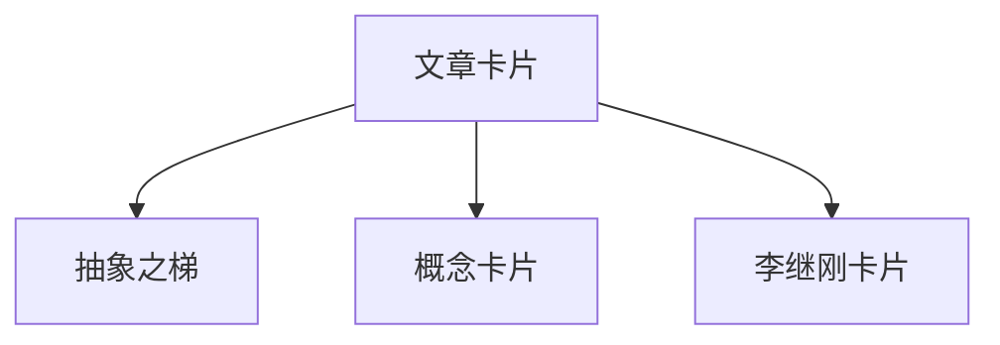

> **摘要** — 文章卡片章节，包含抽象之梯、概念卡片模板、李继刚Claude卡片等内容。

---

# 文章卡片

## 内容

- [02-01-abstract-ladder](/guide/ai/prompt-hub/02-01-article-cards/02-01-abstract-ladder/) — 抽象之梯
- [02-02-card-template-h](/guide/ai/prompt-hub/02-01-article-cards/02-02-card-template-h/) — 横版概念卡片模板
- [02-03-card-template-v](/guide/ai/prompt-hub/02-01-article-cards/02-03-card-template-v/) — 竖版概念卡片模板
- [02-04-li-jigang-cards](/guide/ai/prompt-hub/02-01-article-cards/02-04-li-jigang-cards/) — 李继刚：用Claude做卡片