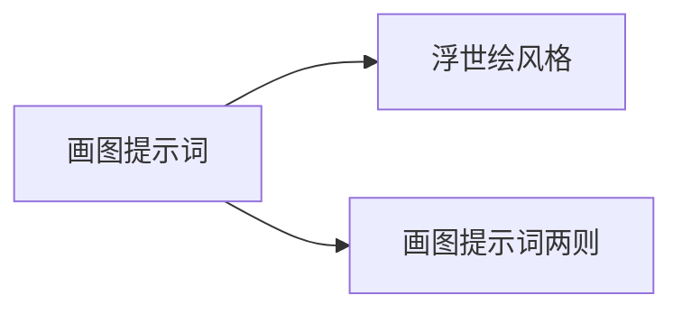

> **摘要** — 画图提示词章节，包含浮世绘风格和画图提示词两则。

---

# 画图提示词

## 内容

- [03-01-ukiyo-e](/guide/ai/prompt-hub/03-01-paint-prompts/03-01-ukiyo-e/) — 浮世绘风格
- [03-02-paint-prompts-two](/guide/ai/prompt-hub/03-01-paint-prompts/03-02-paint-prompts-two/) — 画图 Prompt 两则