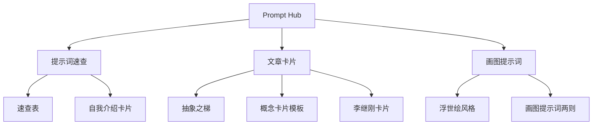

> **摘要** — Prompt 提示词中心，收录各类精选提示词模板和案例。



```markmap height=280
# Prompt Hub
## 01 提示词速查
- 01-01-cheatsheet：提示词速查表
- 01-02-self-intro-card：自我介绍卡片设计师
## 02 文章卡片
- 02-01-abstract-ladder：抽象之梯
- 02-02-card-template-h：横版卡片模板
- 02-03-card-template-v：竖版卡片模板
- 02-04-li-jigang-cards：李继刚Claude卡片
## 03 画图提示词
- 03-01-ukiyo-e：浮世绘风格
- 03-02-paint-prompts-two：画图提示词两则
```

---

# Prompt Hub

## 目录

### 01 提示词速查

| 章节 | 内容 |
|------|------|
| [01-01-cheatsheet](/guide/ai/prompt-hub/01-01-cheatsheet/) | 提示词速查表 |
| [01-02-self-intro-card](/guide/ai/prompt-hub/01-01-cheatsheet/01-02-self-intro-card/) | 自我介绍卡片设计师 |

### 02 文章卡片

| 章节 | 内容 |
|------|------|
| [02-01-abstract-ladder](/guide/ai/prompt-hub/02-01-article-cards/02-01-abstract-ladder/) | Claude Prompt：抽象之梯 |
| [02-02-card-template-h](/guide/ai/prompt-hub/02-01-article-cards/02-02-card-template-h/) | 横版概念卡片模板 |
| [02-03-card-template-v](/guide/ai/prompt-hub/02-01-article-cards/02-03-card-template-v/) | 竖版概念卡片模板 |
| [02-04-li-jigang-cards](/guide/ai/prompt-hub/02-01-article-cards/02-04-li-jigang-cards/) | 李继刚：用Claude做卡片 |

### 03 画图提示词

| 章节 | 内容 |
|------|------|
| [03-01-ukiyo-e](/guide/ai/prompt-hub/03-01-paint-prompts/03-01-ukiyo-e/) | 浮世绘风格 |
| [03-02-paint-prompts-two](/guide/ai/prompt-hub/03-01-paint-prompts/03-02-paint-prompts-two/) | 画图 Prompt 两则 |