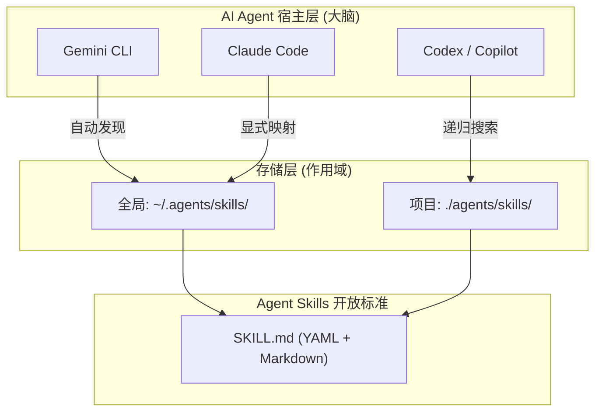
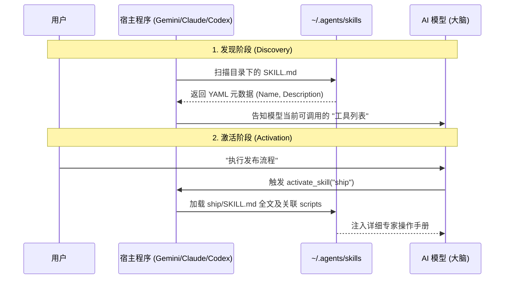

# ~/.agents 目录：Agent Skills 开放标准说明文档

## 1. 概述

`~/.agents` 目录遵循 **Agent Skills Open Standard**。这是一个跨平台的技能定义规范，旨在让 AI 代理（如 Codex, Claude Code, Gemini CLI, GitHub Copilot）能够共享可移植、结构化的专业能力。

通过将技能统一安装在 `~/.agents/skills` 下，你可以为不同的 AI 宿主工具建立一个共享的“专家知识库”。

---

## 2. 核心哲学：能力解耦与渐进式披露

- **解耦 (Decoupling):** 将“推理大脑”（模型）与“专业流程”（技能）分离。
- **渐进式披露 (Progressive Disclosure):** 宿主工具通过读取 `SKILL.md` 顶部的 YAML 元数据来决定是否激活技能，从而避免一次性加载过多无关信息导致 Context 浪费。

### 2.1 系统架构图



---

## 3. 主流工具的加载机制

### 3.1 激活流程对比



### A. Gemini CLI：原生支持与全自动扫描
- **机制:** 启动时递归扫描 `~/.agents/skills` 和 `~/.gemini/skills`。
- **特点:** 零配置使用，只要文件夹结构正确且包含 `SKILL.md`，AI 就能在 System Prompt 中感知到该技能。

### B. Claude Code：配置驱动与显式注入
- **机制:** 依赖 `~/.clauderc` 的全局路径配置或项目内 `CLAUDE.md` 的显式引用。
- **特点:** 权限控制更严，通常需要项目内的授权文件（如 `CLAUDE.md`）来开启对全局技能的访问。

### C. Codex：深度集成的技能管理
- **机制:** 提供 `$skill-installer` 等专用命令直接管理该目录，并将技能作为一级指令（如 `/office-hours`）直接挂载到 CLI。

---

## 4. 标准技能文件夹结构

遵循该标准的技能应具备以下结构：

```text
~/.agents/skills/my-skill/
├── SKILL.md          # 必选：元数据 + 指令集
├── scripts/          # 可选：技能依赖的可执行脚本
├── references/       # 可选：领域背景知识、SOP 文档
└── assets/           # 可选：模板、静态图片等资源
```

---

## 5. 统一安装的优势

1. **跨平台兼容:** 编写一次 `SKILL.md`，在所有支持该标准的 Agent 中通用。
2. **上下文效率:** 只有需要的指令才会被加载，保持对话的高响应速度。
3. **团队协同:** 将技能放在项目的 `.agents/skills` 目录下并提交 Git，团队所有成员的 AI Agent 都会立即获得同样的专业能力。

---

> *参考来源：Agent Skills Open Standard (agentskills.io) & gstack 官方文档。*
