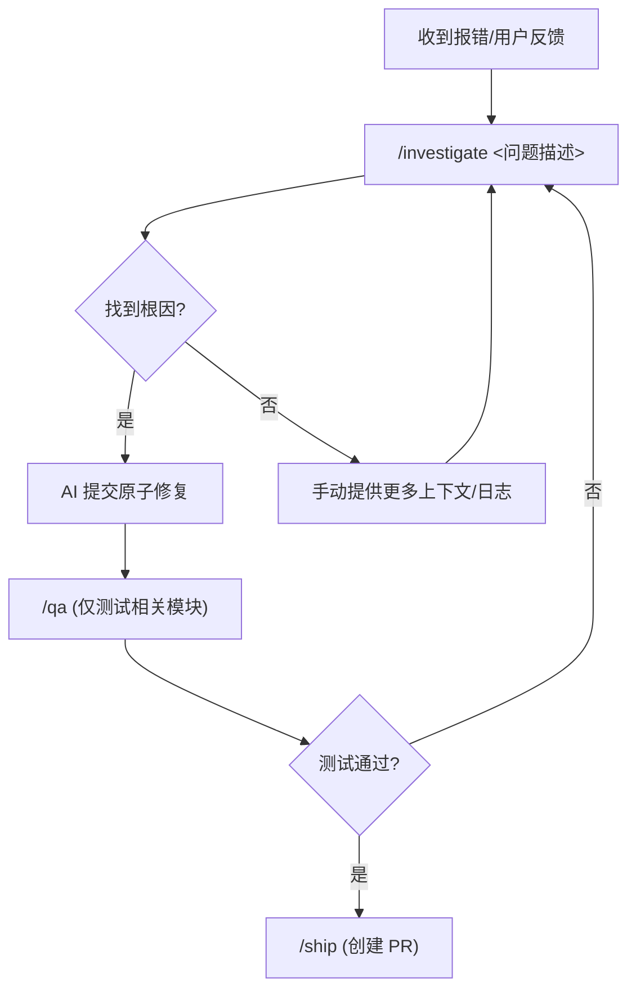
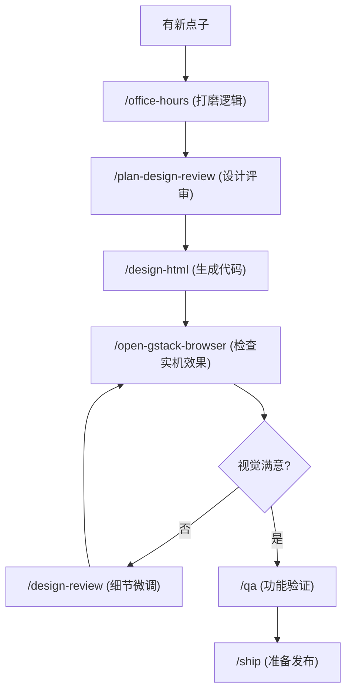
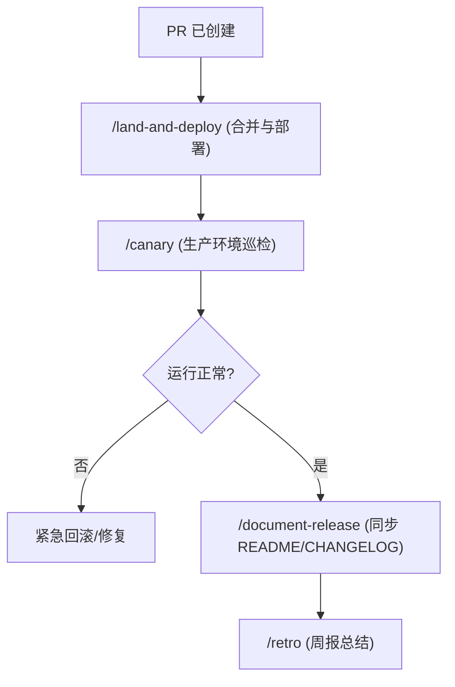

# GStack 10分钟快速上手手册 (Quick Start Guide)

本手册旨在帮助您在 10 分钟内掌握 GStack 核心技能，提升 Web 开发、设计与交付效率。

---

## ⏱️ 0-2 min: 浏览器与 QA (浏览与测试)
GStack 让 AI 拥有了操作真实浏览器的“眼睛”和“手”。

*   **可视化控制：** 执行 `/open-gstack-browser`。
    *   *作用：* 启动一个带侧边栏的可视化 Chrome，你可以实时看到 AI 的所有操作。
*   **快速网页操作：** `/browse https://example.com "点击登录按钮"`。
    *   *作用：* 快速导航、点击、截图或验证页面状态。
*   **全自动 QA：** `/qa` 或 `/qa-only`。
    *   *作用：* 让 AI 扫描你的站点，发现 Bug 并自动修复（`/qa` 模式）。

## ⏱️ 2-4 min: 设计与前端润色 (视觉与体验)
不仅仅是写代码，还要写得漂亮且符合规范。

*   **视觉审计：** `/design-review`。
    *   *场景：* 当你觉得 UI “哪里不对劲”时，让 AI 检查间距、对齐和一致性并自动修正 CSS。
*   **零依赖 HTML：** `/design-html "创建一个现代化的登录页面"`。
    *   *场景：* 快速生成高性能、无第三方依赖的原生 HTML/CSS 代码。
*   **设计头脑风暴：** `/design-shotgun`。
    *   *场景：* 并行生成 3-4 种不同风格的设计方案供你选择。

## ⏱️ 4-7 min: 战略规划与评审 (思考与设计)
在动手写代码前，先确保方向是正确的。

*   **项目发现：** `/office-hours`。
    *   *场景：* 你有一个新点子？运行此技能，通过 YC 风格的 6 个核心问题压测你的想法。
*   **创始人模式评审：** `/plan-ceo-review`。
    *   *场景：* 在 Plan 模式下运行，AI 会挑战你的产品假设，建议扩大或精简范围。
*   **自动化全案评审：** `/autoplan`。
    *   *场景：* 一键运行 CEO、工程、设计、DX（开发者体验）全套评审，直接产出最优执行计划。

## ⏱️ 7-9 min: 代码交付与上线 (发布与同步)
让代码稳健地进入生产环境。

*   **一键 Ship：** `/ship`。
    *   *作用：* 自动检测基准分支、运行测试、更新 CHANGELOG、提升版本号、提交并创建 PR。
*   **落地与监控：** `/land-and-deploy`。
    *   *作用：* 自动合并代码，等待 CI/CD 完成，并验证生产环境的健康状况。
*   **发布文档：** `/document-release`。
    *   *作用：* 在代码上线后，自动将变更内容同步到 README 和 CLAUDE.md。

## ⏱️ 9-10 min: 安全与维护 (稳健与防护)
确保开发过程不出错。

*   **根因分析：** `/investigate "错误堆栈信息"`。
    *   *原则：* 坚决执行“无根因不修复”，AI 会先分析原因再给出原子化的修复方案。
*   **安全围栏：** `/guard`。
    *   *作用：* 开启高危指令拦截（如 `rm -rf`）并限制 AI 只能编辑特定目录。
*   **状态存盘：** `/checkpoint`。
    *   *作用：* 随时保存当前工作状态、上下文和未竟事宜，方便稍后无缝恢复。

## 🛠️ 实战流程图 (Actual Usage Workflows)

以下是三个最常用的实战场景及其对应的技能调用顺序：

### 1. 发现并修复 Bug (Bug Fix & Verification)
用于处理报错、异常行为或测试失败。

### 2. 从点子到高保真页面 (Design to Implementation)
用于从零开始构建新功能或优化现有 UI。

### 3. 安全部署与文档同步 (Safe Deployment & Sync)
用于确保代码稳健上线并更新团队文档。

---

## 💡 进阶提示
- **语音触发：** 许多技能支持语音别名（如 "Show me the browser" 触发 `/open-gstack-browser`）。
- **组合使用：** 尝试 `autoplan -> design-html -> qa -> ship` 的全流程自动化。
- **获取帮助：** 随时运行 `/help` 或查看 `GSTACK_INSTALLATION_ZH.md` 获取完整清单。
