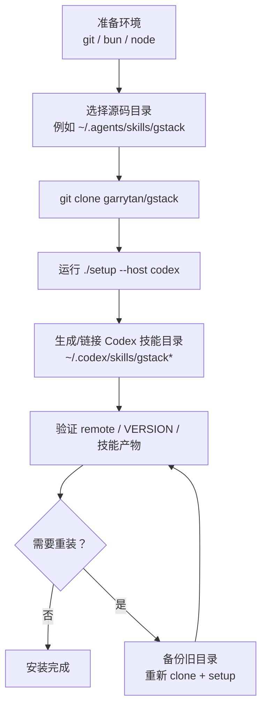
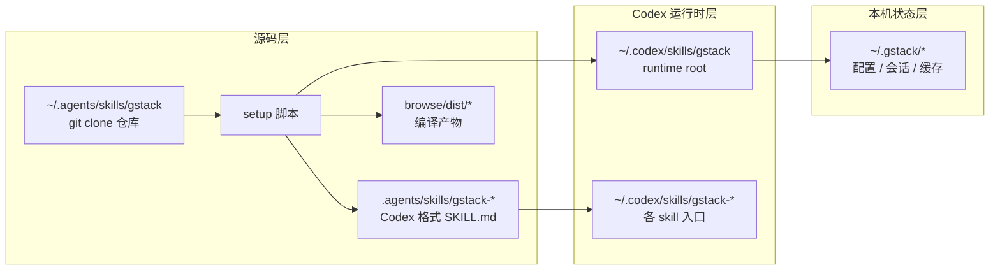
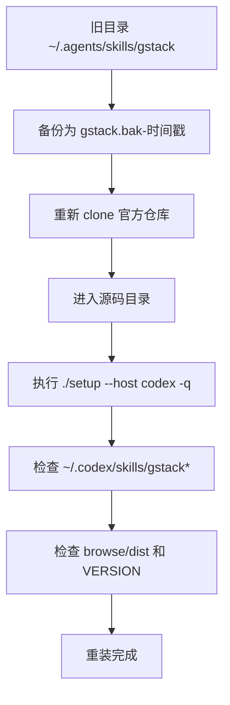

# gstack 安装与重装记录

本文档整理了 `gstack` 的安装、重装、验证流程，基于本机实际操作结果编写。

适用环境：

- 仓库来源：`https://github.com/garrytan/gstack`
- 当前主机：Linux
- 目标运行时：Codex
- 当前采用的源码目录：`~/.agents/skills/gstack`

## 安装总览图



## 安装后目录架构图



## 1. 安装形态

`gstack` 有两层路径需要区分：

1. **源码目录**
   例如：`~/.agents/skills/gstack` 或 `~/.claude/skills/gstack`

2. **运行时技能目录**
   例如：
   - Codex: `~/.codex/skills/gstack*`
   - Claude: `~/.claude/skills/gstack*`

`./setup --host <host>` 的职责不是重新拉代码，而是把源码目录生成/链接到对应 host 的运行时技能目录。

## 2. 前置条件

安装前需要具备：

- `git`
- `bun`
- `node`

本机验证命令：

```bash
git --version
bun --version
node --version
```

## 3. 首次安装

### 3.1 Claude 默认安装

官方 README 的默认安装方式是：

```bash
git clone --single-branch --depth 1 https://github.com/garrytan/gstack.git ~/.claude/skills/gstack
cd ~/.claude/skills/gstack
./setup
```

这会把 gstack 安装到 Claude 相关路径，并生成对应技能入口。

### 3.2 Codex 安装

如果目标是 Codex，推荐先有一个本地 clone，再执行：

```bash
cd <gstack-clone-dir>
./setup --host codex
```

本次实际使用的源码目录是：

```bash
cd ~/.agents/skills/gstack
./setup --host codex
```

执行后，Codex 的运行时目录应出现在：

```bash
~/.codex/skills/gstack
~/.codex/skills/gstack-*
```

## 4. 本机实际重装流程

这次为了重新安装 `garrytan/gstack`，采用了“备份旧目录 + 全新克隆 + 重新 setup”的方式。

### 重装流程图



### 4.1 备份旧安装

```bash
mv ~/.agents/skills/gstack ~/.agents/skills/gstack.bak-$(date +%Y%m%d-%H%M%S)
```

### 4.2 重新克隆

```bash
git clone --single-branch --depth 1 https://github.com/garrytan/gstack.git ~/.agents/skills/gstack
```

如果你需要完整历史而不是浅克隆：

```bash
git clone https://github.com/garrytan/gstack.git ~/.agents/skills/gstack
```

### 4.3 重新生成 Codex 技能

```bash
cd ~/.agents/skills/gstack
./setup --host codex -q
```

说明：

- `-q` 是 quiet mode，减少输出噪音
- `setup` 会执行 `bun install`、生成 host 对应的 `SKILL.md`、并把 Codex 技能链接到 `~/.codex/skills`

## 5. 重装后的验证方法

### 5.1 验证源码目录

```bash
cd ~/.agents/skills/gstack
git remote -v
git rev-parse --short HEAD
cat VERSION
```

预期：

- `origin` 指向 `https://github.com/garrytan/gstack.git`
- 可以正常读取 `VERSION`

### 5.2 验证 Codex 技能目录

```bash
find ~/.codex/skills -maxdepth 1 \( -type l -o -type d \) -name 'gstack*' -printf '%P -> %l\n' | sort
```

预期至少应看到：

- `gstack`
- `gstack-office-hours`
- `gstack-review`
- `gstack-ship`
- 其他 `gstack-*` 技能目录或链接

### 5.3 验证 browse 运行时产物

```bash
find ~/.codex/skills/gstack -maxdepth 3 | sed -n '1,80p'
```

预期应包含：

- `~/.codex/skills/gstack/SKILL.md`
- `~/.codex/skills/gstack/bin`
- `~/.codex/skills/gstack/browse/dist`
- `~/.codex/skills/gstack/gstack-upgrade/SKILL.md`

## 6. 本次安装中遇到的两个问题

### 6.1 OpenClaw skill 的 YAML frontmatter 报错

报错文件：

- `openclaw/skills/gstack-openclaw-ceo-review/SKILL.md`
- `openclaw/skills/gstack-openclaw-investigate/SKILL.md`
- `openclaw/skills/gstack-openclaw-office-hours/SKILL.md`

根因：

- `description:` 使用了未加引号的 YAML 标量
- 内容里包含 `Four modes:` / `Four phases:` / `Two modes:`
- `: ` 被 YAML 解析器当成新的 mapping 起点

修复方式：

- 仅将 `description` 改为单引号字符串

### 6.2 `setup --host codex` 没有正确写入 `~/.codex/skills`

根因：

- `setup` 误把 `$HOME/.agents/skills` 识别成 repo-local `.agents/skills`
- 导致安装逻辑走偏，没有正确建立 `~/.codex/skills/gstack*`

修复方向：

- 在 `setup` 里区分“仓库内 `.agents/skills`”和“用户家目录下全局 `~/.agents/skills`”

## 7. 本次额外修复

为了让 `setup --host codex` 在本机可用，本次还修了一个构建问题：

- 文件：`browse/scripts/build-node-server.sh`
- 问题：Bun 1.3.9 会把 `@ngrok/ngrok` 的本地 `.node` 资产一起打包，导致 `--outfile` 失败
- 处理：把 `@ngrok/ngrok` 也加入 `--external`

验证命令：

```bash
cd ~/.agents/skills/gstack
bash browse/scripts/build-node-server.sh
```

预期输出：

```text
Node server bundle ready: .../browse/dist/server-node.mjs
```

## 8. 建议的标准重装命令

如果后面要再次重装，建议直接用下面这组命令：

```bash
TS=$(date +%Y%m%d-%H%M%S)
mv ~/.agents/skills/gstack ~/.agents/skills/gstack.bak-$TS
git clone --single-branch --depth 1 https://github.com/garrytan/gstack.git ~/.agents/skills/gstack
cd ~/.agents/skills/gstack
./setup --host codex -q
find ~/.codex/skills -maxdepth 1 \( -type l -o -type d \) -name 'gstack*' -printf '%P -> %l\n' | sort
```

## 9. 当前状态

截至本文档写入时，当前机器上的结果是：

- `~/.agents/skills/gstack` 已重新从 `garrytan/gstack` 克隆
- `./setup --host codex -q` 已成功执行
- `~/.codex/skills/gstack*` 已正确生成
- OpenClaw 相关 `SKILL.md` 的 YAML frontmatter 已修复为可解析状态
