# 一次性讲清楚常见的软件架构图

本文是根据 ProcessOn 整理汇总而来，ProcessOn 是一个非常不错的画图软件，功能强大，界面优美。

作者：面汤放盐

时间：2025.11.24

## 架构图详细分类

架构图作为一种重要的工具，用于可视化展示软件、系统、应用程序等的体系结构及其组成部分之间的关系。

常用的架构图种类有：业务架构图、应用架构图、系统架构图、技术架构图、部署架构图、数据架构图、产品架构图、功能架构图、信息架构图等。

关于架构图所处位置，可见下图所示：

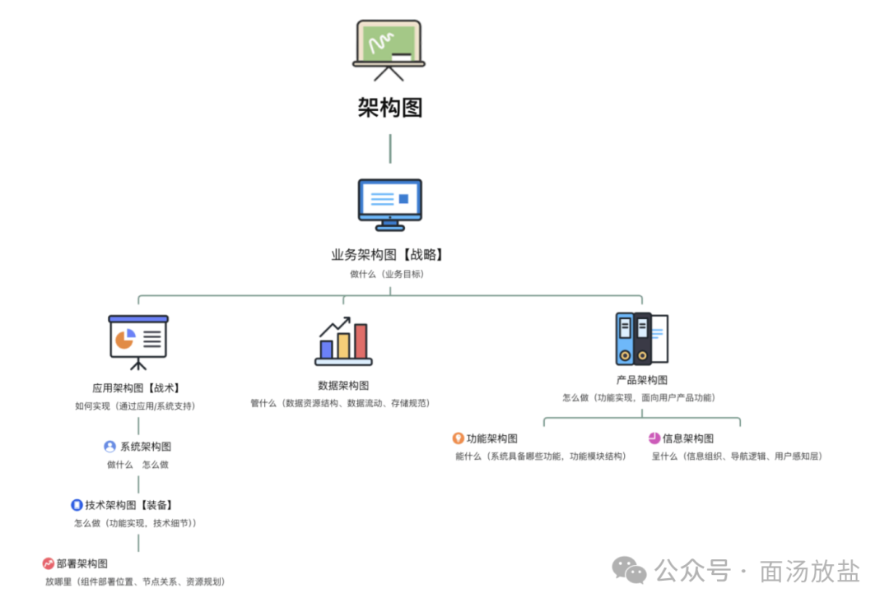

## 1. 业务架构图

### 1.1. 什么是业务架构图

业务架构服务于业务目标，通过描绘业务上下层关系，梳理一整套完整、简单的业务视图，降低业务系统的复杂度，提高客户理解度，最终给客户最直观的业务体现。

画业务架构图需要对业务熟悉掌握，并对业务进行收集、拆解、提炼、归纳、分类，从而绘制出业务的上下层级关系和主要结构模块。为后续围绕业务内容展开的工作提供可视化支持。

比如做一个团购网站，你只需要把商品类目、货品库存、订单服务、支付退款等进行清晰划分，而不需要考虑以下问题：我用什么技术开发、我的并发大怎么办、我选择什么样的硬件等。

### 1.2. 业务架构图构成要素

业务能力：企业"能做什么"--抽象层级高的功能，如"客户管理"、"订单处理"

业务流程：描述业务活动"如何做"--如"下单流程"、"客户服务流程"

业务角色：组织中承担特定职责的角色，如"客服人员"、"销售代表"

组织结构：企业组织架构中的部门、分支等

信息对象：业务中使用和产生的数据，如"订单"、"客户档案"

服务：可被调用的业务功能，如"开票服务"、"查询账户"

### 1.3. 业务架构核心价值

战略目标：明确公司的长期愿景和短期目标。

价值流：识别和优化业务流程，确保价值最大化。

业务能力：确定组织的核心竞争力和服务能

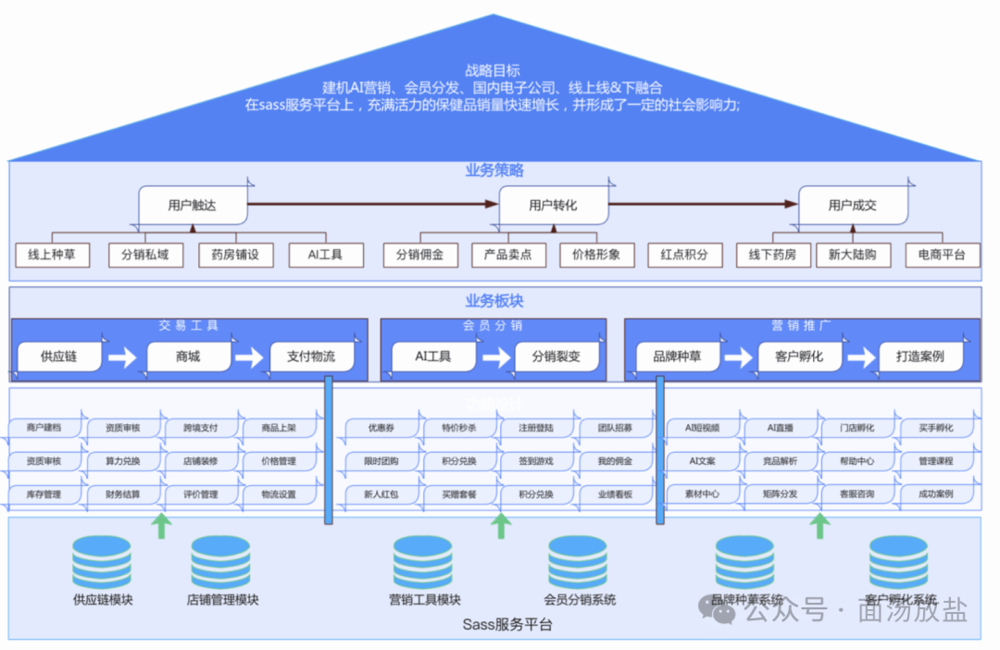

### 1.4. 业务架构分层

上中下结构：资源层—数据层—平台层—业务层—用户层。

左中右结构：上游产业—业务模型—下游产业。

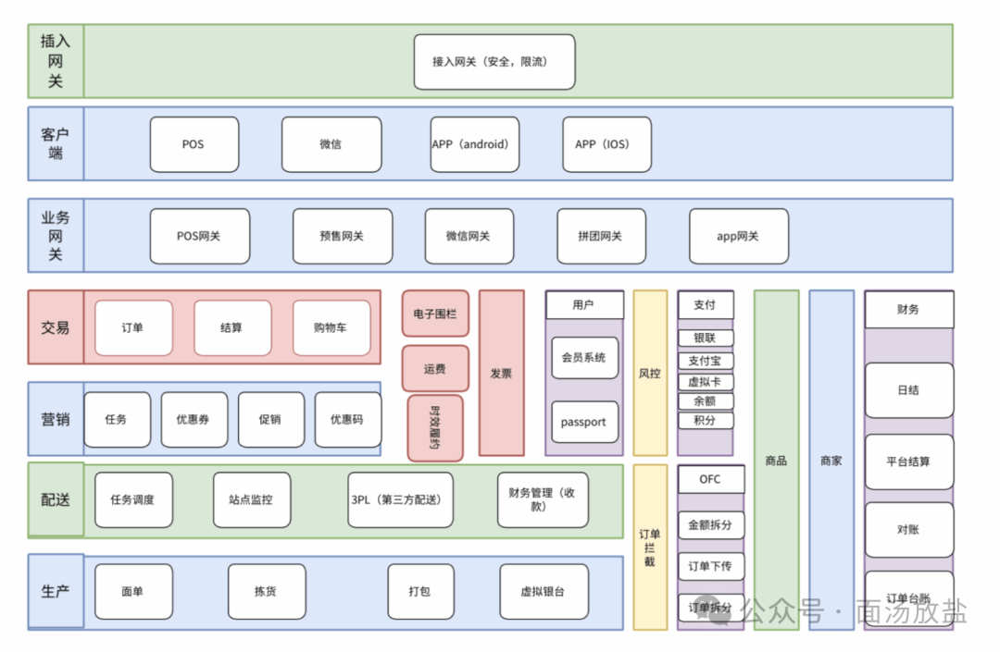

### 1.5. 业务架构图设计规范

横向：并列结构，左边的和右边的，级别要相同

纵向：要分层，上层依赖下层，底层更重要。

对称：讲究对称美，功能结构分配均匀。

虚线框：逻辑上可归为一块的多个模块可用虚线框。

色彩：颜色搭配要有区分，每个大的业务功能之间要有颜色做区分，但整体风格要一致。

大小格式：大小要一致，统一格式。

模块分级：同一级别模块要统一级别，粒度大小也要统一。

词汇描述：用词要准确，让开发人员或用户能理解。

模块划分粒度：细节要抽象出模块，粒度要合适，不能太具体或太宽泛。

### 1.6. 业务架构图使用场景

产品汇报：在产品规划和汇报会议上，可以用业务架构图来展现业务全局状态。

技术汇报：在汇报的时候不能只讲技术，也要讲业务的发展情况，用业务架构图就能够比较容易地展现业务整体情况。

员工培训：给新员工培训业务的时候，发一张业务架构图给他，能让新员工对整体业务有一个全局的认识和了解。

## 2. 应用架构图

### 2.1. 什么是应用架构图

应用架构图也叫逻辑架构图，是一种视觉化的工具，用于描述应用程序的结构和各个组件之间的交互方式。应用架构的设计起源于5W1H业务调研表中的信息化需求，结合业务组件的五要素定义等，以及现有信息系统的建设情况梳理IT应用现状，通过分析得出现状应用架构。

应用架构图包括应用程序的层次结构、组件、数据流和交互，帮助理解和设计复杂应用程序，一般分为：表现层、数据层、应用逻辑层和基础通用层。

应用架构图在所有架构图中起到了呈上启下的作用，向上承接了业务模式和产品功能的实现落地，向下指导了技术模块的设计与展开。应用架构图也是整个系统实现的总体架构，需要指出系统的层次、系统开发的原则、系统各个层次的应用服务

### 2.2. 应用架构图组成元素

应用系统：企业内部或外部使用的软件系统，用矩形框表示

模块/子系统：应用内部的功能模块，用嵌套框、分组区域表示

系统之间的接口：系统之间的数据流、服务调用等，用箭头表示

业务对象/数据流：通过系统流转的业务数据，用标签、泳道、颜色区分

用户或业务角色：使用系统的用户或组织，用人形图标表示

接口技术：如 REST、SOAP

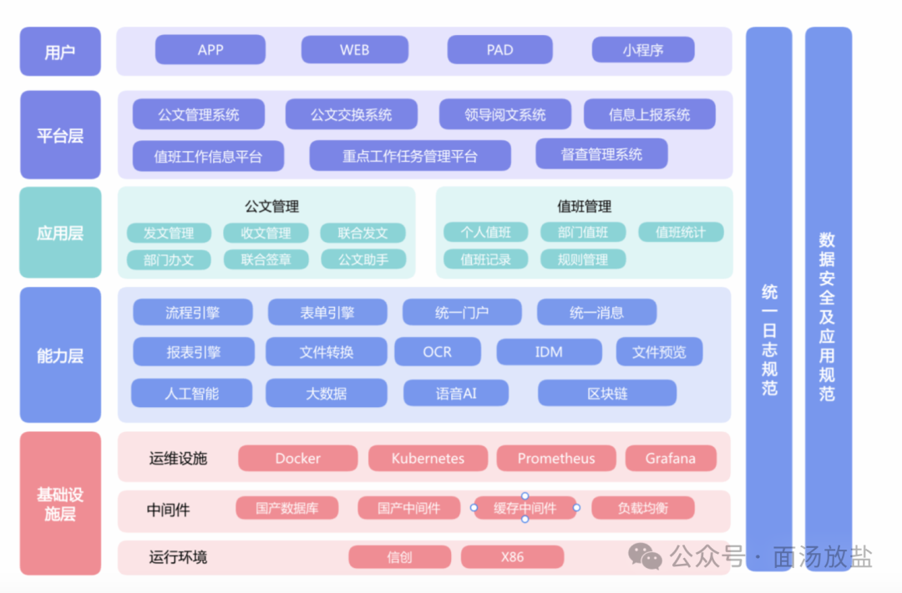

### 2.3. 应用架构分层方式

横向水平分层，按照功能处理顺序划分应用，比如把系统分为web前端/中间服务/后台任务，这是面向业务深度的划分。

纵向垂直分层，按照不同的业务类型划分应用，比如进销存系统可以划分为三个独立的应用，这是面向业务广度的划分

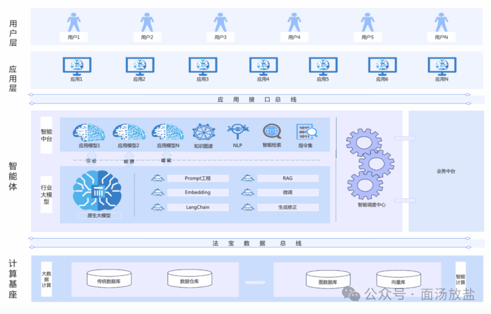

### 2.4. 应用架构图层级结构

三层架构：表现层、业务逻辑层和数据访问层。

四层架构：表现层、应用层、业务逻辑层和数据访问层。

其他分层结构：可以根据应用程序的实际需求进行分层，例如微服务架构、基于事件的架构等。

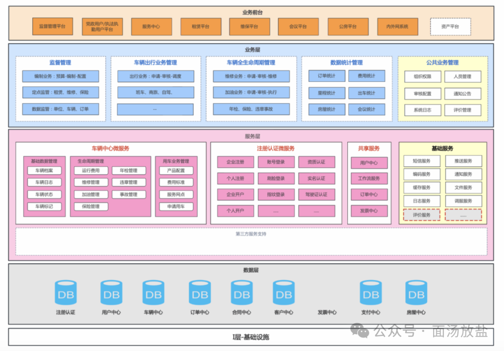

## 3. 技术架构图

### 3.1. 什么是技术架构图

技术架构图是基于产品开发之下的技术执行分支，描述了需要支持业务、数据和应用服务的软件和硬件能力，包括IT基础设施、中间件、网络、通信、流程、标准等。技术架构图绘制有助于团队对技术结构、实现方案、技术组件等进行宏观了解，对后续的具体技术工作提供基础认识。

技术架构解决的问题包括：纯技术层面的分层、开发框架的选择、开发语言的选择、涉及非功能性需求的技术选型，主要目标是基于现状技术架构、技术标准、业务/应用/数据架构要求，设计目标技术架构。技术架构主要考虑系统的非功能性特征，对系统的可用性、高性能、扩展、安全、伸缩性、简洁等做系统级的把握，要求架构师具备软件和硬件的功能和性能的过硬知识，这也是技术架构设计工作中最为困难的工作。

### 3.2. 技术架构图组成要素

模块与组件：展示系统的核心功能模块，如用户服务、订单处理、支付网关等。

数据流与交互逻辑：描绘信息流动轨迹，包括数据的输入、输出和转换过程。

通信协议与依赖关系：描述各个系统组件之间如何进行交互，使用的通信协议如HTTP、TCP/IP、消息队列等。

基础设施与部署环境：描述系统运行的硬件或云环境，如服务器、虚拟机、网络资源等。

安全与权限体系：描述如何管理用户权限、数据加密以及其他安全策略

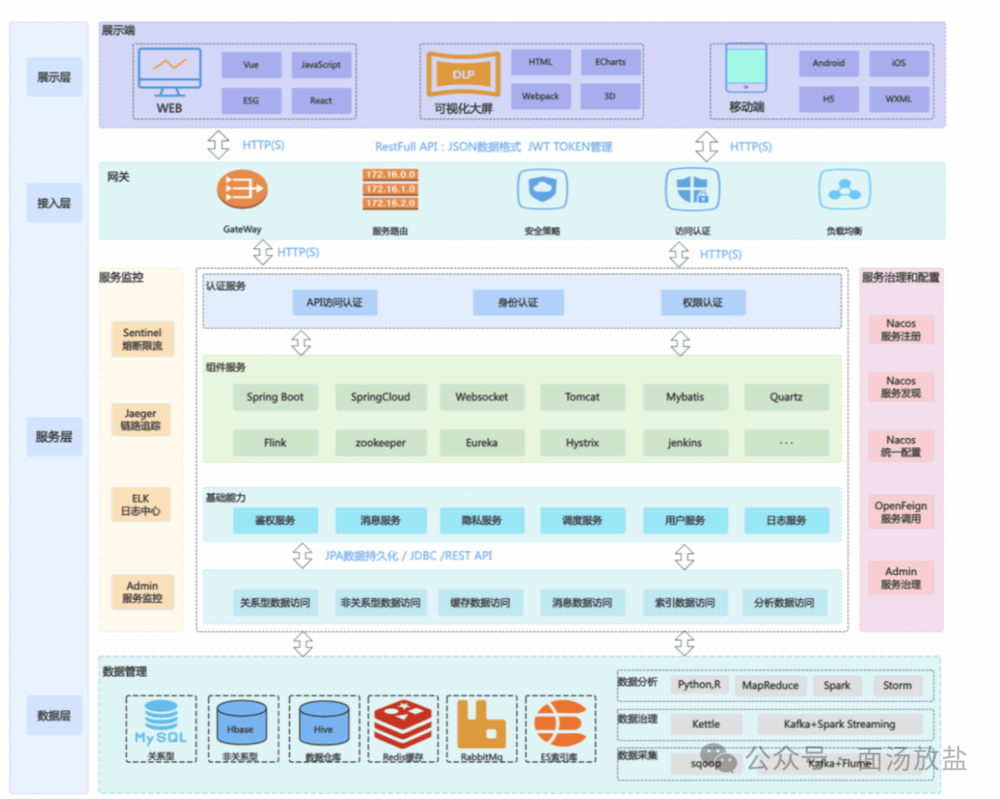

### 3.3. 技术架构图应用场景

技术架构图应用广泛，常用在：项目立项或方案评审、架构设计或重构汇报、安全合规与系统审计、跨部门技术协作说明、技术文档附图说明等场景。

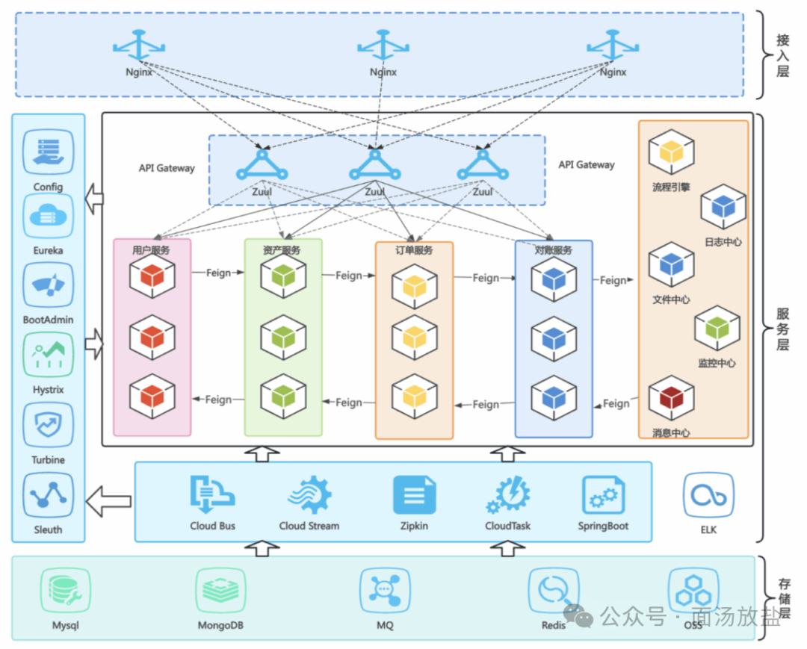

### 3.4. 技术架构图与系统架构图区别

系统架构图是关于"做什么"和"怎么做"的高层次描述，而技术架构图是关于"怎么做"的更详细的技术实现描述。两者相辅相成，共同指导软件系统的设计和开发。

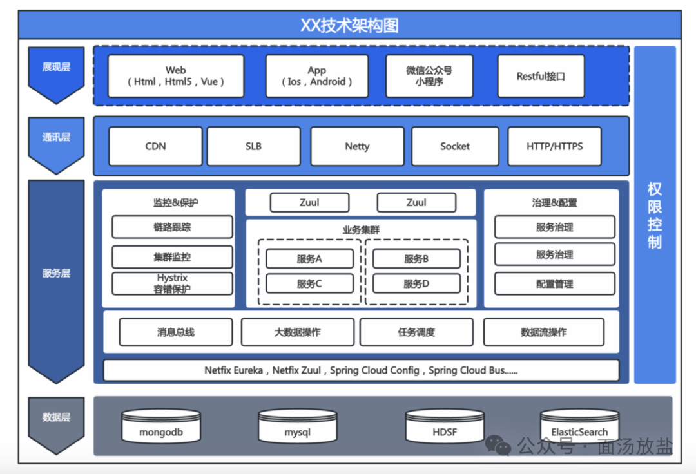

### 3.5. 技术架构图主要作用

明确系统结构和组件关系：展现系统整体架构，以及各个组件之间的依赖和交互方式。

指导开发和维护：帮助开发人员理解系统设计，方便进行开发、测试、部署和维护工作。

促进团队协作和沟通：提供清晰的视觉化表示，方便团队成员之间进行交流和理解，减少沟通成本。

支持技术选型和方案设计：帮助选择合适的技术栈，规划系统架构，保证系统的可扩展性和可维护性

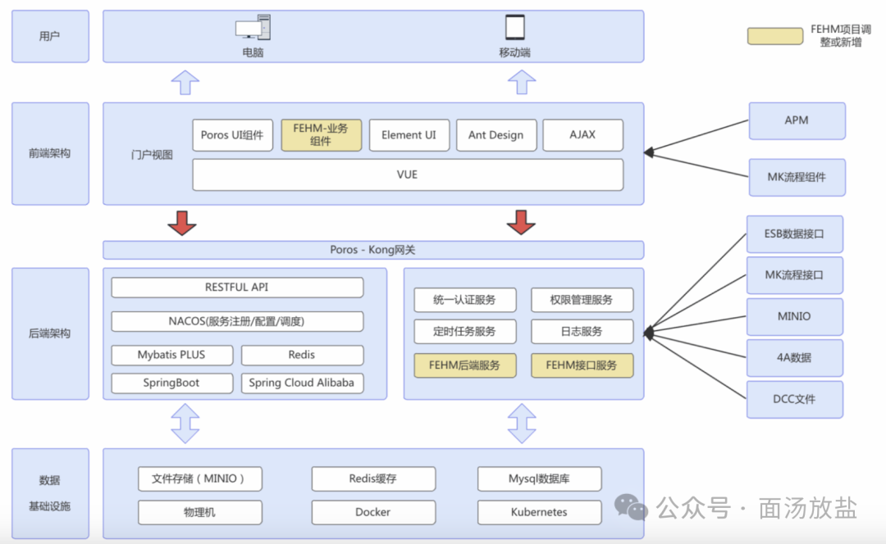

### 3.6. 技术架构图设计步骤

1，根据应用架构，进行技术支撑分析，识别技术支撑的必要条件2，技术选型，包括开发架构、技术产品、开发技术栈、开发平台、运行平台3，技术影响分析，成本，难易度，规划，治理

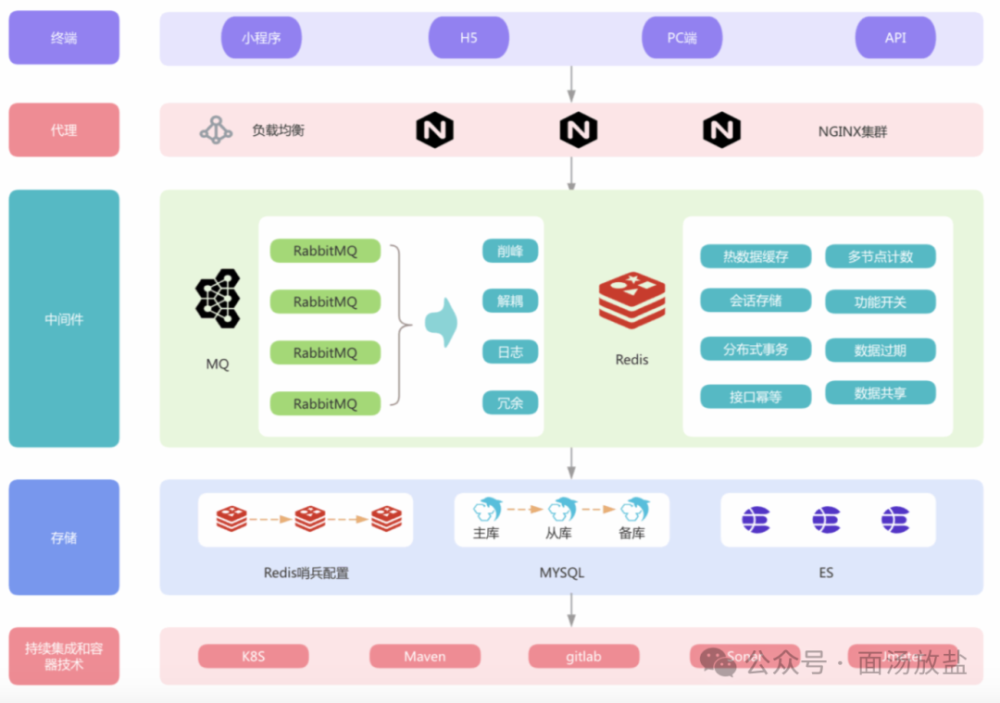

## 4. 数据架构图

数据架构图: 是连接业务与系统的纽带，关注系统中数据的存储方案，包括数据模型、数据存储格式、数据传递、数据复制、数据同步等策略。根据数据架构可以了解主体架构的数据模型、数据分布和数据资产之间的结构与关系，为数据库管理员和开发人员提供数据管理和数据处理的指导，帮助他们理解系统的数据结构和数据流动方式。

### 4.1. 什么是数据架构图

数据架构图是从数据侧描述数据怎么来、怎么存、怎么加工、怎么使用，重点关注系统中数据的存储方案，包括数据模型、数据存储格式、数据传递、数据复制、数据同步等策略。它会根据各个系统应用场景、不同时间段的应用场景 ，对数据进行诸如数据异构、读写分离、缓存使用、分布式数据策略等划分。

数据架构图为数据库管理员和开发人员提供数据管理和数据处理的指导，帮助他们理解系统的数据结构和数据流动方式，从而优化数据管理流程，提高系统效率，并支持数据驱动的决策过程。绘制数据架构图需要注意的核心内容有4点：

1）从数据源开始，数据通过哪些方式集成大到数仓；

2）数据集成到数仓之后，存储在哪里，数仓怎么分层，每一层的任务是什么；

3）数据在数据集市中又怎么存储、怎么管理；

4）数据到数据应用层又提供给哪些应用。

### 4.2. 数据架构图构成元素

数据源：这是数据进入系统的起点，可以是各种内部系统（如ERP、CRM）或外部系统（如第三方API、社交媒体）。

数据存储：存储系统负责持久化数据，包括数据库（如关系型数据库、NoSQL数据库）、数据仓库、数据湖等。

数据处理：处理模块负责对原始数据进行清洗、转换、聚合等操作，以便后续的分析和使用。

数据分析：分析模块提供各种分析工具和方法，以从数据中提取有价值的信息。

数据服务：将处理和分析后的数据以API或其他形式对外提供服务，供其他系统或用户使用。

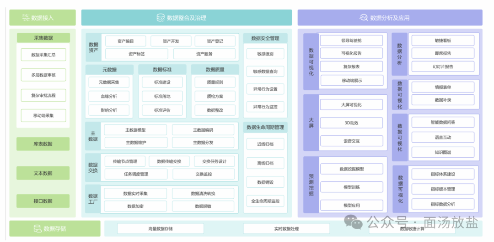

### 4.3. 数据架构图六大模块

数据声明：架构工作声明是架构开发方法中的关键文档之一，描述架构开发的范围、方法、资源和计划，它定义了架构项目的基本框架和预期成果，数据声明是其中的一部分。

数据原则：用于指导企业架构设计和实施的一组基本准则和指导方针，确保架构的一致性、灵活性和可扩展性，使架构决策在不同的项目和团队中保持一致。

数据模型：定义数据元素、它们的属性以及数据元素之间的关系。输出物包括概念模型、逻辑模型、物理模型、数据目录等。

数据流动：数据流动的主要输出物包括数据流转、数业映射等，描述数据在系统内和系统间的流动和传输方式。

数据管理：数据管理是指对企业内所有数据资产的管理和控制，旨在确保数据的高质量、完整性、安全性、可用性和可访问性，以支持业务决策和运营。

数据治理：数据治理涉及制定数据策略、建立数据管理组织结构和流程，以确保数据的一致性、完整性和使用合规性

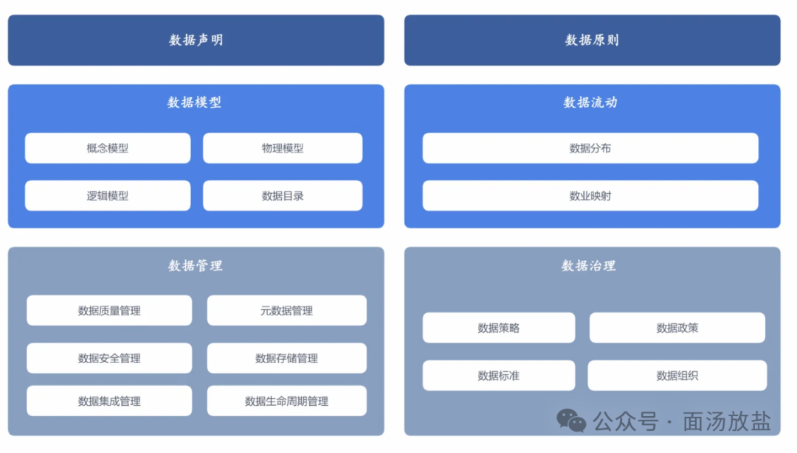

### 4.4. 数据架构图作用

数据架构主要解决三个问题：

第一，系统需要什么样的数据；

第二，如何存储这些数据；

第三，如何进行数据架构设计

### 4.5. 数据架构图核心目标

明确数据流向，描述数据从源头采集、处理、分发到消费的过程

梳理数据结构，展示关键数据域、表结构、数据模型

统一数据标准，辅助数据分类分级、命名规范、元数据治理

支持平台建设，为构建数据中台、数据湖、数据仓库提供依据

支撑合规治理，满足数据安全、合规、主数据管理等需求

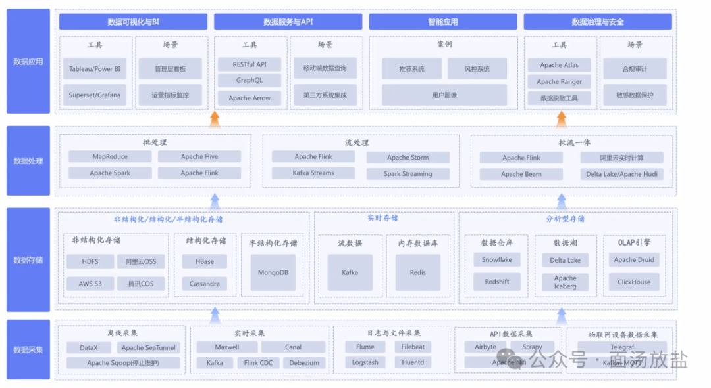

### 4.6. 数据架构图设计步骤

上接业务架构，分析数据需求，识别数据类型，采集数据

数据模型设计，概念模型、逻辑模型、物理模型

数据治理，数据安全合规，数据质量管理

数据共享开放，支撑业务决策，业务创新

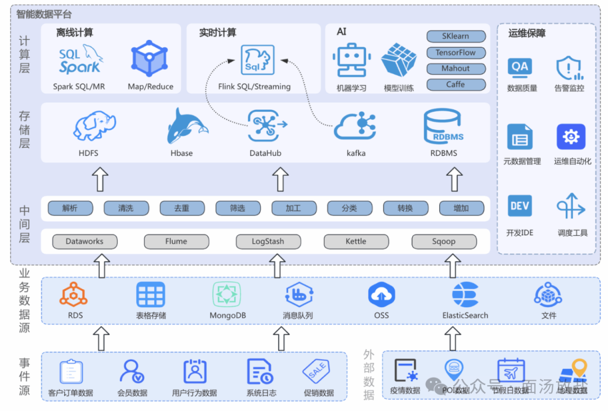

## 5. 产品架构图

### 5.1. 什么是产品架构图

产品架构图是产品经理用来表达自己产品设计机制的图，它将产品功能落地为信息化、模块化、层次清晰的可视化架构，并通过不同分层的交互关系、功能模块的组合、数据和信息的流转，来传递产品的业务流程、商业模式和设计思路，它是设计复杂产品时不可或缺的文档之一。

产品架构图是构建系统化技术蓝图的基础，其重要性在于通过分层展示功能模块、技术组件和数据流向等核心要素，直观呈现产品各层级的逻辑关系与技术实现路径。

一张逻辑清晰、层次明确的产品架构图，是对一个产品功能架构体系的高度抽象，能够给观者讲述一个产品的业务流程、功能框架和设计思路，项目组成员如果能将产品架构图熟记心中，那么对产品的演进方向就会有一个整体的概念，不至于在平时的设计和建设过程中"盲人摸象"

### 5.2. 产品架构图构成

模块划分：将产品分解为不同的功能模块，例如用户界面、业务逻辑、数据存储、支付系统等。

交互关系：明确各个模块之间的交互方式，例如用户如何通过界面与后端系统进行交互，不同模块之间如何传递数据。

信息流动：展示信息在不同模块之间的流转路径，确保每个模块的功能和数据来源都能得到清晰表达。

技术实现：包含技术层面的内容，例如使用的技术栈、数据库类型、服务器架构等。

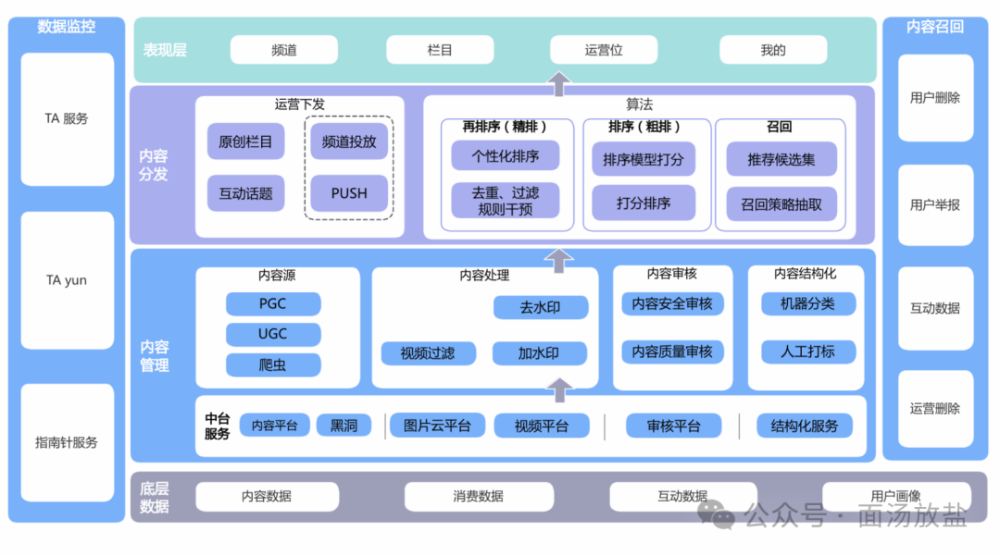

### 5.3. 产品架构图分层

统一的用户感知层：解决的是用户触达的问题，考虑在何种场景下通过何种方式触达用户。

解耦的业务功能层：本质是解决产品的核心功能的设计问题，包括如何高效的完成业务功能，如何与用户层进行交互，如何与外部系统进行数据通信等一系列复杂的业务处理。

集中的数据处理层：产品的数据从哪里来，沉淀到哪里去，数据如何高效的存储，如何快速的被调用。

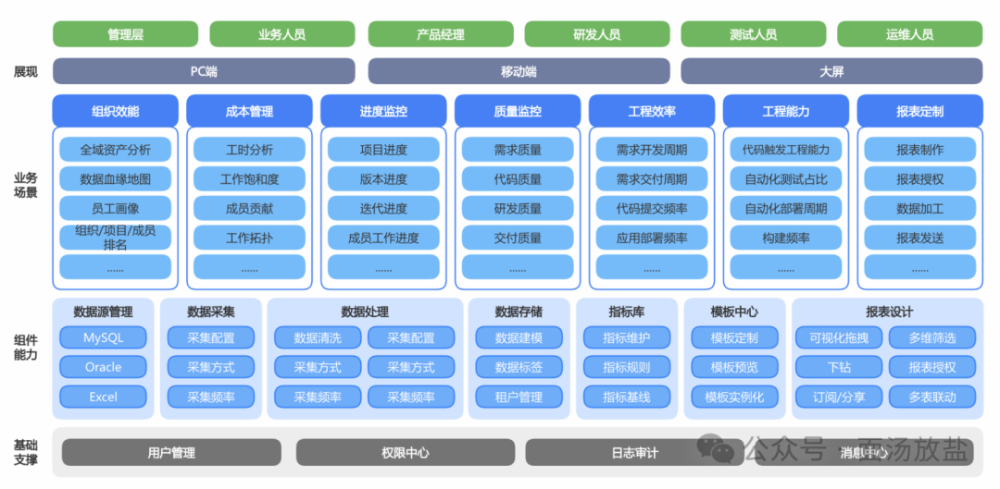

### 5.4. 产品架构图重要性

在产品正式进入开发以前，绘制一个完整的产品架构图已成为必然。产品架构图的根本目的就是为了梳理产品思路，从整体上把握产品的发展方向，把控产品的功能重点，它决定了产品必须要实现的功能，以及什么时候必须完成的功能。

同时，为了满足所设定的产品架构图，还必须配备相关的产品研发和市场运营资源以及具体的落地计划，包括技术选型和技术路径、市场营销规划等一系列的策略和措施。

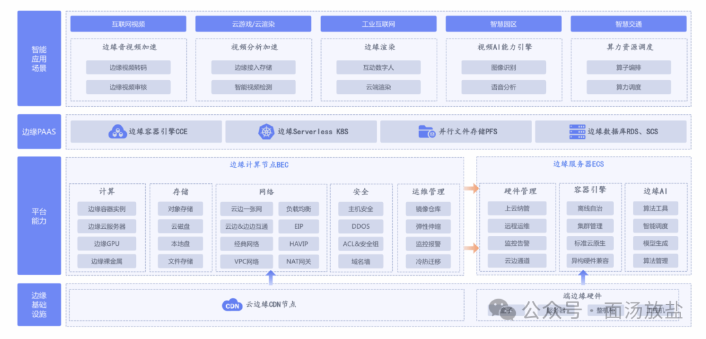

## 6. 系统架构图

### 6.1. 什么事系统架构图

系统架构关注的是系统的整体结构和组织方式，它描述了系统的各个组件、模块、子系统以及它们之间的交互和通信方式，更偏向于系统的物理构成和部署方式。一个电商平台的系统架构图可能包括负载均衡器、Web服务器、应用服务器、数据库服务器、缓存服务器等，以及它们之间的网络连接和数据传输。

应用架构是从整体上定义了应用程序的实现方式，系统架构则是从更加具体的层面对于应用程序怎样实现进行了设计，如果把应用架构类比为广东省的规划，那么系统架构就是深圳市的规划。

相比技术架构，系统架构是关于"做什么"和"怎么做"的高层次描述，而技术架构是关于"怎么做"的更详细的技术实现描述，如果把系统架构类比为深圳市的规划，那么技术架构就是南山区的规划。两者相辅相成，共同指导软件系统的设计和开发。

系统架构图不仅仅是一张图表，它是项目成功的蓝图。系统架构图作为一种可视化工具，能够帮助不同背景的团队成员理解复杂的系统结构，从而促进更有效的沟通。系统架构图通过展示系统的当前和未来状态，可以帮助团队做出更明智的技术选择和规划。当面对系统中的问题时，一张详细的系统架构图可以帮助快速定位问题源头，从而简化解决过程。

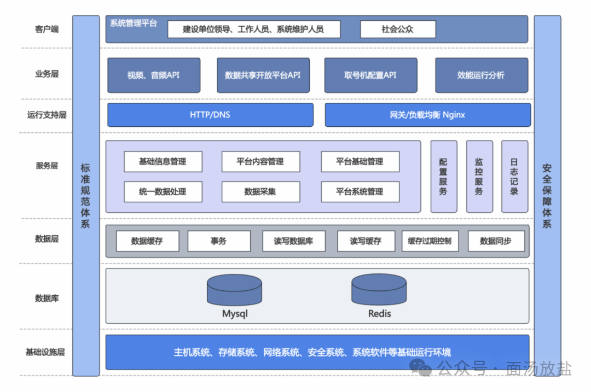

### 6.2. 系统架构图常用元素

系统架构图常用元素有服务器、数据库、网络设备、子系统、接口等

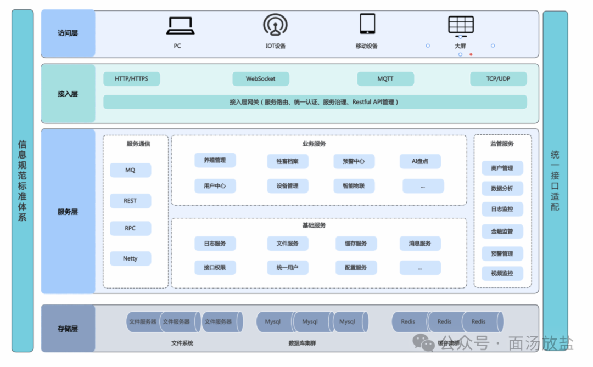

### 6.3. 系统架构图组成

1.系统元素：指系统中的各个组成部分，如模块、组件、接口等。2.系统关系：指系统元素之间的关系和交互，如依赖关系、接口关系等。3.系统属性：指系统元素和系统关系的一些特性，如性能、可靠性等。

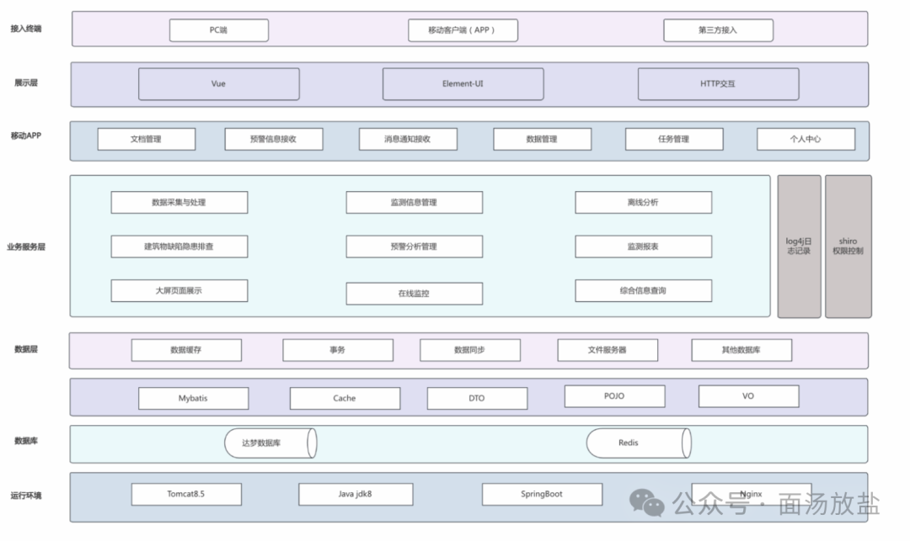

### 6.4. 系统架构图分类

1.物理架构图：描述系统的物理组成和部署情况，如服务器、网络设备等。2.逻辑架构图：描述系统的逻辑组成和功能模块，如业务模块、数据模块等。3.流程架构图：描述系统的流程和业务流程，如数据流程、业务流程等。

### 6.5. 系统架构图作用

为项目成员提供整体视角，确保系统设计合理且各部分协调

支持架构决策和技术选型，明确各组件职责

方便沟通和协作，减少误解和重复工作

帮助运维和测试团队，更容易理解系统运行机制及风险点

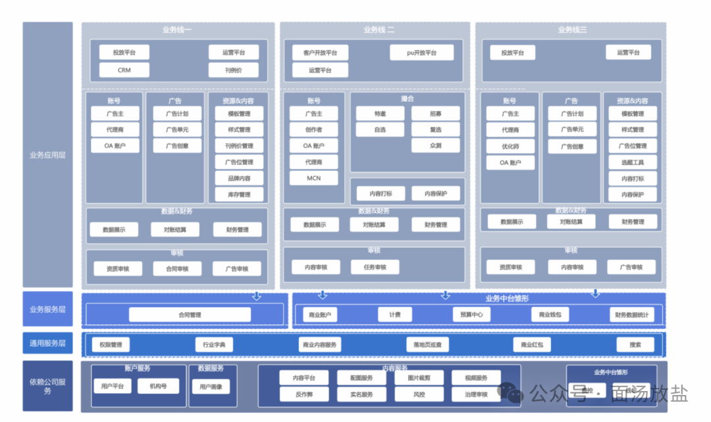

## 7. 部署架构图

部署架构图： 关注系统如何被部署到物理机器和网络环境中，包括硬件、软件、网络设备等资源的配置和布局，为系统管理员和运维人员提供系统的部署方案，帮助他们理解系统的物理布局和部署要求。

### 7.1. 什么是部署架构图

部署架构图又叫物理架构图，是描述系统组件及其相互关系的图形表示，关注软件元件是如何放到硬件上的，专注于基础设施，某种软硬件体系，甚至云平台，包括机房搭建、网络拓扑结构，网络分流器、代理服务器、Web 服务器、应用服务器、报表服务器、整合服务器、存储服务器和主机等。

物理架构主要考虑硬件选择和拓扑结构，软件到硬件的映射，软硬件的相互影响。在软件系统的开发和实施过程中，部署架构图扮演着非常重要的角色。通过清晰的部署架构图，能够为开发者提供完整的系统概览，帮助其理解系统组件的布局和交互方式。

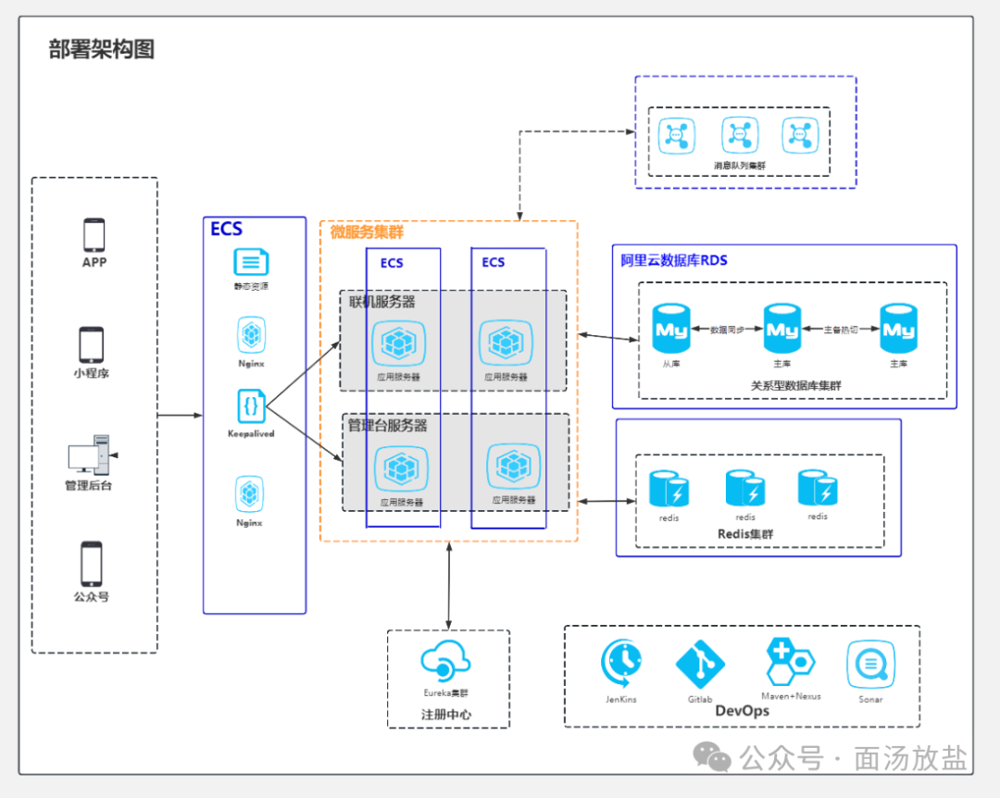

### 7.2. 部署架构图元素

部署架构图常用的元素包括：基础设施层元素、网络与通信元素、应用与服务层、用户与客户、图形符号和连线样式等。

### 7.3. 部署架构图模块

接入层：用于接收外部请求，是系统的"入口"。

服务层：实现具体业务逻辑，通常由多个服务或微服务组成。

通信与集成层：模块之间或系统与第三方的交互机制。

数据层：负责数据的持久化与管理。

运维与监控层：保障系统稳定性和可观测性。

部署与基础设施层：底层资源的部署方式与基础支撑。

安全层：保障系统各个模块的访问控制和数据安全。

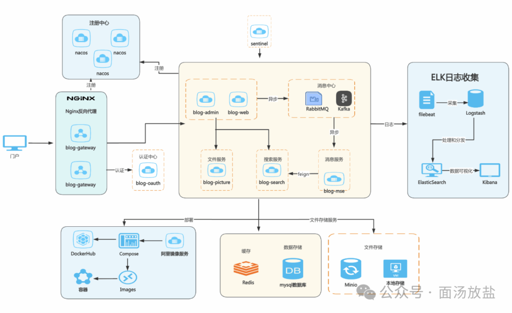

### 7.4. 部署架构图作用

部署架构图能够帮助开发人员更好地理解系统的整体结构，以及各个组件之间的数据流动和交互方式。此外，通过部署架构图，开发人员可以更好地规划系统的部署和扩展策略，提高系统的可维护性和可扩展性。

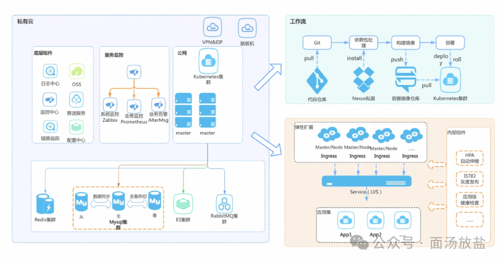

### 7.5. 部署架构图应用场景

开发协作：清晰知道各服务部署位置、依赖组件，避免部署误差

运维部署：指导环境搭建、版本发布、容量评估、健康监控等

安全评估：审查网络隔离、认证鉴权、端口暴露、流量控制等

性能规划：分析瓶颈、做容量预估、支持弹性扩展方案

灾备设计：展示主备结构、异地多活、自动故障切换机制

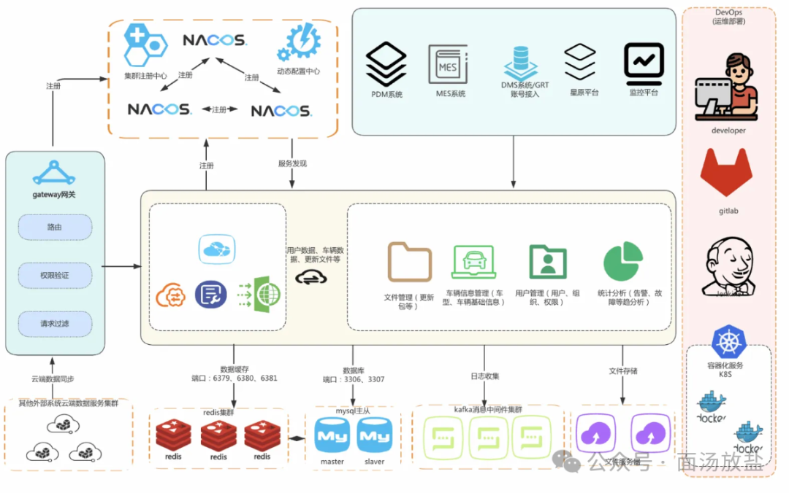

### 7.6. 部署架构图类型

单体部署：所有模块部署在同一台或少数几台机器上

分布式部署：模块划分明确，服务部署在多个节点上

微服务部署：基于容器或服务网格，各模块独立部署，可独立伸缩

混合云部署：部分模块部署在本地 IDC，部分部署在云端

多活部署：多个节点/区域同时提供服务，提高可用性与容灾能力

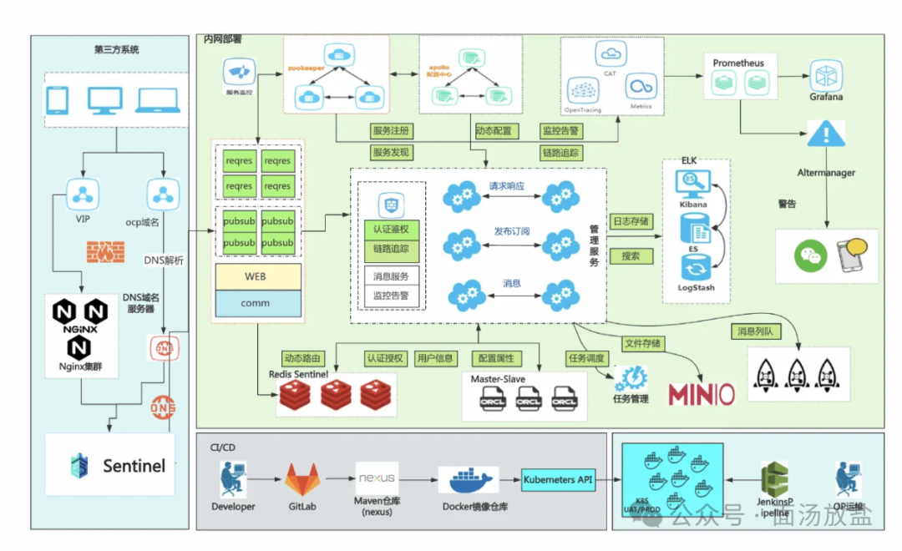

## 8. 信息架构图

### 8.1. 什么是信息架构图

信息结构图就是将业务中的对象按照一定的方式梳理而成的结构化信息图谱，是帮助我们定义和组织如何在产品中展示信息的工具。信息架构图的设计旨在满足用户需求和产品目标，通过合理的信息组织和表达，使用户更容易获取和理解信息。

信息架构的核心是探讨用户对信息的认知过程，对于产品设计而言，信息架构关注的是"呈现给用户合理且有价值的信息"。

信息架构图通常由信息架构师和交互设计师共同设计，他们需要深入理解用户需求、业务目标和技术平台，以确保信息架构图能够有效地支持用户的信息检索和导航需求。

信息架构图一般以思维导图绘制居多，绘制方法和步骤也比较简单

### 8.2. 信息架构图设计原则

对应性：产品目标与用户需求相对应。

功能的相似性：通过分类把相似性质的功能放在一起，以大类为基础作为产品的主框架，以小类作为子框架进行补充就形成了整个产品框架。

功能和功能之间的关系：包含关系--功能之间存在上下游依赖的关系，可以纵向进行的信息架构；并列关系--两个功能之间没有关联，可以考虑横向信息架构。

功能的使用频率：使用的频率越高，说明这个功能越重要，越要把这个功能放在最容易触及的地方，优先考虑围绕核心功能进行设计架构。

系统的扩展性：产品从0到1，从1到N，产品功能也是不断增加完善的，这就要求在做信息架构时，要做好拓展的准备，考虑之后的扩展性。

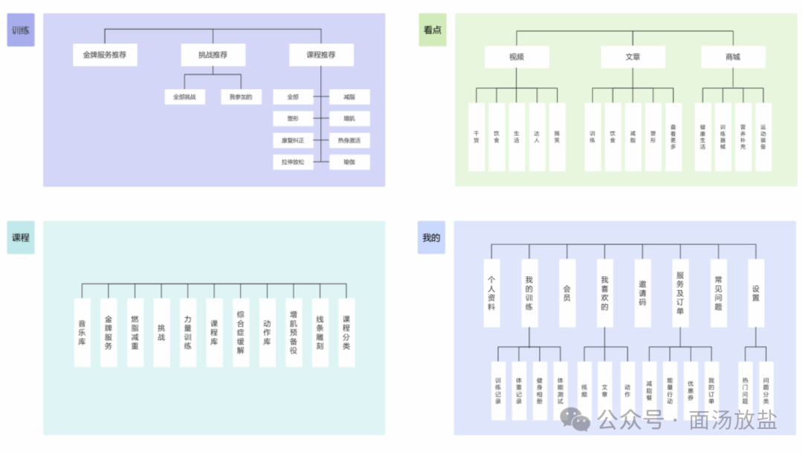

### 8.3. 信息架构构建方式

自上而下：自上而下的构建方式是由战略层驱动，根据产品目标与用户需求直接进行结构设计，进行新产品规划或者产品重新定义的时候用到。

自下而上：自下而上的构建方式是由范围层驱动，根据对现有的内容和功能需求的分析进行设计，这是项目实践中大家最常用的一种方式。

综合运用：自上而下和自下而上两种构建方式都有明显的缺点，所以理想的信息架构的构建方式都是综合运用的，同时从战略层和范围层进行驱动，以构建一个适应性强的系统。

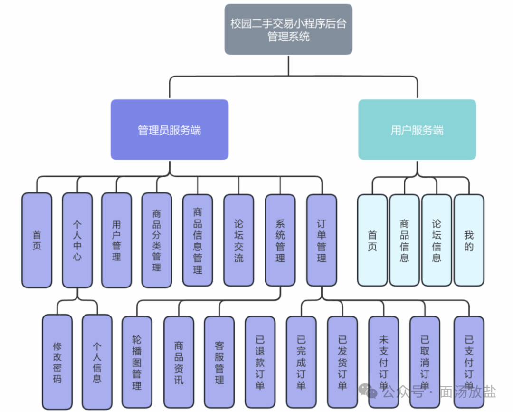

## 9. 总结

架构图在软件开发过程中的关键作用，它们不仅是设计文档的重要组成部分，也是确保项目成功的关键因素之一。通过合理的架构设计，可以有效提升系统的可维护性、扩展性和用户体验。