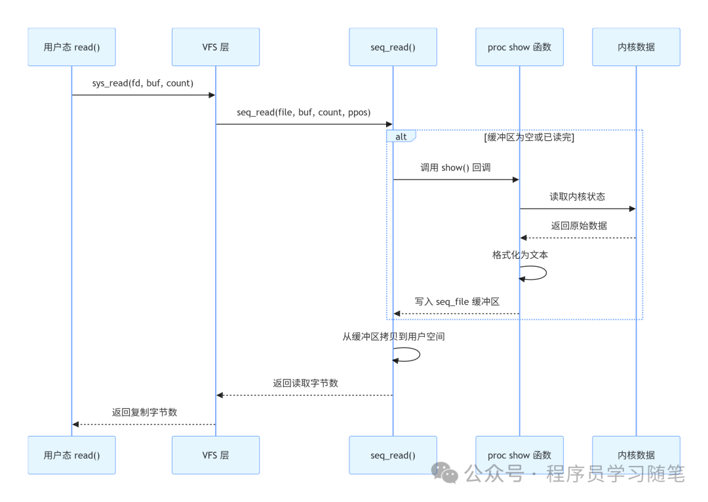

# /proc 不是磁盘：Linux 虚拟文件系统的运行机制

0.引言

执行 du -sh /proc 的时候，我们可能会感到困惑：明明 ls /proc 能列出上百个文件和目录，总大小却显示为 0。原因很简单——/proc 里的东西根本不在磁盘上。

它不是一个存放数据的目录，而是内核向用户态打开的一扇窗。每一次 cat /proc/meminfo，都不是在读取磁盘扇区，而是触发了一次内核函数调用，把当前内存状态实时格式化成文本，再通过标准的文件接口返回到用户空间。

这就是虚拟文件系统（Virtual File System）：它用统一的文件抽象，封装了完全不同的底层实现。ext4 读写磁盘，procfs 读写内核数据结构，而我们用的是同一套 open/read/write 系统调用。

本文从 VFS 抽象层出发，深入 procfs 的内核实现，拆解一次 cat 命令背后完整的调用链路。

1.VFS：一切文件系统的统一抽象

在理解 proc 之前，我们必须先理解 VFS。Linux 能同时支持几十种文件系统，靠的就是这层抽象。详细内容可以参考：VFS：Linux文件系统的“联合国”式抽象——探秘统一访问接口的设计哲学

这就是为什么我们可以用 cat、grep、vim 等任何普通文件工具操作 /proc——因为在 VFS 层面，它和磁盘文件没有区别。

2.proc_dir_entry：proc 文件系统的骨架

procfs 内部有自己的目录树组织方式，核心数据结构是 struct proc_dir_entry，简称 PDE。每个你在 /proc 下看到的文件或目录，在内核里都对应一个 PDE 节点。

structproc_dir_entry{/** number of callers into module in progress;* negative -> it's going away RSN*/atomic_tin_use;refcount_trefcnt;structlist_headpde_openers;/* who did ->open, but not ->release *//* protects ->pde_openers and all struct pde_opener instances */spinlock_tpde_unload_lock;structcompletion*pde_unload_completion;conststructinode_operations*proc_iops;union{conststructproc_ops*proc_ops;conststructfile_operations*proc_dir_ops;};conststructdentry_operations*proc_dops;union{conststructseq_operations*seq_ops;int(*single_show)(structseq_file *,void*);};proc_write_twrite;void*data;unsignedintstate_size;unsignedintlow_ino;nlink_tnlink;kuid_tuid;kgid_tgid;loff_tsize;structproc_dir_entry*parent;structrb_rootsubdir;structrb_nodesubdir_node;char*name;umode_tmode;u8 flags;u8 namelen;charinline_name[];} __randomize_layout;

设计细节：

第一，子目录用红黑树组织。/proc 下有几百个进程目录，如果用链表遍历性能太差。内核使用红黑树按名称排序存储，查找时间复杂度 O(log n)。当你访问 /proc/1234/status 时，内核通过两次树查找就能定位到目标 PDE。

第二，inode 号是动态分配的。procfs 没有磁盘 inode，所以它用一个简单的计数器 low_ino 分配编号。这也是为什么 ls -i /proc 看到的 inode 号和磁盘文件系统完全不在一个数量级。

第三，size 字段通常为 0。因为内容是动态生成的，打开文件之前没人知道最终会输出多少字节。所以 ls -l 看到大部分 proc 文件大小都是 0，但实际读取时能返回数据。

3.一次完整的读取

现在我们跟踪一次 cat /proc/meminfo，看数据如何从内核变量走到你的终端。

### 阶段一：路径查找与 inode 实例化

当内核收到 open 系统调用，VFS 开始路径解析。逐分量遍历 / → proc → meminfo，每一步都在 dentry cache 中查找。如果未命中，就调用 procfs 的 lookup 方法去 PDE 红黑树里找。

找到对应 PDE 后，VFS 会创建一个 struct inode。这是一个纯内存对象，字段从 PDE 填充而来：权限、uid/gid、操作函数表。这个 inode 只存在于内存，永远不会写入磁盘。

### 阶段二：打开文件，绑定操作集

inode 创建完成后，内核创建 struct file 对象，将 file->f_op 指向该文件对应的操作函数表。对于大多数只读 proc 文件，这个表是 proc_seq_operations，里面注册了 seq_file 提供的通用读写实现。

### 阶段三：读取触发内容生成

用户调用 read() 时，最终调用到 seq_read()。这是 seq_file 机制的核心入口。

这里有一个关键的工程设计：show 函数不直接和用户缓冲区交互。它只负责把内容写入 seq_file 提供的内部缓冲区，seq_read 再统一处理分段拷贝、位置偏移、越界判断。

### 阶段四：关闭与回收

close 系统调用触发 seq_release，释放 seq_file 缓冲区。如果 dentry 使用计数归零，还可能被回收进 dcache LRU 链表，内存压力大时会被释放。

procfs 的 inode 属性中st_size/st_blocks通常为 0，因此du显示 0。

## 4.seq_file：虚拟文件的工程化解决方案

seq_file 是内核引入的专门解决虚拟文件读取的一套机制。在它出现之前，每个 proc 文件都要自己处理偏移量、缓冲区、分页，bug 层出不穷。

seq_file 的核心思想是迭代器模式。它把虚拟文件内容看作一系列"记录"，提供四个回调：

structseq_operations {void* (*start) (structseq_file *m, loff_t *pos);void(*stop)  (structseq_file *m,void*v);void* (*next)  (structseq_file *m,void*v, loff_t *pos);int(*show)  (structseq_file *m,void*v);};

对于输出只有一行或一个固定块的简单文件（比如 meminfo），连迭代器都不用写，直接用 single_open 封装一个 show 函数就行：

// meminfo 的简化实现示意staticintmeminfo_show(structseq_file *m,void*v){structsysinfo i;si_meminfo(&i);seq_printf(m, ”MemTotal:       %8lu kB\n”, i.totalram);seq_printf(m, ”MemFree:        %8lu kB\n”, i.freeram);seq_printf(m, ”Buffers:        %8lu kB\n”, i.bufferram);// ... 输出几十行统计信息return0;}staticintmeminfo_open(structinode *inode,structfile*file){returnsingle_open(file, meminfo_show, NULL);}

seq_printf 是 seq_file 提供的格式化函数，它自动管理内部缓冲区的扩容，不用担心溢出。这比直接操作用户缓冲区安全得多。

seq_file 的另一个重要贡献是正确处理 seek。因为每条记录有明确的边界，即使随机 seek 到文件中间，seq_file 也能通过迭代器定位到正确的记录起始位置，不会出现读到半行的尴尬情况。

5.写入路径：/proc/sys 如何修改内核参数

proc 文件不只是能读，/proc/sys 下的文件还能写。echo 1 > /proc/sys/net/ipv4/ip_forward 这条命令很多人都用过，但它背后是怎么工作的？

### 5.1 sysctl 表驱动机制

/proc/sys 并不是用普通 PDE 一个个注册的，它基于 sysctl 表。内核中定义了一张 ctl_table 树，每个节点对应一个 sysctl 参数，同时也对应 /proc/sys 下的一个文件。

// 简化的 sysctl 表定义staticstructctl_table ipv4_table[] = {{.procname   = ”ip_forward”,.data       = &ipv4_devconf.data[IPV4_DEVCONF_FORWARDING -1],.maxlen     =sizeof(int),.mode       =0644,.proc_handler   = proc_dointvec,},// ... 几十上百个参数};

每个表项包含几个关键字段：

### 5.2 写入调用流程

当你执行 echo 1 > /proc/sys/net/ipv4/ip_forward：

VFS 层路径解析，定位到对应 sysctl 节点

调用proc_sys_write，从用户空间拷贝字符串

调用该节点注册的proc_handler（这里是proc_dointvec）

如果有额外的回调钩子，触发后续逻辑（比如转发开关变化后刷新路由缓存）

整个过程本质上是通过文件接口修改变量。没有磁盘写入，没有文件内容保存。你写进去的字符串在完成解析后就被丢弃了，内核里只保留最终的整数值。

这也解释了为什么重启后设置会丢失——因为修改的是内存中的变量，没有持久化存储。sysctl.conf 的作用就是开机时重新执行一遍写入操作。

6.进程目录：动态生成的体现

/proc 下最神奇的莫过于数字编号的进程目录。系统里有多少个运行中的进程，/proc 下就有多少个对应目录。进程创建时出现，进程退出时消失。

这不是靠定时器轮询刷新，而是生命周期绑定。

### 6.1 /proc/[pid] 的创建时机

用户访问`/proc/<pid>`时，由`proc_pid_lookup()`动态创建 dentry/inode。也就是说，进程目录本身也是“按需构造”的，而不是在进程创建时插入 PDE。

进程退出时，内核通过proc_flush_task()之类的路径让相关 dentry/inode 失效。

### 6.2 读取 /proc/self/maps 的内部过程

/proc/self 是一个指向当前进程目录的符号链接。读取 /proc/self/maps 时：

路径解析遇到self，procfs 动态解析为当前进程 PID

定位到 maps 文件对应的 PDE

seq_file 迭代器遍历进程的 VMA（虚拟内存区域）链表

每个 VMA 调用一次show函数，输出一行地址范围、权限、映射文件等信息

### 6.3 /proc/[pid]/fd 的特殊之处

/proc/[pid]/fd 目录下是文件描述符对应的符号链接。这些链接不是预先创建好的，而是在 lookup 时动态生成。当你 ls /proc/1/fd/，内核遍历进程的文件描述符表，为每个打开的文件即时创建一个 dentry。

这也是为什么 /proc 下很多目录你 ls 的时候才"突然出现"——它们根本没有常驻的 PDE，完全按需构造。

## 7.性能代价与工程权衡

procfs 很方便，但不是完全没有开销的。理解它的性能特性有助于合理使用。

读取开销远大于普通文件。读一个磁盘文件，大部分时间在等待 I/O，但 CPU 开销很低；读一个 proc 文件，CPU 要执行完整的内核函数调用、数据采集、格式化、拷贝。对于 cat /proc/net/tcp 这种需要遍历整个连接表的操作，在高并发服务器上可能消耗几毫秒 CPU 时间。

频繁读取会产生实际成本。很多监控脚本每秒 cat /proc/stat 采集 CPU 使用率，看起来无害，但在容器密集的机器上，几百个容器同时采集，CPU 开销会非常可观。这也是为什么 /proc 接口逐渐被更高效的 syscall或 perf 事件替代。

dentry 缓存是双刃剑。访问过的 proc 文件会在 dcache 中留下缓存，加速后续访问。但如果系统上短生命周期进程很多，/proc/[pid] 目录会产生大量转瞬即逝的 dentry，给内存回收带来压力。

尽管有这些资源消耗，procfs 的设计仍然是成功的。它用极小的性能代价，换来了极大的调试和运维便利性。任何进程不需要特殊权限、不需要特殊工具，只用标准文件 I/O 就能窥探内核状态。这是 Unix "一切皆文件" 哲学最精彩的体现之一。

8.几个容易搞错的冷知识

### 误区一：/proc 文件可以用 mmap

大部分不行。mmap 需要文件内容有稳定的内存布局，而 proc 文件是动态生成的文本，没有固定的物理页。少数特殊文件（如 /proc/kcore）实现了 mmap，但那是直接映射内核地址空间，属于特例。

### 误区二：文件大小为 0 是空文件

恰恰相反，大小为 0 正是虚拟文件的标志。因为内容在读取前无法预知长度，所以 stat 调用返回 st_size = 0。但 read 可以返回非零数据。很多脚本用 if [ -s /proc/xxx ] 判断文件是否有内容，这在 procfs 上是错误的。

### 误区三：/proc 下的文件都是文本

大部分是，但不全是。/proc/kcore 是 ELF 格式的内核镜像，/proc/kmsg 是二进制日志流。procfs 只是提供字节流接口，内容格式完全由实现决定。

### 误区四：echo 写入的值会原样保存

写入 /proc/sys 的字符串会被解析后丢弃。你写 "1" 进去，内核变量变成整数 1。再读出来时，是内核把整数重新格式化成字符串返回的。写入和读出的字符串格式不一定完全一致。

9.总结

/proc 看起来像文件，用起来像文件，接口和文件完全一致，但它从头到尾都不是文件。

它是内核暴露给用户态的函数调用界面，披着文件系统的外衣。VFS 层的抽象让这种伪装天衣无缝，seq_file 机制让内核开发者可以轻松添加新的"文件"，而用户甚至感知不到这背后是完全不同的实现。

理解了 procfs，我们才能更好的理解 Linux "一切皆文件" 的设计哲学——不是说什么东西都往磁盘上存，而是说什么东西都可以用文件的接口来操作。管道、套接字、设备、进程状态、内核参数……它们来源各异，形态不同，但在 VFS 的统一调度下，都变成了可以 open、read、write、close 的字节流。
