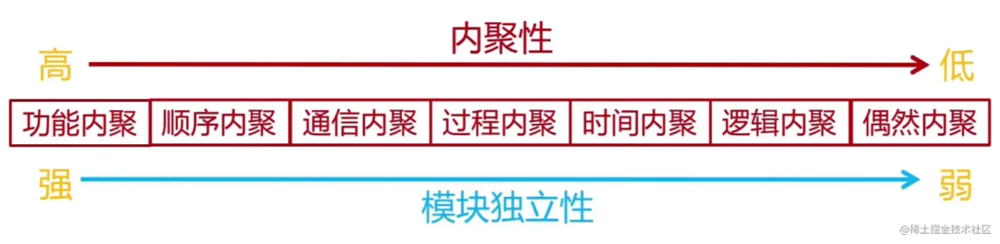
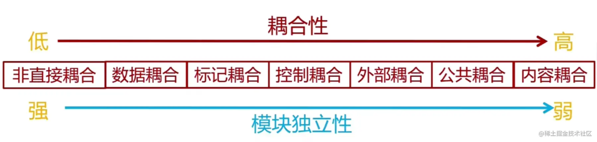
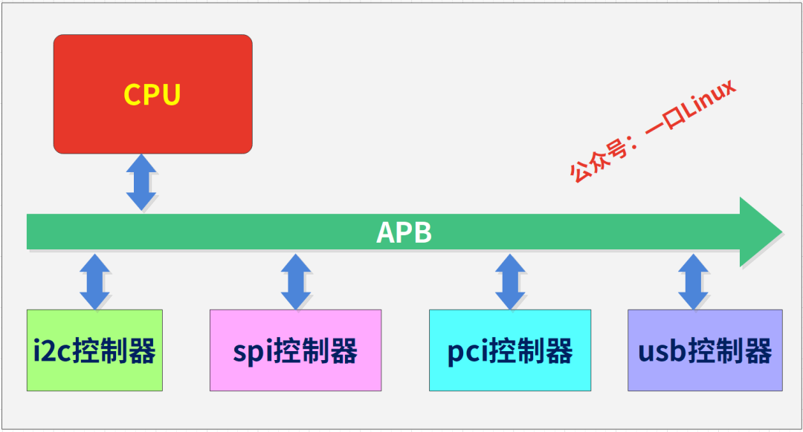
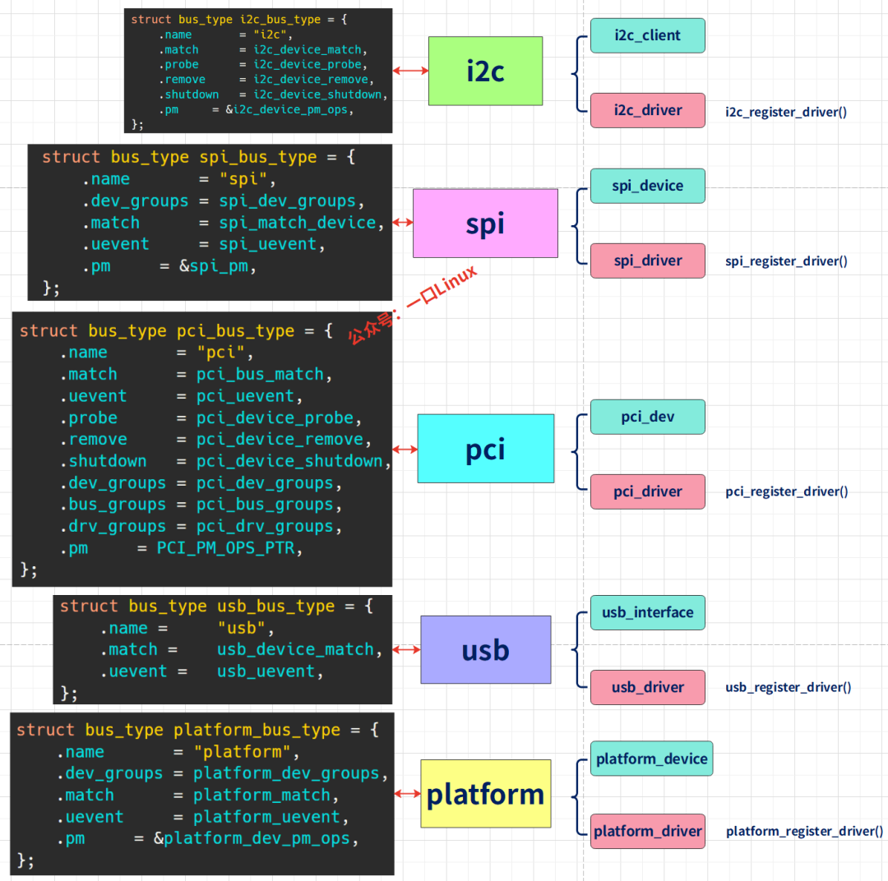

# 到底什么是高内聚、低耦合？

击左上方蓝色“一口Linux”，选择“设为星标”

第一时间看干货文章☞【干货】嵌入式驱动工程师学习路线☞【干货】Linux嵌入式知识点-思维导图-免费获取☞【就业】一个可以写到简历的基于Linux物联网综合项目☞【就业】简历模版

第一时间看干货文章

☞【干货】嵌入式驱动工程师学习路线

☞【干货】Linux嵌入式知识点-思维导图-免费获取

☞【就业】一个可以写到简历的基于Linux物联网综合项目

☞【就业】简历模版

一、前言设计原则千万条，高内聚低耦合第一条！学过软件工程这门课的同学一定都听过高内聚低耦合这个名词，可以说这个是软件设计最重要的一个原则，是一种设计哲学理念，作为新时代的民工，这个概念必须掌握。Linux内核虽然是由汇编代码和C语言编写的，但是很多架构模块也用到了面向对象的思想， 最后一章会以Linux内核中的bus总线架构来讲解到底高内聚、低耦合的艺术？二、内聚性、耦合性概念高内聚低耦合，是软件工程中的概念，是判断设计好坏的标准，主要是面向对象的设计，主要看类的内聚性是否高，耦合度是否低。目的是使得模块的可重用性、移植性大大增强。1. 内聚性：又称块内联系。指模块的功能强度的度量，即一个模块内部各个元素彼此结合的紧密程度的度量。若一个模块内各元素（语名之间、程序段之间）联系的越紧密，则它的内聚性就越高。所谓高内聚是指一个软件模块是由相关性很强的代码组成，只负责一项任务，也就是常说的单一责任原则。通常程序结构中各模块的内聚程度越高，模块间的耦合程度就越低。2. 耦合性：也称块间联系。指软件系统结构中各模块间相互联系紧密程度的一种度量。模块之间联系越紧密，其耦合性就越强，模块的独立性则越差。模块间耦合高低取决于模块间接口的复杂性、调用的方式及传递的信息。对于低耦合，粗浅的理解是：一个完整的系统，模块与模块之间，尽可能的使其独立存在。也就是说，让每个模块，尽可能的独立完成某个特定的子功能。模块与模块之间的接口，尽量的少而简单。如果某两个模块间的关系比较复杂的话，最好首先考虑进一步的模块划分。这样有利于修改和组合。耦合强弱取决于模块间接口的复杂程度、进入或访问一个模块的点以及通过接口的数据。举个例子比如以往去政府办一个证明要跑八九个部门、盖十几个章的麻烦，这其实就是政府服务"低内聚"，后来政府精简办事流程，一个窗口盖完所有章，这就是一种"高内聚"的服务。作为苹果用户，一定对"封闭生态环境"体会深刻：它固然能提供很好的服务，但是深陷其中之后——iPhone、iPad、macbook、iCloud等——那么，即使其中某项服务无以为继了、或者满足不了需求了，也无法轻易地脱身而出、改换门庭。这就是"高耦合"。三、内聚与耦合分类1. 内聚内聚有如下的种类，它们之间的内聚度由弱到强排列如下：偶然内聚： 一个模块内的各处理元素之间没有任何联系，只是偶然地被凑到一起。这种模块也称为巧合内聚，内聚程度最低。逻辑内聚： 这种模块把几种相关的功能组合在一起， 每次被调用时，由传送给模块参数来确定该模块应完成哪一种功能 。时间内聚： 把需要同时执行的动作组合在一起形成的模块称为时间内聚模块。过程内聚： 构件或者操作的组合方式是，允许在调用前面的构件或操作之后，马上调用后面的构件或操作，即使两者之间没有数据进行传递。简单的说就是如果一个模块内的处理元素是相关的，而且必须以特定次序执行则称为过程内聚。 例如某要完成登录的功能，前一个功能判断网络状态，后一个执行登录操作，显然是按照特定次序执行的。通信内聚： 指模块内所有处理元素都在同一个数据结构上操作或所有处理功能都通过公用数据而发生关联（有时称之为信息内聚）。即指模块内各个组成部分都使用相同的数据结构或产生相同的数据结构。顺序内聚： 一个模块中各个处理元素和同一个功能密切相关，而且这些处理必须顺序执行，通常前一个处理元素的输出时后一个处理元素的输入。例如某要完成获取订单信息的功能，前一个功能获取用户信息，后一个执行计算均价操作，显然该模块内两部分紧密关联。 顺序内聚的内聚度比较高，但缺点是不如功能内聚易于维护。功能内聚： 模块内所有元素的各个组成部分全部都为完成同一个功能而存在，共同完成一个单一的功能，模块已不可再分。即模块仅包括为完成某个功能所必须的所有成分，这些成分紧密联系、缺一不可。2. 耦合耦合可以分为以下几种，它们之间的耦合度由高到低排列如下：内容耦合： 一个模块直接访问另一模块的内容，则称这两个模块为内容耦合。 若在程序中出现下列情况之一，则说明两个模块之间发生了内容耦合：一个模块直接访问另一个模块的内部数据。一个模块不通过正常入口而直接转入到另一个模块的内部。两个模块有一部分代码重叠（该部分代码具有一定的独立功能）。一个模块有多个入口。内容耦合可能在汇编语言中出现。大多数高级语言都已设计成不允许出现内容耦合。这种耦合的耦合性最强，模块独立性最弱。公共耦合： 一组模块都访问同一个全局数据结构，则称之为公共耦合。公共数据环境可以是全局数据结构、共享的通信区、内存的公共覆盖区等。如果模块只是向公共数据环境输入数据，或是只从公共数据环境取出数据，这属于比较松散的公共耦合；如果模块既向公共数据环境输入数据又从公共数据环境取出数据，这属于较紧密的公共耦合。 公共耦合会引起以下问题：无法控制各个模块对公共数据的存取，严重影响了软件模块的可靠性和适应性。使软件的可维护性变差。若一个模块修改了公共数据，则会影响相关模块。降低了软件的可理解性。不容易清楚知道哪些数据被哪些模块所共享，排错困难。一般地，仅当模块间共享的数据很多且通过参数传递很不方便时，才使用公共耦合。外部耦合： 一组模块都访问同一全局简单变量，而且不通过参数表传递该全局变量的信息，则称之为外部耦合。控制耦合： 模块之间传递的不是数据信息，而是控制信息例如标志、开关量等，一个模块控制了另一个模块的功能。标记耦合： 调用模块和被调用模块之间传递数据结构而不是简单数据，同时也称作特征耦合。表就和的模块间传递的不是简单变量，而是像高级语言中的数据名、记录名和文件名等数据结果，这些名字即为标记，其实传递的是地址。数据耦合： 调用模块和被调用模块之间只传递简单的数据项参数。相当于高级语言中的值传递。非直接耦合： 两个模块之间没有直接关系，它们之间的联系完全是通过主模块的控制和调用来实现的。耦合度最弱，模块独立性最强。四、 高内聚低耦合是否意味着内聚越高越好，耦合越低越好？并不是内聚越高越好，耦合越低越好， 真正好的设计是在高内聚和低耦合间进行平衡，也就是说高内聚和低耦合是冲突的。最强的内聚莫过于一个类只写一个函数这样内聚性绝对是最高的。但这会带来一个明显的问题：类的数量急剧增多，这样就导致了其它类的耦合特别多，于是整个设计就变成了“高内聚高耦合”了。由于高耦合，整个系统变动同样非常频繁。对于耦合来说，最弱的耦合是一个类将所有的函数都包含了这样类完全不依赖其它类，耦合性是最低的。但这样会带来一个明显的问题：内聚性很低，于是整个设计就变成了“低耦合低内聚”了。真正做到高内聚、低耦合是很难的，很多时候未必一定要这样，更多的时候“最适合”的才是最好的，不过，审时度势、融会贯通、人尽其才、物尽其用，才是设计的王道。事实上，短期来看，并没有很明显的好处，甚至短期内会影响系统的开发进度，因为高内聚，低耦合的系统对开发设计人员提出了更高的要求。高内聚，低耦合的好处体现在系统持续发展的过程中，高内聚，低耦合的系统具有更好的重用性，维护性，扩展性，可以更高效的完成系统的维护开发，持续的支持业务的发展，而不会成为业务发展的障碍。五高内聚低耦合的优点和缺点优点如果一个模块、一个系统能够做到高内聚、低耦合，那么，它就具有了非常高的可扩展性。可扩展性高意味着“未来有无限可能”：功能不满足新需求了，在模块内部简单扩展就能满足；性能上达不到要求了，系统内部挖潜就能达标；技术太过陈旧要更新换代了，自己就能完成新陈代谢……缺点优点如此显而易见，为什么实际工作中很少有人认真执行“高内聚低耦合”的设计要求呢？对比前面的例子，如果你是一个政府部门，你是愿意自己只盖一个章、让用户去跑其它部门盖完剩下的十几个章，还是愿意让用户只来你这一个部门、你去跑其它部门改完所有的章？如果你是一家商店，你是愿意让用户把钱全都花在你的店里，还是愿意提供一堆服务让用户去别的店铺消费？做软件设计也要面对“投入产出比”的考虑。如果一个良好设计的成本太高而收益太低、甚至与主要目标背道而驰，那么人们自然就会用脚投票、不使用这种设计。“高内聚低耦合”的设计就常常会陷入这样的困境中。首先，要严格做到高内聚、低耦合，通常多要付出很多精力来做设计，还常常会增加不少的开发工作量。而这些额外成本有时并不一定能带来期望的结果。高内聚低耦合实施中遇到的现实问题“高内聚低耦合”是一种原则性的设计准则。在现实中，原则性的东西一般都会为灵活性——比如工期，历史遗留问题，部门关系——让步。我曾经经常听到“以前就是这么做的，这次也这样处理吧”、“他们的接口就是这样的，我们也没办法”这样的话， 也经常看到因为这些原因而放弃更好的设计，甚至因此而不再思考有没有更好的设计。有时真让人感叹技术其实什么都改变不了。另外，原则性的东西往往太务虚而无法落到实处。“这个模块不够高内聚”，“这段代码的耦合度太高了”，具体是怎么不够高内聚？要改成怎样才能降低耦合度？完全叫人丈二金刚摸不着头脑。最后，法学上有种罪名叫做“箩筐罪”，当你觉得一个东西有问题、但又说不清楚具体是什么问题时，就可以把它归入“箩筐罪”中——也就是所谓“xx罪是个框，什么都能往里装”。“高内聚低耦合”可以说是软件设计界的“箩筐罪”，只要想往里装就能往里装。例如前面那个短信验证功能模块，它真的满足了“高内聚低耦合”了吗？ 虽然经过精心设计，但是如果要挑，也还能挑出一箩筐毛病来。所以，“高内聚低耦合”的度很难把握，过于执着甚至可能走火入魔。这也是为什么“高内聚低耦合”很少在实际工作中提及和应用的原因之一。五、软件设计时，如何做好高内聚低耦合？所谓高内聚，就是指相近的功能应该放到同一个类中，不相近的功能不要放到同一类中。相近的功能往往会被同时修改，放到同一个类中，修改会比较集中。所谓松耦合指的是，在代码中，类与类之间的依赖关系简单清晰。即使两个类有依赖关系，一个类的代码改动也不会或者很少导致依赖类的代码改动。耦合是影响软件复杂程度和设计质量的一个重要因素，为提高模块的独立性，应建立模块间尽可能松散的系统在模块划分时，要遵循“一个模块，一个功能”的原则，尽可能使模块达到功能内聚。在设计上我们应采用以下原则：若模块间必须存在耦合，应尽量使用数据耦合，少用控制耦合，慎用或有控制地使用公共耦合，限制公共耦合的范围，尽量避免内容耦合。六、Linux内核中的高内聚低耦合举例一个	嵌入式系统，基本上都会包含各种总线控制器：Linux内核中必然要维护各种总线，但是各种总线功能复杂，而且硬件差异较大，有的总线支持热插拔（usb），有的不支持有的是片上的总线(i2c、spi)，有的是用于与外设通信(usb、uart)速率差异大为了作为内核设计者，linus为总线定义了一个结构体struct bus_typestructbus_type{constchar*name;constchar*dev_name;structdevice*dev_root;structdevice_attribute*dev_attrs;/* use dev_groups instead */conststructattribute_group**bus_groups;conststructattribute_group**dev_groups;conststructattribute_group**drv_groups;int(*match)(struct device *dev, struct device_driver *drv);int(*uevent)(struct device *dev, struct kobj_uevent_env *env);int(*probe)(struct device *dev);int(*remove)(struct device *dev);void(*shutdown)(struct device *dev);int(*online)(struct device *dev);int(*offline)(struct device *dev);int(*suspend)(struct device *dev,pm_message_tstate);int(*resume)(struct device *dev);conststructdev_pm_ops*pm;structiommu_ops*iommu_ops;structsubsys_private*p;structlock_class_keylock_key;};不论哪种总线都必须申请这个结构体通过以下函数注册intbus_register(struct bus_type *bus)linus将这些总线功能做了抽象，主要功能如下：抽象对象功能name总线名称，用于在sysfs创建相应的目录match()用于匹配总线上的硬件信息和驱动，只要有硬件或者驱动注册到该总线，就会调用这个函数probe()只要有硬件或者驱动匹配成功，就会调用该函数，该函数是所有驱动初始化的入口remove()只要有硬件或者驱动从该总线删除，那么就会调用该函数suspend ()系统进入休眠，pm子系统会统一调用所有总线的该函数，该函数主要功能就是暂停当前设备工作，一般通过停止供电或停止时钟来实现resume()系统被唤醒，pm子系统会统一调用该函数如果要注册一个新的总线，那么必须先填充这些结构体，然后再注册。这些功能由各个总线子模块自己填充，如下图：所有总线相同的操作有bus 核心代码实现，各个总线相关操作的单独的功能（比如match、probe）则由上图左侧结构体中函数来实现，这就体现了高内聚性，这些不同总线的函数功能之间相对独立（各个总线的match和probe功能不尽相同），体现了低耦合。其中macth函数原型为staticintxxx_device_match(struct device *dev, struct device_driver *drv)LInux内核规定：总线上所有硬件信息都必须包含struct device类型成员驱动则必须包含struct device_driver类型成员这样内核中bus管理子系统中具有通用部分功能就只需要通过这些基本的成员进行操作即可。

## 一、前言

设计原则千万条，高内聚低耦合第一条！

学过软件工程这门课的同学一定都听过高内聚低耦合这个名词，

可以说这个是软件设计最重要的一个原则，

是一种设计哲学理念，

作为新时代的民工，这个概念必须掌握。

Linux内核虽然是由汇编代码和C语言编写的，但是很多架构模块也用到了面向对象的思想， 最后一章会以Linux内核中的bus总线架构来讲解到底高内聚、低耦合的艺术？

## 二、内聚性、耦合性概念

高内聚低耦合，是软件工程中的概念，是判断设计好坏的标准，主要是面向对象的设计，主要看类的内聚性是否高，耦合度是否低。目的是使得模块的可重用性、移植性大大增强。

### 1. 内聚性：

又称块内联系。

指模块的功能强度的度量，即一个模块内部各个元素彼此结合的紧密程度的度量。若一个模块内各元素（语名之间、程序段之间）联系的越紧密，则它的内聚性就越高。

所谓高内聚是指一个软件模块是由相关性很强的代码组成，只负责一项任务，也就是常说的单一责任原则。

通常程序结构中各模块的内聚程度越高，模块间的耦合程度就越低。

### 2. 耦合性：

也称块间联系。

指软件系统结构中各模块间相互联系紧密程度的一种度量。

模块之间联系越紧密，其耦合性就越强，模块的独立性则越差。模块间耦合高低取决于模块间接口的复杂性、调用的方式及传递的信息。

对于低耦合，粗浅的理解是：一个完整的系统，模块与模块之间，尽可能的使其独立存在。

也就是说，让每个模块，尽可能的独立完成某个特定的子功能。模块与模块之间的接口，尽量的少而简单。

如果某两个模块间的关系比较复杂的话，最好首先考虑进一步的模块划分。这样有利于修改和组合。

耦合强弱取决于模块间接口的复杂程度、进入或访问一个模块的点以及通过接口的数据。

### 举个例子

比如以往去政府办一个证明要跑八九个部门、盖十几个章的麻烦，这其实就是政府服务"低内聚"，后来政府精简办事流程，一个窗口盖完所有章，这就是一种"高内聚"的服务。

作为苹果用户，一定对"封闭生态环境"体会深刻：它固然能提供很好的服务，但是深陷其中之后——iPhone、iPad、macbook、iCloud等——那么，即使其中某项服务无以为继了、或者满足不了需求了，也无法轻易地脱身而出、改换门庭。这就是"高耦合"。

## 三、内聚与耦合分类

### 1. 内聚

内聚有如下的种类，它们之间的内聚度由弱到强排列如下：

偶然内聚： 一个模块内的各处理元素之间没有任何联系，只是偶然地被凑到一起。这种模块也称为巧合内聚，内聚程度最低。

偶然内聚： 一个模块内的各处理元素之间没有任何联系，只是偶然地被凑到一起。这种模块也称为巧合内聚，内聚程度最低。

逻辑内聚： 这种模块把几种相关的功能组合在一起， 每次被调用时，由传送给模块参数来确定该模块应完成哪一种功能 。

逻辑内聚： 这种模块把几种相关的功能组合在一起， 每次被调用时，由传送给模块参数来确定该模块应完成哪一种功能 。

时间内聚： 把需要同时执行的动作组合在一起形成的模块称为时间内聚模块。

时间内聚： 把需要同时执行的动作组合在一起形成的模块称为时间内聚模块。

过程内聚： 构件或者操作的组合方式是，允许在调用前面的构件或操作之后，马上调用后面的构件或操作，即使两者之间没有数据进行传递。简单的说就是如果一个模块内的处理元素是相关的，而且必须以特定次序执行则称为过程内聚。 例如某要完成登录的功能，前一个功能判断网络状态，后一个执行登录操作，显然是按照特定次序执行的。

过程内聚： 构件或者操作的组合方式是，允许在调用前面的构件或操作之后，马上调用后面的构件或操作，即使两者之间没有数据进行传递。简单的说就是如果一个模块内的处理元素是相关的，而且必须以特定次序执行则称为过程内聚。 例如某要完成登录的功能，前一个功能判断网络状态，后一个执行登录操作，显然是按照特定次序执行的。

通信内聚： 指模块内所有处理元素都在同一个数据结构上操作或所有处理功能都通过公用数据而发生关联（有时称之为信息内聚）。即指模块内各个组成部分都使用相同的数据结构或产生相同的数据结构。

通信内聚： 指模块内所有处理元素都在同一个数据结构上操作或所有处理功能都通过公用数据而发生关联（有时称之为信息内聚）。即指模块内各个组成部分都使用相同的数据结构或产生相同的数据结构。

顺序内聚： 一个模块中各个处理元素和同一个功能密切相关，而且这些处理必须顺序执行，通常前一个处理元素的输出时后一个处理元素的输入。

顺序内聚： 一个模块中各个处理元素和同一个功能密切相关，而且这些处理必须顺序执行，通常前一个处理元素的输出时后一个处理元素的输入。

例如某要完成获取订单信息的功能，前一个功能获取用户信息，后一个执行计算均价操作，显然该模块内两部分紧密关联。 顺序内聚的内聚度比较高，但缺点是不如功能内聚易于维护。

功能内聚： 模块内所有元素的各个组成部分全部都为完成同一个功能而存在，共同完成一个单一的功能，模块已不可再分。即模块仅包括为完成某个功能所必须的所有成分，这些成分紧密联系、缺一不可。

### 2. 耦合

耦合可以分为以下几种，它们之间的耦合度由高到低排列如下：

内容耦合： 一个模块直接访问另一模块的内容，则称这两个模块为内容耦合。 若在程序中出现下列情况之一，则说明两个模块之间发生了内容耦合：

一个模块直接访问另一个模块的内部数据。

一个模块不通过正常入口而直接转入到另一个模块的内部。

两个模块有一部分代码重叠（该部分代码具有一定的独立功能）。

一个模块有多个入口。

内容耦合可能在汇编语言中出现。大多数高级语言都已设计成不允许出现内容耦合。这种耦合的耦合性最强，模块独立性最弱。

公共耦合： 一组模块都访问同一个全局数据结构，则称之为公共耦合。公共数据环境可以是全局数据结构、共享的通信区、内存的公共覆盖区等。如果模块只是向公共数据环境输入数据，或是只从公共数据环境取出数据，这属于比较松散的公共耦合；如果模块既向公共数据环境输入数据又从公共数据环境取出数据，这属于较紧密的公共耦合。 公共耦合会引起以下问题：

无法控制各个模块对公共数据的存取，严重影响了软件模块的可靠性和适应性。

使软件的可维护性变差。若一个模块修改了公共数据，则会影响相关模块。

降低了软件的可理解性。不容易清楚知道哪些数据被哪些模块所共享，排错困难。

一般地，仅当模块间共享的数据很多且通过参数传递很不方便时，才使用公共耦合。

外部耦合： 一组模块都访问同一全局简单变量，而且不通过参数表传递该全局变量的信息，则称之为外部耦合。

外部耦合： 一组模块都访问同一全局简单变量，而且不通过参数表传递该全局变量的信息，则称之为外部耦合。

控制耦合： 模块之间传递的不是数据信息，而是控制信息例如标志、开关量等，一个模块控制了另一个模块的功能。

控制耦合： 模块之间传递的不是数据信息，而是控制信息例如标志、开关量等，一个模块控制了另一个模块的功能。

标记耦合： 调用模块和被调用模块之间传递数据结构而不是简单数据，同时也称作特征耦合。表就和的模块间传递的不是简单变量，而是像高级语言中的数据名、记录名和文件名等数据结果，这些名字即为标记，其实传递的是地址。

标记耦合： 调用模块和被调用模块之间传递数据结构而不是简单数据，同时也称作特征耦合。表就和的模块间传递的不是简单变量，而是像高级语言中的数据名、记录名和文件名等数据结果，这些名字即为标记，其实传递的是地址。

数据耦合： 调用模块和被调用模块之间只传递简单的数据项参数。相当于高级语言中的值传递。

数据耦合： 调用模块和被调用模块之间只传递简单的数据项参数。相当于高级语言中的值传递。

非直接耦合： 两个模块之间没有直接关系，它们之间的联系完全是通过主模块的控制和调用来实现的。耦合度最弱，模块独立性最强。

非直接耦合： 两个模块之间没有直接关系，它们之间的联系完全是通过主模块的控制和调用来实现的。耦合度最弱，模块独立性最强。

## 四、 高内聚低耦合是否意味着内聚越高越好，耦合越低越好？

并不是内聚越高越好，耦合越低越好， 真正好的设计是在高内聚和低耦合间进行平衡，也就是说高内聚和低耦合是冲突的。

最强的内聚莫过于一个类只写一个函数这样内聚性绝对是最高的。但这会带来一个明显的问题：类的数量急剧增多，这样就导致了其它类的耦合特别多，于是整个设计就变成了“高内聚高耦合”了。由于高耦合，整个系统变动同样非常频繁。

对于耦合来说，最弱的耦合是一个类将所有的函数都包含了这样类完全不依赖其它类，耦合性是最低的。但这样会带来一个明显的问题：内聚性很低，于是整个设计就变成了“低耦合低内聚”了。

真正做到高内聚、低耦合是很难的，很多时候未必一定要这样，更多的时候“最适合”的才是最好的，不过，审时度势、融会贯通、人尽其才、物尽其用，才是设计的王道。

事实上，短期来看，并没有很明显的好处，甚至短期内会影响系统的开发进度，因为高内聚，低耦合的系统对开发设计人员提出了更高的要求。

高内聚，低耦合的好处体现在系统持续发展的过程中，高内聚，低耦合的系统具有更好的重用性，维护性，扩展性，可以更高效的完成系统的维护开发，持续的支持业务的发展，而不会成为业务发展的障碍。

## 五高内聚低耦合的优点和缺点

#### 优点

如果一个模块、一个系统能够做到高内聚、低耦合，那么，它就具有了非常高的可扩展性。可扩展性高意味着“未来有无限可能”：功能不满足新需求了，在模块内部简单扩展就能满足；性能上达不到要求了，系统内部挖潜就能达标；技术太过陈旧要更新换代了，自己就能完成新陈代谢……

#### 缺点

优点如此显而易见，为什么实际工作中很少有人认真执行“高内聚低耦合”的设计要求呢？

对比前面的例子，如果你是一个政府部门，你是愿意自己只盖一个章、让用户去跑其它部门盖完剩下的十几个章，还是愿意让用户只来你这一个部门、你去跑其它部门改完所有的章？

如果你是一家商店，你是愿意让用户把钱全都花在你的店里，还是愿意提供一堆服务让用户去别的店铺消费？做软件设计也要面对“投入产出比”的考虑。如果一个良好设计的成本太高而收益太低、甚至与主要目标背道而驰，那么人们自然就会用脚投票、不使用这种设计。

“高内聚低耦合”的设计就常常会陷入这样的困境中。首先，要严格做到高内聚、低耦合，通常多要付出很多精力来做设计，还常常会增加不少的开发工作量。而这些额外成本有时并不一定能带来期望的结果。

### 高内聚低耦合实施中遇到的现实问题

“高内聚低耦合”是一种原则性的设计准则。

在现实中，原则性的东西一般都会为灵活性——比如工期，历史遗留问题，部门关系——让步。

我曾经经常听到“以前就是这么做的，这次也这样处理吧”、“他们的接口就是这样的，我们也没办法”这样的话， 也经常看到因为这些原因而放弃更好的设计，甚至因此而不再思考有没有更好的设计。

有时真让人感叹技术其实什么都改变不了。

另外，原则性的东西往往太务虚而无法落到实处。

“这个模块不够高内聚”，“这段代码的耦合度太高了”，

具体是怎么不够高内聚？要改成怎样才能降低耦合度？

完全叫人丈二金刚摸不着头脑。

最后，法学上有种罪名叫做“箩筐罪”，当你觉得一个东西有问题、但又说不清楚具体是什么问题时，就可以把它归入“箩筐罪”中——也就是所谓“xx罪是个框，什么都能往里装”。

“高内聚低耦合”可以说是软件设计界的“箩筐罪”，只要想往里装就能往里装。

例如前面那个短信验证功能模块，它真的满足了“高内聚低耦合”了吗？ 虽然经过精心设计，但是如果要挑，也还能挑出一箩筐毛病来。

所以，“高内聚低耦合”的度很难把握，过于执着甚至可能走火入魔。这也是为什么“高内聚低耦合”很少在实际工作中提及和应用的原因之一。

## 五、软件设计时，如何做好高内聚低耦合？

所谓高内聚，就是指相近的功能应该放到同一个类中，不相近的功能不要放到同一类中。

相近的功能往往会被同时修改，放到同一个类中，修改会比较集中。所谓松耦合指的是，在代码中，类与类之间的依赖关系简单清晰。

即使两个类有依赖关系，一个类的代码改动也不会或者很少导致依赖类的代码改动。

耦合是影响软件复杂程度和设计质量的一个重要因素，为提高模块的独立性，应建立模块间尽可能松散的系统

在模块划分时，要遵循“一个模块，一个功能”的原则，尽可能使模块达到功能内聚。

在设计上我们应采用以下原则：

若模块间必须存在耦合，应尽量使用数据耦合，少用控制耦合，

慎用或有控制地使用公共耦合，

限制公共耦合的范围，尽量避免内容耦合。

## 六、Linux内核中的高内聚低耦合举例

一个	嵌入式系统，基本上都会包含各种总线控制器：

Linux内核中必然要维护各种总线，

但是各种总线功能复杂，而且硬件差异较大，

有的总线支持热插拔（usb），有的不支持

有的是片上的总线(i2c、spi)，有的是用于与外设通信(usb、uart)

速率差异大

为了作为内核设计者，linus为总线定义了一个结构体struct bus_type

不论哪种总线都必须申请这个结构体通过以下函数注册

linus将这些总线功能做了抽象，

主要功能如下：

抽象对象功能name总线名称，用于在sysfs创建相应的目录match()用于匹配总线上的硬件信息和驱动，只要有硬件或者驱动注册到该总线，就会调用这个函数probe()只要有硬件或者驱动匹配成功，就会调用该函数，该函数是所有驱动初始化的入口remove()只要有硬件或者驱动从该总线删除，那么就会调用该函数suspend ()系统进入休眠，pm子系统会统一调用所有总线的该函数，该函数主要功能就是暂停当前设备工作，一般通过停止供电或停止时钟来实现resume()系统被唤醒，pm子系统会统一调用该函数

抽象对象

功能

name

总线名称，用于在sysfs创建相应的目录

match()

用于匹配总线上的硬件信息和驱动，只要有硬件或者驱动注册到该总线，就会调用这个函数

probe()

只要有硬件或者驱动匹配成功，就会调用该函数，该函数是所有驱动初始化的入口

remove()

只要有硬件或者驱动从该总线删除，那么就会调用该函数

suspend ()

系统进入休眠，pm子系统会统一调用所有总线的该函数，该函数主要功能就是暂停当前设备工作，一般通过停止供电或停止时钟来实现

resume()

系统被唤醒，pm子系统会统一调用该函数

如果要注册一个新的总线，那么必须先填充这些结构体，然后再注册。

这些功能由各个总线子模块自己填充，

如下图：

其中macth函数原型为

LInux内核规定：

总线上所有硬件信息都必须包含struct device类型成员

驱动则必须包含struct device_driver类型成员

这样内核中bus管理子系统中具有通用部分功能就只需要通过这些基本的成员进行操作即可。

end

end

end

end

end

一口Linux关注，回复【1024】海量Linux资料赠送精彩文章合集文章推荐☞【专辑】ARM☞【专辑】粉丝问答☞【专辑】所有原创☞【专辑】linux入门☞【专辑】计算机网络☞【专辑】Linux驱动☞【干货】嵌入式驱动工程师学习路线☞【干货】Linux嵌入式所有知识点-思维导图

一口Linux关注，回复【1024】海量Linux资料赠送精彩文章合集文章推荐☞【专辑】ARM☞【专辑】粉丝问答☞【专辑】所有原创☞【专辑】linux入门☞【专辑】计算机网络☞【专辑】Linux驱动☞【干货】嵌入式驱动工程师学习路线☞【干货】Linux嵌入式所有知识点-思维导图

一口Linux关注，回复【1024】海量Linux资料赠送精彩文章合集文章推荐☞【专辑】ARM☞【专辑】粉丝问答☞【专辑】所有原创☞【专辑】linux入门☞【专辑】计算机网络☞【专辑】Linux驱动☞【干货】嵌入式驱动工程师学习路线☞【干货】Linux嵌入式所有知识点-思维导图

一口Linux

一口Linux

一口Linux

关注，回复【1024】海量Linux资料赠送精彩文章合集文章推荐☞【专辑】ARM☞【专辑】粉丝问答☞【专辑】所有原创☞【专辑】linux入门☞【专辑】计算机网络☞【专辑】Linux驱动☞【干货】嵌入式驱动工程师学习路线☞【干货】Linux嵌入式所有知识点-思维导图

关注，回复【1024】海量Linux资料赠送精彩文章合集文章推荐☞【专辑】ARM☞【专辑】粉丝问答☞【专辑】所有原创☞【专辑】linux入门☞【专辑】计算机网络☞【专辑】Linux驱动☞【干货】嵌入式驱动工程师学习路线☞【干货】Linux嵌入式所有知识点-思维导图

关注，回复【1024】海量Linux资料赠送

精彩文章合集

文章推荐

☞【专辑】ARM

☞【专辑】粉丝问答

☞【专辑】所有原创

☞【专辑】linux入门

☞【专辑】计算机网络

☞【专辑】Linux驱动

☞【干货】嵌入式驱动工程师学习路线

☞【干货】Linux嵌入式所有知识点-思维导图
