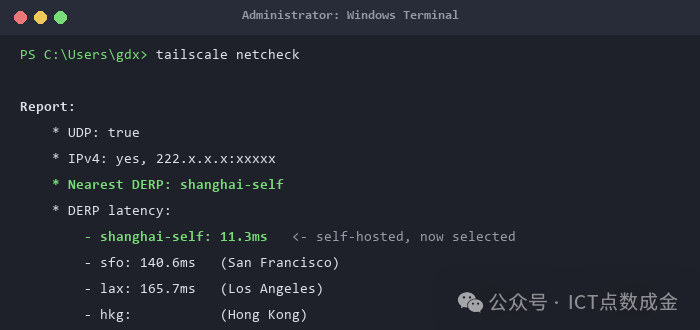
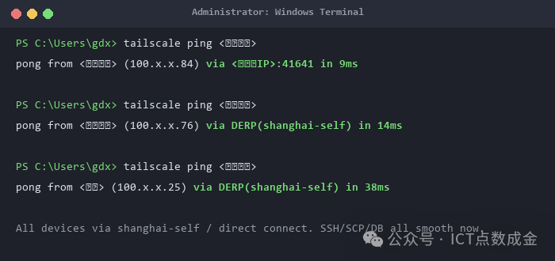
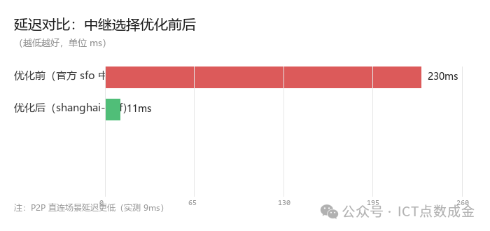

# Tailscale 自建上海中继 从 141ms 卡顿到 11ms 全设备秒连

实 操 教 程 · 第 2 篇Tailscale 自建上海中继从 141ms 卡顿到 11ms 全设备秒连实战记录 · 证书 · 踩坑 · 全流程

实 操 教 程 · 第 2 篇

# Tailscale 自建上海中继从 141ms 卡顿到 11ms 全设备秒连

实战记录 · 证书 · 踩坑 · 全流程

Tailscale 是个好东西，但 P2P 打洞失败时流量会走官方中继——人在上海，中继却经常给你调度到美国旧金山，延迟 140ms 起步，SSH、SCP、数据库操作卡到怀疑人生。这篇文章是我完整的实战排障记录：自建一个上海本地的 DERP 中继，让所有设备（Windows 笔记本、Linux 服务器、Android 手机）都走最近最快的通道，延迟从 141ms 压到 11ms。含证书方案、DNS 厂商的坑、以及让手机也能用的关键一招。

Tailscale 是个好东西，但 P2P 打洞失败时流量会走官方中继——人在上海，中继却经常给你调度到美国旧金山，延迟 140ms 起步，SSH、SCP、数据库操作卡到怀疑人生。

这篇文章是我完整的实战排障记录：自建一个上海本地的 DERP 中继，让所有设备（Windows 笔记本、Linux 服务器、Android 手机）都走最近最快的通道，延迟从 141ms 压到 11ms。含证书方案、DNS 厂商的坑、以及让手机也能用的关键一招。

本文目录00 准备工作：要提前注册 / 下载 / 配置什么01 卡顿根因：中继选型逻辑02 方案总览：一台轻量服务器搞定03 部署 derper 中继服务04 证书方案：自签 vs Let's Encrypt（重点）05 后台 policy 配置（最关键一步）06 踩坑实录（DNS 厂商 / 证书 / SSH）07 验证与效果对比

本文目录

00 准备工作：要提前注册 / 下载 / 配置什么01 卡顿根因：中继选型逻辑02 方案总览：一台轻量服务器搞定03 部署 derper 中继服务04 证书方案：自签 vs Let's Encrypt（重点）05 后台 policy 配置（最关键一步）06 踩坑实录（DNS 厂商 / 证书 / SSH）07 验证与效果对比

## 00 准备工作：开工前先备好这些

照本文操作前，先花几分钟把下面的东西备齐（按重要性排序）：

类别

需要什么

说明

账号

Tailscale 账号

去tailscale.com注册（支持 Google/GitHub 登录），免费版个人够用

下载

各设备 Tailscale 客户端

Windows / macOS / Linux / Android / iOS 都装上并登录同一账号，确认能互相 ping 通

服务器

一台有公网 IP 的云服务器

腾讯云 / 阿里云轻量都行，1核1G 起步、带宽 3M+；中继要扛流量，建议 2C2G+。装 Ubuntu/Debian

域名

一个域名（强烈推荐）

用于申请 Let's Encrypt 正式证书，让手机等设备免配置。阿里云 / 腾讯云 / Namesilo 都行，几十块一年

配置

云防火墙放行端口

TCP 33401（中继）+ UDP 3478（STUN 测速），加完顺手在控制台确认生效

解析

子域名解析到服务器

如derp.你的域名→ 服务器公网 IP（DNS 服务商控制台加 A 记录）

环境

服务器装 Go + acme.sh

Go 用来编译 derper；acme.sh 签发证书（国内服务器推荐，比 certbot 对国内环境友好）

工具

SSH 终端工具

MobaXterm / Xshell / Windows Terminal 都行，连服务器排障用

⏱ 大概花费：账号注册 5 分钟 + 服务器购买 10 分钟 + 域名解析 5 分钟。备齐后，整个部署流程 30-60 分钟可以跑完。

## 01 卡顿根因：Tailscale 的中继是怎么选的

Tailscale 的流量优先走P2P 直连（UDP 打洞）。打洞失败时（公司对称 NAT、酒店网络、两地跨运营商），会自动回退到DERP 中继服务器。

中继的选择逻辑很简单：客户端会做一次netcheck，挨个测所有中继的延迟，然后选延迟最低的那个。

$ tailscale netcheck   * Nearest DERP: San Francisco   ← 人在上海，被分到美国     - sfo: 141ms  (San Francisco)     - shanghai-self: ()           ← 自建中继没测出延迟，永远选不上

我实测办公室 P2P 打洞失败时走 sfo，ping 平均2300ms、丢包 16%，SSH 敲个命令都要等半天。

## 02 方案总览

核心就三件事：

步骤

做什么

在哪做

①

部署 derper 中继 + 开启 STUN

云服务器

②

申请 HTTPS 证书（正式证书最佳）

域名服务商

③

后台 policy 写入 derpMap

Tailscale 管理后台

## 03 部署 derper 中继服务

derper 是 Tailscale 官方开源的中继程序，装在任何一台有公网 IP 的服务器上即可（我用的是腾讯云轻量 4C4G）。

go install tailscale.com/cmd/derper@latest  # 自签证书模式（应急可用） derper -a=:33401 \   -hostname=你的IP或域名 \   -certdir=/etc/derper -certmode=manual \   -http-port=-1 -stun=true

⚠️ 两个必须注意的点：①必须加-stun=true（默认就是 true，但别手滑关掉）——这是客户端测延迟的关键；② 云防火墙要放行TCP 33401（中继）和UDP 3478（STUN 测速）。

## 04 证书方案：这是全文章最重要的经验

中继是 HTTPS 服务，客户端要校验证书。两条路线：

### 路线 A：自签证书（不推荐做长期方案）

自签证书便宜省事，但有个致命伤——每台设备都要手动装证书：

# Windows（管理员） certutil -f -addstore Root derp.crt  # Ubuntu / Debian cp derp.crt /usr/local/share/ca-certificates/ update-ca-certificates && systemctl restart tailscaled  # Arch Linux cp derp.crt /etc/ca-certificates/trust-source/anchors/ update-ca-trust extract && systemctl restart tailscaled

💀 自签证书的死结：Android 官方 Tailscale App 非 root 装不了系统证书——手机永远连不上你的自建中继，还会反复尝试导致掉线。这是我踩的最大一个坑。

### 路线 B：Let's Encrypt 正式证书（强烈推荐）

申请一个域名（或子域名）指向服务器 IP，签发 Let's Encrypt 证书。因为 Let's Encrypt 根证书全世界所有设备出厂就信任，Windows / Linux / Android 手机零配置直接连，一劳永逸。

# derper 切到域名证书（manual 模式读 `<域名>`.crt/.key） ln -sf /root/.acme.sh/derp.你的域名_ecc/fullchain.cer /etc/derper/derp.你的域名.crt ln -sf /root/.acme.sh/derp.你的域名_ecc/derp.你的域名.key /etc/derper/derp.你的域名.key  # 改 hostname 为域名并重启 systemctl restart derper  # 验证证书链（必须返回 0 = ok） echo | openssl s_client -connect 127.0.0.1:33401 \   -servername derp.你的域名 2>/dev/null | grep 'Verify return code'

🥇 关键细节：一定要软链 fullchain.cer（完整证书链），不是叶子证书！否则客户端缺中间证书，验证直接失败（openssl 报 Verify return code: 21）。

## 05 后台 policy 配置（最关键一步）

打开 Tailscale 管理后台 →Access Controls（ACL 编辑器），在 JSON 里加derpMap字段（注意：不是独立的 DERP 设置页，就在 ACL 编辑器的 JSON 里）：

"derpMap": {   "Regions": {     "900": {       "RegionID": 900,       "RegionCode": "shanghai-self",       "Nodes": [         {           "Name": "900a",           "RegionID": 900,           "HostName": "derp.你的域名",      ← 域名！用于 TLS 建连           "IPv4": "你的服务器IP",            ← 用于 STUN 测速           "DERPPort": 33401,           "STUNPort": 3478                  ← 必须有效端口！见下         }       ]     }   } }

📌 为什么 STUNPort 必须是有效端口？Tailscale 的netcheck测中继延迟，靠的是向节点的STUNPort 发 UDP 探测。如果你写-1，netcheck 直接跳过该节点，日志还会误导性地报named node "900a" has no v4 address（实际是端口无效）——中继永远测不出延迟、永远选不上。我当时在这里卡了很久。

保存后等 1-2 分钟下发，客户端netcheck就能看到你的中继了。

## 06 踩坑实录（都是真金白银换来的）

### 坑 1：DNS 服务商的"智能解析"拦截了证书验证

我的域名托管在 DNSPod，疑似接了腾讯 EdgeOne 智能解析。申请 Let's Encrypt 证书时（HTTP-01 方式），验证服务器从海外访问，被解析到了 EdgeOne 的边缘节点，返回 418 拦截页：

Detail: `<某边缘节点IP>`: Invalid response from   https://dnspod.qcloud.com/static/webblock.html?d=你的域名 Server: TencentEdgeOne

解法：改用 DNS-01 验证（往 DNS 里加一条 TXT 记录，不依赖 80 端口，完美绕开拦截）：

# 生成 TXT 验证记录 acme.sh --issue --dns -d derp.你的域名 \   --yes-I-know-dns-manual-mode-enough-go-ahead-please \   --server letsencrypt  # 会输出一条 TXT 记录，去 DNS 控制台添加： #   _acme-challenge.derp   TXT   记录值 # 加完后再执行 renew 完成签发 acme.sh --renew -d derp.你的域名 \   --yes-I-know-dns-manual-mode-enough-go-ahead-please

⚠️ acme.sh 手动模式的坑：每次 renew 都会生成新的 TXT 值，必须同步去 DNS 控制台改记录，否则报 "Incorrect TXT record"。90 天到期前记得处理（或配 DNSPod API 密钥转全自动）。

### 坑 2：中继建好了，其他设备却全部掉线（rx 0）

我把中继配置好后，笔记本能连（10ms），但服务器、手机全部连不上，状态显示relay "shanghai-self", rx 0。

根因链条：

① 笔记本优选了自建中继（快）→ 所有中继流量都走它② 但独立 derper 没有 mesh key（日志：No mesh key configured）→ 只能转发直连它的设备③ 其他设备没信任证书 → 连不上这个中继 → 中继找不到转发目标 → 全部 rx 0

解法：换正式证书让所有设备都能连（路线 B），问题自然消失。这也印证了证书方案的重要性。

### 坑 3：Tailscale SSH 每次要浏览器审批

policy 里默认"action": "check"，SSH 连 Linux 机器时每次都弹审批 URL。个人 tailnet 直接改成"action": "accept"，凭密钥直接进：

"ssh": [   { "action": "accept",        ← 原来是 "check"     "src": ["autogroup:member"],     "dst": ["autogroup:self"],     "users": ["autogroup:nonroot", "root"] } ]

### 坑 4：办公室网络到部分官方中继不通

实测办公室网络到香港官方中继（hkg）三个节点全部 TCP 超时，而到美国 sfo 正常。如果设备被调度到 hkg 而你办公室连不上它，也会出现"连不上"假象。可借此判断是网络问题还是配置问题。

## 07 验证与效果对比

$ tailscale netcheck   - shanghai-self: 11.3ms   ← 自建中继测出延迟，当选   - sfo: 140.6ms  $ tailscale ping `<家里主机>` pong via DERP(shanghai-self) in 14ms   ← 走上海中继  $ tailscale ping `<云服务器>` pong via `<服务器IP>`:41641 in 9ms  ← 服务器甚至直连了

设备

优化前

优化后

腾讯云服务器

141-2300ms（sfo 中继）

9-16ms

家里 Linux 主机

141ms+

14-16ms

Android 手机

连不上/极慢

38ms

SSH、SCP、数据库操作全部恢复丝滑

总结一句话自建 Tailscale DERP 中继，用域名 + Let's Encrypt 正式证书（而不是自签证书），在后台 policy 里配好derpMap（记得 STUNPort 用有效端口），就能让全设备走最近最快的通道，卡顿根治。

总结一句话

自建 Tailscale DERP 中继，用域名 + Let's Encrypt 正式证书（而不是自签证书），在后台 policy 里配好derpMap（记得 STUNPort 用有效端口），就能让全设备走最近最快的通道，卡顿根治。

核心经验速记：· netcheck 靠 STUNPort 测延迟 → 别写 -1· 证书用 Let's Encrypt 域名证书 → 手机零配置· 软链 fullchain 不是叶子证书· 独立 derper 无 mesh → 设备必须都能直连它· DNSPod/EdgeOne 会拦海外验证 → 用 DNS-01· 个人 tailnet 的 SSH 策略改 accept 免审批

如果这篇文章帮到了你，欢迎点赞、在看、转发有疑问欢迎评论区交流

如果这篇文章帮到了你，欢迎点赞、在看、转发

有疑问欢迎评论区交流
