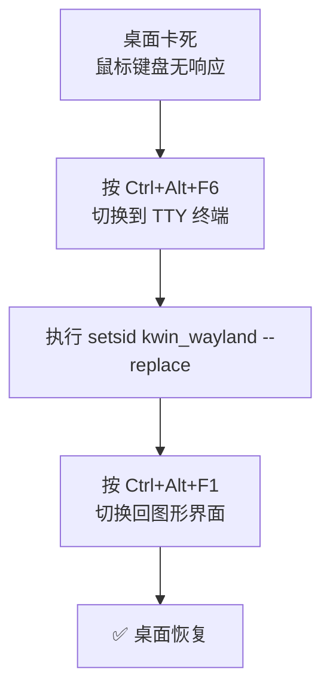

# Debian 13 Plasma Wayland 桌面卡住解决办法

适用环境：Debian 13 + Plasma 桌面 + Wayland

------------------------------------------------------------------------

# 问题描述

Plasma Wayland 会话偶尔出现卡死、鼠标键盘无响应的情况。



------------------------------------------------------------------------

# 解决方案

## 第一步：切换到 TTY 终端

按 `Ctrl + Alt + F6` 进入 TTY 终端界面。

## 第二步：重启 KWin

在 TTY 终端执行：

``` bash
setsid kwin_wayland --replace
```

## 第三步：切回图形界面

按 `Ctrl + Alt + F1` 切回图形界面，桌面应恢复正常。

------------------------------------------------------------------------

# 原理说明

- `setsid` 在新会话中启动进程，避免受当前会话限制
- `kwin_wayland --replace` 直接替换当前 Wayland 合Compositor，无需注销用户会话

------------------------------------------------------------------------

# 注意事项

- 不要用 `sudo`，在用户会话内直接执行即可
- 若无效，需在 TTY 执行 `sudo reboot` 强制重启

------------------------------------------------------------------------

# 扩展：为什么 setsid kwin_wayland --replace 会关闭所有应用？

## KWin 不只是窗口管理器

在 KDE Plasma + Wayland 环境下，`kwin_wayland` 不仅仅是窗口管理器，它是整个 Wayland **合成器（Compositor）**，负责：

- 创建和管理所有图形表面（surfaces）
- 接收并分发输入事件（键盘、鼠标、触摸）
- 与所有图形客户端通过 Wayland 协议直接通信

## setsid 的作用

`setsid` 在新会话中启动进程时，会**先强制终止同名现有进程**（即杀掉当前的 kwin_wayland），然后启动新的实例。

结果：
1. 当前 kwin_wayland 进程被突然杀掉
2. 所有与之连接的 Wayland 客户端**立即失去通信 socket**
3. Wayland 协议**没有类似 X11 的"重新连接"机制**——客户端发现合成器消失，绝大多数直接崩溃或退出

所以 `setsid kwin_wayland --replace` 本质上是**暴力重启 Wayland 合成器**，效果约等于图形会话强制重启。

受影响的包括：Dolphin、系统设置、浏览器、文本编辑器、Konsole、Flatpak 应用等几乎所有图形界面软件。

## 为什么 tmux 和虚拟机还活着？

tmux 是一个**终端复用守护进程**，完全不依赖图形界面：

- 它是独立的后台进程，父进程是 init 或 systemd 用户服务
- 即使 Konsole 被杀死，tmux 服务器依然毫发无损
- 执行 `tmux attach` 就能立刻恢复原会话

KVM 虚拟机同理——它是独立运行的进程，不依赖当前 Wayland 会话。

## 更安全的替代方案

如果只是任务栏或窗口管理逻辑卡死，可以尝试更温和的方式：

| 问题范围 | 推荐命令 | 影响 |
|---------|---------|------|
| 仅任务栏/面板/桌面图标卡住 | `systemctl restart --user plasma-plasmashell` | 不重启 kwin_wayland，所有应用保留 |
| 整个桌面彻底没反应 | TTY 登录后 `loginctl terminate-user $USER` | 等同于注销重登录，比 setsid 更干净 |

## Wayland vs X11 的关键区别

这个操作暴露了 Wayland 与 X11 的一个关键架构差异：

- **X11**：客户端与服务器分离，支持重新连接
- **Wayland**：合成器崩溃 = 所有客户端立即断开，无重连机制

下次遇到卡死，优先尝试 `systemctl restart --user plasma-plasmashell`，或直接用 `Alt+F2` 运行 `kwin_wayland --replace`（不加 setsid 行为略有差异，虽然仍可能丢应用，但不会先杀再启）。