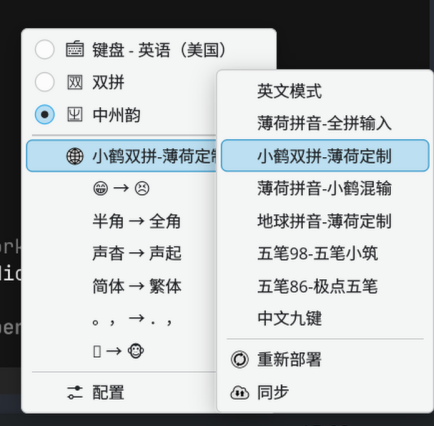

# Debian 13 安装与配置 Fcitx5-Rime 中文输入法指南

在 Linux 桌面环境下，输入法一直是新手最容易踩坑的环节之一。许多用户遇到输入法问题时，往往盲目从源码编译或下载各种不受信任的安装脚本，最终导致系统依赖混乱。

本文基于 Debian 13 (Trixie)，介绍如何通过 Debian 官方软件包体系以最干净、最稳健的方式安装并配置 Fcitx5 + Rime（中州韵）输入法。

---

## 1. 架构理解：为什么是 Fcitx5 + Rime？

在搞懂安装前，必须理清两者的角色分工：

- **Fcitx5（前端与框架）**：它就像是“管家”和“中介”，负责与操作系统桌面（Wayland / X11）以及具体的应用程序（GTK、Qt、Electron 等）进行通信，处理按键捕获、候选框渲染与光标跟随。
- **Rime（算法与引擎）**：它是底层的“核心大脑”，负责把用户的拼音、五笔或注音编码通过算法转换成文字。所有的词库、用户词频、输入习惯数据全部保存在本地，绝无隐私泄露风险。

通过 Fcitx5 承载 Rime 引擎，既能享受现代 Linux 桌面（特别是 Wayland）流畅的输入响应，又能拥有 Rime 极高的可定制性。

---

## 2. 软件包安装

在 Debian 13 中，官方源已收录了稳定且经过充分测试的 `fcitx5-rime` 组件及相关数据包。**严禁通过源码手动编译安装**，直接使用包管理器即可。

### 基础安装

执行以下命令安装核心框架、配置图形工具与 Rime 引擎：

```bash
sudo apt update
sudo apt install -y fcitx5 fcitx5-rime fcitx5-config-qt
```

### 补充输入方案与词库（可选）

Rime 支持多种输入方案（如朚拼、小鹤双拼、自然码、五笔等）。如果你需要更多预设方案或基础词库，可以安装数据扩展包：

```bash
# 安装常见的 Rime 数据包
sudo apt install -y librime-data librime-data-double-pinyin
```

---

## 3. 环境变量配置

要让所有桌面应用（包括 Chrome、VS Code、终端以及各种桌面客户端）都能正确调用 Fcitx5，需要确保输入法环境变量正确生效。

Debian 13 默认桌面通常为 Wayland 或 X11。最通用稳健的做法是编辑 `/etc/environment` 文件（对全局生效）：

```bash
sudo nano /etc/environment
```

在文件中追加以下三行：

```text
GTK_IM_MODULE=fcitx
QT_IM_MODULE=fcitx
XMODIFIERS=@im=fcitx
```

> **注意**：在纯 Wayland 环境下（如 GNOME Wayland / KDE Wayland），许多现代应用优先通过 Wayland 原生协议 `text-input-v3` 通信，但保留上述环境变量可以确保旧式 XWayland / GTK / Qt 应用不会出现无法呼出输入法的情况。

保存后，需要**注销当前用户并重新登录**（或重启系统）以使环境变量生效。

---

## 4. 添加与启用 Rime 输入法

1. 重启或重新登录后，通过应用菜单搜索并打开 **“Fcitx 5 配置”**（或在终端运行 `fcitx5-config-qt`）。
2. 在 **“输入法”** 标签页中：
   - 查看右侧的“可用输入法”列表。
   - 取消勾选“仅显示当前语言”（如果未直接看到中州韵）。
   - 找到 **“中州韵” (Rime)**，点击左箭头 `←` 将其添加到左侧的“已安装输入法”列表中。
   - 建议列表顺序保留两项：第一项为 `键盘 - 英语 (美国)`，第二项为 `中州韵`。
3. 点击右下角 **“应用”** 按钮保存。

现在，你可以在任何文本框中按下 `Ctrl + Space`（或你设置的切换键）在英文键盘和 Rime 输入法之间自由切换。

---

## 5. Rime 方案切换与配置定制

### 切换输入方案

当处于 Rime 输入状态时，按下快捷键：

- `F4` 或 ``Ctrl + ` ``（反引号，即 Tab 键上方、数字 1 左侧的按键）

屏幕上会弹出 Rime 方案菜单，你可以通过数字键快速切换：
- 明月拼音（全拼）
- 双拼（自然码 / 小鹤等）
- 简繁切换（选择“半角/全角”、“漢字/汉字”）



上图展示了从 Fcitx5 菜单进入 Rime 方案菜单，并选择“小鹤双拼-薄荷定制”的操作界面。

### 配置文件与词库路径

Rime 的所有用户配置文件和词库全部保存在用户家目录下：

```text
~/.local/share/rime/
```

- **用户字典**：用户打字习惯自动生成的 `.userdb/`。
- **自定义配置**：如果需要定制输入方案或快捷键，可在该目录下创建 `default.custom.yaml`，例如修改候选词个数为 9 个：

```yaml
# ~/.local/share/rime/default.custom.yaml
patch:
  "menu/page_size": 9
```

修改完配置后，右键托盘小企鹅图标，选择中州韵并点击 **“重新部署”**（Deploy）即可生效。

### 扩展工具：Snout（可选）

[Snout](https://github.com/ca-x/snout) 是一个跨平台的 Rime 初始化与更新工具，支持通过终端界面管理万象、雾凇、白霜和薄荷等输入方案、词库与语法模型。

它不能替代 Debian 软件包安装和桌面输入法配置。使用前仍需按照本文完成 `fcitx5-rime` 的安装并启动 Fcitx5；如果只使用默认方案，也没有必要额外安装 Snout。

---

## 6. 常见问题排查

### 1. 为什么某些应用中按 `Ctrl + Space` 没反应？
- 检查环境变量是否生效：在终端输入 `env | grep -E 'IM_MODULE|XMODIFIERS'`，确认是否输出 `fcitx`。
- 检查 Fcitx5 守护进程是否在后台运行：运行 `pgrep -l fcitx5`。

### 2. IDEA 等 Java 应用无法输入中文？
Java AWT/Swing 应用在 Wayland 下可能存在焦点同步问题。可通过指定启动环境变量运行：
```bash
env _JAVA_AWT_WM_NONREPARENTING=1 idea
```

---

## 7. 总结

在 Debian 系统上维护输入法的黄金法则是：**信任官方包管理器，保持配置最小化，不要画蛇添足引入第三方不明脚本**。Fcitx5 负责框架通信，Rime 专注离线输入，这是当前 Linux 生态下兼顾现代协议与高品质中文输入的最优解。
