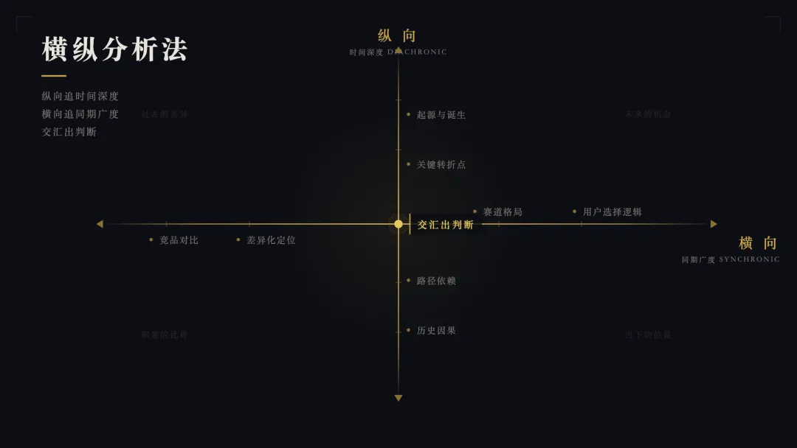

# 横纵分析法：半小时搞懂任何陌生领域的深度研究框架



> 核心方法：纵向追时间深度，横向追同期广度，最后交汇出判断。

## 方法论起源

横纵分析法脱胎于社会科学和语言学的经典研究视角：

- **语言学**：索绪尔提出的**历时分析**（Diachronic）和**共时分析**（Synchronic）——前者看演变轨迹，后者看当下系统中的位置关系
- **社会科学**：**纵向研究**（Longitudinal）追踪对象变化轨迹，**横截面研究**（Cross-sectional）在某个时间点上观察截面状态并做横向对比

将这两种学术研究视角抽离，结合商业和竞争战略分析思路，封装成给 AI 使用的通用研究框架。

## 两条轴

### 纵向轴：沿时间线还原全貌

沿时间轴，完整还原研究对象从诞生到现在的发展全貌：

1. **起源追溯**：诞生的背景、基于什么技术/理念/需求而来、创始团队、当时的行业环境
2. **诞生节点**：首次发布/成立/提出时间，最初的形态和定位
3. **演进历程**：所有关键节点——重大版本更新、融资事件、团队变动、战略转型、技术架构变化、用户规模里程碑、合作/收购、危机事件
4. **决策逻辑**：每个关键节点上为什么选了 A 而不是 B？面对的约束条件是什么？

**叙事要求**：不要写成干巴巴的年表，用故事方式把发展史串起来，让读者感受到因果关系和时代脉络。

### 横向轴：与同期竞品全面对比

以当前时间点为切面，将研究对象与同赛道的竞品/同类进行全面对比。分三种场景：

- **场景 A：无直接竞品**——分析为什么没有竞品？未来最可能从哪个方向冒出竞争者？有没有间接替代方案？
- **场景 B：少量竞品（1-2 个）**——逐一深入对比
- **场景 C：竞品充分（3 个及以上）**——选取最具代表性的 3-5 个对比，其余简要提及

对比维度（根据研究对象类型灵活调整）：

1. **核心差异**：技术路线、产品形态、目标用户、核心优势与短板、定价策略
2. **用户视角**：真实口碑、社区评价、使用体验、实际使用方式与官方定位的偏差
3. **生态位**：在赛道版图中占据什么位置？填补什么空白？跟谁正面竞争？
4. **趋势判断**：竞争格局中的走向、机会和风险

### 交汇出判断

纵向告诉你它是怎么走到今天的，横向告诉你它今天站在哪。两条轴交叉，能看到单独看任何一条轴都看不到的东西——比如今天的某个优势是三年前一个不起眼的决策慢慢积累出来的，今天的某个短板是当初合理的选择变成了包袱。

**纵向追时间深度，横向追同期广度，最终交汇出判断。**

## Deep Research Prompt

以下 Prompt 适用于 ChatGPT DeepResearch、Claude 深度研究、豆包专家模式、DeepSeek 专家模式等支持深度研究的 AI 工具：

```
> 横纵分析法 by 数字生命卡兹克

## 变量定义

研究对象 = 「此处替换为你的研究对象名」

（以下所有提到「研究对象」的地方，都指代上面定义的内容。使用时只需修改等号右边的内容即可。）

---

你是一位资深的技术与商业研究分析师。请使用「横纵分析法」对「研究对象」进行一份完整的深度研究报告。

横纵分析法包含两个维度：

---

### 一、纵向分析（Diachronic / Longitudinal）

沿时间轴，完整还原「研究对象」从诞生到现在的发展全貌。要求如下：

1. **起源追溯**：它诞生的背景是什么？基于什么技术/理念/需求而来？创始团队或核心推动者是谁？当时的行业环境是什么样的？
2. **诞生节点**：明确的首次发布/成立/提出时间，以及最初的形态和定位。
3. **演进历程**：从诞生到现在，按时间顺序梳理所有关键节点。包括但不限于：重大版本更新、融资事件、团队变动、战略转型、技术架构变化、用户规模里程碑、重大合作或收购、公关危机或争议事件。
4. **决策逻辑**：在每个关键节点上，尽可能还原决策背后的原因。为什么选了A而不是B？当时面对的约束条件是什么？
5. **叙事要求**：不要写成干巴巴的年表。用故事的方式把发展史串起来，让读者能感受到因果关系和时代脉络。越详细、越多元越好，把相关的人物、事件、背景信息都拽进来。

---

### 二、横向分析（Synchronic / Cross-sectional）

以当前时间点为切面，将「研究对象」与同赛道的竞品/同类进行全面对比。

**首先判断竞品情况**，分为三种场景：

- **场景A：无直接竞品。** 如果「研究对象」是一个全新品类或独占性极强的领域，没有可直接对比的竞品，则跳过逐一对比，改为分析：它为什么没有竞品？是品类太新、壁垒太高、还是市场太小？未来最可能从哪个方向冒出竞争者？有没有间接替代方案或上一代的解决方式可以作为参照？
- **场景B：少量竞品（1-2个）。** 逐一深入对比，每个竞品展开详细分析。
- **场景C：竞品充分（3个及以上）。** 选取最具代表性的3-5个进行对比，其余可简要提及。

**对比维度**（根据「研究对象」的类型灵活调整）：

1. **核心差异对比**：
   - 技术路线/核心方法论/底层逻辑
   - 产品形态/商业模式/组织结构
   - 目标用户/受众/适用场景
   - 核心优势与明显短板
   - 定价策略/资源投入/规模体量
2. **用户视角**：每个竞品的真实用户口碑如何？社区评价、使用体验中被提及最多的优点和槽点分别是什么？用户实际的使用方式和官方定位有没有偏差？
3. **生态位分析**：在整个赛道的版图中，「研究对象」占据的是什么位置？它填补了什么空白，还是在跟谁正面竞争？
4. **趋势判断**：基于横向对比，你认为「研究对象」在竞争格局中的走向是什么？它的机会和风险各是什么？

---

### 三、写作风格要求

这不是一份冷冰冰的咨询报告，而是一篇让人能从头读到尾的深度研究。请遵循以下风格要求：

1. **可读性优先**：写得像一篇优质的深度报道或非虚构特稿，有节奏感，有画面感。读者应该能被内容本身吸引着往下读，而不是靠目录跳着看。
2. **叙事驱动，不是罗列驱动**：纵向部分要有故事弧线，有起承转合。不要写成流水账。
3. **观点要有，但必须建立在事实之上**：鼓励你给出判断和洞察，但每一个观点都必须有事实支撑。先摆事实，再给判断。如果是推测，明确标注。
4. **用人话写**：避免咨询公司式的套话和空洞的形容词（如"赋能""抓手""打造闭环"）。用具体的细节和例子代替概括性陈述。
5. **对比要有温度**：横向对比不要写成参数对照表的文字版。要讲清楚每个竞品"活成了什么样"，用户选它的真实理由是什么。

---

### 四、篇幅要求

根据「研究对象」的复杂度，自适应调整篇幅：

- **纵向分析**：6000-15000字。核心原则是把故事讲完整、讲透，宁可写长写细，也不要蜻蜓点水。
- **横向分析**：3000-10000字。竞品越多篇幅越长。
- **横纵交汇总结**：1500-3000字。不要写成前面内容的缩写版，要给出新的、综合性的判断。
- **全文总计**：10000-30000字。不要怕长，写到该停的地方自然停。

---

### 五、输出格式要求

1. 先输出纵向分析（发展史叙事），再输出横向分析（竞品对比）
2. 纵向部分以时间叙事为主线，不要用纯粹的列表格式
3. 横向部分可以适当使用对比表格辅助，但核心分析必须是文字论述
4. 在报告最后，加一段「横纵交汇」的总结
5. 所有信息尽可能标注来源或时间节点，确保可追溯
6. 如果某些信息无法确认，明确标注为推测或未经证实，不要编造

---

### 适用范围说明

此分析法适用于以下类型的研究对象：

- **产品/工具**：如 Hermes Agent、Cursor、Claude Code
- **公司/组织**：如 Anthropic、字节跳动、OpenAI
- **技术概念**：如 MCP协议、RAG、Agent框架
- **人物**：如某个行业关键人物的职业轨迹与同期人物的对比

请根据「研究对象」的具体类型，灵活调整纵向和横向分析中的具体维度。核心原则不变：纵向追时间深度，横向追同期广度，最终交汇出判断。

---

## Agent Codebase 解读技巧

### Hermes Agent 官方文档

Hermes Agent 架构文档推荐直接看官方文档，写得比较清楚。

### 用 Agent 解读代码库

用 Codex 或 Claude Code 打开项目代码库，直接让 Agent 解释代码库。如果不清楚可以随时追问，可以问任何想知道的问题，Agent 会通过检索项目文档和代码帮你解释清楚。

> **讓 agent 解釋自己的 codebase，這個學法比讀文檔快三倍**

### 追问技巧

让 Agent 解释代码时，记得要求：
- **带文件路径和行号**
- **按入口到主流程画调用链**

关键结论让 Agent 跑一次 demo 或对应测试用例验证，不然很容易讲得像对但实际不对。
```

## Skill 版本

除了 Prompt 版本，作者还提供了一个 Claude Code Skill 版本（`hv-analysis`），安装后直接对 Agent 说「帮我研究一下 xxx」即可。Skill 版本额外能力：

- 自动联网搜索信息
- 包含 arxiv API，研究学术问题时自主查询论文
- 生成排版好的 PDF 研究报告
- 文风更易读

开源地址：[KKKKhazix/khazix-skills](https://github.com/KKKKhazix/khazix-skills)

## 方法局限

1. **框架而非终点**：能快速建立认知框架，但替代不了亲自深入的田野研究
2. **信息准确性**：AI 可能有幻觉，不能直接当结论用，更适合作为研究起点
3. **依赖工具质量**：用支持 Deep Research 的工具（10 分钟+）效果远好于普通联网搜索（不到 1 分钟）
4. **实践建议**：拿到报告后先快速通读建立框架，再针对疑问点和兴趣点深入搜资料

## 核心洞察

> 信息已经像洪水一样，AI 让你获取信息的成本趋近于零。但你要问什么问题、从什么角度去看、怎么把散落的信息组织成有意义的判断——这些 AI 帮不了你。
>
> 横纵分析法就是一个提问框架。纵向追时间，横向追空间，最后交汇出判断，三步走完，认知框架就搭起来了。
>
> 哲学始于惊奇，研究也是——始于你对一个东西真的好奇。方法和工具都是后面的事，好奇心在前面。