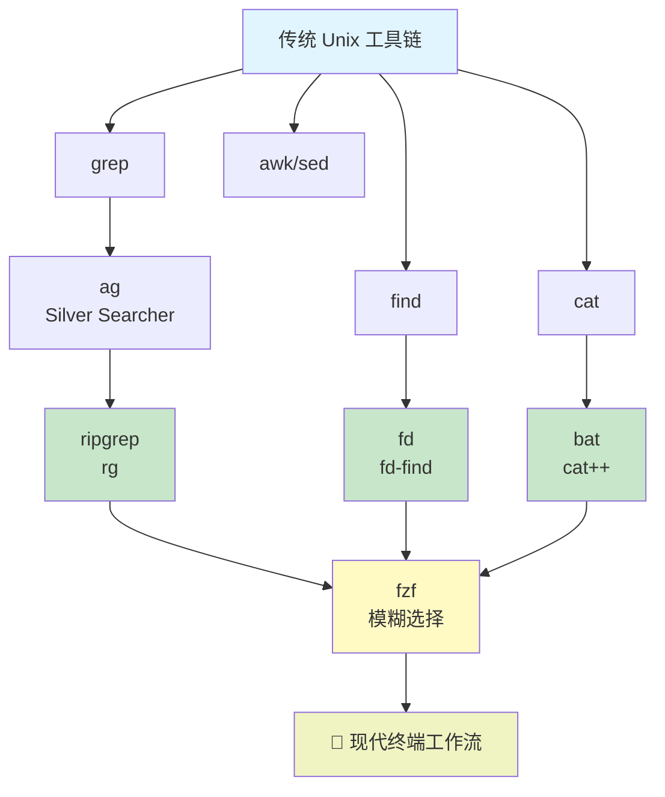

# 现代 Linux 开发效率工具完整指南

> 从传统 Unix 工具链升级到现代 Rust 工具链的演进之路

---

## 📋 目录导航

- [工具生态演进图](#工具生态演进图)
- [传统 Unix 工具层](#传统-unix-工具层)
- [第一代增强工具](#第一代增强工具)
- [现代 Rust 工具主流](#现代-rust-工具主流)
- [模糊选择核心](#模糊选择核心)
- [现代开发黄金组合](#现代开发黄金组合)
- [工具详细对比](#工具详细对比)
- [实战工作流示例](#实战工作流示例)

---

## 🗺 工具生态演进图



---

## 🧱 传统 Unix 工具层

Unix 工具链的基础设施（1970s 延续至今）

| 工具        | 作用       | 典型命令               |
| --------- | -------- | ------------------- |
| `grep`    | 文本搜索     | `grep "pattern" file` |
| `find`    | 文件查找     | `find . -name "*.md"` |
| `cat`     | 输出文件     | `cat file.txt`        |
| `awk/sed` | 文本处理     | `sed 's/old/new/g'`   |

### 传统工具的优劣

✅ **优势**：
- 强大灵活
- 广泛兼容性
- 经过时间验证

❌ **劣势**：
- 语法复杂
- 大项目性能一般
- 不默认忽略 `.gitignore`
- 输出格式不够友好

---

## 🚀 第一代增强工具

### The Silver Searcher（`ag`）

```bash
# 安装
sudo apt install silversearcher-ag

# 基本用法
ag keyword
ag -i keyword        # 忽略大小写
ag -t java keyword   # 指定文件类型
```

#### 特点

- 比 `grep` 快得多
- **默认忽略 `.gitignore`**
- 代码搜索优化
- 支持递归搜索
- 输出清晰

#### 现状

⚠️ **已逐渐被 `ripgrep` 取代**

新项目建议直接用 `rg`，但如果你的系统或脚本已经依赖 `ag` 也可以继续使用。

---

## ⚡ 现代 Rust 工具主流

这一层是 2024-2026 年 Linux 开发者的标准配置。

### 1️⃣ ripgrep（`rg`）

> ⚡ 下一代 `grep`，**现代代码搜索的事实标准**

#### 安装

```bash
# Debian/Ubuntu
sudo apt install ripgrep

# 验证
rg --version
```

#### 全名

**ripgrep** - 使用 Rust 编写的超快文本搜索工具

#### 核心特点

- 🔥 **极快**：通常比 `grep` / `ag` 快 10-100 倍
  - 原因：SIMD 优化 + 多线程
- 📦 **默认遵守 `.gitignore`**：自动忽略版本控制的文件
- 🎯 **精准的正则支持**：Rust regex 引擎
- 📱 **多线程处理**：充分利用多核 CPU
- 🌍 **Unicode 支持优秀**：中文搜索完美
- 👥 **社区活跃**：持续维护升级

#### 常用命令

```bash
# 基础搜索
rg keyword

# 忽略大小写
rg -i keyword

# 指定文件类型
rg -t java keyword
rg -t py keyword

# 显示行号
rg -n keyword

# 显示行号 + 前后文本
rg -n -B 2 -A 2 keyword

# 只列出文件名
rg --files-with-matches keyword

# 搜索特定扩展名
rg -g '*.java' keyword

# 正则搜索
rg 'pattern.*regex' -r replacement file

# 排除某些模式
rg keyword -g '!node_modules' -g '!dist'

# 只显示匹配部分
rg -o keyword

# 列出所有文件（无搜索）
rg --files
```

#### 搭配 fzf 的强大用法

```bash
# 搜索代码 → fzf 交互选择 → 打开编辑器
rg --line-number "" | fzf | xargs -I {} sh -c 'nvim {}' 

# 按行号搜索并打开
rg -n "UserService" | fzf --preview 'bat --highlight-line {2} {1}' | cut -d: -f1,2 | xargs -I {} nvim {}
```

#### 性能对比

```bash
# 在大型项目搜索（如 Linux Kernel）
time grep -r "pattern" .           # ~2-3 秒
time ag "pattern" .                # ~0.5 秒
time rg "pattern" .                # ~0.1-0.2 秒
```

#### 适合场景

✅ 搜代码  
✅ 大项目全文检索  
✅ 搭配 fzf 做模糊代码跳转  
✅ CI/CD 流程中的文本处理  
✅ 日志分析  

---

### 2️⃣ fd（`fd-find`）

> 🚀 现代化 `find` 替代品，**文件查找的优雅方案**

#### 安装

```bash
# Debian/Ubuntu - 注意包名是 fd-find，命令通常是 fdfind
sudo apt install fd-find

# 创建 alias 方便使用
alias fd=fdfind
# 或在 ~/.zshrc / ~/.bashrc 中添加
```

#### 关键点

- **包名**：`fd-find`
- **命令**：通常是 `fdfind`（或 alias 为 `fd`）

#### 核心特点

- 📝 **语法简单**：比 `find` 直观太多
- 🚀 **默认多线程**：充分利用 CPU
- 🎯 **默认忽略 `.gitignore`**
- 🔄 **默认递归搜索**：省去 `-r` 参数
- ✨ **输出干净**：无冗余信息
- 🌈 **彩色输出**：易于辨别文件类型

#### 对比传统 find

| 需求 | 传统 `find` | `fd` |
|------|----------|------|
| 查找 Java 文件 | `find . -type f -name "*.java"` | `fd -e java` |
| 查找文件夹 | `find . -type d -name "src"` | `fd -t d src` |
| 排除某些目录 | `find . -not -path "*/node_modules/*"` | `fd -E node_modules` |
| 显示隐藏文件 | `find . -name ".*"` | `fd -H` |
| 递归和计数 | `find . \| wc -l` | `fd \| wc -l` |

#### 常用命令

```bash
# 基础搜索（递归，忽略 .gitignore）
fd pattern

# 搜索特定类型
fd -t f -e java          # 查找所有 .java 文件
fd -t d src              # 查找名为 src 的目录
fd -t l                  # 查找符号链接

# 搜索文件名（精确）
fd -x pattern            # 精确匹配

# 显示隐藏文件
fd -H ".*"

# 排除某些目录
fd -E node_modules -E dist -e ts

# 从某个目录开始搜索
fd pattern /path/to/search

# 显示完整路径
fd -a pattern

# 用正则表达式
fd -x 'pattern' -x sh -c 'echo {}'
```

#### 搭配 fzf 的强大用法

```bash
# 打开文件（带预览）
fd -t f | fzf --preview 'bat {}'

# 打开文件并用 nvim 编辑
fd -t f | fzf | xargs nvim

# 复制文件绝对路径
fd -t f | fzf | xargs realpath | wl-copy

# 切换到某个目录
fd -t d | fzf | cd

# 移除某个文件
fd -t f -e log | fzf | xargs rm
```

#### 适合场景

✅ 给 `fzf` 提供文件列表  
✅ 快速查找文件  
✅ 项目目录搜索  
✅ 与其他命令管道  
✅ shell 脚本中作为 `find` 的替代  

---

### 3️⃣ bat

> 🎨 带语法高亮的 `cat`，**代码预览的最佳工具**

#### 安装

```bash
sudo apt install bat
```

#### 核心特点

- 🌈 **自动语法高亮**：支持 500+ 语言
- 🔢 **显示行号**：默认 `-n`
- 📊 **Git diff 友好**：显示修改状态（`+` `-` `~`）
- 📄 **自动分页**：大文件不会刷屏
- 🎯 **主题支持**：可自定义颜色
- 🔍 **支持预览**：与 `fzf` 天生搭配

#### 对比传统 cat

```bash
# 普通 cat
cat file.java

# bat（带高亮、行号、git diff）
bat file.java
```

结果：`bat` 输出看起来像 IDE 预览。

#### 常用命令

```bash
# 基础用法（自动高亮 + 行号）
bat file.java

# 指定语言
bat --language python code.py

# 不显示行号
bat -p file.md

# 只显示某些行
bat --line-range 10:20 file.java

# 显示不可见字符（空格、Tab）
bat --show-nonprintable file.txt

# 自定义主题
bat --list-themes
bat --theme DracoDark file.java

# 查看颜色映射
bat --list-languages
```

#### 与 fzf 的配合

```bash
# 文件预览（这是标准做法）
fd -t f | fzf --preview 'bat {}'

# 查看任何命令的输出结果
rg "keyword" | fzf --preview 'bat --file-name {../.1}'

# 快速预览 man 页面
man ls | bat
```

#### 作为 PAGER 使用

```bash
# 让 git 用 bat 显示代码
export PAGER=bat
git diff

# 让 less 用语法高亮
bat --paging=always
```

#### 适合场景

✅ `fzf` 预览窗口  
✅ 查看配置文件  
✅ 代码审查  
✅ 作为默认的 PAGER  
✅ shell 脚本中替代 `cat`  

---

## 🎯 模糊选择核心

### fzf（Fuzzy Finder）

`fzf` 本身不在本文详细范围内，但它是"粘合剂"。详见 [fzf-tab.md](fzf-tab.md)

关键点：
- 模糊匹配任何列表
- 支持 preview 窗口
- 支持多选
- 支持自定义快捷键
- 是整个现代工作流的"胶水"

---

## 🏗 现代开发黄金组合

结合所有工具的最佳实践：

```
rg   → 搜索内容（代码搜索）
fd   → 查找文件（文件发现）
bat  → 预览文件（代码查看）
fzf  → 交互选择（用户界面）
wl-copy → 复制结果（剪贴板）
nvim → 编辑代码（编辑器）
```

### 为什么都用 Rust 写？

- 🛡️ **内存安全**：无 buffer overflow
- ⚡ **SIMD 优化**：向量化处理
- 🧵 **多线程易实现**：零成本抽象
- 🚀 **启动速度快**：纳秒级
- 📦 **二进制单文件发布**：易于分发

---

## 📊 工具详细对比

### 搜索工具对比

| 特性 | grep | ag | rg |
|------|------|----|----|
| 搜索速度 | ⭐ | ⭐⭐⭐ | ⭐⭐⭐⭐⭐ |
| 遵守 .gitignore | ❌ | ✅ | ✅ |
| 正则支持 | 基础 | 好 | 优秀 |
| 多线程 | ❌ | ✅ | ✅ |
| Unicode 支持 | 一般 | 好 | 优秀 |
| 社区活跃度 | 稳定维护 | 逐步衰落 | 🔥 活跃 |
| 推荐度 (2026) | 作为备选 | 不推荐 | ⭐⭐⭐⭐⭐ |

### 文件查找对比

| 特性 | find | fd |
|------|------|----|
| 语法复杂度 | 高 | 低 |
| 递归搜索 | `-r` 额外参数 | 默认递归 |
| 遵守 .gitignore | ❌ | ✅ |
| 多线程 | ❌ | ✅ |
| 彩色输出 | ❌ | ✅ |
| 推荐度 (2026) | 作为备选 | ⭐⭐⭐⭐⭐ |

### 查看文件对比

| 特性 | cat | less | bat |
|------|-----|------|-----|
| 语法高亮 | ❌ | ❌ | ✅ |
| 行号显示 | ❌ | 可选 | ✅ |
| Git diff 显示 | ❌ | ❌ | ✅ |
| 自动分页 | ❌ | ✅ | ✅ |
| 推荐度 (2026) | 简查看 | 基础 | ⭐⭐⭐⭐⭐ |

---

## 🎯 实战工作流示例

### 场景 1：搜索代码并跳转

```bash
# 搜索 Java 类 → 选择 → 打开编辑器（带行号）
rg -n "class.*Service" | fzf | cut -d: -f1,2 | xargs -I {} sh -c 'nvim +$(echo {} | cut -d: -f2) $(echo {} | cut -d: -f1)'

# 更简洁的版本（假设配置了 editor alias）
rg -n "" | fzf | fzf-open
```

### 场景 2：查找文件并打开

```bash
# 查找所有 Java 文件 → 交互选择 → 打开
fd -t f -e java | fzf --preview 'bat {}' | xargs nvim

# 查找并复制文件路径
fd -t f | fzf | xargs realpath | wl-copy
```

### 场景 3：搜索内容并查看上下文

```bash
# 搜索包含 "UserService" 的地方 → 显示前后 3 行 → 交互选择
rg -n -B 2 -A 2 "UserService" | fzf

# 或用 bat 预览精准行号
rg -n "UserService" | fzf --preview 'bat --highlight-line {2} --line-range {2}:$(($(echo {2})+5)) {1}'
```

### 场景 4：Git 工作流增强

```bash
# 在 git 修改文件中搜索
rg "keyword" $(git diff --name-only)

# 切换分支（fzf + git branch）
git branch | fzf | xargs git checkout

# 查看最近修改的文件
git log --name-only --pretty=format: | sort -u | fzf | xargs nvim
```

### 场景 5：项目导航（Java 开发者）

```bash
# 快速定位 Java 类
fd -t f -e java | fzf --preview 'bat {}'

# 在某个 Maven module 中搜索
rg "keyword" pom.xml | fzf

# 查找配置文件
fd -e yml -e yaml -e properties | fzf --preview 'bat {}'
```

### 场景 6：快速清理临时文件

```bash
# 找出所有 .log 文件 → 预览 → 删除
fd -e log | fzf --preview 'bat {}' | xargs rm

# 找出所有构建产物
fd -E 'src' -E 'docs' -t d target | fzf
```

---

## 🔗 整体工作流图


---

## 🧠 进阶建议：工程级终端工作流

### 针对你的环境配置

如果你是：
- ✅ Java 多项目工作区
- ✅ 重度 shell 用户（zsh + tmux）
- ✅ Wayland 用户

**建议打造**：

> 🔥 **终端级 IDE 工作流**体系

包括：
- `fzf` 搜索代码 + 跳转行号
- `fzf` Git 文件选择
- `fzf` 分支快速切换
- `fzf` 最近项目导航
- `fzf` Maven module 切换
- `fzf` Docker container 选择
- `fzf` K8s Pod 访问

### 推荐扩展阅读

- [fzf 完整指南](fzf-tab.md)：深入学习模糊查找
- [tmux 指南](tmux-guide.md)：终端多路复用最佳实践
- [zsh 配置指南](zsh.md)：Shell 定制

---

## ✅ 快速检查清单

安装现代工具链的步骤：

```bash
# 1. 安装 ripgrep
sudo apt install ripgrep

# 2. 安装 fd-find
sudo apt install fd-find
echo "alias fd=fdfind" >> ~/.zshrc

# 3. 安装 bat
sudo apt install bat

# 4. 安装 fzf（如果还没装）
git clone --depth 1 https://github.com/junegunn/fzf.git ~/.fzf
~/.fzf/install

# 5. 测试 - 搜索一个文件并预览
fd -t f | fzf --preview 'bat {}'
```

---

## 📚 相关资源

- [ripgrep GitHub](https://github.com/BurntSushi/ripgrep)
- [fd GitHub](https://github.com/sharkdp/fd)
- [bat GitHub](https://github.com/sharkdp/bat)
- [The Silver Searcher 文档](https://geoff.greer.fm/ag/)

---

## 🎯 总结

| 层级 | 工具 | 用途 | 替代对象 |
|------|------|------|---------|
| 搜索内容 | `rg` | 代码全文搜索 | `grep` / `ag` |
| 搜索文件 | `fd` | 文件快速查找 | `find` |
| 查看文件 | `bat` | 代码语法高亮预览 | `cat` / `less` |
| 交互选择 | `fzf` | 模糊交互界面 | shell 原生选择 |
| 剪贴板 | `wl-copy` | 复制到系统剪贴板 | 手工复制 |

**一句话总结**：

> 🚀 使用 **rg + fd + bat + fzf + wl-copy** 组合，你就拥有了一个 **轻量级终端 IDE**，足以处理大多数开发需求，而且启动速度比真实 IDE 快 1000 倍。

这就是 **2026 年 Linux 开发者的黄金工具组合**。
