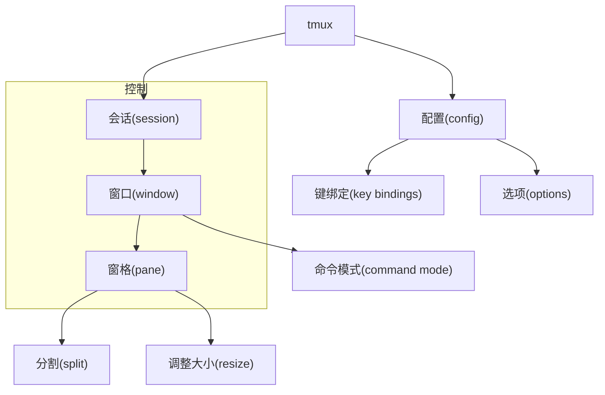

# tmux 指南

## 概念图



上面的概念图概览了tmux的核心构成元素：会话(Session)、窗口(Window)、窗格(Pane)以及配置选项。

## 1. 基本概念

### 1.1 会话 (Session)
会话是tmux的最高级别组织单位，一个会话可以包含多个窗口。会话允许你在同一个终端中运行多个任务并轻松切换。

- 创建会话：`tmux new -s <session-name>`
- 列出会话：`tmux ls`
- 附着到会话：`tmux attach -t <session-name>`
- 退出会话：在tmux中运行 `exit` 或 `Ctrl-b d` (detach)

### 1.2 窗口 (Window)
窗口类似于虚拟终端，可以在会话中创建多个窗口，每个窗口有一个编号和名称。

- 创建新窗口：`Ctrl-b c`
- 切换窗口：`Ctrl-b n`(下一个)、`Ctrl-b p`(前一个)、`Ctrl-b <数字>`
- 查看所有窗口（选择窗口列表）：`Ctrl-b w`
- 重命名窗口：`Ctrl-b ,` 然后输入新名称（也可以在配置中绑定快捷键，例如 `prefix+r`）

### 1.3 窗格 (Pane)
窗格是窗口内的子区域，允许在同一窗口中并排运行多个终端。

- 水平分割：`Ctrl-b "`
- 垂直分割：`Ctrl-b %`
- 切换窗格：`Ctrl-b o`
- 调整大小：`Ctrl-b :resize-pane -L/-R/-U/-D <number>`
- 关闭窗格：`Ctrl-b x`
- 显示当前窗口所有 pane 的编号：`Ctrl-b q` (会在每个 pane 角落短暂出现数字，可直接按数字切换)

## 2. 进阶使用

### 2.1 命令模式
按下 `Ctrl-b :` 可以进入命令模式，直接输入tmux命令，例如 `new-window`、`split-window` 等。

### 2.2 配置文件
默认配置文件位于 `~/.tmux.conf`，可以自定义键绑定、选项等。

示例配置：

```conf
# -----------------------------------------------------------------------------
# Tmux 基本配置 - 要求 Tmux >= 2.3
# 如果不想使用插件，只需要将此节的内容写入 ~/.tmux.conf 即可
# -----------------------------------------------------------------------------

# C-b 和 VIM 冲突，修改 Prefix 组合键为 Control-Z，按键距离近
set -g prefix C-z

set -g base-index         1     # 窗口编号从 1 开始计数
set -g display-panes-time 10000 # PREFIX-Q 显示编号的驻留时长，单位 ms
set -g mouse              on    # 开启鼠标
set -g pane-base-index    1     # 窗格编号从 1 开始计数
set -g renumber-windows   on    # 关掉某个窗口后，编号重排

setw -g allow-rename      off   # 禁止活动进程修改窗口名
setw -g automatic-rename  off   # 禁止自动命名新窗口
setw -g mode-keys         vi    # 进入复制模式的时候使用 vi 键位（默认是 EMACS）


# window management 窗口管理
bind -n M-o new-window -c "#{pane_current_path}"     # Alt+o：在当前窗格路径下创建一个新窗口
bind -n M-O break-pane                              # Alt+Shift+o：将当前窗格拆分为一个新窗口（break-pane）
bind -n M-Q kill-pane                               # Alt+Shift+q：关闭当前窗格
# 快捷重命名
bind r command-prompt -I "#W" "rename-window '%%'"   # prefix+r：重命名当前窗口

# window navigation 窗口导航
unbind n                                            # 取消默认的“n”键绑定（下一个窗口）
unbind p                                            # 取消默认的“p”键绑定（上一个窗口）
unbind 1                                            # 取消默认的“1”键绑定（选择窗口1）
unbind 2                                            # 取消默认的“2”键绑定（选择窗口2）
unbind 3                                            # 取消默认的“3”键绑定（选择窗口3）
unbind 4                                            # 取消默认的“4”键绑定（选择窗口4）
unbind 5                                            # 取消默认的“5”键绑定（选择窗口5）
unbind 6                                            # 取消默认的“6”键绑定（选择窗口6）
unbind 7                                            # 取消默认的“7”键绑定（选择窗口7）
unbind 8                                            # 取消默认的“8”键绑定（选择窗口8）
unbind 9                                            # 取消默认的“9”键绑定（选择窗口9）
unbind 0                                            # 取消默认的“0”键绑定（选择窗口10）
bind -r C-p previous-window                         # Ctrl+p：切换到上一个窗口（可重复）
bind -r C-n next-window                             # Ctrl+n：切换到下一个窗口（可重复）

bind -n M-1 select-window -t 1                      # Alt+1：选择窗口1
bind -n M-2 select-window -t 2                      # Alt+2：选择窗口2
bind -n M-3 select-window -t 3                      # Alt+3：选择窗口3
bind -n M-4 select-window -t 4                      # Alt+4：选择窗口4
bind -n M-5 select-window -t 5                      # Alt+5：选择窗口5
bind -n M-6 select-window -t 6                      # Alt+6：选择窗口6
bind -n M-7 select-window -t 7                      # Alt+7：选择窗口7
bind -n M-8 select-window -t 8                      # Alt+8：选择窗口8
bind -n M-9 select-window -t 9                      # Alt+9：选择窗口9

# 将新的窗格加入到指定窗口（join-pane）
bind -n M-! join-pane -t :1                         # Alt+!：将当前窗格加入到窗口1
bind -n M-@ join-pane -t :2                         # Alt+@：将当前窗格加入到窗口2
bind -n 'M-#' join-pane -t :3                        # Alt+#：将当前窗格加入到窗口3
bind -n 'M-$' join-pane -t :4                        # Alt+$：将当前窗格加入到窗口4
bind -n M-% join-pane -t :5                         # Alt+%：将当前窗格加入到窗口5
bind -n M-^ join-pane -t :6                         # Alt+^：将当前窗格加入到窗口6
bind -n M-& join-pane -t :7                         # Alt+&：将当前窗格加入到窗口7
bind -n M-* join-pane -t :8                         # Alt+*：将当前窗格加入到窗口8
bind -n M-( join-pane -t :9                         # Alt+(：将当前窗格加入到窗口9


bind j split-window -vb -c "#{pane_current_path}"  # u：向下分屏
bind k split-window -v -c "#{pane_current_path}"   # e：向上分屏
bind h split-window -hb -c "#{pane_current_path}"  # n：向左分屏
bind l split-window -h -c "#{pane_current_path}"   # i：向右分屏

bind -n M-f resize-pane -Z                     # Alt+f：最大化/恢复窗格

bind 1 select-pane -t:.1                       # 选择窗格 1
bind 2 select-pane -t:.2
bind 3 select-pane -t:.3
bind 4 select-pane -t:.4
bind 5 select-pane -t:.5
bind 6 select-pane -t:.6
bind 7 select-pane -t:.7
bind 8 select-pane -t:.8
bind 9 select-pane -t:.9
bind 0 select-pane -t:.10                      # 选择窗格 10

bind -n M-h select-pane -L                     # Alt+h：焦点左移
bind -n M-j select-pane -D                     # Alt+j：焦点下移
bind -n M-k select-pane -U                     # Alt+k：焦点上移
bind -n M-l select-pane -R                     # Alt+l：焦点右移

# -----------------------------------------------------------------------------
# 使用插件 - via tpm
#   1. 执行 git clone https://github.com/tmux-plugins/tpm ~/.tmux/plugins/tpm
#   2. 执行 bash ~/.tmux/plugins/tpm/bin/install_plugins
# -----------------------------------------------------------------------------

setenv -g TMUX_PLUGIN_MANAGER_PATH '~/.tmux/plugins'

# 推荐的插件（请去每个插件的仓库下读一读使用教程）
set -g @plugin 'seebi/tmux-colors-solarized'
set -g @plugin 'tmux-plugins/tmux-pain-control'
set -g @plugin 'tmux-plugins/tmux-prefix-highlight'
set -g @plugin 'tmux-plugins/tmux-resurrect'
set -g @plugin 'tmux-plugins/tmux-sensible'
set -g @plugin 'tmux-plugins/tmux-yank'
set -g @plugin 'tmux-plugins/tpm'

# tmux-resurrect
set -g @resurrect-dir '~/.tmux/resurrect'

# tmux-prefix-highlight
set -g status-right '#{prefix_highlight} #H | %a %Y-%m-%d %H:%M'
set -g @prefix_highlight_show_copy_mode 'on'
set -g @prefix_highlight_copy_mode_attr 'fg=white,bg=blue'

# 初始化 TPM 插件管理器 (放在配置文件的最后)
run '~/.tmux/plugins/tpm/tpm'

# -----------------------------------------------------------------------------
# 结束
# -----------------------------------------------------------------------------

```

### 2.3 选项
常用选项包括：

- `set -g mouse on`：启用鼠标操作
- `setw -g mode-keys vi`：使用 vi 键绑定进行复制模式

### 2.4 会话共享
多个用户可以附加到同一个会话，适用于协作。

- 设置权限：登录同一用户或者使用 `tmux -S /tmp/socket` 创建共享socket

### 2.5 快速脚本
编写脚本自动化tmux布局，例如：

```bash
#!/usr/bin/env bash
SESSION="dev"

tmux new-session -d -s "$SESSION"

tmux rename-window -t "$SESSION:0" 'editor'

tmux split-window -h -t "$SESSION:0"

tmux select-pane -t "$SESSION:0.0"

tmux attach -t "$SESSION"
```

## 3. 常见问题与技巧

- **如何恢复已关闭的窗格？** tmux 不支持直接恢复；建议使用 `tmux-resurrect` 插件。
- **如何在退出时保持会话？** 使用 `Ctrl-b d` 进行detach, 之后会话将在后台继续运行。
- **如何调整前缀键？** 在 `~/.tmux.conf` 中使用 `set -g prefix <key>`。

## 4. 参考资料

- [tmux 官方文档](https://github.com/tmux/tmux/wiki)
- [tmux cheat sheet](https://tmuxcheatsheet.com/)

---

*说明：本指南从概念图开始，逐步深入到基本操作、高级配置和常见问题，适合初学者和有经验的用户。*
