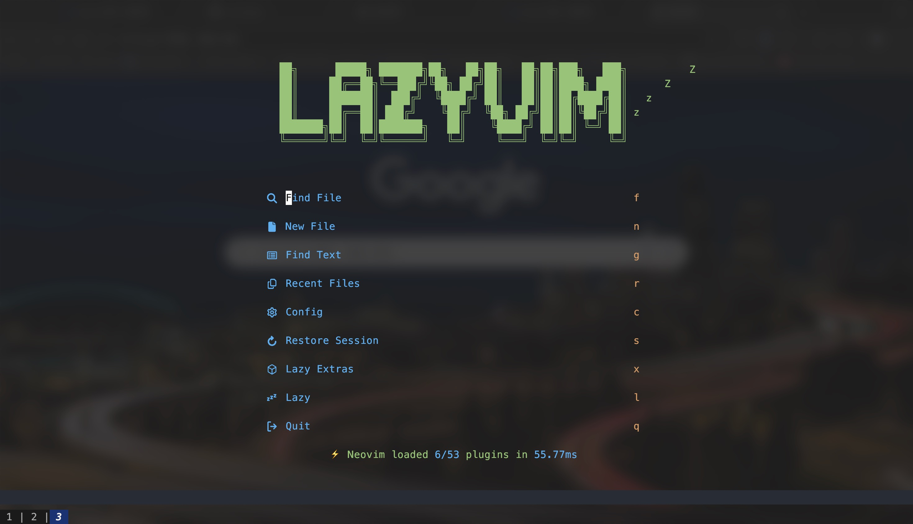
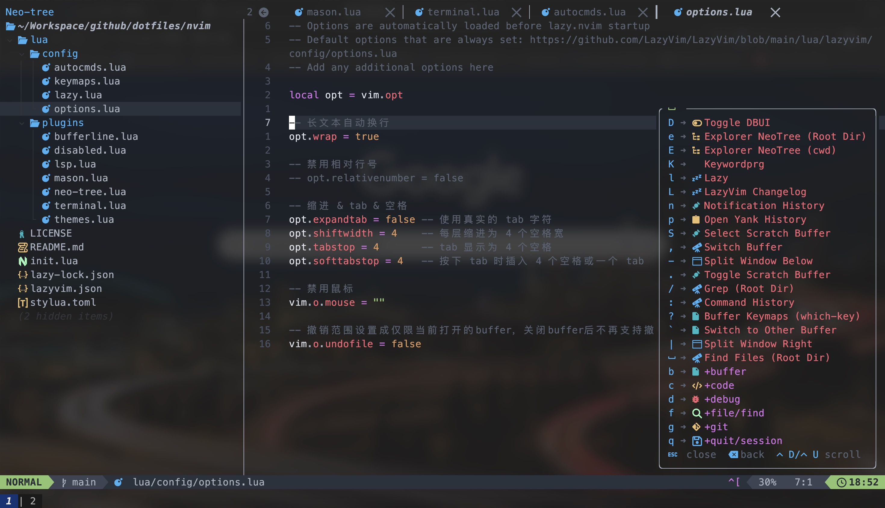

# LazyVim 备忘录（zzkrix 版 + JetBrains 对照表）

> **核心结论**：作者从 JetBrains IDE（IDEA/WebStorm）转 LazyVim 时整理的备忘录。**最有价值的部分是**「JetBrains 快捷键 ↔ LazyVim 快捷键」**对照表**——17 条常用操作（跳转定义、变量重构、折叠、注释、批量替换等），帮助 JetBrains 用户 0 切换成本上手 LazyVim。

> **关键洞察**：
> - **`<leader><leader>` = `<leader>ff`** 都是「快速搜索文件」（两种风格）
> - **`shift k` 是浮窗显示函数文档**（KB 多）
> - **`s` + 任意字符串 = Vimium 风格搜索**
> - **`ctrl ww` = 焦点在窗口间切换**；`ctrl w` + `h/j/k/l` = 移动到 ⬅️/⬇️/⬆️/➡️
> - 备忘录含**作者自用配置链接**：https://github.com/zzkrix/dotfiles/tree/main/nvim

<!-- more -->

## 安装前置条件

原文指引（无新增信息，记录在案）：

- 前置条件：https://www.lazyvim.org/#%EF%B8%8F-requirements
- 安装步骤：https://www.lazyvim.org/installation

## 一、基本操作 20 个

| 快捷键 | 描述 |
|--------|------|
| `<leader><leader>` 或 `<leader>ff` | 快速搜索文件 |
| `<leader>fb` | 搜索 buffer |
| `<leader>ft` | 打开 terminal |
| `ctrl /` | 打开 / 隐藏 terminal |
| `ctrl ww` | 焦点在各窗口之间切换 |
| `ctrl w` + `h/j/k/l` | 焦点移动到 ⬅️/⬇️/⬆️/➡️ 侧窗口 |
| `shift h` / `shift l` | 移动到 ⬅️ / ➡️ 侧 buffer 标签 |
| `shift k` | 浮窗显示函数文档 |
| `<leader>qq` | 退出 nvim（quit all） |
| `s` + 任意字符串 | 快速搜索定位（Vimium 风格） |
| `<leader>cd` | 在 lsp 警告提示上执行可看完整信息 |
| `<leader>xx` | 在窗口中查看所有 lint 提示 |
| `<leader>cs` | 显示函数/类大纲 |
| `<leader>n` | 查看 notify（通知消息）历史 |
| `<leader>l` | 打开 `lazy.vim` 窗口 |
| `<leader>cm` | 打开 `mason` 窗口 |
| `<leader>gg` | 打开 `lazygit` 窗口 |

## 二、文件管理器 9 个

| 快捷键 | 描述 |
|--------|------|
| `<leader>e` | 打开或关闭文件管理器 |
| `Esc` | 隐藏文件管理器 |
| `shift h` | 控制隐藏文件显示 |
| `a` | 新建文件或文件夹（路径以 `/` 结尾） |
| `c` | copy 文件 |
| `m` | move 文件 / 重命名 |
| `r` | rename 重命名 |
| `d` | delete 删除文件 / 目录 |
| `shift v` 选中后 `y` | 多选文件 / 目录 |

## 三、JetBrains 快捷键对照表 ⭐

> **来历**：作者从 JetBrains 系（IDEA/WebStorm）转 LazyVim 时整理，**让 JetBrains 用户能"肌肉记忆复用"**。

| LazyVim 快捷键 | 描述 | JetBrains 对照 |
|----------------|------|---------------|
| `gd` | 跳转到定义处 | `cmd b` |
| `gr` | 显示引用 | `cmd b` |
| `ctrl o` / `ctrl + i` | 跳转回原处 | `cmd opt ←` / `→` |
| `<leader>/` | 全局关键字搜索 | `cmd shift f` |
| `<leader>sg` | 全局关键字搜索 | `cmd shift f` |
| `<leader>cr` | 变量名重构 | `shift f6` |
| `zM` | 折叠所有函数体 | `cmd shift -` |
| `zR` | 展开所有函数体 | `cmd shift +` |
| `za` | 折叠/打开当前函数体 | `cmd -` |
| `zo` | 展开当前函数体 | `cmd +` |
| `zc` | 折叠当前函数体 | — |
| `gc` | 多行 注释 / 取消注释 | `cmd /` |
| `gcc` | 单行 注释 / 取消注释 | `cmd /` |
| `:%s/old/new/g` | 当前文件替换 | `cmd r` |
| `<leader>sr` | 批量查找替换 | `shift cmd r` |
| `<leader>sr \c` | 退出替换窗口 | — |
| `<leader>sr \r` | 执行 `replace` | — |
| `<leader>sr \s` | 执行 `sync`，效果同 `replace` | — |

### 对照表的实操价值

适合「**曾用 IDEA / WebStorm / GoLand / PyCharm 等 JetBrains 工具**」的你 —— 老按键肌肉记忆还在，迁到 LazyVim 时这 17 条能立刻衔接。

## 同仓库相关资源

- [lazyvim-cheatsheet.md](../lazyvim-cheatsheet.md) — 官方 150 条精选速查
- [lazyvim-keymaps-complete.md](./lazyvim-keymaps-complete.md) — 全插件 420 条 keymap 完整版
- [lazyvim-architecture.md](./lazyvim-architecture.md) — LazyVim 庖丁解牛（理解原理）
- [lazyvim-keymap-config.md](./lazyvim-keymap-config.md) — 自定义 keymaps.lua 完整配置

## 关联参考

- 作者自用配置：https://github.com/zzkrix/dotfiles/tree/main/nvim
- 作者 vim 备忘：https://www.zzkrix.com/tech/vim-shortkeys/

## 附：原文预览

作者博客现场截图（来自原文）：
- 
- 