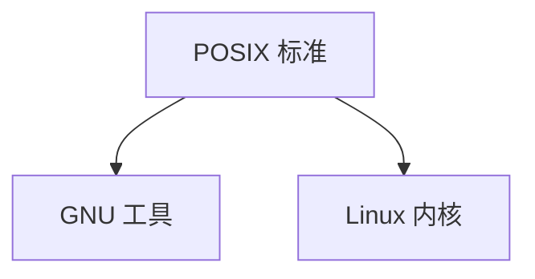
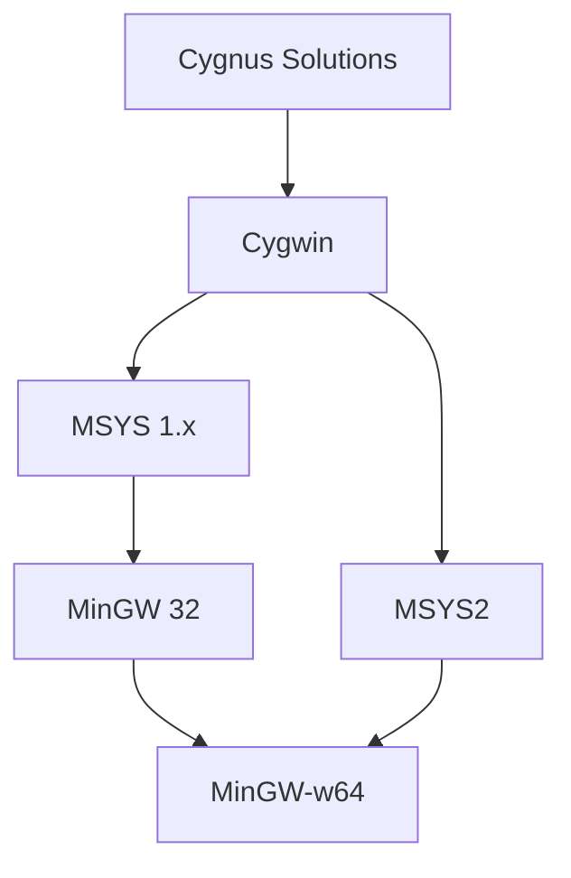
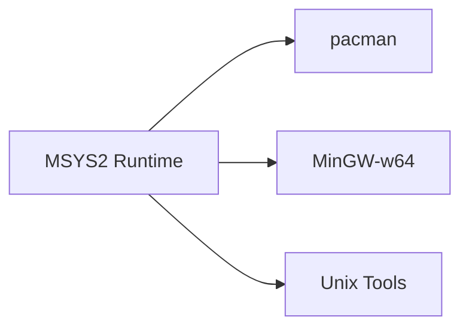

# Windows 上 GNU 生态全景解析：Cygwin、MinGW、MSYS 与 POSIX 的演进与本质

在 Windows 上使用 GCC、Bash、Make、grep 这些工具时，你一定会遇到几个名字：

* Cygwin
* MinGW
* MSYS
* MSYS2

很多文章介绍它们的区别，但往往越看越乱。
真正理解它们，需要从 **GNU 与 POSIX** 讲起。

---

# 一、GNU 与 POSIX —— 理论基础

## 1️⃣ GNU 是什么？

GNU 是由 Richard Stallman 于 1983 年发起的自由软件计划。

GNU 的目标：

> 构建一个完全自由的类 Unix 操作系统

GNU 提供的不是内核，而是：

* GCC（编译器）
* Binutils（链接器工具链）
* Bash（Shell）
* Coreutils（ls / cp / rm）
* glibc（C 标准库）

我们常说的“Linux 系统”，更准确地说是：

```text
Linux 内核 + GNU 用户空间
```

因此常被称为：

> GNU/Linux

---

## 2️⃣ POSIX 是什么？

POSIX（Portable Operating System Interface）是由 IEEE 制定的标准。

它的目标：

> 统一 Unix 系统的接口规范

POSIX 规定了：

* 文件 API（open / read / write）
* 进程管理（fork / exec）
* 信号机制
* 线程模型
* Shell 规范
* 常用命令行为标准

重点：

> POSIX 是标准，不是系统。

Linux 实现了大部分 POSIX 标准。

---

## 3️⃣ 三者关系

| 组件    | 本质   |
| ----- | ---- |
| POSIX | 标准规范 |
| GNU   | 工具实现 |
| Linux | 内核实现 |

关系图：



---

# 二、Windows 上 GNU 的两条路线

当 GNU 工具想运行在 Windows 上时，有两种策略：

---

## 路线一：模拟 POSIX

Windows
⬇
POSIX 兼容层
⬇
GNU 工具

代表：Cygwin / MSYS / MSYS2

---

## 路线二：生成原生 Windows 程序

Windows
⬇
GNU 编译器
⬇
WinAPI

代表：MinGW / MinGW-w64

---

# 三、历史演进图



---

# 四、Cygwin —— Windows 上的 POSIX 子系统

Cygwin 最初由 Cygnus 开发，后归属 Red Hat。

核心目标：

> 在 Windows 上实现 POSIX

它通过一个关键组件：

```text
cygwin1.dll
```

将 POSIX 调用转换为 Windows API。

特点：

* 类 Unix 文件系统结构
* Unix 风格路径
* Windows 盘符挂载
* 可运行 GNU 工具
* 程序依赖 cygwin1.dll

本质：

> Windows 上的 POSIX 子系统

优点：

* 兼容性强
* 工具丰富

缺点：

* 体积大
* 运行效率受兼容层影响

---

# 五、MinGW —— 原生 Windows GNU 编译器

MinGW 全称：

> Minimalist GNU for Windows

目标：

> 用 GCC 直接生成 Windows 原生程序

特点：

* 不模拟 POSIX
* 不依赖 cygwin1.dll
* 直接调用 WinAPI
* 生成 .exe 原生程序
* 运行时依赖 msvcrt

适用场景：

* Win32 程序开发
* GUI 应用开发
* 纯 Windows 工程

本质：

> GNU 工具链 + Windows SDK 适配

---

# 六、MSYS —— MinGW 的辅助环境

由于 Windows cmd 体验不佳，开发者从旧版 Cygwin fork 出 MSYS。

目标：

* 提供基础 Unix 工具
* 辅助 MinGW 使用

特点：

* 轻量
* 功能有限
* 已逐渐停止活跃维护

定位：

> MinGW 的命令行辅助环境

---

# 七、MinGW-w64 —— 现代化升级版

旧版 MinGW：

* 仅支持 32 位
* API 支持不足
* 更新停滞

MinGW-w64：

* 支持 64 位
* 支持更多 Windows API
* 支持交叉编译

定位：

> 现代 Windows 原生 GCC 主流方案

---

# 八、MSYS2 —— 现代融合方案

MSYS2 是新一代解决方案。

特点：

* 基于较新 Cygwin fork
* 使用 pacman 包管理器
* 集成 MinGW-w64
* 活跃社区

架构：



定位：

> Cygwin + MinGW-w64 + 包管理 的融合体

目前是 Windows 上使用 GNU 工具的推荐方案。

---

# 九、区别对比表

| 项目        | 是否模拟 POSIX | 是否生成原生程序 | 是否完整类 Unix 环境 |
| --------- | ---------- | -------- | ------------- |
| Cygwin    | ✅          | ❌        | ✅             |
| MinGW     | ❌          | ✅        | ❌             |
| MSYS      | 部分         | ❌        | 简化版           |
| MinGW-w64 | ❌          | ✅        | ❌             |
| MSYS2     | 部分         | ✅        | 中等            |

---

# 十、如何选择？

如果你想：

* 在 Windows 上运行大量 Linux 工具
  → Cygwin 或 MSYS2

* 开发 Windows 原生程序
  → MinGW-w64

* 既要 Unix 工具又要原生编译
  → MSYS2

* 做企业级 Windows 开发
  → MSVC 或 MinGW-w64

---

# 十一、本质总结

* GNU 是工具生态
* POSIX 是接口标准
* Linux 是内核实现
* Cygwin 是 Windows 上的 POSIX 子系统
* MinGW 是 Windows 原生 GCC
* MSYS 是 MinGW 的外壳
* MSYS2 是现代融合解决方案

---

# 十二、一句话理解

> Cygwin 让 Windows 看起来像 Unix
> MinGW 让 GNU 为 Windows 生成原生程序
> MSYS2 让两者结合并现代化


