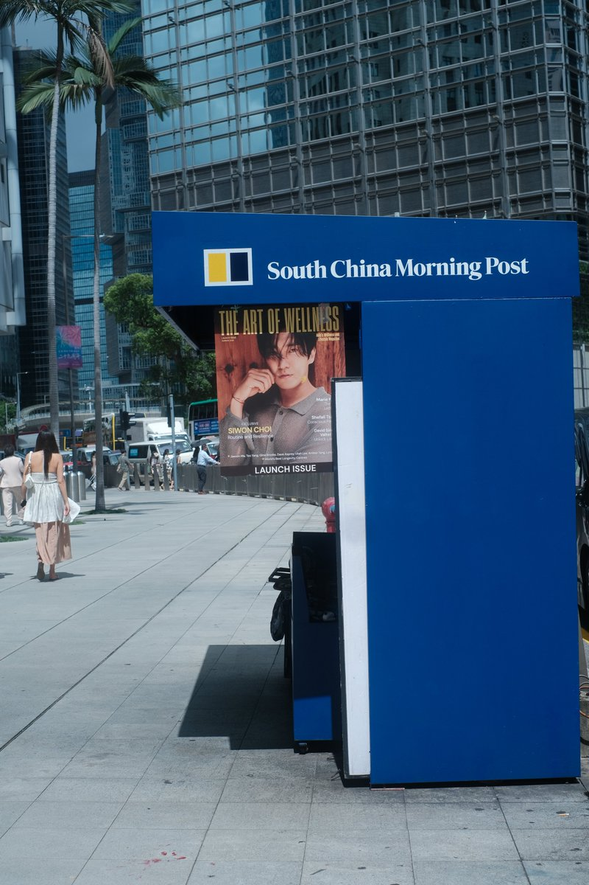
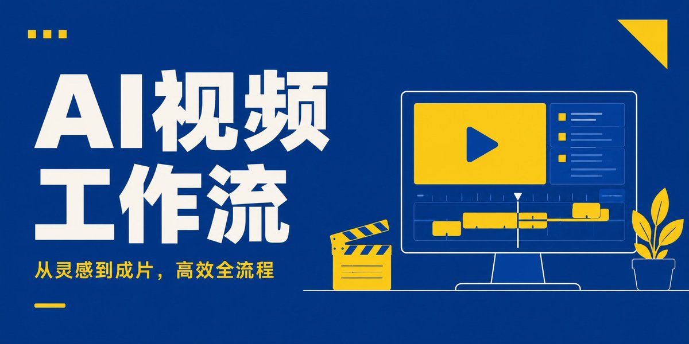
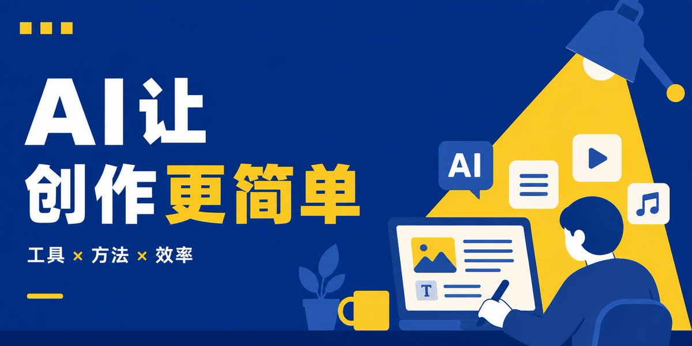

# 为什么宜家、德邦都爱黄蓝配色？我把它做成了一套 Prompt。

前几天走在香港街头，突然被一组很简单的黄蓝配色吸引住了。

蓝色负责稳定、秩序和可信感，黄色负责提醒、活力和注意力。两个颜色放在一起，既醒目，又不会显得杂乱。再往回想，德邦物流、宜家这些大家熟悉的品牌，也长期在使用黄蓝组合。它能被反复采用，说明这套颜色本身就有很强的识别力。

所以，这版提示词就来了。

这是一套以深蓝为主、明黄点缀、暖白辅助的扁平化大字封面提示词。






```
请根据以下输入，直接生成一张「深蓝主色 × 明黄点缀 × 扁平大字」风格封面。

【输入信息】

主题：{{填写主题}}

主标题：{{填写主标题，建议4—12个字}}

副标题：{{可留空，建议6—16个字}}

核心观点：{{这张图真正想表达的结论，可留空}}

画幅比例：{{5:2 / 16:9 / 3:2 / 4:3 / 1:1 / 4:5 / 3:4 / 9:16}}

用途：{{文章封面 / X长文封面 / 视频封面 / 社交媒体配图 / 海报}}

视觉主体：{{人物 / 电脑 / 手机 / 工作台 / 日常物品 / 自动判断}}

画面方向：{{偏理性 / 偏生活 / 偏幽默 / 偏效率 / 偏职场 / 自动判断}}

一、核心视觉定位

采用深蓝色为主、明黄色为强调色、米白色为文字和局部辅助色的现代扁平矢量封面。

整体气质：

直接；
醒目；
现代；
亲切；
有生活感；
有编辑设计感；
像一本大众设计目录、生活方式手册或现代知识杂志封面。

这不是科技炫技海报，不是复杂信息图，也不是品牌广告。

画面必须同时具备：

超大粗体标题；
极简扁平插画；
明确视觉隐喻；
高对比配色；
大面积留白；
稳定而不僵硬的版式。

二、内容分析逻辑

生成画面前，先理解主题，不要直接堆砌图标。

先完成以下判断：

1. 主题真正讲的是什么；
2. 最核心的动作、矛盾、结果或情绪是什么；
3. 哪一个日常场景最容易让人一眼看懂；
4. 用一个核心画面表达，不要同时塞入多个故事。

不同主题应使用不同视觉隐喻：

AI主题：
可使用电脑、创作台、对话框、自动化流程、机器人助手、文档、视频时间轴、素材卡片。

职场主题：
可使用阶梯、办公桌、工位、闹钟、会议桌、文件堆、工牌、奖杯、通勤人物。

生活主题：
可使用沙发、台灯、咖啡杯、冰箱、购物袋、床、餐桌、植物、收纳柜。

幽默或有梗主题：
通过人物动作、物品比例、反差场景表达笑点，不依赖大量文字解释。

三、色彩系统

深蓝色为绝对主色，占画面约60%—85%。

明黄色为强调色，占画面约10%—30%。

米白色或暖白色占画面约5%—20%，主要用于标题、人物皮肤、灯光或局部留白。

推荐色彩关系：

深蓝：
#003B7A
#004A91
#00529B

明黄：
#FFCC00
#FFD21A
#FFC800

暖白：
#F7F3E8
#FFF9E8

禁止平均分配蓝色和黄色。

黄色只能负责：

关键图形；
核心动作；
局部高光；
重点文字；
视觉引导；
少量几何装饰。

蓝色必须承担：

主要背景；
大面积空间；
主体结构；
整体视觉基调。

同一系列中允许调整色彩比例，但始终保持蓝色明显多于黄色。

四、标题设计

主标题必须是画面第一视觉中心。

使用超粗无衬线中文字体，字形宽厚、稳定、直接。

标题占画面约30%—50%。

标题可以使用：

纯白色；
暖白色；
局部黄色强调关键词。

主标题最多使用两种颜色。

允许将标题拆成2—4行，但必须保持阅读顺序清楚。

标题排版特点：

字号大；
字距紧凑；
行距偏紧；
整体稳定；
允许部分文字略微切边；
不得拥挤；
不得变形；
不得出现错字。

AI、数字、英文缩写可保留英文形式，但不要使用多余英文装饰。

五、版式系统

根据主题自动选择最合适的版式，不固定只有一种结构。

版式一：左字右图

左侧放超大标题；
右侧放单一扁平场景；
适合知识、教程、AI、职场主题。

版式二：上字下图

上方放大标题；
下方放人物、家具、电脑或流程；
适合竖版封面和生活主题。

版式三：字图交叠

标题与插画局部穿插；
文字仍保持清晰；
适合更有设计感、情绪感或幽默感的主题。

版式四：大场景切边

人物、家具、设备从画面边缘进入；
主体不必完整出现；
标题占据另一侧留白；
适合横版封面。

版式五：单一符号隐喻

使用一个巨大物品、阶梯、灯光、窗口或工具表达主题；
减少人物；
适合抽象观点和方法论。

每张图只选一种主要版式，不混用全部结构。

六、插画风格

使用统一的扁平矢量插画语言。

具体要求：

几何形状简洁；
轮廓干净；
体块清楚；
细节克制；
人物动作明确；
物品容易识别；
场景具有生活感；
允许轻微轮廓线；
允许少量深浅蓝层次；
禁止复杂纹理。

人物风格：

简化五官；
比例自然但略带图形化；
姿态清楚；
不过度卡通；
不做儿童绘本感；
不做夸张3D玩具感。

物品风格：

保持平面化；
使用矩形、圆形、弧线和简单切面；
不要真实材质；
不要高光反射；
不要复杂透视。

七、视觉隐喻要求

画面不能只是“标题旁边放一台电脑”。

必须让视觉主体与主题发生关系。

例如：

“AI视频工作流”
用电脑时间轴、素材模块和流程节点构成一条完整制作路径。

“打工人生存指南”
用人物攀爬阶梯，阶梯中嵌入时间、任务、工资和休息符号。

“AI让创作更简单”
用灯光照亮创作桌，AI将文字、图片、音频和视频汇入一个作品。

“周末干点嘛”
用空沙发、台灯、植物和等待中的人物形成松弛感。

“别让AI替你思考”
用人物头脑与AI工具之间形成清晰边界或对比。

八、文字规范

画面只允许出现：

主标题；
副标题；
必要的1—5个流程短词。

流程短词每个不超过4个字。

除非主题确实需要，不要放：

段落文字；
解释性小字；
英文装饰；
编号；
品牌名称；
Logo；
网址；
水印；
虚构数据。

副标题必须明显小于主标题，不能抢夺视觉中心。

九、细节变化机制

为了避免每张图都像同一个模板，生成时必须根据主题变化以下内容：

标题位置；
人物数量；
主体大小；
黄色区域形状；
场景视角；
留白方向；
物品组合；
图形切边方式。

但以下核心必须始终固定：

深蓝色为主；
明黄色点缀；
暖白色文字；
超大粗字体；
扁平矢量；
单一核心隐喻；
简洁几何结构；
大面积留白；
高识别度。

十、禁止项

禁止宜家Logo；
禁止直接写IKEA；
禁止模仿具体品牌广告；
禁止黄色成为绝对主背景；
禁止蓝黄各占一半；
禁止渐变背景；
禁止霓虹灯；
禁止赛博朋克；
禁止玻璃质感；
禁止金属质感；
禁止3D渲染；
禁止写实摄影；
禁止复杂阴影；
禁止高光反射；
禁止复杂信息图；
禁止满屏小图标；
禁止多个场景同时出现；
禁止人物过多；
禁止标题过小；
禁止大段文字；
禁止装饰元素无意义堆积；
禁止错误中文；
禁止文字变形；
禁止生成与主题无关的家具陈列。

十一、最终效果

最终画面应该像一张成熟、稳定、现代的蓝黄视觉封面：

远看先看到大标题；
近看能读懂视觉隐喻；
蓝色建立秩序；
黄色负责抓眼；
白色保证阅读；
插画简单但不空洞；
风格统一但每张构图不同。

直接生成最终封面，不展示分析过程，不输出提示词，不生成多图拼贴。
```

## 关于作者

Punk｜中科大 MBA｜HerName 首席设计师｜Stanley 商学院执行院长｜

｜AI提示词｜分享小白能看懂、复制能上手的 AI / 搞钱方法｜

[@AdrianPunk115](https://x.com/@AdrianPunk115)