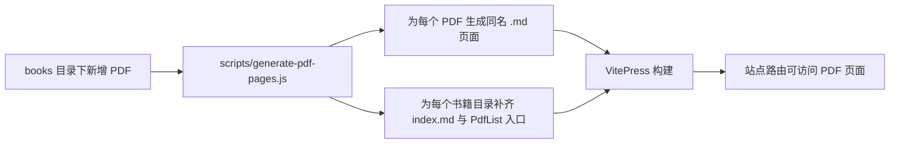

# PDF 预览功能梳理

本文整理站点当前的 PDF 预览能力，覆盖功能边界、运行链路与关键实现点。

## 功能范围

当前 PDF 预览由两个组件协同提供：

1. `PdfList`：聚合并展示 `docs/md/books/**/*.pdf`，用于“选书 + 选章节”。
2. `PdfViewer`：负责单个 PDF 的加载、渲染与交互。

用户可用能力：

- 页码跳转：首页、上一页、下一页、尾页。
- 缩放：0.2x 到 5x。
- 目录导航：读取 PDF Outline，支持层级目录点击跳转。
- 全屏预览：浏览器 Fullscreen API。
- 新标签打开原文件：直接打开 PDF URL。
- 异常提示：加载失败时展示错误信息。

## 运行原理链路

### A. 构建期链路（内容入口生成）



说明：脚本会确保页面使用 `new URL('./xx.pdf', import.meta.url).href` 构造资源地址，避免手写路径不一致。

### B. 运行时链路（页面打开到首屏渲染）

```mermaid
flowchart TD
  U[用户打开书籍页面] --> M[Markdown 页面挂载 Vue 组件]
  M --> L{入口类型}
  L -->|目录页| PL[PdfList 通过 import.meta.globEager 收集 PDF]
  L -->|单页| PV[PdfViewer 接收 src]
  PL --> S[用户选择某个 PDF]
  S --> PV
  PV --> J[动态 import pdfjs-dist]
  J --> W[设置 GlobalWorkerOptions.workerSrc]
  W --> G[getDocument(src) 创建 loadingTask]
  G --> P[pdfDocument = await loadingTask.promise]
  P --> O[读取 numPages 与 getOutline]
  O --> R[renderPage: getPage + getViewport + canvas.render]
  R --> UI[显示首屏并响应翻页/缩放/目录跳转]
```

### C. 交互链路（用户操作后的渲染闭环）

```mermaid
flowchart LR
  A[翻页/缩放/目录点击] --> B[更新 page 或 scale]
  B --> C[watch(page/scale) 触发 renderPage]
  C --> D[pdfPage.render 到 canvas]
  D --> E[界面刷新]
```

## 关键实现点

1. 延迟加载 PDF 引擎
- `PdfViewer` 在首次需要时才 `import('pdfjs-dist')`，减少初始包体负担。

2. Worker 显式绑定
- 通过 `import('pdfjs-dist/build/pdf.worker.min.mjs?url')` 获取 worker 静态资源 URL。
- 将 URL 赋给 `GlobalWorkerOptions.workerSrc`，保证解析任务在 worker 中执行。

3. 目录递归渲染
- `PdfOutline` 组件递归渲染多级目录，点击后通过 `getDestination` 解析目标页并跳转。

4. 资源发现机制
- `PdfList` 使用 `import.meta.globEager('../../../md/books/**/*.pdf')` 在构建期收集 PDF 并按目录分组。

## 失败链路与兜底

```mermaid
flowchart TD
  A[getDocument(src)] -->|异常| B[catch error]
  B --> C[error 状态写入]
  C --> D[界面显示“PDF 加载失败”]
  D --> E[用户可通过“新标签打开”直接访问原 PDF]
```

常见失败原因：

- 文件名或 URL 编码问题（特殊字符未正确处理）。
- 资源路径错误（页面与 PDF 相对路径不匹配）。
- PDF 文件损坏或网络请求失败。

## 代码位置

- `docs/.vitepress/theme/components/PdfViewer.vue`
- `docs/.vitepress/theme/components/PdfList.vue`
- `docs/.vitepress/theme/components/PdfOutline.vue`
- `scripts/generate-pdf-pages.js`
- `docs/md/books/**/index.md` 与各 PDF 同名 `.md`
