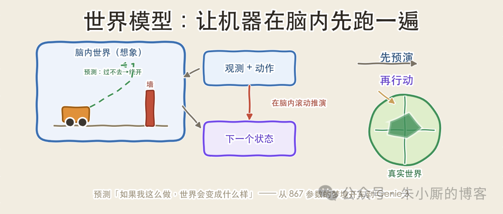

# 什么是世界模型？

点击上方“朱小厮的博客”，选择“设为星标”

# 点击上方“朱小厮的博客”，选择“设为星标”

人开车拐弯前，脑子里会先"过一遍"：方向盘打多少、对面那辆车大概怎么走、要是急刹会不会追尾。这个在头脑里预演后果、再决定动作的过程，认知科学称之为心智模型。让机器也具备这种能力，就是"世界模型"（World Model）要解决的事——给系统装一个能预测"如果我这么做，世界会变成什么样"的内部模拟器，让它在真正行动之前，先在脑内把可能的未来跑几遍。和大语言模型对照着看。语言模型预测的是"下一个 token"，维护的是文本序列的概率分布；世界模型预测的是"下一个世界状态"——给定当前观测和一个动作，输出环境接下来的样子。一个续写句子，一个推演环境。Yann LeCun 给过一个更严格的定义：世界模型是一个因果模型，给定对系统的一次观测和一次干预（动作），预测这次干预导致的结果；这种预测不必细到每个像素，可以在一个抽象的表示空间里进行。抽象表示空间、因果、干预，这三点是后面两条技术路线分歧的来源。

人开车拐弯前，脑子里会先"过一遍"：方向盘打多少、对面那辆车大概怎么走、要是急刹会不会追尾。这个在头脑里预演后果、再决定动作的过程，认知科学称之为心智模型。让机器也具备这种能力，就是"世界模型"（World Model）要解决的事——给系统装一个能预测"如果我这么做，世界会变成什么样"的内部模拟器，让它在真正行动之前，先在脑内把可能的未来跑几遍。

和大语言模型对照着看。语言模型预测的是"下一个 token"，维护的是文本序列的概率分布；世界模型预测的是"下一个世界状态"——给定当前观测和一个动作，输出环境接下来的样子。一个续写句子，一个推演环境。Yann LeCun 给过一个更严格的定义：世界模型是一个因果模型，给定对系统的一次观测和一次干预（动作），预测这次干预导致的结果；这种预测不必细到每个像素，可以在一个抽象的表示空间里进行。抽象表示空间、因果、干预，这三点是后面两条技术路线分歧的来源。

图1：语言模型 vs 世界模型它最早长什么样2018 年 Ha 与 Schmidhuber 那篇直接叫《World Models》的工作，是理解世界模型的一个起点。它的结构拆成三个模块：V（Vision，视觉）用一个 VAE 把每一帧 64×64 的游戏画面压成一个几百维的隐向量 z，相当于给世界拍张"压缩快照"；M（Memory，记忆）用一个 MDN-RNN 学习时序动态，根据当前的 z、动作和隐藏状态，预测下一时刻的 z 会是什么，这就是模型"预测未来"的部分；C（Controller，控制器）是一个极小的线性策略，输入 V 和 M 的隐状态，输出该按哪个动作，参数量只有 867 个。这套结构真正区别于常规做法的，是训练方式：智能体几乎不在真实环境里学策略，而是在世界模型"想象"出来的梦境里学。M 既然能预测下一帧的隐状态，把它自己的输出再喂回自己，就能不停地滚动生成一整段虚构的未来轨迹（rollout），控制器在这条虚构轨迹上做强化学习，学好之后再迁移回真实环境。就靠这套方法，那个 867 参数的线性控制器在 CarRacing-v0 上拿到了 906±21 分，首次解出了这个像素级连续控制任务。"在梦里学开车"这个说法，就是这么来的。

## 它最早长什么样

2018 年 Ha 与 Schmidhuber 那篇直接叫《World Models》的工作，是理解世界模型的一个起点。它的结构拆成三个模块：V（Vision，视觉）用一个 VAE 把每一帧 64×64 的游戏画面压成一个几百维的隐向量 z，相当于给世界拍张"压缩快照"；M（Memory，记忆）用一个 MDN-RNN 学习时序动态，根据当前的 z、动作和隐藏状态，预测下一时刻的 z 会是什么，这就是模型"预测未来"的部分；C（Controller，控制器）是一个极小的线性策略，输入 V 和 M 的隐状态，输出该按哪个动作，参数量只有 867 个。

这套结构真正区别于常规做法的，是训练方式：智能体几乎不在真实环境里学策略，而是在世界模型"想象"出来的梦境里学。M 既然能预测下一帧的隐状态，把它自己的输出再喂回自己，就能不停地滚动生成一整段虚构的未来轨迹（rollout），控制器在这条虚构轨迹上做强化学习，学好之后再迁移回真实环境。就靠这套方法，那个 867 参数的线性控制器在 CarRacing-v0 上拿到了 906±21 分，首次解出了这个像素级连续控制任务。"在梦里学开车"这个说法，就是这么来的。

图2：V-M-C 三模块与梦境训练两条分岔的路线2018 年之后，"怎么预测世界"分成了方向几乎相反的两条思路。今天大部分相关新闻，都能归到其中一条上。第一条是像素重建（生成）路线：要预测未来，就把未来的画面一帧帧、一个像素一个像素地生成出来。Sora 这类视频生成模型、英伟达的 Cosmos、Wayve 的 GAIA-1 都走这条路。好处是结果直观、能看、能交互，可以直接当"神经渲染引擎"用。第二条是抽象表征路线，代表是 LeCun 主推的 JEPA（Joint-Embedding Predictive Architecture，联合嵌入预测架构）。它的主张很直接：重建每一个像素是浪费——智能体不需要预测"墙上有几道纹路"，只需要知道"墙在那儿、过不去"这种对决策有用的事实。所以 JEPA 不在像素空间重建，而是在一个学到的隐空间里，用过去观测的表示去预测未来观测的表示。在隐空间里做预测，能自然跳过那些本就无法预测的表面细节（像素噪声、光照抖动、措辞变化），把算力留给真正支撑规划的结构性信息。这也是 LeCun 在 Sora 发布当天批评它"没有真正理解物理世界"、并同日拿出 V-JEPA 的立场所在。这条路线现在是一个模型家族：I-JEPA 做图像、V-JEPA 做视频，到 V-JEPA 2 已经能接入动作条件，给定"观测-动作"序列去预测后续表示，服务于具身智能体的规划。两条路线不是替代关系——生成路线强在可视化和数据合成，表征路线强在效率和面向决策的抽象，实际系统里两者经常混用。

## 两条分岔的路线

2018 年之后，"怎么预测世界"分成了方向几乎相反的两条思路。今天大部分相关新闻，都能归到其中一条上。

第一条是像素重建（生成）路线：要预测未来，就把未来的画面一帧帧、一个像素一个像素地生成出来。Sora 这类视频生成模型、英伟达的 Cosmos、Wayve 的 GAIA-1 都走这条路。好处是结果直观、能看、能交互，可以直接当"神经渲染引擎"用。第二条是抽象表征路线，代表是 LeCun 主推的 JEPA（Joint-Embedding Predictive Architecture，联合嵌入预测架构）。它的主张很直接：重建每一个像素是浪费——智能体不需要预测"墙上有几道纹路"，只需要知道"墙在那儿、过不去"这种对决策有用的事实。所以 JEPA 不在像素空间重建，而是在一个学到的隐空间里，用过去观测的表示去预测未来观测的表示。在隐空间里做预测，能自然跳过那些本就无法预测的表面细节（像素噪声、光照抖动、措辞变化），把算力留给真正支撑规划的结构性信息。这也是 LeCun 在 Sora 发布当天批评它"没有真正理解物理世界"、并同日拿出 V-JEPA 的立场所在。

这条路线现在是一个模型家族：I-JEPA 做图像、V-JEPA 做视频，到 V-JEPA 2 已经能接入动作条件，给定"观测-动作"序列去预测后续表示，服务于具身智能体的规划。两条路线不是替代关系——生成路线强在可视化和数据合成，表征路线强在效率和面向决策的抽象，实际系统里两者经常混用。

图3：像素重建路线 vs JEPA 抽象表征路线把世界模型装进强化学习世界模型最实在的用途，是让强化学习省数据。传统的无模型（model-free）强化学习靠海量真实交互试错，成本极高；有了世界模型，智能体大部分时间在模型的想象里训练，只用少量真实数据校准模型本身。DeepMind 的 Dreamer 系列是这条线的代表。到 DreamerV3，它由三个神经网络协同：一个世界模型预测动作会带来什么样的隐状态，一个 critic 预测这些隐状态的价值，一个 actor 输出策略；三者通过在想象出的轨迹上反向传播来端到端联合训练。DreamerV3 的特点，是用同一套超参数、不做针对性调优，跑通了 150 多个差异极大的任务——连续与离散动作、图像与低维输入、2D 与 3D 世界都能覆盖，而且模型越大数据效率越高。它还是第一个不依赖任何人类数据、不设课程学习，就能从零在《我的世界》里挖到钻石的算法。挖钻石要长链条探索加稀疏奖励下的规划，一直被当成 AI 的一道难关，而"在脑内世界里反复演练"正好对上了这个难点。会实时生成的可交互世界2025 年 8 月，DeepMind 的 Genie 3 把生成路线又推进了一步。给它一句文字描述，它能实时生成一个可以走动、跳跃的三维世界，每秒 24 帧、720p 分辨率，并在几分钟的尺度内保持场景一致——你转身再回来，房间还是原来那个房间。这一点解决了以往视频生成模型的老毛病：越往后生成，画面越容易漂移、失忆。实时、可交互、长一致性三件事同时具备，它就不只是在拍视频，而更接近一个"用文字凭空造出来的游戏引擎"。它最直接的价值，是给智能体的训练和评估提供源源不断、可控又便宜的虚拟环境，让"在想象中训练"从玩具级别往实用级别靠。它能用在哪，又难在哪世界模型的应用，集中在"真实试错代价太高"的地方。自动驾驶是最典型的一类：GAIA-1、DriveDreamer、Vista 这些模型能按动作和文字条件生成可控的驾驶画面，当作神经化的仿真器，去合成真实路测极难采到的长尾危险场景——鬼探头、极端天气、罕见的事故构型——让自动驾驶系统在虚拟世界里先见过千百遍。机器人这边，英伟达的 Cosmos 世界基础模型能生成符合物理规律的未来视频，批量造出合成训练环境，把昂贵、缓慢又危险的真机采集，换成可控、便宜、能无限复制的虚拟数据。这些用法加上前面的模型驱动强化学习和可交互环境生成，就是眼下"物理 AI"的核心引擎。

## 把世界模型装进强化学习

世界模型最实在的用途，是让强化学习省数据。传统的无模型（model-free）强化学习靠海量真实交互试错，成本极高；有了世界模型，智能体大部分时间在模型的想象里训练，只用少量真实数据校准模型本身。DeepMind 的 Dreamer 系列是这条线的代表。到 DreamerV3，它由三个神经网络协同：一个世界模型预测动作会带来什么样的隐状态，一个 critic 预测这些隐状态的价值，一个 actor 输出策略；三者通过在想象出的轨迹上反向传播来端到端联合训练。

DreamerV3 的特点，是用同一套超参数、不做针对性调优，跑通了 150 多个差异极大的任务——连续与离散动作、图像与低维输入、2D 与 3D 世界都能覆盖，而且模型越大数据效率越高。它还是第一个不依赖任何人类数据、不设课程学习，就能从零在《我的世界》里挖到钻石的算法。挖钻石要长链条探索加稀疏奖励下的规划，一直被当成 AI 的一道难关，而"在脑内世界里反复演练"正好对上了这个难点。

## 会实时生成的可交互世界

2025 年 8 月，DeepMind 的 Genie 3 把生成路线又推进了一步。给它一句文字描述，它能实时生成一个可以走动、跳跃的三维世界，每秒 24 帧、720p 分辨率，并在几分钟的尺度内保持场景一致——你转身再回来，房间还是原来那个房间。这一点解决了以往视频生成模型的老毛病：越往后生成，画面越容易漂移、失忆。实时、可交互、长一致性三件事同时具备，它就不只是在拍视频，而更接近一个"用文字凭空造出来的游戏引擎"。它最直接的价值，是给智能体的训练和评估提供源源不断、可控又便宜的虚拟环境，让"在想象中训练"从玩具级别往实用级别靠。

## 它能用在哪，又难在哪

世界模型的应用，集中在"真实试错代价太高"的地方。自动驾驶是最典型的一类：GAIA-1、DriveDreamer、Vista 这些模型能按动作和文字条件生成可控的驾驶画面，当作神经化的仿真器，去合成真实路测极难采到的长尾危险场景——鬼探头、极端天气、罕见的事故构型——让自动驾驶系统在虚拟世界里先见过千百遍。机器人这边，英伟达的 Cosmos 世界基础模型能生成符合物理规律的未来视频，批量造出合成训练环境，把昂贵、缓慢又危险的真机采集，换成可控、便宜、能无限复制的虚拟数据。这些用法加上前面的模型驱动强化学习和可交互环境生成，就是眼下"物理 AI"的核心引擎。

图4：世界模型的应用场景与三个技术难点另一面，这条路还没走通，有三个技术难点仍未解决。一是误差累积（compounding error）：世界模型靠把自己的预测再喂回自己来滚动生成，每一步的微小偏差会像滚雪球一样越滚越大，推得越久越容易"跑飞"。二是物理一致性：到现在还没有哪个学出来的世界模型，能在长时间跨度上准确预测真实物理，重力、碰撞、流体这些约束照样会被违反。三是抽象层级怎么定：预测得太细（到像素）既费算力又难稳定，预测得太粗又可能丢掉决策要用的关键信息——JEPA 和生成派的分歧，说到底就在这里。世界模型的内核并不复杂：智能不只是对眼前做出反应，而是在脑子里存一个"世界怎么运转"的压缩模型，先推演、再动手。从 867 个参数的线性控制器在梦里学开车，到能用一句话造出可交互世界的 Genie 3，变的是规模和保真度，没变的是这个内核——让机器先在脑子里把这一步跑一遍，再落到真实世界。不少研究者押注通往更通用智能的路要从这儿走，理由也在于此。

另一面，这条路还没走通，有三个技术难点仍未解决。一是误差累积（compounding error）：世界模型靠把自己的预测再喂回自己来滚动生成，每一步的微小偏差会像滚雪球一样越滚越大，推得越久越容易"跑飞"。二是物理一致性：到现在还没有哪个学出来的世界模型，能在长时间跨度上准确预测真实物理，重力、碰撞、流体这些约束照样会被违反。三是抽象层级怎么定：预测得太细（到像素）既费算力又难稳定，预测得太粗又可能丢掉决策要用的关键信息——JEPA 和生成派的分歧，说到底就在这里。

世界模型的内核并不复杂：智能不只是对眼前做出反应，而是在脑子里存一个"世界怎么运转"的压缩模型，先推演、再动手。从 867 个参数的线性控制器在梦里学开车，到能用一句话造出可交互世界的 Genie 3，变的是规模和保真度，没变的是这个内核——让机器先在脑子里把这一步跑一遍，再落到真实世界。不少研究者押注通往更通用智能的路要从这儿走，理由也在于此。

加入新技术群。备注：加群/技术

近日最近文章汇总

中间件相关：

Kafka 从 2.0 至今：关键技术演进、原理与架构

Redis 近些年核心演进全景——从单线程缓存到实时数据平台

RabbitMQ 怎么有点 Kafka 的味道了？—— 细说 RabbitMQ 进化史

实时协同编辑的魔法揭秘——多人同时敲一个文档，为什么不会乱套？

分布式事务通关指南·图解

分布式 MySQL 是怎么炼成的：从单机瓶颈到亿级数据

LLM 系列：

Claude Code 核心架构与原理研究

Loop Engineering：当你不再给 AI 打字，而是给 AI 设计一位"老板"

RAG 还是 LLM Wiki？一次讲透怎么把知识喂给 AI

当 AI 拿起键盘：一文看懂 LLM 沙箱的门道

Claude Code 为什么“只用 Grep、不碰 Code RAG”？——一道被问错的面试题

图解 Codex: 核心架构和原理研究

图解·为什么 Agent Skill 不靠向量 RAG 召回？

Skill / Prompt 优化后,如何守住老 case?——写给程序员的 LLM 回归评测实战

为什么 Claude Code 和 Opus 更搭、Codex 和 GPT 更搭？一篇讲透「模型与工具的双向奔赴」

分身有术：一文读懂大模型里的 Sub Agent 机制

Agent 如何按任务自主切换模型：原理、架构与 Claude Code / Codex / Cursor 实战

当 AI 学会"组队打怪"：一文读懂 Agent Team

为什么 LLM 会吐出“亚洲AV”“无码”：从语料、概率到安全对齐的底层解释

被误传的 92%：Claude Code 上下文压缩阈值的计算逻辑与成本权衡

Claude Code 的上下文压缩机制：阈值、分层策略与守卫

grill-me、brainstorming、plan：三种"先想清楚再写代码"的机制差在哪

git worktree：Agent 并行编程背后的隐藏功臣

大模型推理底层原理：从一个 Token 到一句完整回答

大模型推理流量的限流与调度：原理、架构与应用场景

新出的 Claude Managed Agents 是什么？把 Agent 的大脑和双手拆开

Agent 评测：从结果校验到过程与可靠性分析

Claude Code 的 Dynamic Workflow 到底是什么

MCP 为什么不用 RPC 协议

Claude Code 的防蒸馏机制：三层设防与门控逻辑

上下文压缩与管理

ACP 与 A2A：两套 Agent 互通协议的技术对照

LLM 缓存机制详解：从 KV Cache 到前缀缓存，再到 Claude Code / Codex 的工程实践

/plan 是怎么实现的：让 AI 先画图纸，再动工

动手之前，先让 AI 去 GitHub 翻一遍！

AI Code 一分钟，我至少要花 20 分析 Review——怎么办？

多Agent项目中，子Agent之间是如何通信的？

Multica 深读：把编码 Agent 变成真正的队友，靠的是「不造循环，只做控制面」

/goal 是怎么实现的：让智能体自己判断「干完了没有」

想知道更多？马上关注我
