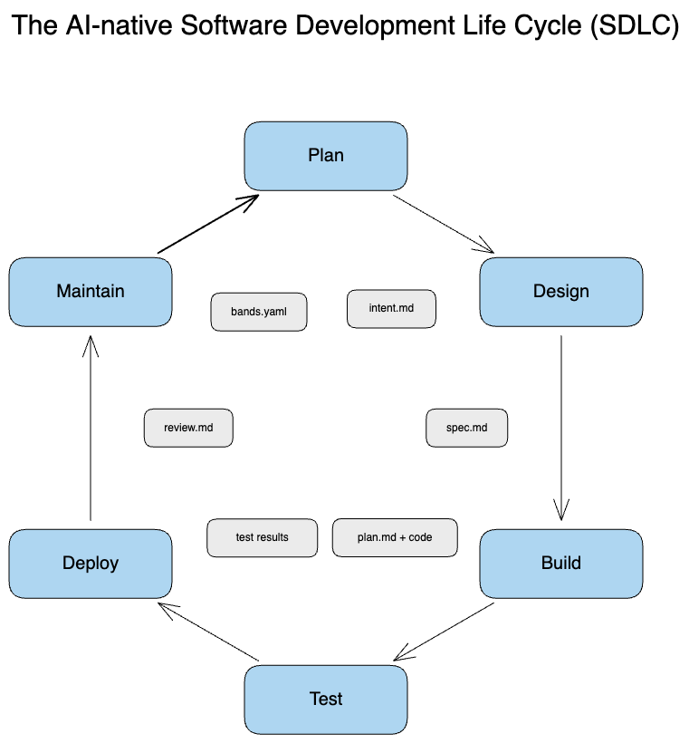
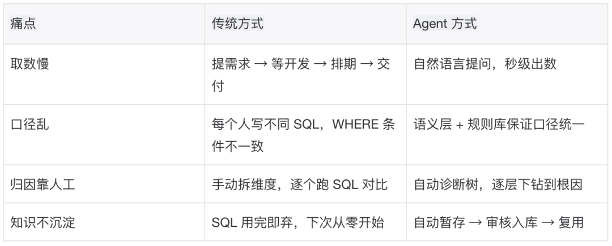
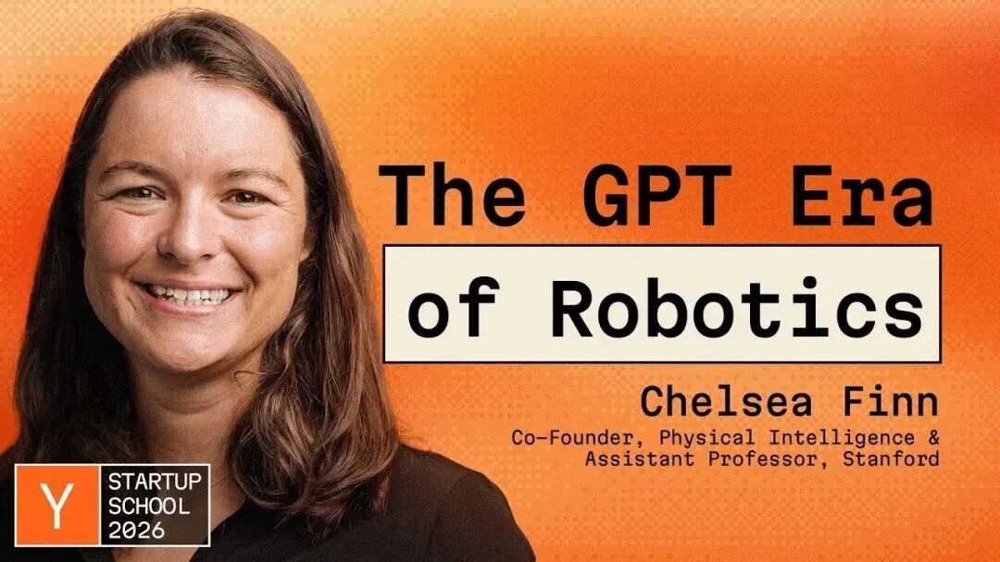
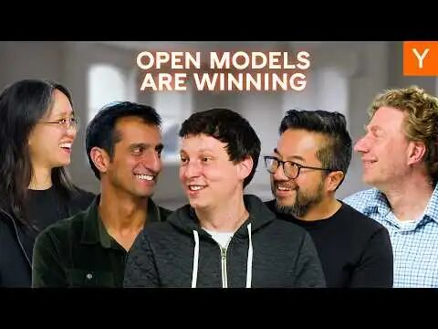
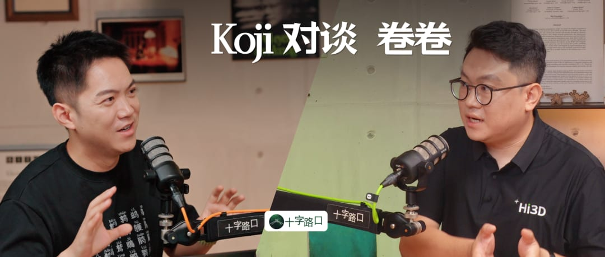
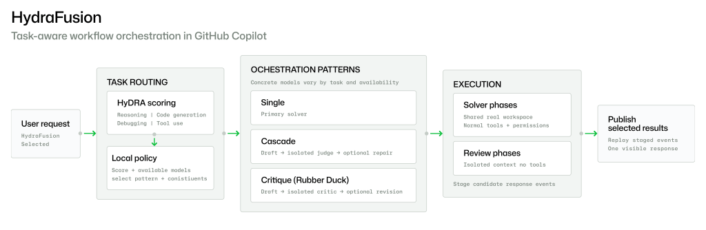

# BestBlogs 早报 · 09-05｜AI 原生 SDLC 重排，淘宝数据 Agent 查数，物理 AI 提升可靠性

BestBlogs.dev 是 AI 驱动的私人阅读助手。这是面向所有人的每日早报内容，如果你希望它基于你的兴趣和阅读习惯整理，可以体验「我的早报」。如需查看本期完整内容，可点击文末「阅读原文」。导语当 Agent 写代码快过人类审查，省下来的时间并不会自动变成交付速度。需求有没有被准确记录、测试能否及时给出证据、生产故障是否回到下一轮规划，会成为新的限制条件。freeCodeCamp 的实践指南把这个变化展开为一套六阶段工程流程。类似的问题也出现在更接近业务和现实世界的地方。淘宝百亿补贴团队没有让模型直接猜 SQL，而是先建立指标语义、规则与校验链路；Physical Intelligence 则把机器人是否可用，落实到长期自主运行、记忆和跨任务泛化。过去三天的早报分别谈过编码 Agent 成本、Harness、组织知识、世界模型与视频理解。今天可以沿一条更具体的阅读路径继续：先看流程怎样保存意图，再看知识怎样约束行动，最后看系统如何从真实执行的失败中学习。★ 精讲一：AI 原生工程实战：Claude Code、Codex 与 Gemini 贯穿软件生命周期来源：freeCodeCamp · BestBlogs 评分：92这篇 freeCodeCamp 指南从一个已经发生的错位出发：AI 辅助编码正在成为默认工作方式，但许多团队仍沿用为人工编码设计的软件生命周期。文章引用 DORA 的 2025 年调查，90% 的开发者已经在工作中使用 AI，超过 80% 认为生产力提高，同时约三成仍对生成代码缺乏信任。生成变快与交付可信，是两个不同的问题。作者沿用 Anthropic 应用 AI 团队的 AI 原生 SDLC 框架，把研发拆成 Plan、Design、Build、Test、Deploy、Maintain 六个阶段。它与传统流程最明显的区别，不是让 Agent 参与更多步骤，而是要求每一步留下能够被下一步读取和检查的工件，并让生产反馈重新触发规划。Plan 先用intent.md保存请求者原本要解决的问题，避免团队过早把需求解释成某个方案。Design 再把意图转成spec.md，明确接口、约束、取舍与尚未解决的疑问。Build 根据获批的plan.md修改指定文件，并提前写清修改顺序与验证方法。Agent 因此不是从一句临时提示自由发挥，而是在经过人工确认的目标内执行。Test 和 Deploy 把可信度变成可执行规则。文章建议让测试在每次文件修改后运行，把失败结果直接交回 Agent，而不是在构建结束后等待人工集中排错。部署阶段则让另一组检查依据规格与计划审查变更，并把权限、审批和回滚要求写进持续集成流程。绿色结果需要对应具体提交和具体测试，不能只留下一个无法追溯的状态。Maintain 是闭环真正成立的地方。监控配置记录哪些指标越界，一旦出现生产问题，系统生成事件记录，并据此起草新的intent.md。这样，故障不再停留在一次告警或周一才想起来的待办，而会成为下一轮规划的输入。图中的回箭头，比任何单阶段的自动化都更能解释这套方法的增量。文章还把同一框架映射到 Claude Code、Codex 与 Gemini CLI 的配置、只读规划模式、权限和 CI 示例。这里应把它理解为实践者对三种工具的对照实现，而不是三家厂商共同制定的标准；文中一名工程师覆盖原五人工作量的案例，也取决于任务边界和组织条件。9 月 3 日的早报讨论过 GitHub 如何优化编码 Agent 成本，9 月 4 日又介绍 Harness 与 Meta 的组织知识实践。这篇文章把两条线补成端到端流程。团队可以先选择一个高返工阶段，记录等待时间、缺陷逃逸和恢复成本，再决定是否扩展 Agent。读者最终需要保留的判断是：AI 原生研发的目标不是写出更多代码，而是让意图、证据与生产反馈始终可追溯。★ 精讲二：淘宝百亿补贴数据分析助手 Agent 实战来源：大淘宝技术 · BestBlogs 评分：91用户问「昨天 GMV 多少」，一个企业数据 Agent 不能只返回语法正确的 SQL。它还要找到正确的表，确认指标定义，补上业务必需的过滤条件，执行查询，并判断用户是否需要环比或归因。淘宝百亿补贴团队把这条行动链作为系统起点，目标是覆盖找表、取数、血缘追踪、波动分析与 Python 分析，而不是只做 Text to SQL。系统入口先用一次模型调用识别意图、时间、指标和维度，再由 Supervisor 注入日期、读取记忆并分发给取数、分析、运维等专业 Agent。多 Agent 的作用是缩小每个角色可见的工具与指令范围，减少一个大提示同时管理几十个工具时的选择混乱。模型调用失败时，意图识别还能够退回关键词与规则解析。执行层采用 ReAct 循环。以比较两天 GMV 为例，Agent 先搜索指标所在表，再查该表对应的业务规则，然后生成查询、执行查询，最后按问题决定是否调用 Python 计算环比。每一步都能读取上一步结果并调整动作，因此它既不是一条固定流水线，也不是不受约束的自由探索。最关键的技术选择是 NL2MDL2SQL。WrenAI 的 MDL 语义层预先描述表、字段、指标、关联关系和计算口径，模型先把自然语言映射到业务语义，再生成 SQL。某张表必须带上的活动类型条件，不再依赖模型从模糊上下文猜测，而由规则与语义层明确提供。生成结果还会经过 SQL Validator Gate，检查语法、表名与字段是否合法。团队把知识分成表结构、语义模型、SQL 片段、规则、血缘和会话记忆六层，并为知识沉淀安排人工审核。血缘解析可以把 SQL 抽象语法树转成表与字段关系；回归框架覆盖 45 张真实表、296 个节点，回答评测目前覆盖 6 类意图、15 个用例。这些规模来自团队披露，价值在于看见知识、执行与评测如何相互连接。性能也会改变 Agent 是否可用。文章称，递归下钻时一次分析可能执行 5 到 10 次查询，原先每次走 ODPS 需要 30 到 120 秒，整体等待可能超过 10 分钟；接入 Hologres 外部表后，单次查询缩短到 3 到 10 秒。它是特定数据栈中的团队实测，不应外推为通用性能承诺，却说明了端到端体验常被工具层延迟决定。9 月 3 日的淘宝研发实践关注 Agent 如何参与工程，9 月 4 日的 Meta 案例关注专家知识怎样被组织复用。今天这篇更进一步，把业务语义变成 Agent 行动前的契约。企业团队可以从一个高频问题开始，先整理指标口径、可访问数据、校验规则和可回放用例，再扩大自动化范围。先治理确定性知识，再让 Agent 处理不确定步骤，是比单纯换模型更稳健的建设顺序。★ 精讲三：Physical Intelligence 联创 Chelsea Finn：物理 AI 已经走到自己的 GPT 时刻来源：十字路口Crossing · BestBlogs 评分：90Physical Intelligence 联合创始人 Chelsea Finn 在演讲中提出，机器人真正进入现实世界需要三个条件：可靠性、记忆，以及无需为每项任务单独微调的通用模型。她把当前阶段称为物理 AI 的「GPT 时刻」，这是演讲者对技术位置的判断，而不是机器人已经获得类似聊天产品的大规模分发。物理 AI 与推荐、聊天或编码系统的差异，在于模型会直接改变现实环境。软件建议出错时，用户通常可以拒绝、撤销或重做；机器人端起杯子、使用工具或整理物品时，错误可能立即产生物理后果。因此，单次成功视频只能证明任务可完成，连续运行、恢复失败和跨场景表现才更接近部署标准。团队用制作拿铁检验可靠性。机器人需要锁紧冲煮手柄、等待萃取、倒入奶泡，再把接近满杯的拿铁平移到杯垫上。Physical Intelligence 表示，策略连续运行了 13 小时；在浓缩咖啡任务上成功率超过 90%。这些结果来自公司自测，但测试方式给出了比一次演示更有意义的观察维度。训练方法把人的介入用在恢复而非持续遥控。机器人若反复尝试一条失败路径，继续采样只会积累低价值经验；操作员可以在关键位置示范怎样脱困，让系统接回任务。随后，团队用多种机器人经验训练通用价值函数，估计当前状态离目标还有多远，而不是为同一个提示重复采样大量轨迹。演讲者称，强化学习阶段带来约 2 倍吞吐量。长任务还需要处理上下文成本。演讲给出的例子是，若把 10 秒、四路摄像头的高频画面直接送入模型，输入会迅速膨胀。团队因此使用多时间尺度记忆：短期保留更细的视频变化，更早的经历则压缩成文本摘要。借助这套机制，机器人可以在 10 到 15 分钟内完成清理厨房等多步骤任务，同时记住目标、已完成步骤和眼前状态。最后是通用模型 π0.7。团队把记忆、任务指令、子任务指令与数据质量等元信息共同输入一个模型，并可用子目标图像提示短期目标状态。公司报告，未经逐任务强化学习微调的 π0.7，在多类内部任务上达到或超过若干专用模型。这个结果需要更多外部复现，但它把评估问题从「会不会一个动作」推进到「同一模型能否换任务仍然有效」。9 月 2 日早报的世界模型关注环境表示，9 月 3 日的视频理解关注感知成本，今天的演讲补上经验回流、长时记忆与自主可靠性。判断机器人进展时，可以少问一次视频是否惊艳，多问三个可比较的问题：能连续运行多久，偏离后怎样恢复，换任务或换硬件后还能否工作。这套问题比「GPT 时刻」的标签，更能帮助读者追踪物理 AI 的真实进度。速览LangChain 中的 MCP：无状态协议、信息追问及更多新特性！来源：LangChain Blog · BestBlogs 评分：91LangChain 更新 MCP 支持以适配新的无状态协议，并将能力移入主包langchain.mcp。过去工具调用通常先建立会话，后续请求携带会话编号，客户端容易被绑定到签发编号的服务实例；无状态请求更适合横向扩展和失败恢复。新版基于 FastMCP 客户端处理传输、认证、连接与协议协商，同时加入客户端工具目录缓存，避免每次运行重复获取列表。服务器需要补充参数时，可以通过 LangGraph interrupt 暂停调用，等用户回答后把请求作为可重试的一轮继续执行。升级价值不只在接口迁移，而在长流程 Agent 的连接状态更少、追问路径更清晰。团队评估时应一起检查旧服务兼容、缓存何时失效，以及中断后如何恢复，才能判断协议变化是否真正减少运行复杂度。开源模型正在重塑企业 AI 的成本与基础设施来源：Y Combinator · BestBlogs 评分：89Y Combinator 采访 Ollama 联合创始人兼首席执行官，讨论开源模型为何进入更多企业工作负载。他观察到，编程 Agent 与 AI 助手正在推高 Token 需求，组织也开始在本地、云端、开源模型和前沿闭源模型之间组合选择。开源方案提供的不只是较低单价，还包括部署控制、硬件选择、数据边界与针对负载优化的空间。混合路由可以让常见任务先使用成本较低的模型，遇到复杂问题再升级；与此同时，安全、模型更新、容量管理与利用率会进入总成本。这些判断来自 Ollama 平台方的业务视角，具体收益仍取决于企业自己的任务和运维能力。更值得跟踪的变化是，竞争重点正从获得单一模型额度，转向是否能可靠运营多模型与 Agent，并用端到端任务成本而非标价做决策。推出 K2 Horizon：前沿性能，极致开源来源：Hacker News · BestBlogs 评分：91基础模型研究所发布 K2 Horizon，由 6 个模型组成，规模覆盖 0.9B 到 375B。发布方称，小尺寸模型在各自级别的推理、数学、编码与 Agent 任务上有较强表现；这些性能结论主要来自官方评测，后续仍需要独立复现。这次发布更稀缺的信息在训练生命周期。团队开放最终权重、代码、中间检查点、训练配置、细粒度日志、评测结果，以及能够发布的数据或详细构造配方，并披露预训练、推理后训练与 Agent 后训练过程，还介绍了 MoVA 和 Uno Diffusion 等设计。研究者因此不只拿到一个可运行模型，还能比较能力在哪个训练阶段出现，检查数据混合与后训练选择，并设计更有针对性的复现实验。对于重视可审计与可修改的团队，开放过程的颗粒度可能和最终榜单名次同样重要。Hi3D 创业实战：AI 3D 如何进入制造业生产管线来源：十字路口Crossing · BestBlogs 评分：90十字路口对数美万物创始人的长访谈，从 Hi3D 3.0 延伸到团队建设制造业操作系统的设想。访谈最具体的增量，是把「生成三维资产」与「交付可生产商品」区分开来：一个视觉上成立的模型，还不是工厂能够直接使用的结果。进入生产后，系统需要拆件、设计连接结构、适配材料与设备，也要把毛绒曲面展开为纸样，把图像转换成刺绣机可识别的针迹。随后还有高并发订单、差异化生产、质量控制和履约，这些环节共同决定创意能否变成实物。因此，模型后的工程管线不是附加工作，而是产品价值的重要组成。AI 3D 团队可以用可制造率、返工率、交付时间和复用程度来衡量进展；把模型、工具、工厂与交易连接起来，才有机会让生成能力进入稳定业务。Project HydraFusion：通过多模型编排实现前沿质量来源：The GitHub Blog · BestBlogs 评分：90GitHub 发布研究预览 Project HydraFusion，让 Copilot CLI 在运行时选择三类工作流：单模型直接完成，较便宜模型先答并按质量门升级，或由不同模型家族的只读批评者审查草稿后再修订。用户选择一个入口，路由、成本与延迟权衡由系统处理。GitHub 报告，HydraFusion 在 TerminalBench 2.1 上相对固定使用 Claude Opus 5，验证质量提高 4.9 个百分点，估算成本降低 67%。这组固定策略还使用 Claude Opus 5 与 GPT 5.6 Sol，在 TerminalBench 2.1、DeepSWE 和厂商内部基准 CheckpointBench 上反复调优，因此不是一次独立的单一基准留出测试。研究预览真正可迁移的部分，是把路由、复核、升级和失败回退做成显式策略，再用自己的任务分布衡量质量、总成本与延迟。多模型并不会天然胜过单模型，编排价值来自能够识别哪些任务值得增加一次审查或调用更强推理。Anthropic 用 Lean 自动形式化费马大定理来源：Hacker News · BestBlogs 评分：91Anthropic 研究团队公布了一个由计算机检查的费马大定理完整形式化证明。官方称，Claude 在 11 天内大体自主工作，沿着既有证明路线，把人类数学论证转写为 Lean 能够逐步验证的形式，而不是重新发现费马大定理的纸面证明。项目使用多 Agent Harness 分解中间定理，并以 Lean 检查最终结果。Anthropic 披露，系统生成约 1300 万行 Lean，在最终证明中使用 29500 个中间定理；人类主要提供少量高层优先级指示。证明还依赖 Mathlib、既有形式化项目与数学共同体长期积累。这项工作的读者价值在于观察模型与确定性验证器怎样协作。语言模型负责拆解与搜索，Lean 对每一步逻辑进行机器检查；即使生成过程很长，可信度仍能落到可复验的证明对象上。这种模式也可能迁移到规格验证和高风险代码审查。#700.Ajay Mehta：AI 应用如何从情感陪伴突围，在 TikTok 时代跑出增长曲线来源：跨国串门儿计划 · BestBlogs 评分：90Portola AI 联合创始人分享了陪伴应用 Tolan 的产品与增长经历。团队把角色设计成友好、非恋爱导向的外星朋友，并称核心用户主要是 15 到 25 岁女性。许多人用它讨论日常生活、作业、做饭或关系问题，而不是替代现实社交。产品把低延迟语音、持续记忆和个性化 Onboarding 组合起来。问卷答案会进入后续记忆，让角色在未来对话中重新提起用户关心的事；团队再与 TikTok 创作者合作，把做饭、学习和情感话题变成具体使用场景。创始人还分享了累计 1000 万美元融资。用户画像、增长与融资信息来自创始人访谈，适合作为消费产品案例理解。它的可迁移判断是，模型 API 只是起点，关系定位、首次体验、语音延迟、记忆质量与内容渠道需要共同工作；评估这类产品时，长期留存比一次爆款视频更接近真实价值。延伸探索流程、知识与可靠性。freeCodeCamp 的工件闭环、淘宝的语义与校验、Physical Intelligence 的经验回流，分别处理目标、依据和行动结果。读者可以用同一张检查表审视自己的 Agent：任务意图是否保存，关键知识能否溯源，权限是否受控，失败是否产生下一轮可用数据。协议、模型与编排。LangChain 的无状态 MCP 关注工具连接，Ollama 访谈关注模型组合，K2 Horizon 提供更完整的开放训练材料，HydraFusion 则尝试动态安排多个模型。把它们连起来读，可以从一次调用的成本，走向整套 Agent 系统的可运维性与可审计性。从数字世界到实体生产。世界模型、视频理解、机器人记忆与 AI 3D 管线分别覆盖环境表示、感知、行动和制造。下一步值得比较的不是谁的视频更吸引人，而是系统能否在不同环境中持续工作，错误恢复需要多少人工，以及输出是否真正进入生产。可验证与可留存。Lean 形式化证明用机器检查增强长时 Agent 的可信度，Tolan 则用持续记忆和关系体验争取用户留存。两者场景差异很大，却都提醒我们：一次生成只是开始，结果能否被验证或在下一次交互中发挥作用，决定了能力能否积累。今日小结回顾今天的内容，AI 原生 SDLC 用工件和反馈重排研发，淘宝数据 Agent 用语义、规则与校验约束分析，Physical Intelligence 则用长期运行、记忆和通用模型检验机器人自主性。后面的七篇把协议、模型、编排、制造、数学验证与消费体验补到这条实践路径上。如果你正在建设企业 Agent，可以先读淘宝与 freeCodeCamp，再用 MCP 和 HydraFusion 检查工具连接与模型路由；如果关注机器人和制造，先读 Physical Intelligence 与 Hi3D。想研究模型开放、验证或消费 AI，则可以分别从 K2 Horizon、Lean 形式化和 Tolan 开始。你的系统目前最薄弱的是意图保存、知识质量、执行可靠性，还是结果验证？如果要让 Agent 连续工作十倍更久，你会先增加模型能力，还是先改流程与恢复机制？欢迎把这份早报分享给正在做相关项目的同事，一起讨论可复用的判断方法。👉 近期早报BestBlogs 早报 · 09-04｜GPT-6 Astra 披露安全，Paul Graham 谈创业，曾鸣论产业BestBlogs 早报 · 09-03｜Gemini 3.8 升级，Claude 构建电商智能体，GitHub 降本BestBlogs 早报 · 09-02｜Astra 达阈值，提升 Claude 安全，Gemini 视频理解降本BestBlogs 精选周刊 第 110 期：新的稀缺BestBlogs 精选周刊第 109 期：程序员的职业未来BestBlogs 精选周刊第 108 期：智能的执行层BestBlogs 是 AI 驱动的私人阅读助手，帮助你发现真正适合你的高质量内容，关注你感兴趣的来源和主题，每天生成一份更适合自己的「我的早报」，欢迎体验和关注我们。👇 点击「阅读原文」查看完整早报内容

BestBlogs.dev 是 AI 驱动的私人阅读助手。这是面向所有人的每日早报内容，如果你希望它基于你的兴趣和阅读习惯整理，可以体验「我的早报」。如需查看本期完整内容，可点击文末「阅读原文」。

## 导语

当 Agent 写代码快过人类审查，省下来的时间并不会自动变成交付速度。需求有没有被准确记录、测试能否及时给出证据、生产故障是否回到下一轮规划，会成为新的限制条件。freeCodeCamp 的实践指南把这个变化展开为一套六阶段工程流程。

类似的问题也出现在更接近业务和现实世界的地方。淘宝百亿补贴团队没有让模型直接猜 SQL，而是先建立指标语义、规则与校验链路；Physical Intelligence 则把机器人是否可用，落实到长期自主运行、记忆和跨任务泛化。

过去三天的早报分别谈过编码 Agent 成本、Harness、组织知识、世界模型与视频理解。今天可以沿一条更具体的阅读路径继续：先看流程怎样保存意图，再看知识怎样约束行动，最后看系统如何从真实执行的失败中学习。

## ★ 精讲一：AI 原生工程实战：Claude Code、Codex 与 Gemini 贯穿软件生命周期

> 来源：freeCodeCamp · BestBlogs 评分：92

来源：freeCodeCamp · BestBlogs 评分：92

这篇 freeCodeCamp 指南从一个已经发生的错位出发：AI 辅助编码正在成为默认工作方式，但许多团队仍沿用为人工编码设计的软件生命周期。文章引用 DORA 的 2025 年调查，90% 的开发者已经在工作中使用 AI，超过 80% 认为生产力提高，同时约三成仍对生成代码缺乏信任。生成变快与交付可信，是两个不同的问题。

作者沿用 Anthropic 应用 AI 团队的 AI 原生 SDLC 框架，把研发拆成 Plan、Design、Build、Test、Deploy、Maintain 六个阶段。它与传统流程最明显的区别，不是让 Agent 参与更多步骤，而是要求每一步留下能够被下一步读取和检查的工件，并让生产反馈重新触发规划。

Plan 先用intent.md保存请求者原本要解决的问题，避免团队过早把需求解释成某个方案。Design 再把意图转成spec.md，明确接口、约束、取舍与尚未解决的疑问。Build 根据获批的plan.md修改指定文件，并提前写清修改顺序与验证方法。Agent 因此不是从一句临时提示自由发挥，而是在经过人工确认的目标内执行。

Test 和 Deploy 把可信度变成可执行规则。文章建议让测试在每次文件修改后运行，把失败结果直接交回 Agent，而不是在构建结束后等待人工集中排错。部署阶段则让另一组检查依据规格与计划审查变更，并把权限、审批和回滚要求写进持续集成流程。绿色结果需要对应具体提交和具体测试，不能只留下一个无法追溯的状态。

Maintain 是闭环真正成立的地方。监控配置记录哪些指标越界，一旦出现生产问题，系统生成事件记录，并据此起草新的intent.md。这样，故障不再停留在一次告警或周一才想起来的待办，而会成为下一轮规划的输入。图中的回箭头，比任何单阶段的自动化都更能解释这套方法的增量。

文章还把同一框架映射到 Claude Code、Codex 与 Gemini CLI 的配置、只读规划模式、权限和 CI 示例。这里应把它理解为实践者对三种工具的对照实现，而不是三家厂商共同制定的标准；文中一名工程师覆盖原五人工作量的案例，也取决于任务边界和组织条件。

9 月 3 日的早报讨论过 GitHub 如何优化编码 Agent 成本，9 月 4 日又介绍 Harness 与 Meta 的组织知识实践。这篇文章把两条线补成端到端流程。团队可以先选择一个高返工阶段，记录等待时间、缺陷逃逸和恢复成本，再决定是否扩展 Agent。读者最终需要保留的判断是：AI 原生研发的目标不是写出更多代码，而是让意图、证据与生产反馈始终可追溯。

## ★ 精讲二：淘宝百亿补贴数据分析助手 Agent 实战

> 来源：大淘宝技术 · BestBlogs 评分：91

来源：大淘宝技术 · BestBlogs 评分：91

用户问「昨天 GMV 多少」，一个企业数据 Agent 不能只返回语法正确的 SQL。它还要找到正确的表，确认指标定义，补上业务必需的过滤条件，执行查询，并判断用户是否需要环比或归因。淘宝百亿补贴团队把这条行动链作为系统起点，目标是覆盖找表、取数、血缘追踪、波动分析与 Python 分析，而不是只做 Text to SQL。

系统入口先用一次模型调用识别意图、时间、指标和维度，再由 Supervisor 注入日期、读取记忆并分发给取数、分析、运维等专业 Agent。多 Agent 的作用是缩小每个角色可见的工具与指令范围，减少一个大提示同时管理几十个工具时的选择混乱。模型调用失败时，意图识别还能够退回关键词与规则解析。

执行层采用 ReAct 循环。以比较两天 GMV 为例，Agent 先搜索指标所在表，再查该表对应的业务规则，然后生成查询、执行查询，最后按问题决定是否调用 Python 计算环比。每一步都能读取上一步结果并调整动作，因此它既不是一条固定流水线，也不是不受约束的自由探索。

最关键的技术选择是 NL2MDL2SQL。WrenAI 的 MDL 语义层预先描述表、字段、指标、关联关系和计算口径，模型先把自然语言映射到业务语义，再生成 SQL。某张表必须带上的活动类型条件，不再依赖模型从模糊上下文猜测，而由规则与语义层明确提供。生成结果还会经过 SQL Validator Gate，检查语法、表名与字段是否合法。

团队把知识分成表结构、语义模型、SQL 片段、规则、血缘和会话记忆六层，并为知识沉淀安排人工审核。血缘解析可以把 SQL 抽象语法树转成表与字段关系；回归框架覆盖 45 张真实表、296 个节点，回答评测目前覆盖 6 类意图、15 个用例。这些规模来自团队披露，价值在于看见知识、执行与评测如何相互连接。

性能也会改变 Agent 是否可用。文章称，递归下钻时一次分析可能执行 5 到 10 次查询，原先每次走 ODPS 需要 30 到 120 秒，整体等待可能超过 10 分钟；接入 Hologres 外部表后，单次查询缩短到 3 到 10 秒。它是特定数据栈中的团队实测，不应外推为通用性能承诺，却说明了端到端体验常被工具层延迟决定。

9 月 3 日的淘宝研发实践关注 Agent 如何参与工程，9 月 4 日的 Meta 案例关注专家知识怎样被组织复用。今天这篇更进一步，把业务语义变成 Agent 行动前的契约。企业团队可以从一个高频问题开始，先整理指标口径、可访问数据、校验规则和可回放用例，再扩大自动化范围。先治理确定性知识，再让 Agent 处理不确定步骤，是比单纯换模型更稳健的建设顺序。

## ★ 精讲三：Physical Intelligence 联创 Chelsea Finn：物理 AI 已经走到自己的 GPT 时刻

> 来源：十字路口Crossing · BestBlogs 评分：90

来源：十字路口Crossing · BestBlogs 评分：90

Physical Intelligence 联合创始人 Chelsea Finn 在演讲中提出，机器人真正进入现实世界需要三个条件：可靠性、记忆，以及无需为每项任务单独微调的通用模型。她把当前阶段称为物理 AI 的「GPT 时刻」，这是演讲者对技术位置的判断，而不是机器人已经获得类似聊天产品的大规模分发。

物理 AI 与推荐、聊天或编码系统的差异，在于模型会直接改变现实环境。软件建议出错时，用户通常可以拒绝、撤销或重做；机器人端起杯子、使用工具或整理物品时，错误可能立即产生物理后果。因此，单次成功视频只能证明任务可完成，连续运行、恢复失败和跨场景表现才更接近部署标准。

团队用制作拿铁检验可靠性。机器人需要锁紧冲煮手柄、等待萃取、倒入奶泡，再把接近满杯的拿铁平移到杯垫上。Physical Intelligence 表示，策略连续运行了 13 小时；在浓缩咖啡任务上成功率超过 90%。这些结果来自公司自测，但测试方式给出了比一次演示更有意义的观察维度。

训练方法把人的介入用在恢复而非持续遥控。机器人若反复尝试一条失败路径，继续采样只会积累低价值经验；操作员可以在关键位置示范怎样脱困，让系统接回任务。随后，团队用多种机器人经验训练通用价值函数，估计当前状态离目标还有多远，而不是为同一个提示重复采样大量轨迹。演讲者称，强化学习阶段带来约 2 倍吞吐量。

长任务还需要处理上下文成本。演讲给出的例子是，若把 10 秒、四路摄像头的高频画面直接送入模型，输入会迅速膨胀。团队因此使用多时间尺度记忆：短期保留更细的视频变化，更早的经历则压缩成文本摘要。借助这套机制，机器人可以在 10 到 15 分钟内完成清理厨房等多步骤任务，同时记住目标、已完成步骤和眼前状态。

最后是通用模型 π0.7。团队把记忆、任务指令、子任务指令与数据质量等元信息共同输入一个模型，并可用子目标图像提示短期目标状态。公司报告，未经逐任务强化学习微调的 π0.7，在多类内部任务上达到或超过若干专用模型。这个结果需要更多外部复现，但它把评估问题从「会不会一个动作」推进到「同一模型能否换任务仍然有效」。

9 月 2 日早报的世界模型关注环境表示，9 月 3 日的视频理解关注感知成本，今天的演讲补上经验回流、长时记忆与自主可靠性。判断机器人进展时，可以少问一次视频是否惊艳，多问三个可比较的问题：能连续运行多久，偏离后怎样恢复，换任务或换硬件后还能否工作。这套问题比「GPT 时刻」的标签，更能帮助读者追踪物理 AI 的真实进度。

## 速览

### LangChain 中的 MCP：无状态协议、信息追问及更多新特性！

> 来源：LangChain Blog · BestBlogs 评分：91

来源：LangChain Blog · BestBlogs 评分：91

LangChain 更新 MCP 支持以适配新的无状态协议，并将能力移入主包langchain.mcp。过去工具调用通常先建立会话，后续请求携带会话编号，客户端容易被绑定到签发编号的服务实例；无状态请求更适合横向扩展和失败恢复。

新版基于 FastMCP 客户端处理传输、认证、连接与协议协商，同时加入客户端工具目录缓存，避免每次运行重复获取列表。服务器需要补充参数时，可以通过 LangGraph interrupt 暂停调用，等用户回答后把请求作为可重试的一轮继续执行。

升级价值不只在接口迁移，而在长流程 Agent 的连接状态更少、追问路径更清晰。团队评估时应一起检查旧服务兼容、缓存何时失效，以及中断后如何恢复，才能判断协议变化是否真正减少运行复杂度。

### 开源模型正在重塑企业 AI 的成本与基础设施

> 来源：Y Combinator · BestBlogs 评分：89

来源：Y Combinator · BestBlogs 评分：89

Y Combinator 采访 Ollama 联合创始人兼首席执行官，讨论开源模型为何进入更多企业工作负载。他观察到，编程 Agent 与 AI 助手正在推高 Token 需求，组织也开始在本地、云端、开源模型和前沿闭源模型之间组合选择。

开源方案提供的不只是较低单价，还包括部署控制、硬件选择、数据边界与针对负载优化的空间。混合路由可以让常见任务先使用成本较低的模型，遇到复杂问题再升级；与此同时，安全、模型更新、容量管理与利用率会进入总成本。

这些判断来自 Ollama 平台方的业务视角，具体收益仍取决于企业自己的任务和运维能力。更值得跟踪的变化是，竞争重点正从获得单一模型额度，转向是否能可靠运营多模型与 Agent，并用端到端任务成本而非标价做决策。

### 推出 K2 Horizon：前沿性能，极致开源

> 来源：Hacker News · BestBlogs 评分：91

来源：Hacker News · BestBlogs 评分：91

基础模型研究所发布 K2 Horizon，由 6 个模型组成，规模覆盖 0.9B 到 375B。发布方称，小尺寸模型在各自级别的推理、数学、编码与 Agent 任务上有较强表现；这些性能结论主要来自官方评测，后续仍需要独立复现。

这次发布更稀缺的信息在训练生命周期。团队开放最终权重、代码、中间检查点、训练配置、细粒度日志、评测结果，以及能够发布的数据或详细构造配方，并披露预训练、推理后训练与 Agent 后训练过程，还介绍了 MoVA 和 Uno Diffusion 等设计。

研究者因此不只拿到一个可运行模型，还能比较能力在哪个训练阶段出现，检查数据混合与后训练选择，并设计更有针对性的复现实验。对于重视可审计与可修改的团队，开放过程的颗粒度可能和最终榜单名次同样重要。

### Hi3D 创业实战：AI 3D 如何进入制造业生产管线

> 来源：十字路口Crossing · BestBlogs 评分：90

来源：十字路口Crossing · BestBlogs 评分：90

十字路口对数美万物创始人的长访谈，从 Hi3D 3.0 延伸到团队建设制造业操作系统的设想。访谈最具体的增量，是把「生成三维资产」与「交付可生产商品」区分开来：一个视觉上成立的模型，还不是工厂能够直接使用的结果。

进入生产后，系统需要拆件、设计连接结构、适配材料与设备，也要把毛绒曲面展开为纸样，把图像转换成刺绣机可识别的针迹。随后还有高并发订单、差异化生产、质量控制和履约，这些环节共同决定创意能否变成实物。

因此，模型后的工程管线不是附加工作，而是产品价值的重要组成。AI 3D 团队可以用可制造率、返工率、交付时间和复用程度来衡量进展；把模型、工具、工厂与交易连接起来，才有机会让生成能力进入稳定业务。

### Project HydraFusion：通过多模型编排实现前沿质量

> 来源：The GitHub Blog · BestBlogs 评分：90

来源：The GitHub Blog · BestBlogs 评分：90

GitHub 发布研究预览 Project HydraFusion，让 Copilot CLI 在运行时选择三类工作流：单模型直接完成，较便宜模型先答并按质量门升级，或由不同模型家族的只读批评者审查草稿后再修订。用户选择一个入口，路由、成本与延迟权衡由系统处理。

GitHub 报告，HydraFusion 在 TerminalBench 2.1 上相对固定使用 Claude Opus 5，验证质量提高 4.9 个百分点，估算成本降低 67%。这组固定策略还使用 Claude Opus 5 与 GPT 5.6 Sol，在 TerminalBench 2.1、DeepSWE 和厂商内部基准 CheckpointBench 上反复调优，因此不是一次独立的单一基准留出测试。

研究预览真正可迁移的部分，是把路由、复核、升级和失败回退做成显式策略，再用自己的任务分布衡量质量、总成本与延迟。多模型并不会天然胜过单模型，编排价值来自能够识别哪些任务值得增加一次审查或调用更强推理。

### Anthropic 用 Lean 自动形式化费马大定理

> 来源：Hacker News · BestBlogs 评分：91

来源：Hacker News · BestBlogs 评分：91

Anthropic 研究团队公布了一个由计算机检查的费马大定理完整形式化证明。官方称，Claude 在 11 天内大体自主工作，沿着既有证明路线，把人类数学论证转写为 Lean 能够逐步验证的形式，而不是重新发现费马大定理的纸面证明。

项目使用多 Agent Harness 分解中间定理，并以 Lean 检查最终结果。Anthropic 披露，系统生成约 1300 万行 Lean，在最终证明中使用 29500 个中间定理；人类主要提供少量高层优先级指示。证明还依赖 Mathlib、既有形式化项目与数学共同体长期积累。

这项工作的读者价值在于观察模型与确定性验证器怎样协作。语言模型负责拆解与搜索，Lean 对每一步逻辑进行机器检查；即使生成过程很长，可信度仍能落到可复验的证明对象上。这种模式也可能迁移到规格验证和高风险代码审查。

### #700.Ajay Mehta：AI 应用如何从情感陪伴突围，在 TikTok 时代跑出增长曲线

> 来源：跨国串门儿计划 · BestBlogs 评分：90

来源：跨国串门儿计划 · BestBlogs 评分：90

Portola AI 联合创始人分享了陪伴应用 Tolan 的产品与增长经历。团队把角色设计成友好、非恋爱导向的外星朋友，并称核心用户主要是 15 到 25 岁女性。许多人用它讨论日常生活、作业、做饭或关系问题，而不是替代现实社交。

产品把低延迟语音、持续记忆和个性化 Onboarding 组合起来。问卷答案会进入后续记忆，让角色在未来对话中重新提起用户关心的事；团队再与 TikTok 创作者合作，把做饭、学习和情感话题变成具体使用场景。创始人还分享了累计 1000 万美元融资。

用户画像、增长与融资信息来自创始人访谈，适合作为消费产品案例理解。它的可迁移判断是，模型 API 只是起点，关系定位、首次体验、语音延迟、记忆质量与内容渠道需要共同工作；评估这类产品时，长期留存比一次爆款视频更接近真实价值。

## 延伸探索

流程、知识与可靠性。freeCodeCamp 的工件闭环、淘宝的语义与校验、Physical Intelligence 的经验回流，分别处理目标、依据和行动结果。读者可以用同一张检查表审视自己的 Agent：任务意图是否保存，关键知识能否溯源，权限是否受控，失败是否产生下一轮可用数据。

协议、模型与编排。LangChain 的无状态 MCP 关注工具连接，Ollama 访谈关注模型组合，K2 Horizon 提供更完整的开放训练材料，HydraFusion 则尝试动态安排多个模型。把它们连起来读，可以从一次调用的成本，走向整套 Agent 系统的可运维性与可审计性。

从数字世界到实体生产。世界模型、视频理解、机器人记忆与 AI 3D 管线分别覆盖环境表示、感知、行动和制造。下一步值得比较的不是谁的视频更吸引人，而是系统能否在不同环境中持续工作，错误恢复需要多少人工，以及输出是否真正进入生产。

可验证与可留存。Lean 形式化证明用机器检查增强长时 Agent 的可信度，Tolan 则用持续记忆和关系体验争取用户留存。两者场景差异很大，却都提醒我们：一次生成只是开始，结果能否被验证或在下一次交互中发挥作用，决定了能力能否积累。

## 今日小结

回顾今天的内容，AI 原生 SDLC 用工件和反馈重排研发，淘宝数据 Agent 用语义、规则与校验约束分析，Physical Intelligence 则用长期运行、记忆和通用模型检验机器人自主性。后面的七篇把协议、模型、编排、制造、数学验证与消费体验补到这条实践路径上。

如果你正在建设企业 Agent，可以先读淘宝与 freeCodeCamp，再用 MCP 和 HydraFusion 检查工具连接与模型路由；如果关注机器人和制造，先读 Physical Intelligence 与 Hi3D。想研究模型开放、验证或消费 AI，则可以分别从 K2 Horizon、Lean 形式化和 Tolan 开始。

你的系统目前最薄弱的是意图保存、知识质量、执行可靠性，还是结果验证？如果要让 Agent 连续工作十倍更久，你会先增加模型能力，还是先改流程与恢复机制？欢迎把这份早报分享给正在做相关项目的同事，一起讨论可复用的判断方法。

## 👉 近期早报

BestBlogs 早报 · 09-04｜GPT-6 Astra 披露安全，Paul Graham 谈创业，曾鸣论产业

BestBlogs 早报 · 09-03｜Gemini 3.8 升级，Claude 构建电商智能体，GitHub 降本

BestBlogs 早报 · 09-02｜Astra 达阈值，提升 Claude 安全，Gemini 视频理解降本

BestBlogs 精选周刊 第 110 期：新的稀缺

BestBlogs 精选周刊第 109 期：程序员的职业未来

BestBlogs 精选周刊第 108 期：智能的执行层

BestBlogs 是 AI 驱动的私人阅读助手，帮助你发现真正适合你的高质量内容，关注你感兴趣的来源和主题，每天生成一份更适合自己的「我的早报」，欢迎体验和关注我们。

👇 点击「阅读原文」查看完整早报内容
