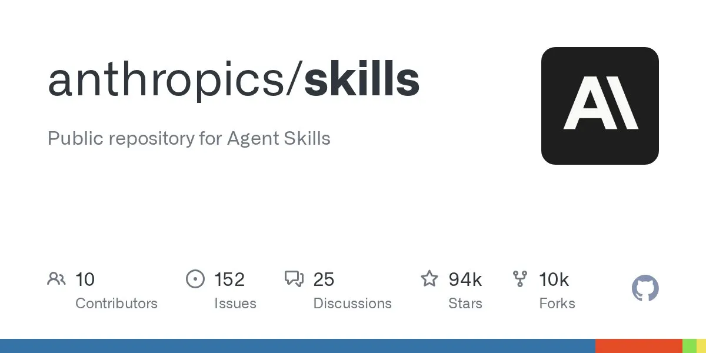
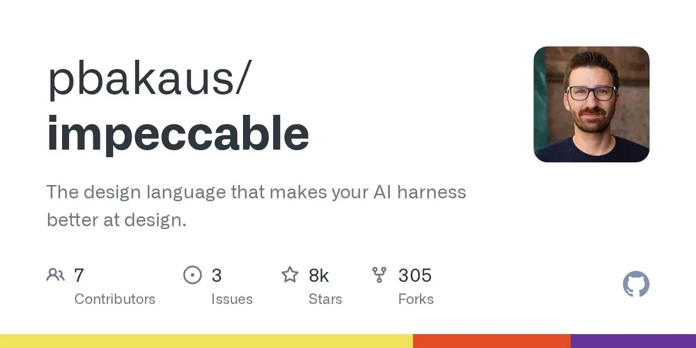
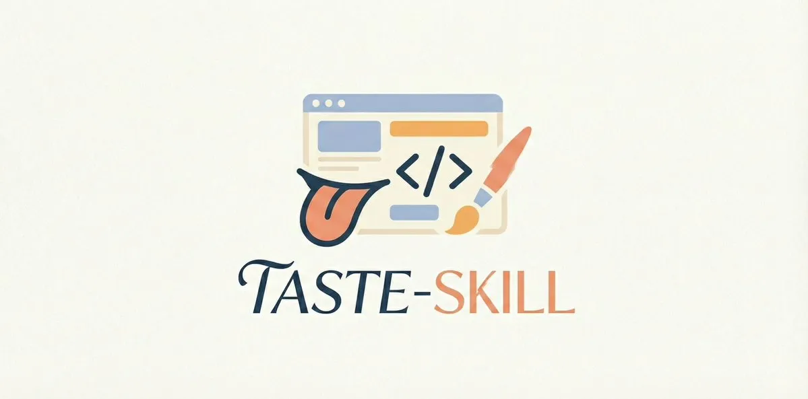
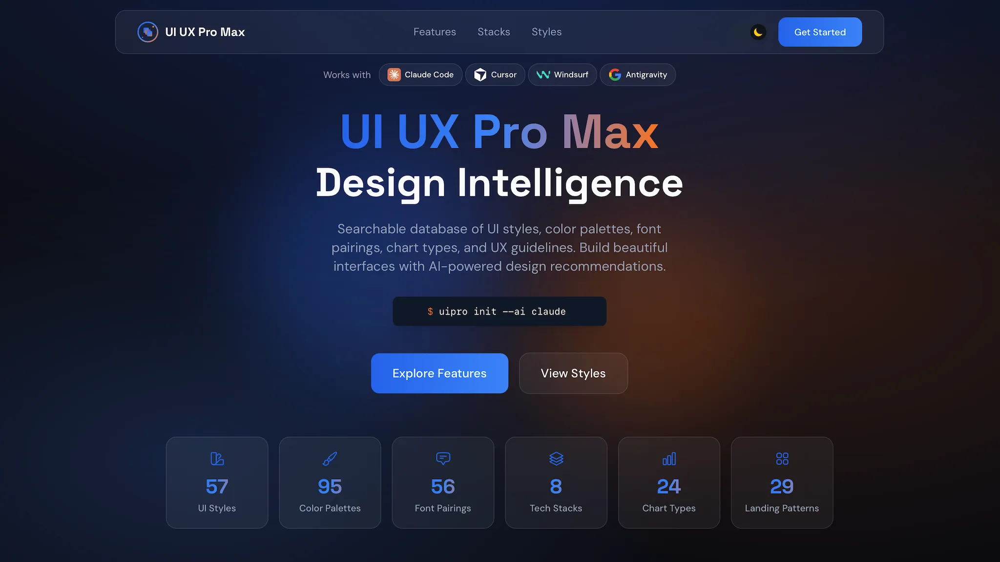
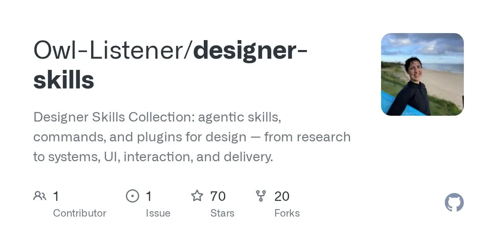
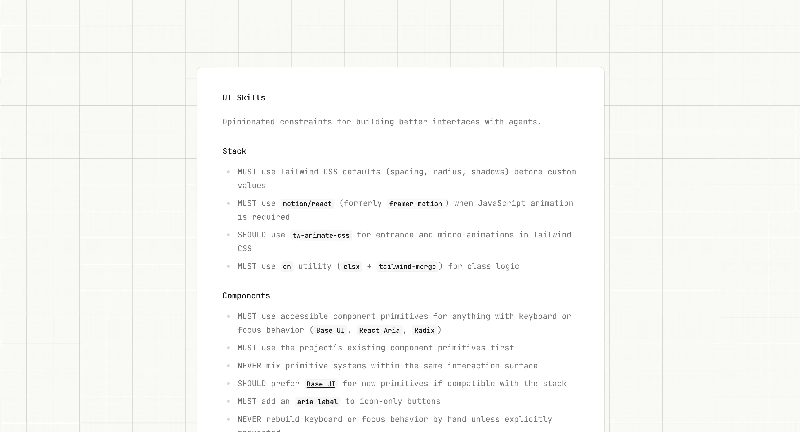
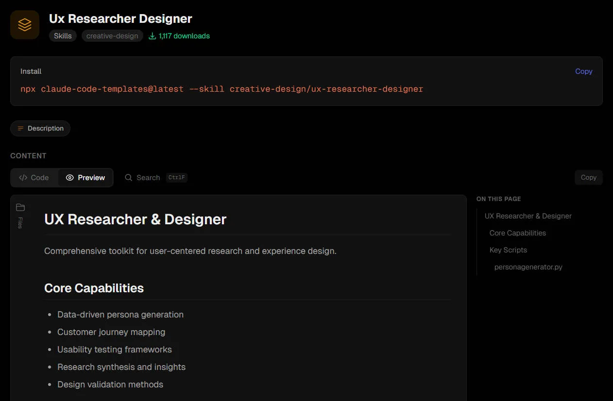
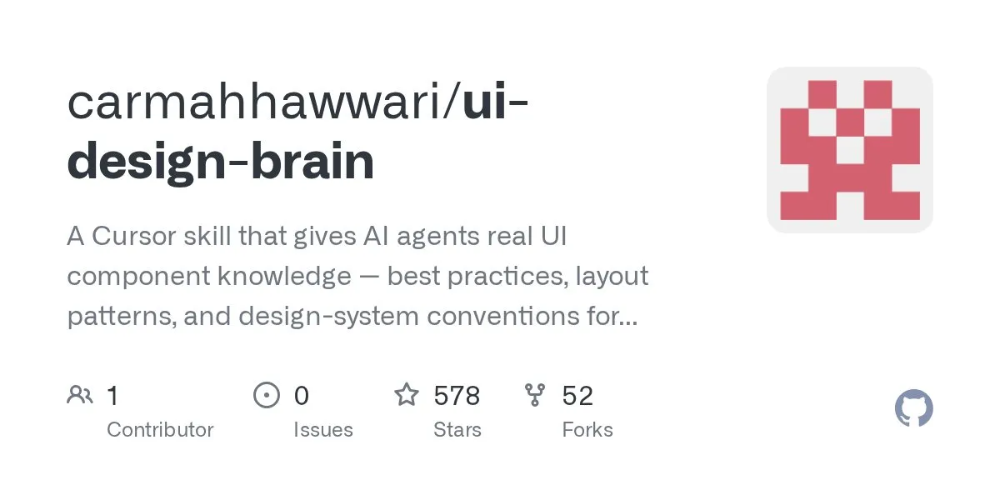

# 8 个优质的设计 Skills 解决 Vibe Coding 设计难题

> 涵盖创意方向、设计智能、质量合规和工程模式四大类别的顶级 Design Skills。

<!-- more -->

## 核心观点

AI 生成的项目设计通常有较多不足。Design Skills 不同于简单的提示模板，它更实用，包含完整设计理念、参考文档和实用脚本的技能包，能让 AI 扮演资深设计师、产品经理等多个角色进行思考和设计，让项目更像是经过团队深度打磨的作品。

**四大类别**：
- **创意方向**：帮助避免通用模板，生成独特设计
- **设计智能**：提供设计数据库和最佳实践参考
- **质量合规**：确保 WCAG 合规和性能优化
- **工程模式**：提供完整设计工作流程和研究方法论

---

## 8 个顶级 Design Skills

### 1. Anthropic Frontend Design

- **GitHub**：[github.com/anthropics/skills](https://github.com/anthropics/skills)
- **Stars**：96k+
- **安装**：`/plugin marketplace add anthropics/skills`

**核心理念**：在编写代码之前，先思考四个维度——目的、基调、约束、差异化。

**涵盖五个设计领域**：
- 排版：明确禁止 Inter、Roboto 等"被 AI 过度使用"的字体
- 颜色和主题：拒绝紫白配色老套路
- 动效：高影响力时刻优先
- 空间构图：不对称、重叠、打破网格
- 背景和视觉细节

**适用场景**：落地页、作品集、营销页面等需要视觉个性的场景。

### 2. Impeccable

- **GitHub**：[github.com/pbakaus/impeccable](https://github.com/pbakaus/impeccable)
- **Stars**：10k+
- **安装**：`npx skills add pbakaus/impeccable`

**核心特性**：Frontend Design 的增强版本，提供 17 个专门的设计命令。

**核心命令**：
- `/polish`：打磨细节
- `/audit`：审计设计问题
- `/distill`：提炼精华
- `/enhance`：增强视觉
- `/refine`：精细调整

**适用场景**：需要精确控制设计流程的专业开发者。

### 3. Taste Skill

- **GitHub**：[github.com/Leonxlnx/taste-skill](https://github.com/Leonxlnx/taste-skill)
- **Stars**：3.4K+
- **安装**：访问仓库获取详细安装说明

**核心理念**：专注于"让东西看起来和感觉昂贵"，涵盖高级设计的四个核心要素：
- 高级字体选择
- 宽阔的空白运用
- 层叠的卡片设计
- 流畅的弹簧动画和漂浮导航

**四个子技能**：
- taste-skill：前端设计核心
- redesign-skill：升级现有项目
- output-skill：强制 AI 写完整代码
- soft-skill：高端设计感的秘密武器

**适用场景**：品牌网站、奢侈品电商、创意机构作品集等追求高端奢华设计感的项目。

### 4. UI/UX Pro Max

- **GitHub**：[github.com/nextlevelbuilder/ui-ux-pro-max-skill](https://github.com/nextlevelbuilder/ui-ux-pro-max-skill)
- **Stars**：43K+
- **安装**：`/plugin marketplace add nextlevelbuilder/ui-ux-pro-max-skill`

**核心特性**：当前生态系统中最全面的设计智能技能，不只是给 AI 美学品味，而是给它一个可搜索的设计数据库。

**设计数据库**：
- 50+ UI 风格
- 97 种调色板
- 57 种字体搭配
- 99 条 UX 指南
- 25 种图表类型
- 覆盖 9 种技术栈

**无障碍类别排名第一**：确保最低 4.5:1 对比度、可见焦点环、描述性 alt 文本、ARIA 标签等。

**适用场景**：需要 AI 根据产品类型和行业做出明智设计决策的设计师和开发者。

### 5. Designer Skills

- **GitHub**：[github.com/Owl-Listener/designer-skills](https://github.com/Owl-Listener/designer-skills)
- **Stars**：164
- **安装**：`/plugin marketplace add Owl-Listener/designer-skills`

**核心特性**：完整的设计师工具箱，包含 63 个 skills 和 27 个命令，覆盖设计工作的全生命周期。

**涵盖 8 大设计领域**：
- 用户研究：访谈、问卷、画像
- 设计系统：组件库规范、Token 定义
- UX 策略：信息架构、用户旅程
- UI 设计：视觉设计、原型制作
- 交互设计：动效定义、微交互
- 原型测试：可用性测试、A/B 测试
- 设计运营：设计评审、版本管理
- 设计工具包：Figma 集成、设计交付

**适用场景**：全栈设计师、UX 团队。

### 6. UI Skills

- **GitHub**：[github.com/ibelick/ui-skills](https://github.com/ibelick/ui-skills)
- **Stars**：1K
- **安装**：`npx skills add ibelick/ui-skills`

**核心特性**：提供 15 个独立的专项 skills，每个都专注于一个具体的设计问题。模块化设计让你可以只安装需要的功能。

**包含的专项技能**：
- baseline-ui：Tailwind 设计一致性
- fixing-accessibility：无障碍审计与修复
- fixing-metadata：SEO 元数据优化
- fixing-motion-performance：动画性能优化
- 12-principles-of-animation：迪士尼动画原则应用
- responsive-design：响应式布局审计
- color-contrast：颜色对比度检查

**适用场景**：需要针对性解决特定 UI 问题、希望按需安装功能的开发者。

### 7. UX Researcher Designer

- **GitHub**：[github.com/davila7/claude-code-templates](https://github.com/davila7/claude-code-templates)
- **Stars**：23K+
- **安装**：`npx skills add davila7/claude-code-templates --skill ux-researcher-designer`

**核心特性**：专注于 UX 研究方法论和设计流程的技能。

**涵盖核心能力**：
- 用户研究方法论
- 可用性测试设计
- 用户旅程映射
- 信息架构规划
- 设计决策文档化

**适用场景**：UX 研究员、产品设计师、需要进行用户研究的开发团队。

### 8. UI Design Brain

- **GitHub**：[github.com/carmahhawwari/ui-design-brain](https://github.com/carmahhawwari/ui-design-brain)
- **Stars**：600+
- **安装**：下载或克隆仓库，将 md 文件放到 /skills 中

**核心特性**：60+ 组件最佳实践库，用来自 component.gallery 的精选知识库取代了 AI 的猜测。

**覆盖内容**：
- 60+ 组件：按钮、表单、导航、模态等
- 5 种设计风格：SaaS、极简、企业、创意、数据仪表盘
- 反模式库

**使用方式**：安装后，当你让 AI 构建 UI 时通常会自动激活，无需显式调用。只需自然描述需求，AI 会自动识别组件、查找最佳实践、应用合适风格，并生成可生产级代码。

**适用场景**：希望界面由"高级产品设计师"而非"模板拼装"完成的前端开发者。

---

## 最佳组合策略

最有效的策略是组合使用：

1. **先装 Frontend Design**：保证美学质量
2. **再加 UI/UX Pro Max**：提供设计智能
3. **最后用 UI Skills 的 accessibility 模块**：确保合规

它们不冲突，而是层层递进、互补提升。

---

## 相关资源

- [Claude Code UI/UX 设计最佳 18 款 Skill 指南](claude-code-18-ui-ux-design-skills)
- [Claude Design 的 10 个高级提示词](claude-design-10-prompts)
- [Design Auditor Skill 设计审计](products/design-auditor-skill)
