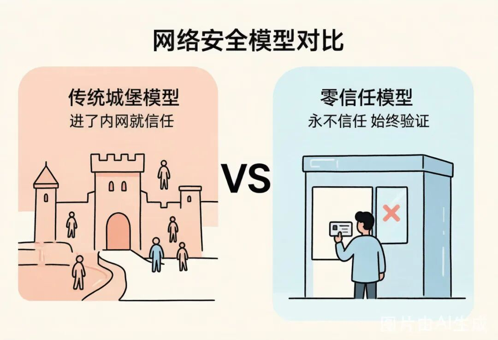
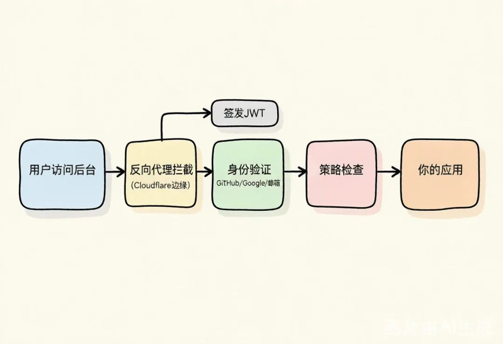
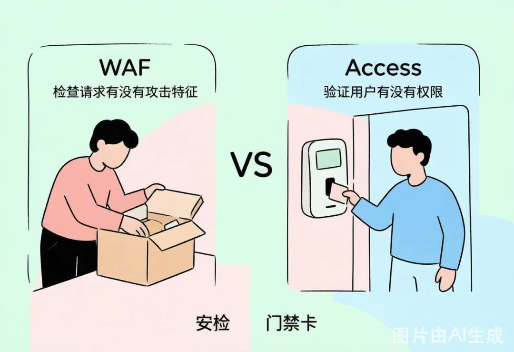
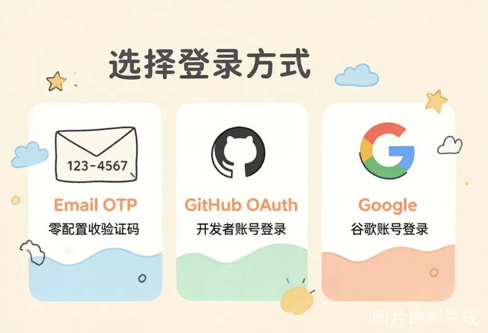
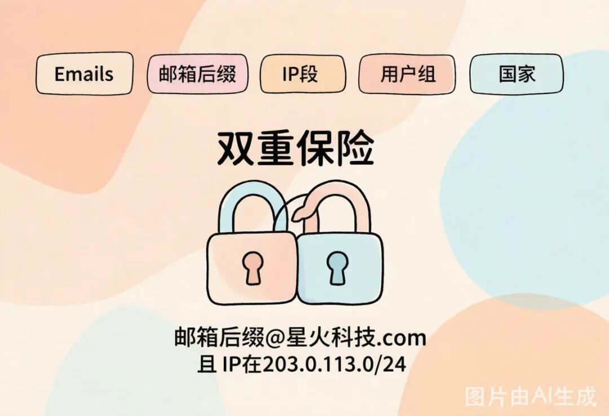
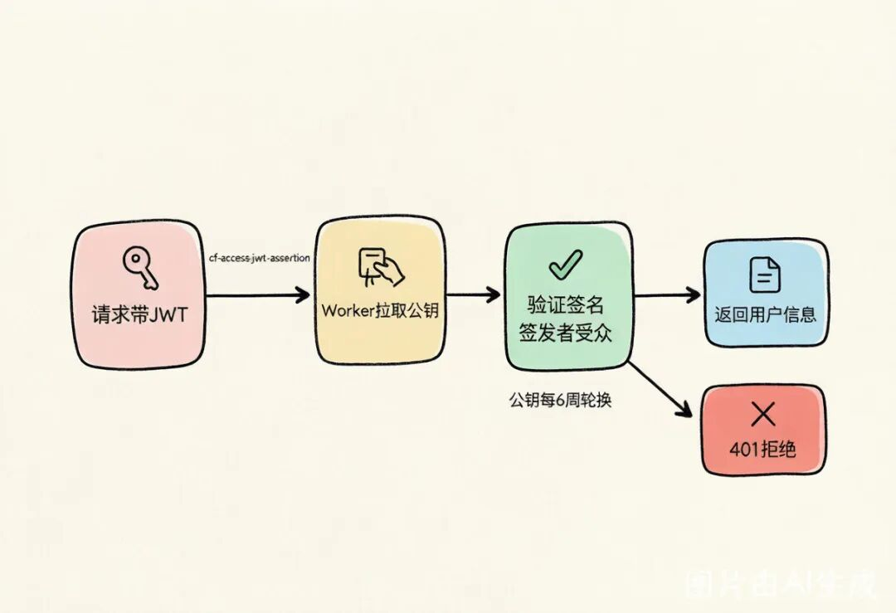

# 《林一的 Cloudflare 通关记》第 12 篇：后台不是谁都能进——Zero Trust Access 访问控制

《林一的 Cloudflare 通关记》第 12 篇故事引入WAF 配好以后，林一总算睡了个安稳觉。第二天到公司，发现老张已经在白板上画了个架构图。"看这儿，"老张指着图上的一个区块，"你的管理后台/admin，现在是裸奔状态。""没有啊，"林一不服气，"我有登录页面，用户名密码验证。""密码？你用的什么加密？""bcrypt……""密码强度策略呢？""至少 8 位……""暴力破解防护呢？""WAF 的速率限制……"老张摇了摇头："那如果你的密码数据库泄露了呢？如果员工在咖啡厅连了公共 WiFi，被中间人攻击截获了 token 呢？如果有人钓鱼邮件骗到了管理员的账号密码呢？"林一沉默了。"你写的那套登录系统，"老张拍了拍他的肩膀，"说实话，能跑，但安全性撑死是个'业余及格'。身份认证这种东西，自己写就是给自己挖坑。Cloudflare Access 免费就能搞定，而且比你自己写的安全一百倍。""又免费？"林一已经不惊讶了，"Cloudflare 到底有多少免费服务？""多到你用不完。"老张笑了笑，"今天教你一个新概念——零信任。"技术讲解什么是"零信任"——"永不信任，始终验证""先说一个你脑子里的旧观念，"老张在白板上画了一座城堡：┌─────────────────────────────┐│         城堡（内网）          ││                              ││   ┌──────┐  ┌──────┐         ││   │ 数据库 │  │ 后台  │         ││   └──────┘  └──────┘         ││                              ││      ┌──────────┐            ││      │  防火墙    │ ← 护城河   ││      └──────────┘            │└─────────────────────────────┘外面是危险的互联网"传统的安全模型就像城堡——外面是护城河（防火墙），一旦你进了城堡（登录了内网/VPN），就被信任了，可以在里面随便走。""这有什么问题？""问题大了。如果攻击者突破了护城河——不管是通过钓鱼邮件、密码泄露、还是 VPN 漏洞——一旦进了内网，就畅通无阻了。2013 年 Target 被黑，黑客就是先拿到了一家空调供应商的内网权限，然后横向移动到了 Target 的支付系统。""空调供应商？"林一瞪大了眼。"对，攻击者不需要直接攻破你，只要攻破你信任的某个人就行。所以零信任的核心思想是——永不信任，始终验证。不管你在内网还是外网，不管你是 CEO 还是实习生，每次访问都要验证身份和权限。"老张把城堡图擦掉，画了个新图：┌──────────────────────────────────────┐│        每个请求都要验证                 ││                                       ││   用户 ──→ [身份验证] ──→ [权限检查] ──→ 资源  ││              ↑              ↑          ││           你是谁？        你能干什么？    │└──────────────────────────────────────┘"简单说，城堡模型是'进了门就是自己人'，零信任是'进了门也得查身份证'。""这不就是每次都登录？那不烦死？""这就是 Cloudflare Access 聪明的地方——它把验证过程做成了无感的。用户登录一次，拿到一个 token，在有效期内访问任何被保护的应用都不用重新登录。但你作为管理员，可以随时吊销某个用户的访问权限。""听起来像 SSO（单点登录）？""本质上就是。但 Cloudflare Access 不需要你搭 SSO 服务器，不需要你维护 LDAP/Active Directory，配置几步就搞定。"国内类比：阿里云的 IDaaS（身份即服务）和腾讯云的身份管家类似，但通常需要付费或绑定企业版。Cloudflare Access 免费 50 个用户，对创业公司来说完全够用。Cloudflare Access 的工作原理"Access 到底怎么工作的？"林一问。老张画了张流程图：用户访问 admin.星火ai.com│▼┌──────────────┐│ Cloudflare   │  ← 反向代理拦截请求│ 边缘节点      │└──────┬───────┘│ 没有有效 token？重定向到登录页▼┌──────────────┐│ 身份验证      │  ← 用户通过 GitHub / Google / 邮箱验证码登录│ (IdP)        │└──────┬───────┘│ 验证通过，签发 JWT▼┌──────────────┐│ 策略检查      │  ← 检查用户是否匹配 Allow 策略└──────┬───────┘│ 策略通过，附带 JWT 转发请求▼┌──────────────┐│ 你的应用      │  ← 收到带 Cf-Access-Jwt-Assertion 的请求│ (Workers等)  │└──────────────┘"三步走：反向代理拦截 → 身份验证 → 策略检查。"""等等，"林一打断，"反向代理？这不就是我们前面配置 Cloudflare 代理模式时用的那套？""没错。Access 就是跑在 Cloudflare 边缘网络上的，不需要你额外装什么。只要你的域名托管在 Cloudflare 上（还记得第 1 篇说的吗？），Access 就能直接生效。""那身份验证呢？用谁的系统？""Cloudflare 不自己搞账号体系——它对接你已有的身份提供商（IdP）。GitHub、Google、GitLab、Okta、Azure AD、SAML……甚至邮箱验证码都行。你选哪个，用户就用哪个登录。""邮箱验证码？就是输入邮箱，收一个 6 位数验证码？""对。对创业公司来说，Email OTP 是最省事的——不需要配置 OAuth App，不需要搞企业目录，用户输入邮箱收验证码就登录了。"Access 和 WAF 有什么区别？"这不和 WAF 重复了？"林一问，"都是防护嘛。""完全不同的维度。"老张在白板上画了张表：WAFAccess防护对象面向公众的网站内部管理后台/工具防护方式拦截恶意请求（SQL注入、XSS等）验证用户身份，拒绝未授权访问判断依据请求内容（URL、参数、行为）用户身份（邮箱、IP、设备）核心问题"这个请求有没有攻击特征？""这个人有没有权限访问？""打个比方：WAF 是门口的安检——检查你包里有没有违禁品；Access 是门禁卡——没有卡你连门都进不去。两个都要。"实操指导第一步：创建 Zero Trust 团队"先建一个 Zero Trust 团队。"老张打开 Cloudflare Dashboard，"第一次用需要创建团队名。"1. 登录 Cloudflare Dashboard2. 左侧菜单点击Zero Trust3. 第一次进入会让你选择计划，选Free（免费版，50 用户）4. 输入团队名（Team Name），比如xinghuo⚠️注意：团队名一旦设置不能更改。它会成为你的 Zero Trust 域名的一部分：https://xinghuo.cloudflareaccess.com。后续在 Worker 中验证 JWT 时也需要用到这个域名。"搞定。现在你的 Zero Trust '组织'就建好了。"第二步：配置身份验证方式"先选好用什么方式登录。"老张点进Settings→Authentication。方式一：Email OTP（最快，推荐先用这个）1. 在 Authentication 页面找到One-time PIN2. 点击Edit，确认已启用就这样。用户登录时输入邮箱，Cloudflare 发一个 6 位验证码到邮箱，输入验证码就完成认证。零配置，马上能用。方式二：GitHub OAuth（技术团队推荐）"对于开发团队，用 GitHub 登录更方便——开发者本来就天天挂着 GitHub。"1. 去 GitHub Developer Settings[1]→OAuth Apps→New OAuth App2. 填写应用信息：• Application name:星火AI Access• Homepage URL:https://xinghuo.cloudflareaccess.com• Authorization callback URL:https://xinghuo.cloudflareaccess.com/cdn-cgi/access/callback3. 创建后拿到Client ID和Client Secret4. 回到 Cloudflare Zero Trust →Authentication→Add new→GitHub5. 填入 Client ID 和 Client Secret，保存方式三：Google（全员都有的话）同理，在 Google Cloud Console 创建 OAuth 2.0 凭据，回调地址填https://`<你的团队名>`.cloudflareaccess.com/cdn-cgi/access/callback，然后在 Cloudflare 里添加。"也可以同时开多个，"老张说，"用户登录时会看到一个选择页面，选哪个都行。"第三步：创建 Access 应用"现在把管理后台保护起来。"1. 进入Zero Trust→Access→Applications2. 点击Add an application3. 选择Self-hosted（自托管应用）4. 填写配置：字段填写内容说明Application name星火AI管理后台显示名称Session Duration24 hours登录有效期Domain选择admin.星火ai.com要保护的域名5. 在Public hostnames里添加要保护的路径：•admin.星火ai.com/*（保护整个管理后台）6. 下一步，创建策略第四步：配置访问策略"策略就是'谁能进来'的规则。"1. 在应用配置的Policy部分，点击Add a policy2. 策略名称：允许管理员3. Action（动作）：Allow（允许访问）4. 在Include规则里添加条件：规则类型值含义Emailszhang@星火科技.com老张的邮箱Emailslinyi@星火科技.com林一的邮箱"这样只有我和你的邮箱能通过验证。其他人即使拿到了正确的登录页面，邮箱不在白名单里也进不去。""那如果以后加人呢？""加一条规则就行。也可以用Emails ending in来匹配整个域名——所有@星火科技.com的邮箱都允许访问。"老张又补充了几种常用的策略规则：策略规则场景Emails指定具体邮箱Emails ending in指定整个邮箱后缀（域名）IP ranges限定 IP 段（如只允许办公室 IP）Groups按用户组授权（需要先在 Access 里建组）Country按国家/地区限制"你可以组合多个规则。比如'邮箱后缀是 @星火科技.com且IP 在 203.0.113.0/24 段内'——双重保险。""5. 保存策略，完成应用创建第五步：测试访问"来，试试。"老张让林一打开浏览器访问admin.星火ai.com。林一输入地址，页面自动跳转到了 Cloudflare Access 的登录页面：╔══════════════════════════════════════╗║         星火AI管理后台                ║║                                      ║║  选择登录方式：                        ║║                                      ║║  [邮箱验证码登录]                      ║║  [GitHub 登录]                        ║║  [Google 登录]                        ║║                                      ║╚══════════════════════════════════════╝林一选了 Email OTP，输入linyi@星火科技.com，30 秒后收到验证码，输入，跳转回管理后台。"搞定了！全程不到一分钟。""注意看你的请求头，"老张打开浏览器开发者工具，"Access 在每个请求里都加了一个Cf-Access-Jwt-Assertion的 Header，里面是一个 JWT Token。你的 Worker 可以读这个 Token 来获取当前登录的用户信息。"第六步：在 Worker 中验证用户身份"光有 Access 的前端拦截还不够，"老张严肃起来，"如果有人绕过 Access 直接访问你的 Worker API 怎么办？你的 Worker 必须验证这个 JWT 是不是合法的。""怎么验证？""Cloudflare 官方推荐用jose这个 NPM 包来验证 JWT。原理是——Access 用私钥签名 JWT，你用公钥验证签名。公钥公开在https://`<你的团队名>`.cloudflareaccess.com/cdn-cgi/access/certs这个地址。"先安装依赖：npm install josewrangler.toml里配置环境变量：[vars]TEAM_DOMAIN="https://xinghuo.cloudflareaccess.com"POLICY_AUD="你的应用AUD Tag"AUD Tag 怎么找：在 Zero Trust → Access → Applications → 你的应用 → Settings → Advanced settings 里能看到Application Audience (AUD) Tag，复制过来就行。Worker 代码：import{ jwtVerify, createRemoteJWKSet }from"jose";exportdefault{asyncfetch(request, env, ctx) {// 1. 从请求头获取 Access JWTconsttoken = request.headers.get("cf-access-jwt-assertion");if(!token) {returnnewResponse("未登录，请先通过 Access 认证", {status:401});}try{// 2. 创建 JWKS（JSON Web Key Set），从 Cloudflare 拉取公钥constJWKS=createRemoteJWKSet(newURL(`${env.TEAM_DOMAIN}/cdn-cgi/access/certs`));// 3. 验证 JWT：检查签名、签发者、受众const{ payload } =awaitjwtVerify(token,JWKS, {issuer: env.TEAM_DOMAIN,audience: env.POLICY_AUD,});// 4. 验证通过！从 payload 里可以拿到用户信息constuserEmail = payload.email;constuserName = payload.name||"未知用户";// 5. 你的业务逻辑returnnewResponse(JSON.stringify({message:"认证成功",user: {email: userEmail,name: userName }}), {headers: {"Content-Type":"application/json"}});}catch(error) {returnnewResponse(`认证失败:${error.message}`, {status:403});}},};"这段代码做了什么？"老张逐行解释：1. 从cf-access-jwt-assertion请求头取出 JWT2. 用createRemoteJWKSet从你的 Zero Trust 域名拉取公钥集合3.jwtVerify验证三件事：签名是否有效、签发者（iss）是否是你的团队域名、受众（aud）是否匹配你的应用4. 验证通过后，从 JWT payload 里取出用户邮箱和姓名5. 把用户信息返回给前端"这样即使有人绕过了 Access 的前端拦截，直接 curl 你的 API——没有合法的 JWT，直接 401 打回去。""那 Access 的公钥会不会变？"林一问了个好问题。"会。Access 默认每 6 周轮换一次签名密钥。旧的密钥轮换后还有 7 天有效期。所以代码里用createRemoteJWKSet动态拉取公钥——不要把公钥硬编码到代码里，不然密钥轮换后你的验证就失效了。"⚠️避坑提醒：createRemoteJWKSet内部有缓存机制，不会每次请求都去拉公钥，性能上不用担心。但如果你的 Worker 冷启动频繁，第一次验证会稍慢——这是正常现象。免费额度"说了这么多，多少钱？"项目免费额度用户数50 个应用数不限身份验证方式Email OTP + 1 个 IdP（GitHub/Google 等）策略数不限日志保留24 小时"50 个用户对创业公司来说够用了。等你公司超过 50 人，说明你已经不缺这点钱了。""如果超过呢？""付费版 $7/用户/月，叫 Zero Trust Essentials。功能更多，日志保留更长，支持更多 IdP。但那是后话了。"小结与预告本篇知识点回顾知识点要点零信任模型"永不信任，始终验证"——每个请求都验证身份和权限Access 工作原理反向代理拦截 → 身份验证 → 策略检查 → 签发 JWTAccess vs WAFWAF 防恶意请求，Access 管访问权限，两个都要身份验证方式Email OTP（零配置）、GitHub OAuth、Google、SAML 等策略配置Allow/Deny 规则，基于邮箱、IP、域名后缀、国家等条件Worker 验证 JWT读取cf-access-jwt-assertion，用jose库验证签名和 AUD免费额度50 用户免费，应用数和策略数不限动手挑战基础挑战：用 Email OTP 保护你的一个子域名（比如admin.你的域名.com），配置只允许你自己的邮箱访问。访问时应该看到 Access 登录页，输入邮箱收验证码后才能进入。进阶挑战：在上一步基础上，配置 GitHub OAuth 登录。然后在 Worker 中验证 Access JWT——读取当前登录用户的邮箱，如果邮箱不是你允许的邮箱，返回 403。提示：1. 创建一个 GitHub OAuth App2. 在 Zero Trust 里添加 GitHub IdP3. 在 Worker 里用jose库验证 JWT4. 从 payload 里取email字段做权限判断思考题：如果你的 Worker 是公开的 API（不是只给管理后台用），普通用户请求不会经过 Access。你怎么区分"来自 Access 的管理请求"和"来自普通用户的 API 请求"？（提示：检查cf-access-jwt-assertion请求头是否存在，分别走不同的认证逻辑。）下回预告林一把 Access 配好，美滋滋地给老张演示。"张哥，管理后台搞定！Email OTP 登录，JWT 验证，零信任安全模型，全套齐活。""不错。"老张点了点头，"对了，小王说明天要给客户发邮件，用contact@星火ai.com的邮箱。你去搞一下。""企业邮箱？那得买吧？阿里云企业邮箱一年好几百……""又想花钱？"老张瞪了他一眼，"Cloudflare 连邮件都能管。Email Routing，免费。""它还能发邮件？""只能收。"老张顿了顿，"但发也有免费的办法。明天教你。"下篇预告：《连邮件也能搞定——Email Routing 邮件转发》引用链接[1]GitHub Developer Settings:https://github.com/settings/developers

> 《林一的 Cloudflare 通关记》第 12 篇

《林一的 Cloudflare 通关记》第 12 篇

## 故事引入

WAF 配好以后，林一总算睡了个安稳觉。第二天到公司，发现老张已经在白板上画了个架构图。

"看这儿，"老张指着图上的一个区块，"你的管理后台/admin，现在是裸奔状态。"

"没有啊，"林一不服气，"我有登录页面，用户名密码验证。"

"密码？你用的什么加密？"

"bcrypt……"

"密码强度策略呢？"

"至少 8 位……"

"暴力破解防护呢？"

"WAF 的速率限制……"

老张摇了摇头："那如果你的密码数据库泄露了呢？如果员工在咖啡厅连了公共 WiFi，被中间人攻击截获了 token 呢？如果有人钓鱼邮件骗到了管理员的账号密码呢？"

林一沉默了。

"你写的那套登录系统，"老张拍了拍他的肩膀，"说实话，能跑，但安全性撑死是个'业余及格'。身份认证这种东西，自己写就是给自己挖坑。Cloudflare Access 免费就能搞定，而且比你自己写的安全一百倍。"

"又免费？"林一已经不惊讶了，"Cloudflare 到底有多少免费服务？"

"多到你用不完。"老张笑了笑，"今天教你一个新概念——零信任。"

## 技术讲解

### 什么是"零信任"——"永不信任，始终验证"

"先说一个你脑子里的旧观念，"老张在白板上画了一座城堡：

"传统的安全模型就像城堡——外面是护城河（防火墙），一旦你进了城堡（登录了内网/VPN），就被信任了，可以在里面随便走。"

"这有什么问题？"

"问题大了。如果攻击者突破了护城河——不管是通过钓鱼邮件、密码泄露、还是 VPN 漏洞——一旦进了内网，就畅通无阻了。2013 年 Target 被黑，黑客就是先拿到了一家空调供应商的内网权限，然后横向移动到了 Target 的支付系统。"

"空调供应商？"林一瞪大了眼。

"对，攻击者不需要直接攻破你，只要攻破你信任的某个人就行。所以零信任的核心思想是——永不信任，始终验证。不管你在内网还是外网，不管你是 CEO 还是实习生，每次访问都要验证身份和权限。"

老张把城堡图擦掉，画了个新图：

"简单说，城堡模型是'进了门就是自己人'，零信任是'进了门也得查身份证'。

"

"这不就是每次都登录？那不烦死？"

"这就是 Cloudflare Access 聪明的地方——它把验证过程做成了无感的。用户登录一次，拿到一个 token，在有效期内访问任何被保护的应用都不用重新登录。但你作为管理员，可以随时吊销某个用户的访问权限。"

"听起来像 SSO（单点登录）？"

"本质上就是。但 Cloudflare Access 不需要你搭 SSO 服务器，不需要你维护 LDAP/Active Directory，配置几步就搞定。"

> 国内类比：阿里云的 IDaaS（身份即服务）和腾讯云的身份管家类似，但通常需要付费或绑定企业版。Cloudflare Access 免费 50 个用户，对创业公司来说完全够用。

国内类比：阿里云的 IDaaS（身份即服务）和腾讯云的身份管家类似，但通常需要付费或绑定企业版。Cloudflare Access 免费 50 个用户，对创业公司来说完全够用。

### Cloudflare Access 的工作原理

"Access 到底怎么工作的？"林一问。

老张画了张流程图：

"三步走：反向代理拦截 → 身份验证 → 策略检查。

""

"等等，"林一打断，"反向代理？这不就是我们前面配置 Cloudflare 代理模式时用的那套？"

"没错。Access 就是跑在 Cloudflare 边缘网络上的，不需要你额外装什么。只要你的域名托管在 Cloudflare 上（还记得第 1 篇说的吗？），Access 就能直接生效。"

"那身份验证呢？用谁的系统？"

"Cloudflare 不自己搞账号体系——它对接你已有的身份提供商（IdP）。GitHub、Google、GitLab、Okta、Azure AD、SAML……甚至邮箱验证码都行。你选哪个，用户就用哪个登录。"

"邮箱验证码？就是输入邮箱，收一个 6 位数验证码？"

"对。对创业公司来说，Email OTP 是最省事的——不需要配置 OAuth App，不需要搞企业目录，用户输入邮箱收验证码就登录了。"

### Access 和 WAF 有什么区别？

"这不和 WAF 重复了？"林一问，"都是防护嘛。"

"完全不同的维度。"老张在白板上画了张表：

WAFAccess防护对象面向公众的网站内部管理后台/工具防护方式拦截恶意请求（SQL注入、XSS等）验证用户身份，拒绝未授权访问判断依据请求内容（URL、参数、行为）用户身份（邮箱、IP、设备）核心问题"这个请求有没有攻击特征？""这个人有没有权限访问？"

WAF

Access

面向公众的网站

内部管理后台/工具

拦截恶意请求（SQL注入、XSS等）

验证用户身份，拒绝未授权访问

请求内容（URL、参数、行为）

用户身份（邮箱、IP、设备）

"这个请求有没有攻击特征？"

"这个人有没有权限访问？"

"打个比方：WAF 是门口的安检——检查你包里有没有违禁品；Access 是门禁卡——没有卡你连门都进不去。两个都要。

"

## 实操指导

### 第一步：创建 Zero Trust 团队

"先建一个 Zero Trust 团队。"老张打开 Cloudflare Dashboard，"第一次用需要创建团队名。"

1. 登录 Cloudflare Dashboard

2. 左侧菜单点击Zero Trust

3. 第一次进入会让你选择计划，选Free（免费版，50 用户）

4. 输入团队名（Team Name），比如xinghuo

> ⚠️注意：团队名一旦设置不能更改。它会成为你的 Zero Trust 域名的一部分：https://xinghuo.cloudflareaccess.com。后续在 Worker 中验证 JWT 时也需要用到这个域名。

⚠️注意：团队名一旦设置不能更改。它会成为你的 Zero Trust 域名的一部分：https://xinghuo.cloudflareaccess.com。后续在 Worker 中验证 JWT 时也需要用到这个域名。

"搞定。现在你的 Zero Trust '组织'就建好了。"

### 第二步：配置身份验证方式

"先选好用什么方式登录。"老张点进Settings→Authentication。

#### 方式一：Email OTP（最快，推荐先用这个）

1. 在 Authentication 页面找到One-time PIN

2. 点击Edit，确认已启用

就这样。用户登录时输入邮箱，Cloudflare 发一个 6 位验证码到邮箱，输入验证码就完成认证。零配置，马上能用。

#### 方式二：GitHub OAuth（技术团队推荐）

"对于开发团队，用 GitHub 登录更方便——开发者本来就天天挂着 GitHub。"

1. 去 GitHub Developer Settings[1]→OAuth Apps→New OAuth App

2. 填写应用信息：

• Application name:星火AI Access

• Homepage URL:https://xinghuo.cloudflareaccess.com

• Authorization callback URL:https://xinghuo.cloudflareaccess.com/cdn-cgi/access/callback

3. 创建后拿到Client ID和Client Secret

4. 回到 Cloudflare Zero Trust →Authentication→Add new→GitHub

5. 填入 Client ID 和 Client Secret，保存

#### 方式三：Google（全员都有的话）

同理，在 Google Cloud Console 创建 OAuth 2.0 凭据，回调地址填https://`<你的团队名>`.cloudflareaccess.com/cdn-cgi/access/callback，然后在 Cloudflare 里添加。

"也可以同时开多个，"老张说，"用户登录时会看到一个选择页面，选哪个都行。

"

### 第三步：创建 Access 应用

"现在把管理后台保护起来。"

1. 进入Zero Trust→Access→Applications

2. 点击Add an application

3. 选择Self-hosted（自托管应用）

4. 填写配置：

字段填写内容说明Application name星火AI管理后台显示名称Session Duration24 hours登录有效期Domain选择admin.星火ai.com要保护的域名

字段

填写内容

说明

Application name

显示名称

Session Duration

登录有效期

Domain

选择admin.星火ai.com

要保护的域名

5. 在

里添加要保护的路径：

•admin.星火ai.com/*（保护整个管理后台）

6. 下一步，创建策略

### 第四步：配置访问策略

"策略就是'谁能进来'的规则。"

1. 在应用配置的Policy部分，点击Add a policy

2. 策略名称：允许管理员

3. Action（动作）：Allow（允许访问）

4. 在Include规则里添加条件：

规则类型值含义Emailszhang@星火科技.com老张的邮箱Emailslinyi@星火科技.com林一的邮箱

规则类型

值

含义

Emails

老张的邮箱

Emails

林一的邮箱

"这样只有我和你的邮箱能通过验证。其他人即使拿到了正确的登录页面，邮箱不在白名单里也进不去。"

"那如果以后加人呢？"

"加一条规则就行。也可以用Emails ending in来匹配整个域名——所有@星火科技.com的邮箱都允许访问。"

老张又补充了几种常用的策略规则：

策略规则场景Emails指定具体邮箱Emails ending in指定整个邮箱后缀（域名）IP ranges限定 IP 段（如只允许办公室 IP）Groups按用户组授权（需要先在 Access 里建组）Country按国家/地区限制

策略规则

场景

指定具体邮箱

指定整个邮箱后缀（域名）

限定 IP 段（如只允许办公室 IP）

按用户组授权（需要先在 Access 里建组）

按国家/地区限制

"你可以组合多个规则。比如'邮箱后缀是 @星火科技.com且IP 在 203.0.113.0/24 段内'——双重保险。

""

5. 保存策略，完成应用创建

### 第五步：测试访问

"来，试试。"老张让林一打开浏览器访问admin.星火ai.com。

林一输入地址，页面自动跳转到了 Cloudflare Access 的登录页面：

林一选了 Email OTP，输入linyi@星火科技.com，30 秒后收到验证码，输入，跳转回管理后台。

"搞定了！全程不到一分钟。"

"注意看你的请求头，"老张打开浏览器开发者工具，"Access 在每个请求里都加了一个Cf-Access-Jwt-Assertion的 Header，里面是一个 JWT Token。你的 Worker 可以读这个 Token 来获取当前登录的用户信息。"

### 第六步：在 Worker 中验证用户身份

"光有 Access 的前端拦截还不够，"老张严肃起来，"如果有人绕过 Access 直接访问你的 Worker API 怎么办？你的 Worker 必须验证这个 JWT 是不是合法的。"

"怎么验证？"

"Cloudflare 官方推荐用jose这个 NPM 包来验证 JWT。原理是——Access 用私钥签名 JWT，你用公钥验证签名。公钥公开在https://`<你的团队名>`.cloudflareaccess.com/cdn-cgi/access/certs这个地址。"

先安装依赖：

wrangler.toml里配置环境变量：

> AUD Tag 怎么找：在 Zero Trust → Access → Applications → 你的应用 → Settings → Advanced settings 里能看到Application Audience (AUD) Tag，复制过来就行。

AUD Tag 怎么找：在 Zero Trust → Access → Applications → 你的应用 → Settings → Advanced settings 里能看到Application Audience (AUD) Tag，复制过来就行。

Worker 代码：

"这段代码做了什么？"老张逐行解释：

1. 从cf-access-jwt-assertion请求头取出 JWT

2. 用createRemoteJWKSet从你的 Zero Trust 域名拉取公钥集合

3.jwtVerify验证三件事：签名是否有效、签发者（iss）是否是你的团队域名、受众（aud）是否匹配你的应用

4. 验证通过后，从 JWT payload 里取出用户邮箱和姓名

5. 把用户信息返回给前端

"这样即使有人绕过了 Access 的前端拦截，直接 curl 你的 API——没有合法的 JWT，直接 401 打回去。

"

"那 Access 的公钥会不会变？"林一问了个好问题。

"会。Access 默认每 6 周轮换一次签名密钥。旧的密钥轮换后还有 7 天有效期。所以代码里用createRemoteJWKSet动态拉取公钥——不要把公钥硬编码到代码里，不然密钥轮换后你的验证就失效了。"

> ⚠️避坑提醒：createRemoteJWKSet内部有缓存机制，不会每次请求都去拉公钥，性能上不用担心。但如果你的 Worker 冷启动频繁，第一次验证会稍慢——这是正常现象。

⚠️避坑提醒：createRemoteJWKSet内部有缓存机制，不会每次请求都去拉公钥，性能上不用担心。但如果你的 Worker 冷启动频繁，第一次验证会稍慢——这是正常现象。

### 免费额度

"说了这么多，多少钱？"

项目免费额度用户数50 个应用数不限身份验证方式Email OTP + 1 个 IdP（GitHub/Google 等）策略数不限日志保留24 小时

项目

免费额度

用户数

50 个

应用数

不限

身份验证方式

Email OTP + 1 个 IdP（GitHub/Google 等）

策略数

不限

日志保留

24 小时

"50 个用户对创业公司来说够用了。等你公司超过 50 人，说明你已经不缺这点钱了。"

"如果超过呢？"

"付费版 $7/用户/月，叫 Zero Trust Essentials。功能更多，日志保留更长，支持更多 IdP。但那是后话了。"

## 小结与预告

### 本篇知识点回顾

知识点要点零信任模型"永不信任，始终验证"——每个请求都验证身份和权限Access 工作原理反向代理拦截 → 身份验证 → 策略检查 → 签发 JWTAccess vs WAFWAF 防恶意请求，Access 管访问权限，两个都要身份验证方式Email OTP（零配置）、GitHub OAuth、Google、SAML 等策略配置Allow/Deny 规则，基于邮箱、IP、域名后缀、国家等条件Worker 验证 JWT读取cf-access-jwt-assertion，用jose库验证签名和 AUD免费额度50 用户免费，应用数和策略数不限

知识点

要点

零信任模型

"永不信任，始终验证"——每个请求都验证身份和权限

Access 工作原理

反向代理拦截 → 身份验证 → 策略检查 → 签发 JWT

Access vs WAF

WAF 防恶意请求，Access 管访问权限，两个都要

身份验证方式

Email OTP（零配置）、GitHub OAuth、Google、SAML 等

策略配置

Allow/Deny 规则，基于邮箱、IP、域名后缀、国家等条件

Worker 验证 JWT

读取cf-access-jwt-assertion，用jose库验证签名和 AUD

免费额度

50 用户免费，应用数和策略数不限

### 动手挑战

基础挑战：用 Email OTP 保护你的一个子域名（比如admin.你的域名.com），配置只允许你自己的邮箱访问。访问时应该看到 Access 登录页，输入邮箱收验证码后才能进入。

进阶挑战：在上一步基础上，配置 GitHub OAuth 登录。然后在 Worker 中验证 Access JWT——读取当前登录用户的邮箱，如果邮箱不是你允许的邮箱，返回 403。提示：

1. 创建一个 GitHub OAuth App

2. 在 Zero Trust 里添加 GitHub IdP

3. 在 Worker 里用jose库验证 JWT

4. 从 payload 里取email字段做权限判断

> 思考题：如果你的 Worker 是公开的 API（不是只给管理后台用），普通用户请求不会经过 Access。你怎么区分"来自 Access 的管理请求"和"来自普通用户的 API 请求"？（提示：检查cf-access-jwt-assertion请求头是否存在，分别走不同的认证逻辑。）

思考题：如果你的 Worker 是公开的 API（不是只给管理后台用），普通用户请求不会经过 Access。你怎么区分"来自 Access 的管理请求"和"来自普通用户的 API 请求"？（提示：检查cf-access-jwt-assertion请求头是否存在，分别走不同的认证逻辑。）

### 下回预告

林一把 Access 配好，美滋滋地给老张演示。

"张哥，管理后台搞定！Email OTP 登录，JWT 验证，零信任安全模型，全套齐活。"

"不错。"老张点了点头，"对了，小王说明天要给客户发邮件，用contact@星火ai.com的邮箱。你去搞一下。"

"企业邮箱？那得买吧？阿里云企业邮箱一年好几百……"

"又想花钱？"老张瞪了他一眼，"Cloudflare 连邮件都能管。Email Routing，免费。"

"它还能发邮件？"

"只能收。"老张顿了顿，"但发也有免费的办法。明天教你。"

> 下篇预告：《连邮件也能搞定——Email Routing 邮件转发》

下篇预告：《连邮件也能搞定——Email Routing 邮件转发》

#### 引用链接

[1]GitHub Developer Settings:https://github.com/settings/developers
