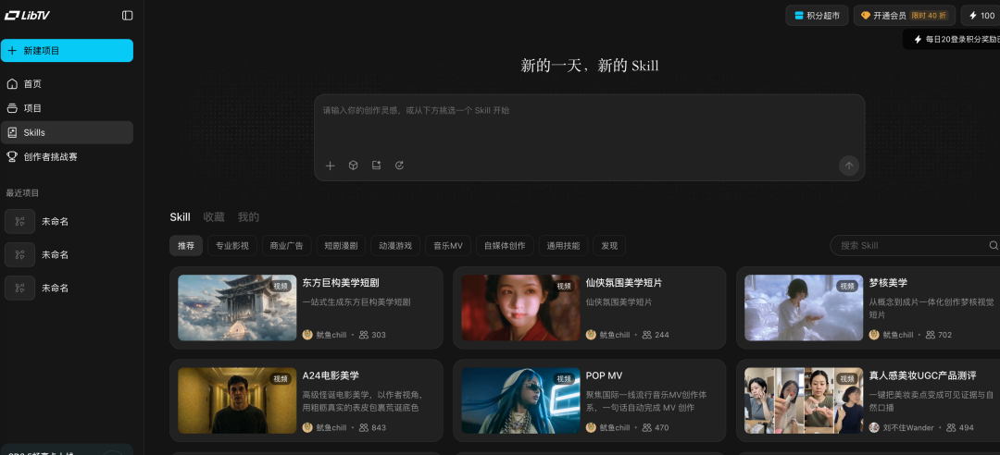
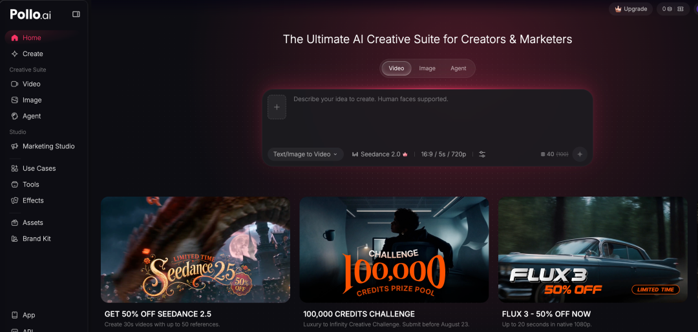
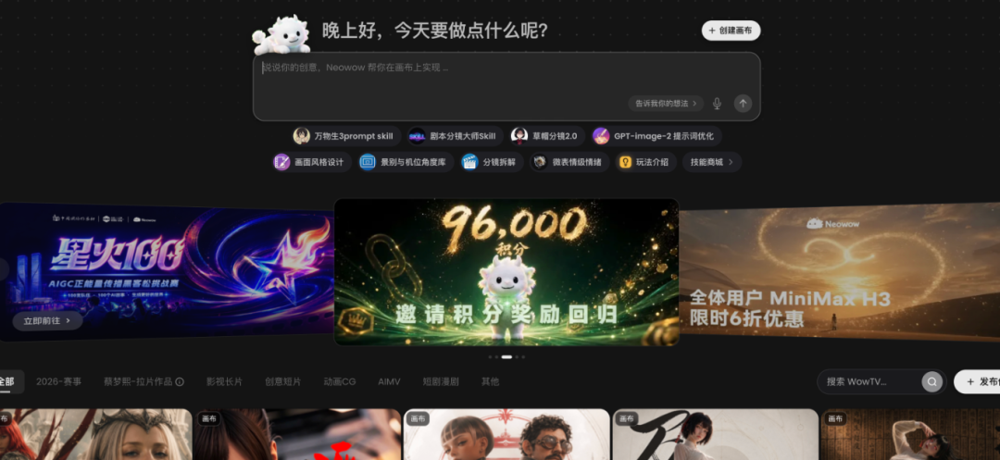

# AI Video 产品竞品调研报告

> 一份覆盖 30+ 产品的 AI 视频赛道全景调研：从"冕神"3.9 折的健身房模式，到画布+Agent+时间轨道的终局结构，到 11 类产品形态的拆解，到 9 种商业模式。核心结论：模型决定上限，工作流才是商品，成片才是价值；最终胜出的不是功能最全的，而是最早跑通"稳定需求、稳定交付、稳定获客、稳定利润"的团队。

<!-- more -->

## 作者信息

- **作者**：Corly
- **发布**：2026-08-15
- **来源**：作者对大量 AI Video 产品的实际观察，文中数据含公开报道、第三方工具估算与业内交流

## 核心观点

> **AI Video 仍然处于群阀割据时代。现在还没有标准答案。**

文章不讨论"哪个模型画质最好"，而是从产品和生意角度回答：**表单、Agent、画布、Clone 和短剧工作流，哪一种更容易赚钱？**

## 一、"冕神"与健身房模式

围绕陈冕（"冕神"）和 LibTV 的圈内故事：估值 3 亿美元、中国最大的 AI 应用创业公司之一、Seedance 2.0 做到接近官方价格的 3.9 折。

**核心商业模式——"健身房模式"：**

> 用户购买一个看似非常划算的包月套餐，理论上可以生成很多视频，但真正每天高强度使用、把额度全部吃完的人只是少数。

平台出售的不是每一秒视频，而是**"我随时可以生成"的权利**。只要大多数用户实际消耗低于套餐上限，平台再通过低价模型、错峰调度、并发限制和闲置算力控制成本，"无限"就有可能成为一门成立的生意。

> 外面看是一场模型大战，里面算的却是概率、利用率和毛利。

陈冕来自剪映体系。剪映培养了同时懂工作流、内容分发、模板生态和海外订阅的人，"剪映系"几乎占了 AI Video 创业的半边天：

- **郭列** → Flova（长期 Context、Agent、Skills）
- **闹闹** → OiiOii（导演/编剧/角色/分镜多 Agent 分工）
- **陈冕** → Lovart（设计 Agent）+ LibTV（视频生产）

## 二、11 种产品形态拆解

### 1. 单页表单
上传图片→输入提示词→选择模型→点击生成。古典但 SEO 和广告转化路径最短，缺点是用户用完即走，壁垒最低。

### 2. 多页面综合站
顶部放 Image/Video/Avatar/Effects/Tools/Templates，像 AI 工具超市。优势是流量入口多，缺点是容易杂乱。代表：Pollo AI 等。

### 3. 纯 Agent
用户说"给我做一条 30 秒运动鞋广告"，系统自动写脚本、拆镜头、选模型、生成成片。演示效果强，但链路越长失败率越高。

### 4. 无限画布
适合专业创作者和复杂项目，保留完整 Context。缺点是学习成本高，小白看到空白画布不知道干什么。

### 5. 画布 + Agent
目前最合理的组合。画布负责展示素材和中间结果，Agent 负责理解需求、调用模型、执行任务。

### 6. 时间轨道
视频最终要落到时间上——配音从几秒开始、镜头持续多久、音乐如何卡点。未来结构可能是：Agent 出初稿，画布管结构，时间轨道做成片。

### 7. 画布 + Agent + Skills
Skills 是封装好的专业工作流（如"制作商品广告"）。通用 Agent 什么都能做但容易失控，Skill 能做的更窄但更稳定。未来可能发展成视频领域的插件市场。

### 8. 资产 + Agent
品牌把商品、Logo、标准色和历史广告存进资产库，Agent 持续使用这些资产。适合企业，容易产生高客单价和迁移成本。

### 9. Video Clone
上传爆款视频→拆解脚本/镜头/节奏/动作/字幕→换新商品/人物/语言。价值表达最直接："我想要一条类似的。"真正的 Clone 不是反推提示词，而是把视频拆成可替换、可编辑、可批量生产的结构。

### 10. 文件转视频
上传 PDF/PPT/网页/文章→自动生成脚本、画面、配音、字幕、时间线。代表：Medeo（ONE2X 旗下）。不用凭空解决"创意"，把已存在的信息变成视频，更稳定。

### 11. 短剧工作流
从故事/剧本/角色/场景开始，继续拆分镜、生成图片与视频，再处理配音/口型/字幕/音乐/合并。链路最长，最容易产生大订单。

## 三、AI 创作产品的演化路径

> **提示词与 Seed 站 → 模型与 LoRA 社区 → 单模型套壳 → 多模型综合站 → 无限画布 → Video Agent → AI 内容生产系统**

**关键原则**：后一种形态出现，不意味着前一种会消失。它们会长期共存——表单还在赚钱，模型社区还在卖算力，综合站还在铺 SEO。

## 四、画布 vs Agent vs 表单：核心分工

> **画布负责复杂度，Agent 负责降低复杂度，表单负责转化率。**

三者没有谁替代谁，关键是产品服务哪一种任务：

- 如果用户搜索"让这张照片动起来"，让他先学习画布就是增加转化阻力
- 如果用户要做品牌视觉，需要一个画布+Agent 的协作空间

## 五、重点竞品赌注分析

| 产品 | 赌什么 | 团队/背景 |
|------|--------|----------|
| **Lovart** | 一句话交付整套方案（品牌视觉/海报/包装/营销素材） | 陈冕，剪映系 |
| **LibTV** | 专业画布 + Skills + 模型生态 → 内容生产基础设施 | 陈冕体系，背靠 LiblibAI |
| **Flova** | 长期 Context——Agent 持续理解项目 | 郭列，字节影像背景 |
| **OiiOii** | 动画 + 多 Agent 分工（导演/编剧/角色/分镜） | 闹闹，剪映/CapCut 背景 |
| **TapNow** | 专业创作者工作台 | 较早做画布 |
| **Medeo** | 像聊天一样剪视频（素材库 + Agent + 时间线） | ONE2X，王冠（前月之暗面模型产品负责人） |
| **PixVerse** | 大而全（表单/Agent/画布/画布+Agent 都做） | 模型厂商直接做 C 端 |
| **Pollo AI** | 模型聚合 + 流量网络（SEO/KOL/品牌渠道） | 务实路线 |
| **P\*\*/R\*\*/S\*\*/V\*\*** | 增长效率（SEO + 投放 + KOL） | 独立站生意 |

## 六、中小站案例：真正赚钱的产品往往没那么"先进"

**反直觉结论：产品形态越复杂，未必越容易赚钱；用户需求越具体，反而越容易完成转化。**

一个画布平台需要教育用户理解整套工作流，而一个"上传商品图，生成 UGC 广告"的页面，用户三秒钟就知道为什么要付钱。

**典型收入量级：**
- R\*\*：月入 10 万美元级（SEO + 大量内容页，多步骤表单）
- S\*\*：月入 20-30 万美元（KOL + 模型热点，Agent 做品牌展示，表单做实际转化）
- V\*\*：月入 10-20 万美元（付费投放为主）

## 七、模型定价矛盾

高质量视频生成价格仍在每秒数角到数元人民币。但**一条 10 秒视频很少一次成功**——人物变形、动作错误、镜头不对、文字乱码、口型失败……

> 假设一个可用镜头平均要生成五次，10 秒有效素材的成本就可能从十几元变成五六十元。

**平台真正应该计算的：**
- 一个可用镜头平均多少钱
- 一条完整成片平均多少钱
- 用户为了拿到成片需要重试多少次、等待多久

> **模型是成本，工作流才是商品，成片才是价值。**

## 八、模型选择：任务路由而非追最强

专业平台真正需要的是"任务路由"——不同任务路由给不同模型：

**国内模型：**
- 字节 Seedance/即梦：多模态参考、镜头语言、复杂动作、商业视频
- 快手 Kling 可灵：人物运动、物理表现、首尾帧、长镜头
- 阿里 Wan 系列：开源生态、ComfyUI、私有部署
- MiniMax Hailuo/H3：人物表现、广告、风格化视频
- 生数 Vidu：多主体参考、一致性、动画
- 爱诗 PixVerse：消费级特效、社交传播
- 腾讯混元：开源、私有部署

**海外模型：**
- Google Veo：电影感、物理真实性、原生音画
- OpenAI Sora：世界模拟、多镜头叙事
- Runway Gen 系列：专业影视、视频重绘、镜头控制
- Luma Ray/Dream Machine：真实运动、关键帧、快速生成
- Lightricks LTX Video：开源、本地部署、长视频
- Pika：消费级特效、社交媒体内容

## 九、四条流量路径

1. **YouTube KOL**：强演示型产品，1万-3万订阅垂类账号报价 500-1000 美元/条
2. **SEO**：新模型/新效果/新场景不断产生新关键词，窗口越来越短
3. **付费投放**：AI Video 失败率和模型成本高，适合投购买意图明确的场景词（商品广告、数字人、UGC、Clone）
4. **创作者运营和自有账号**：比赛、模板活动、邀请返积分、作品广场、自建 TikTok/YouTube/抖音/小红书

## 十、最先形成工业化的两个场景

### AI 短剧
完整流程：剧本→角色→场景→分镜→图片→视频→配音→口型→字幕→音乐。Seedance/Kling/Wan/Hailuo 提升后开始具备工业化可能。已有 SaaS、私有部署、直接交付生产线三种模式。

### 电商复刻
对爆款广告拉片→拆解钩子/文案/镜头节奏/人物动作/商品展示→AI 换模特/商品/语言/场景。一条验证过的素材可扩展成几十个国家、几十种人物、多个画幅版本。

> 电商客户只关心三件事：一天能出多少条，一条成本多少，最终能不能卖货。

## 十一、9 种商业模式

| 收费方式 | 商业逻辑 |
|---------|---------|
| 积分与订阅 | 为生成次数和高级模型付费，定价须覆盖重试和重度用户成本 |
| 无限套餐 | 通过并发/排队/模型版本/公平使用控制实际消耗，本质是概率生意 |
| API 聚合 | 为开发者提供统一接口，长期必须增加稳定性和调度价值 |
| 模板与 Skills | 专业方法封装成可重复销售的数字商品 |
| 企业席位 | 围绕品牌资产、权限、团队协作、内容审核收费 |
| 私有部署 | 为短剧/MCN/企业交付生产线，收入高但实施成本也高 |
| 代制作 | 不卖工具，直接卖广告/短剧/口播成片 |
| 课程+软件+私域 | 通过内容教育、训练营、社群销售工具 |
| 流量与联盟 | 提示词站/测评站/模型导航通过广告/导购/联盟佣金变现 |

> **最容易被替代的是单纯转售模型，价值更高的是工作流和行业交付，最有机会形成壁垒的是资产、Context、数据和分发。**

## 十二、如果今天重新做一个 AI Video 产品

- **快速验证收入**：选需求明确、结果可量化的垂直表单或 Clone（音乐视频/商品广告/服装展示/小说推文/数字人口播）
- **做长期平台**：选"资产 + Agent + 可编辑工作流"，再逐步增加画布和 Skills——**真正能留下用户的是他们已经上传的角色、商品、品牌资料、声音、历史项目和工作方法**
- **服务短剧和企业**：重点在批量生产、成本监控、审核、权限和失败重做——**企业不会因为你接入 20 个模型就付更多钱，但会因为你能每天稳定交付 100 条内容而付钱**

## 十三、最终结论

> **模型决定产品能力的上限，流量决定有没有人进来，工作流决定用户能不能获得结果，成本决定这门生意最终能不能活下来。**

最终胜出的产品，未必是模型最多、功能最全、估值最高的那个。更可能是最早跑通这四件事的团队：**稳定需求、稳定交付、稳定获客、稳定利润。**

> **AI Video 这场战争，表面上是在争夺下一代视频入口，底层其实还是一个非常朴素的问题：你能不能用更低的成本，持续帮用户生产真正有用、甚至能够赚钱的视频？**

## 关键洞察

1. **健身房模式**：无限套餐的本质是概率生意，平台卖的是"我随时可以生成"的权利而非实际消耗
2. **11 种产品形态长期共存**：后一种形态出现不淘汰前一种，表单/综合站/Agent/画布/短剧各有市场
3. **画布负责复杂度，Agent 负责降低复杂度，表单负责转化率**——三者互补而非替代
4. **真正赚钱的产品往往没那么"先进"**：产品越复杂≠越容易赚钱，用户需求越具体反而越容易转化
5. **Agent 承担品牌展示，表单承担实际转化**：大量产品中 Agent 入口是门面，用户最终高频使用的是表单
6. **模型是成本，工作流才是商品，成片才是价值**——这是 AI Video 赛道的根本商业逻辑
7. **任务路由而非追最强模型**：真人表演/商品展示/动漫应路由给不同模型，失败后自动换模型
8. **电商复刻和 AI 短剧是最先工业化的两个场景**——因为它们直接对应商业闭环（卖货/内容产出）
9. **壁垒来源**：资产、Context、数据和分发 > 工作流和行业交付 > 单纯转售模型
10. **四个稳定的最终胜负**：稳定需求、稳定交付、稳定获客、稳定利润
