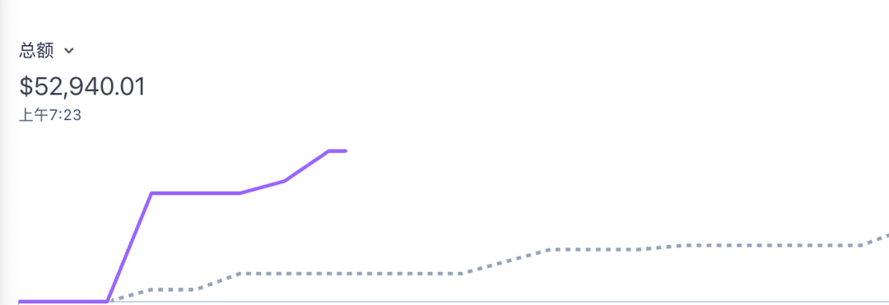
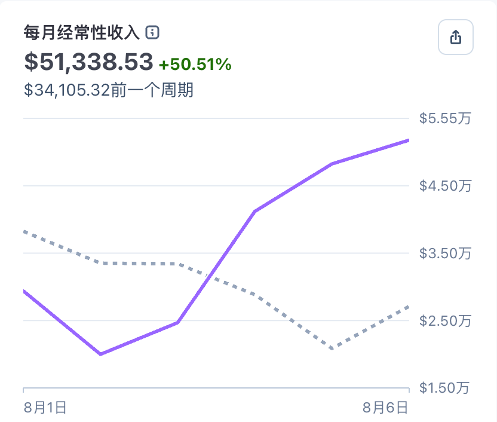
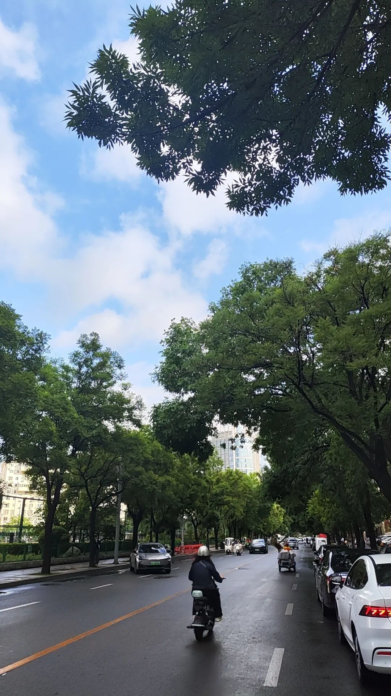

# AI创业半年复盘：从1万美元到5万美元，从一个人到5个人

> 一位离开大厂重新创业的创业者，半年内 AI SaaS 独立站月营收从 1 万美元做到 5 万美元，团队从 1 人扩张到 5 人。核心结论：AI 创业不晚，技术不是壁垒，认知和用户反馈才是关键；Agent + Workflow + 控制层三位一体的"智能工作流"是当前最现实的商业化路径。

<!-- more -->

## 作者信息

- **作者**：Corly
- **发布**：2026-08-06
- **团队所在地**：天津

## 核心经营数据

| 指标 | 半年前 | 现在 |
|------|--------|------|
| 月营收 (MRR) | ~1 万美元 | ~5 万美元 |
| 团队规模 | 1 人 | 5 人 |
| 融资状态 | 无 | 无（纯 bootstrap） |

> 用户真的愿意为 AI 工具付费，全球市场也确实存在大量需求。

## 一、经营情况：从 1 万美元到月收入 5 万美元

目前公司主要方向是 AI SaaS 独立站。数字不算大，但验证了关键假设——**用户真的愿意为 AI 工具付费**。

- 没有融资驱动，靠产品、投放和用户反馈一点点跑出来
- 过程中遇到：广告投放波动、用户付款失败、产品体验问题、服务器压力、客服反馈
- **赚钱不是最难的，持续创造价值并不断复制才是**

## 二、团队变化：从一个人到 5 个人的小团队

**一个人的状态**：效率极高，一个想法晚上想到第二天就能做出来，没有沟通成本和流程限制。

**瓶颈出现后**：产品需要持续迭代、用户需要持续服务、SEO 需要长期投入、广告需要不断测试、新方向需要有人探索。

> **一个人的时候，问题是"能不能做出来"。有团队以后，问题变成"能不能规模化"。**

半年内从 1 人发展到了 5 人，从个人实验进入真正公司的阶段。

## 三、产品探索：AI 应用正在进入爆发期

探索方向包括：AI 视频、AI 图片、AI 3D、AI 面试、AI 短剧、AI 装修等。

**底层逻辑**：利用 AI 降低专业能力的门槛。

| 传统行业 | 过去需要 | AI 时代 |
|---------|---------|--------|
| 视频制作 | 导演、摄影、剪辑 | 一个人 + AI |
| 设计 | 设计师 | 一个人 + AI |
| 3D | 建模人员 | 一个人 + AI |
| 装修 | 设计经验 | 一个人 + AI |
| 招聘 | 专业 HR | 一个人 + AI |

> AI 不是简单创造一个新的工具，而是在重新定义大量传统行业的生产方式。

## 四、技术探索：Agent 不是答案，智能工作流才是答案

作者花了大量时间研究 Agent，发现：

| 方案 | 优势 | 问题 |
|------|------|------|
| Agent | 自由、智能 | 路径不可控、成本不可控、结果质量不可控 |
| Workflow | 稳定 | 智能程度不足，复杂任务处理有限 |
| CC（类 Control Tower） | 控制能力强 | 长任务场景 Token 消耗夸张 |

**结论**：

> **Agent、Workflow、CC 都不能单独成立。真正适合商业化的方向是三者结合的智能工作流。**

- Agent 负责思考和决策
- Workflow 负责稳定执行
- 控制层负责关键节点

> 未来几年 AI 产品竞争的核心，不是谁接入了哪个模型，而是谁能够把复杂能力真正封装成普通用户可以使用的产品。

## 五、行业判断：AI 创业依然处于早期

> **现在做 AI 不晚，甚至可能还非常早。**

互联网发展史证明：真正的大机会不在技术刚出现时，而在技术开始普及之后。

- **hao123 时代**：一个简单的网址导航可以成为千万用户电脑首页
- **iPhone 时代**：普通开发者做一个 App 也可能获得巨大机会
- **AI 时代**：正在连接人的能力（写作、设计、编程、视频、营销、教育）

> 互联网连接信息，移动互联网连接用户，AI 正在连接人的能力。

问题不是有没有机会，而是谁能找到那个**具体场景**。

## 六、创业感悟：技术很重要，但认知更重要

> **创业最后拼的不是技术，而是认知。**

技术变化极快，今天最强的模型几个月后就会被替代。但用户需求不会。

**走过的弯路**：看到新技术方向就觉得未来很大，然后投入大量时间研究，最后发现技术只是手段，用户需求才是目的。

**现在的节奏**：快速验证 → 快速上线 → 快速获取反馈 → 根据市场调整。

> 创业不是证明自己技术多强，而是找到用户愿意付费解决的问题。

## 七、未来计划：从赚钱到建立壁垒

接下来半年计划：增加团队、增加研发、增加市场推广、探索更多 AI 应用方向。

**长期壁垒来源**：

- 产品体验
- 用户数据
- 行业理解
- 品牌影响力
- 商业闭环

> 简单调用模型、做一个 Demo，会越来越没有价值。希望从一个个 AI 工具，逐渐成长为一家真正理解 AI 应用场景的公司。

## 八、寻找同行者

办公室在天津。作者认为 AI 时代会让地域限制越来越弱，一个小团队也可以面向全球市场。

寻找正在做以下方向的人交流：AI 创业、独立开发、海外 SaaS、产品出海。

> **半年前，我从一个人开始。半年后，我们成为 5 个人的团队。收入从 1 万美元到 5 万美元。这些数字不是终点，只是证明方向正确。AI 时代的大门才刚刚打开。**

## 关键洞察

1. **Bootstrap 模式可行性**：无融资、无大团队，纯靠产品+投放+用户反馈跑通，5 万美元 MRR 验证了小规模 AI SaaS 的独立性
2. **Agent ≠ 商业化答案**：Agent 太自由导致路径/成本/质量均不可控，智能工作流 = Agent（思考）+ Workflow（执行）+ 控制层（关键节点）
3. **认知 > 技术**：技术几个月迭代一次，用户需求不变，创业者应聚焦用户愿意付费解决的问题而非追新模型
4. **AI 连接人的能力**：类比互联网（连接信息）、移动互联网（连接用户），AI 正在连接人的能力，大机会在技术普及后
5. **从 1 到 5 人的本质**：不是收入增长驱动的扩招，而是"能不能做出来"→"能不能规模化"的结构性转变
6. **长期壁垒五点**：产品体验、用户数据、行业理解、品牌影响力、商业闭环——Demo 和 API 调用越来越没有价值
7. **地域限制弱化**：天津团队也可以面向全球市场，AI 时代地理不再是创业资源分配的决定因素
8. **快速验证循环**：快速上线→快速反馈→根据市场调整，是比"证明技术多强"更务实的创业节奏
