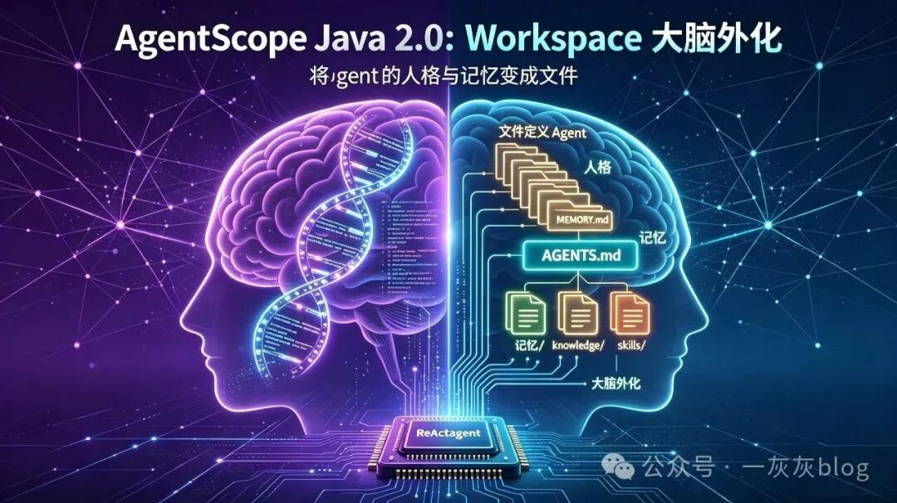
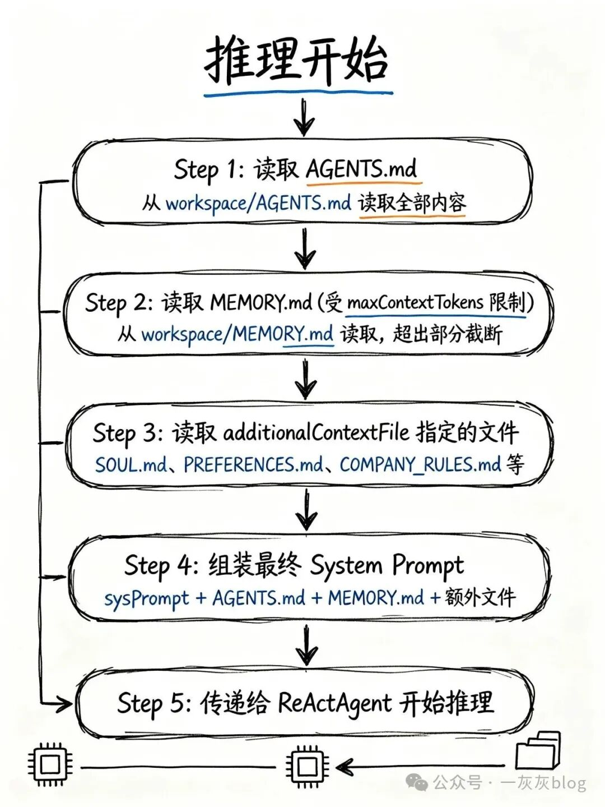
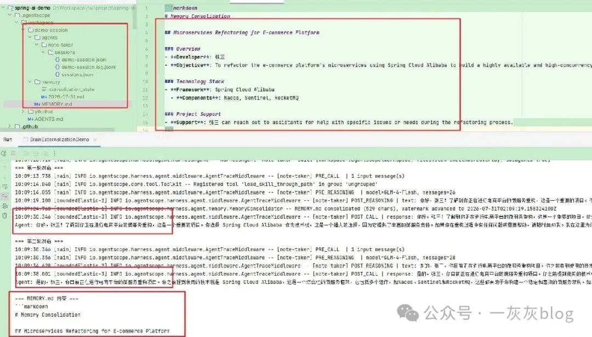
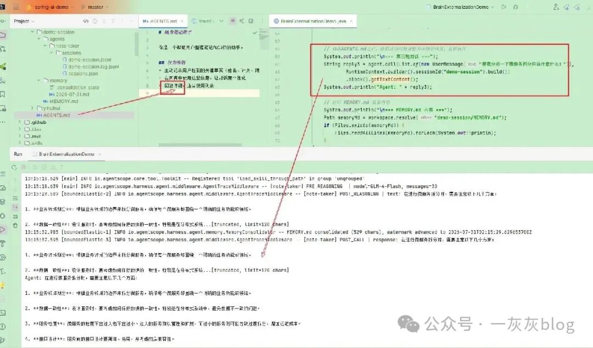

# AgentScope Java 2.0 工作区Workspace —— "大脑外化"

> 一灰灰博主对 AgentScope Java 2.0 Workspace 机制的深度拆解：把 Agent 的"大脑"从内存搬到文件系统——人格是 AGENTS.md，记忆是 MEMORY.md，知识在 knowledge/，技能在 skills/。核心范式转变：从"代码定义 Agent"到"文件定义 Agent"，从"黑盒"到"白盒"，迭代速度从"周级别"到"秒级别"。

<!-- more -->

## 作者信息

- **作者**：一灰灰blog
- **发布**：2026-07-31
- **主题**：AgentScope Java 2.0 Workspace 机制深度分析

## 核心观点

> **Workspace 的本质，不是"把配置写在文件里"这么简单。它是一种架构范式的转变：从"代码定义 Agent"到"文件定义 Agent"，从"内存中的瞬时状态"到"磁盘上的持久化大脑"。**

把 Agent 的整个"大脑"搬到一个文件目录里——人格是 AGENTS.md，长期记忆是 MEMORY.md，领域知识在 knowledge/，技能在 skills/，子 Agent 规格在 subagents/。所有东西都在同一个地方，用同一种方式管理：**普通文件**。

## 一、从"代码定义"到"文件定义"

### 传统方式的痛点

传统 Agent 的"大脑"被拆成了三块：

| 维度 | 传统方式 | Workspace 方式 |
|------|---------|---------------|
| 人格 | 硬编码在 Java 代码 sysPrompt() 里 | AGENTS.md 文件，改完即生效 |
| 记忆 | 存储在数据库中，需要 SQL | MEMORY.md，人类可读可编辑 |
| 知识 | 存在向量数据库中，需要索引服务 | knowledge/ 目录，普通文件 |

传统方式的代价：改人格要改代码→编译→打包→部署→重启。查记忆要连数据库写 SQL。补知识要重建向量索引。**Agent 的大脑是一个黑盒**。

Workspace 方式：所有内容都是普通文件，可以用任何文本编辑器打开、修改、查看。**Agent 的大脑是一个白盒**。

### "大脑外化"的隐喻



Workspace 的核心隐喻是 **大脑外化（Brain Externalization）**——就像阿尔茨海默病患者把重要信息记在笔记本上，这本笔记本就是"大脑外化"的一部分。Agent 不再是一个"运行在内存中的神秘进程"，而是一个"以文件系统为载体的可观测、可编辑、可演化的实体"。

### Source of Truth：为什么文件比数据库更适合？

| 维度 | 数据库 | 文件系统（Workspace） |
|------|--------|---------------------|
| 人类可读性 | 需要 SQL 查询 | 任何编辑器直接打开 |
| 可编辑性 | 需要 SQL 或管理工具 | 直接修改，保存即生效 |
| 版本控制 | 难以做 Git Diff | 天然支持 Git 版本管理 |
| 可移植性 | 依赖特定数据库产品 | 复制目录即可迁移 |
| 透明度 | 内容对开发者不透明 | 所有内容一目了然 |
| 演化记录 | 需要额外审计表 | Git 提交历史就是演化记录 |

### 与 OpenClaw/Hermes 的异同

| 维度 | OpenClaw/Hermes | AgentScope Workspace |
|------|----------------|---------------------|
| 工作区定位 | 单机本地目录 | 可插拔抽象文件系统（本地/远端/沙箱） |
| 多租户 | 无 | 原生支持用户级和 Agent 级隔离 |
| 分布式 | 不支持 | 配合分布式 Session 实现跨节点共享 |
| 记忆机制 | 基础文件追加 | 双层记忆 + 自动压缩 + LLM 合并去重 |
| 子 Agent | 有限支持 | 声明式子 Agent + 隔离执行 |

## 二、AGENTS.md：人格即文件

### 工作原理

AGENTS.md 是 Workspace 根目录下的 Markdown 文件，等价于传统 sysPrompt()，但关键区别在于：**它是文件，不是代码**。

**WorkspaceContextMiddleware 的注入机制：** 每次推理开始前，Middleware 执行以下操作：

1. 扫描 Workspace 根目录
2. 读取 AGENTS.md 全部内容
3. 读取 MEMORY.md 内容（受 maxContextTokens 限制）
4. 读取 additionalContextFile 指定的额外文件
5. 将上述内容拼接到 System Prompt 中
6. 传递给 ReActAgent

> **关键是这个过程每轮推理都会重新执行**——改了 AGENTS.md 保存后下一轮自动生效，完全不需要重启 JVM 进程。

### 多文件人格拆分

通过 additionalContextFile()，可以把人格拆成多个维度文件：

```
.agentscope/workspace/
├── AGENTS.md           # 核心人格（必填，开发团队维护）
├── SOUL.md             # 核心价值观（产品团队维护）
├── PREFERENCES.md      # 个人偏好（用户自己维护）
└── COMPANY_RULES.md    # 公司规范（运维团队维护）
```

不同团队维护不同文件，互不干扰，共同塑造 Agent 的人格。

## 三、MEMORY.md：记忆即文件

### 从 LongTermMemory 到 MEMORY.md

AgentScope 1.x 时代通过 LongTermMemory 接口实现长期记忆，开发者需要自己实现存储和检索逻辑。2.0 版本把记忆下沉到 Workspace 文件 + 中间件，框架只提供机制，不规定策略。

### 两层记忆架构

```
workspace/
├── MEMORY.md                    # 第二层：整理后的长期记忆
└── memory/
    └── YYYY-MM-DD.md            # 第一层：每日事实流水账
```

| 层级 | 文件 | 特性 | 价值 |
|------|------|------|------|
| 第一层 | memory/YYYY-MM-DD.md | 按天追加，只追加不修改不去重 | 原始数据兜底，合并出错可回溯 |
| 第二层 | MEMORY.md | 后台 LLM 定期合并去重提炼 | 精炼结构化，每次推理注入 |

就像**日记本**和**整理后的笔记**——日记本记录每天所有事情（原始、粗糙、不删改），整理笔记是提炼出的精华（精炼、结构化、定期更新）。

### 记忆流水线的三次 LLM 调用

| # | 操作 | 写入目标 | 触发时机 | 可自定义 |
|---|------|---------|---------|---------|
| 1 | Flush（冲刷） | memory/YYYY-MM-DD.md | 每轮对话结束 | flushPrompt |
| 2 | Consolidation（合并） | MEMORY.md | 后台定时任务 | consolidationPrompt |
| 3 | Compaction（压缩） | 上下文摘要 | 上下文超限时 | summaryPrompt |

注意：**Flush 和 Consolidation 是"记忆沉淀"**（收集→加工），**Compaction 是"上下文管理"**（压缩当前会话历史消息），两者是独立功能。

## 四、System Prompt 运行时组装



每次推理开始前，WorkspaceContextMiddleware 重新加载所有文件内容：

> 改了 AGENTS.md → 下一轮生效
> 后台合并了 MEMORY.md → 下一轮生效
> 新增了额外文件 → 下一轮生效

**"改文件即升级"的本质，就是"每轮推理重新加载文件内容"。**

## 五、Workspace 全景：目录结构

```
.agentscope/workspace/
├── AGENTS.md                # 人格：我是谁？（工程师手动维护）
├── MEMORY.md                # 长期记忆：我知道什么？（框架自动维护）
├── memory/                  # 记忆原材料：每日事实流水账
│   └── YYYY-MM-DD.md        # 只追加，不修改，不去重
├── knowledge/               # 知识：我懂什么？（工程师手动维护）
│   └── KNOWLEDGE.md
├── skills/                  # 技能：我会做什么？（可复用能力包）
│   └── <skill-name>/SKILL.md
├── subagents/               # 子 Agent：我能指挥谁？
│   └── <agent-id>.md
├── plans/                   # 运行时：Plan Mode 写下的计划
│   └── PLAN.md
├── tools.json               # 工具白名单：我能用什么工具？
└── agents/<agentId>/        # 运行时数据
    ├── sessions/            # 会话日志（永不压缩，全量留存）
    └── tasks/               # 子 Agent 任务记录
```

**分工逻辑：**

| 分类 | 内容 | 谁维护 | 生命周期 |
|------|------|--------|---------|
| 静态（先天属性） | AGENTS.md, knowledge/, skills/, subagents/ | 工程师 | 静态 |
| 动态（后天积累） | MEMORY.md, memory/, agents/ | 框架自动 | 动态演化 |

## 六、实测：Agent 如何"长大"

### 演示效果





### 关键演示点

1. 初始化 Workspace → 自动生成 AGENTS.md → Agent 具备"随身笔记助手"人格
2. 第一轮对话中 Agent 记住用户身份（张三、电商微服务重构、Spring Cloud Alibaba）
3. 第二轮对话中 Agent 能回忆之前的关键事实
4. **修改 AGENTS.md 中的行为准则**（"回复简洁"→"回复详细，给出完整分析和示例代码"）→ 保存 → 第三轮对话自动生效，**无需重启 JVM**

### 更深层的观察

> Agent 的"成长"不再依赖于代码变更，而是依赖于文件变更。

| 对比 | 传统架构 | Workspace 架构 |
|------|---------|---------------|
| 能力提升方式 | 改代码 → 发版 | 改文件 → 保存 |
| 迭代周期 | 周级别 | 秒级别 |

这不只是一个"方便"的问题——**这是一个迭代速度的数量级跃升**。

## 七、小结

| 概念 | 文件 | 作用 | 谁维护 | 生效方式 |
|------|------|------|--------|---------|
| 人格 | AGENTS.md | 定义 Agent 的"我是谁" | 工程师手动 | 每轮推理重新加载 |
| 长期记忆 | MEMORY.md | 记录 Agent 的"我知道什么" | 框架自动 | 每轮推理重新加载 |
| 记忆原材料 | memory/YYYY-MM-DD.md | 每日事实流水账 | 框架自动 | Flush 时追加 |
| 领域知识 | knowledge/ | Agent 的"我懂什么" | 工程师手动 | 按需加载 |
| 技能 | skills/ | Agent 的"我会做什么" | 工程师手动 | 按需加载 |
| 子 Agent | subagents/ | Agent 的"我能指挥谁" | 工程师手动 | 启动时加载 |

**四个范式转变：**

- 从"代码定义 Agent"到"文件定义 Agent"
- 从"内存中的瞬时状态"到"磁盘上的持久化大脑"
- 从"黑盒式 Agent"到"白盒式 Agent"
- 从"周级别的迭代"到"秒级别的迭代"

> **Workspace 让 Agent 的大脑变得可见、可编辑、可演化——这就是"大脑外化"的力量。**

## 关键洞察

1. **大脑外化**：把 Agent 的整个"大脑"从内存搬到文件系统，所有心智内容变成普通可读可写的文件
2. **黑盒→白盒**：数据库方案让 Agent 大脑不可见，文件方案让所有内容一眼可见
3. **迭代速度数量级跃升**：从"改代码→编译→部署→重启"（周级别）到"改文件→保存"（秒级别）
4. **每轮推理重新加载**：WorkspaceContextMiddleware 每次推理前重新读取文件，无需重启即可生效
5. **两层记忆架构**：第一层日记本（memory/YYYY-MM-DD.md，只追加不修改）+ 第二层整理笔记（MEMORY.md，LLM 定期合并去重）
6. **三次 LLM 调用**：Flush（收集）→ Consolidation（加工）→ Compaction（压缩上下文），职责分明
7. **多文件人格拆分**：AGENTS.md/SOUL.md/PREFERENCES.md/COMPANY_RULES.md 由不同团队维护，职责分离
8. **先天 vs 后天**：静态文件（人格/知识/技能）定义先天属性，动态文件（记忆/会话/任务）记录后天积累
9. **对比 OpenClaw**：AgentScope Workspace 在可插拔文件系统、多租户、分布式、双层记忆、声明式子 Agent 五个维度上实现超越
10. **官方文档**：https://java.agentscope.io/v2/zh/docs/harness/workspace.html
