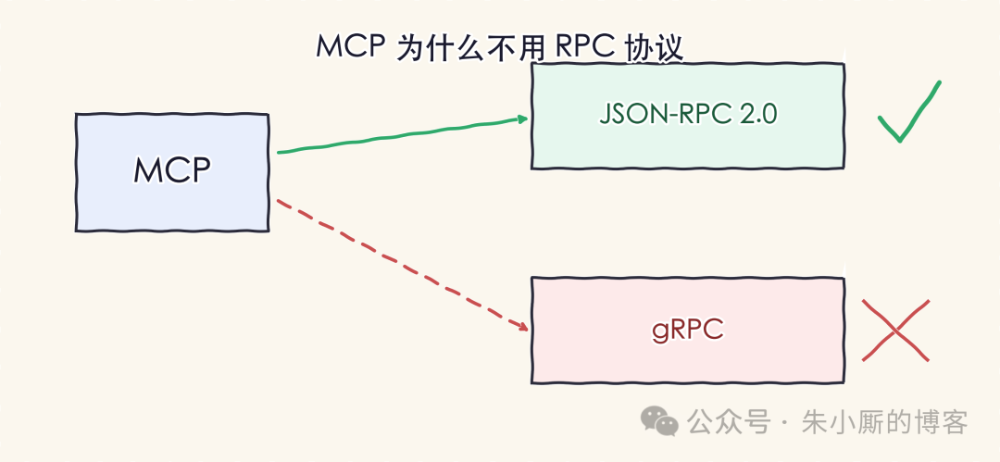
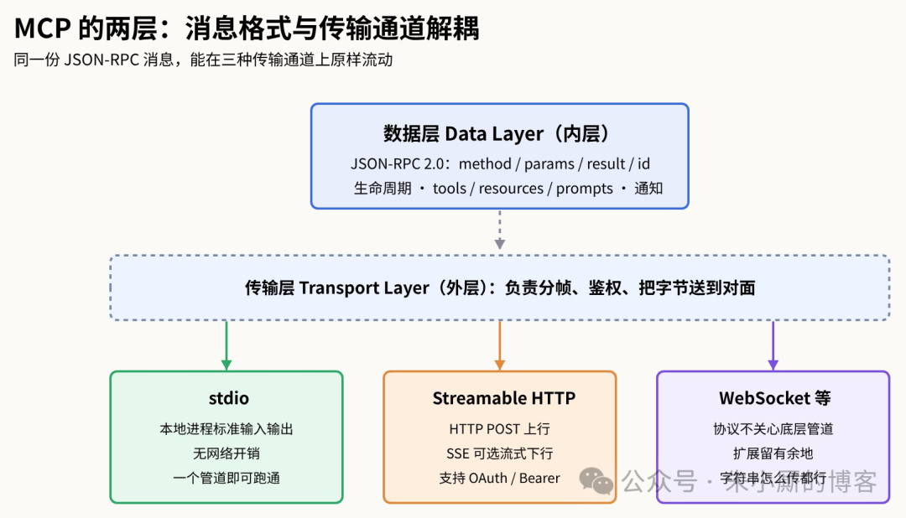
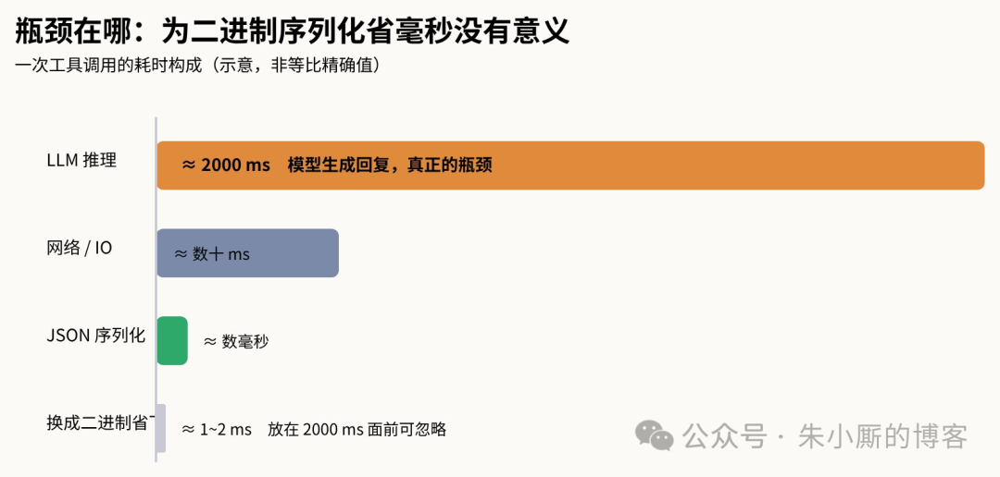
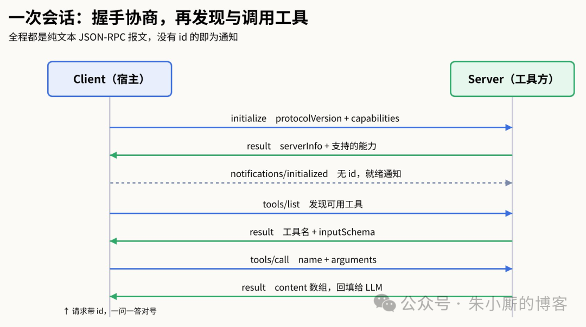
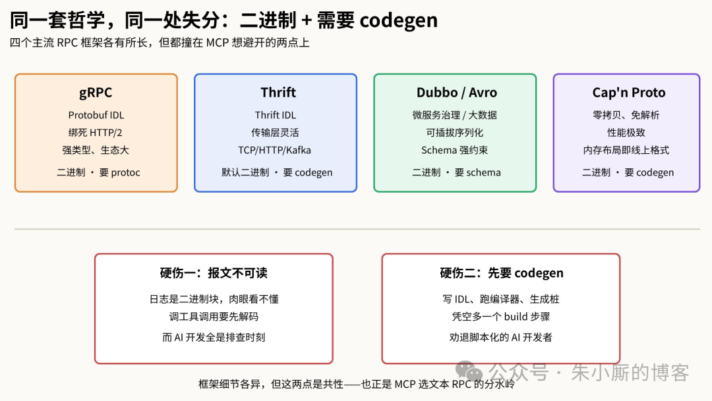
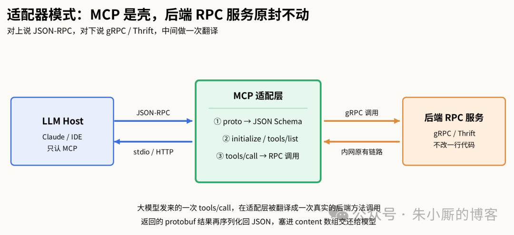

# MCP 为什么不用 RPC 协议

点击上方“朱小厮的博客”，选择“设为星标”

# 点击上方“朱小厮的博客”，选择“设为星标”

如果你第一次翻开 Model Context Protocol 的规范，多半会愣一下：这套要连接大模型和外部工具的协议，底层用的既不是 gRPC，也不是 REST，而是一个 2010 年就定稿、听起来有点"过时"的JSON-RPC 2.0。在微服务圈里，gRPC 几乎是默认答案——二进制编码、HTTP/2 多路复用、强类型 IDL，性能拉满。Anthropic 手握顶尖工程团队，为什么偏偏绕开它？这不是一次偷懒，而是一组被反复权衡过的取舍。看懂这组取舍，你也就看懂了 MCP 到底想解决什么问题。先澄清一个容易被标题误导的点：MCP 并不是"不用 RPC"。JSON-RPC 本身就是一种远程过程调用协议，请求里有method和params，响应里有result或error，靠id把一问一答对上号——这是标准的 RPC 语义。而且要说清楚，能跟它竞争的也不止 gRPC 一个：Thrift、Dubbo、Avro、Cap'n Proto 这些都是成熟的 RPC 框架，它们共同的特征是用 IDL 定义接口、默认走二进制编码、需要编译器生成桩代码。所以真正的问题应该换个说法：为什么选了 JSON-RPC 这种文本 RPC，而不是这一整个二进制 RPC 家族？下面主要拿最有代表性的 gRPC 当靶子来讲，但结论对整个家族都成立。答案要从"谁在跑这个协议、瓶颈在哪、调试有多痛"三件事说起。先看清 MCP 的两层结构要理解协议选型，得先知道 MCP 把自己切成了两层，而 JSON-RPC 只占其中一层。官方架构文档说得很直接：内层是数据层（data layer），外层是传输层（transport layer）。数据层定义"说什么"——基于 JSON-RPC 2.0 的消息结构、生命周期管理、以及 tools / resources / prompts 这三个核心原语；传输层定义"怎么送"——具体走哪条管道、如何做消息分帧和鉴权。关键在于，同一套 JSON-RPC 消息格式，可以原封不动地跑在完全不同的传输通道上。这层解耦，正是后面所有取舍的地基。

如果你第一次翻开 Model Context Protocol 的规范，多半会愣一下：这套要连接大模型和外部工具的协议，底层用的既不是 gRPC，也不是 REST，而是一个 2010 年就定稿、听起来有点"过时"的JSON-RPC 2.0。在微服务圈里，gRPC 几乎是默认答案——二进制编码、HTTP/2 多路复用、强类型 IDL，性能拉满。Anthropic 手握顶尖工程团队，为什么偏偏绕开它？这不是一次偷懒，而是一组被反复权衡过的取舍。看懂这组取舍，你也就看懂了 MCP 到底想解决什么问题。

先澄清一个容易被标题误导的点：MCP 并不是"不用 RPC"。JSON-RPC 本身就是一种远程过程调用协议，请求里有method和params，响应里有result或error，靠id把一问一答对上号——这是标准的 RPC 语义。而且要说清楚，能跟它竞争的也不止 gRPC 一个：Thrift、Dubbo、Avro、Cap'n Proto 这些都是成熟的 RPC 框架，它们共同的特征是用 IDL 定义接口、默认走二进制编码、需要编译器生成桩代码。所以真正的问题应该换个说法：为什么选了 JSON-RPC 这种文本 RPC，而不是这一整个二进制 RPC 家族？下面主要拿最有代表性的 gRPC 当靶子来讲，但结论对整个家族都成立。答案要从"谁在跑这个协议、瓶颈在哪、调试有多痛"三件事说起。

# 先看清 MCP 的两层结构

要理解协议选型，得先知道 MCP 把自己切成了两层，而 JSON-RPC 只占其中一层。官方架构文档说得很直接：内层是数据层（data layer），外层是传输层（transport layer）。数据层定义"说什么"——基于 JSON-RPC 2.0 的消息结构、生命周期管理、以及 tools / resources / prompts 这三个核心原语；传输层定义"怎么送"——具体走哪条管道、如何做消息分帧和鉴权。关键在于，同一套 JSON-RPC 消息格式，可以原封不动地跑在完全不同的传输通道上。这层解耦，正是后面所有取舍的地基。

图1：MCP 的两层结构——数据层（JSON-RPC 消息）与传输层（stdio / Streamable HTTP / WebSocket）解耦图里 Streamable HTTP 那栏标了"上行"和"下行"，这两个方向都是相对 MCP 客户端说的：客户端用 HTTP POST 把请求发出去，是上行；服务端把结果送回来，是下行。之所以下行标了"SSE 可选流式"，是因为普通 HTTP 本就是一问一答，一个 POST 换一个响应就够了；只有当服务端需要在一次请求里持续往回吐数据——比如流式进度、中途通知——才用 Server-Sent Events 把下行这条通道撑成一条可以多次推送的流。相比之下，stdio 天生就是双向全双工的两根管道，压根不需要这层额外机制。这层结构立住了，"为什么是 JSON-RPC"的四个理由才好一个个摊开讲。它们分别关于场景、性能、门槛和数据形态，从不同角度指向同一个结论。理由一：stdio 优先，gRPC 天生进不了这个场景MCP 今天最主流的用法，是把 server 当成一个跑在你笔记本上的本地进程，客户端通过标准输入输出（stdio）跟它对话。这个决定几乎单方面就把 gRPC 判了出局。JSON-RPC 说到底就是文本，你把一段 JSON 字符串喂进进程的 stdin，再从 stdout 读回来就完事了，一根管道就能跑通，不占端口、不碰防火墙、不需要证书。gRPC 则是绑死 HTTP/2 的二进制协议，想在本地拉起来，你得配网络栈、开端口、处理 TLS——对于"一个读取本地文件的小脚本"这种最常见的工具形态，这套开销纯属杀鸡用牛刀。stdio 传输还有个附带好处：本地同机通信没有网络往返，延迟本就极低。理由二：瓶颈根本不在协议序列化上选 gRPC 的头号理由是性能——低延迟、高吞吐、二进制编码省字节。但把这个理由放进 AI 场景里，它会瞬间失重。真正的瓶颈是大模型的推理时间：Claude 生成一段回复要花两三秒，你在传输层用二进制替掉 JSON 省下的那两三毫秒，在这个数量级面前约等于零。这是一笔很清醒的账——MCP 明确地用"原始二进制性能"换回了"灵活性和易用性"。工具调用链路上真正昂贵的是模型那一端，把序列化格式优化到极致，等于在一条被推理堵死的路上给自行车换碳纤维车架。

> 图里 Streamable HTTP 那栏标了"上行"和"下行"，这两个方向都是相对 MCP 客户端说的：客户端用 HTTP POST 把请求发出去，是上行；服务端把结果送回来，是下行。之所以下行标了"SSE 可选流式"，是因为普通 HTTP 本就是一问一答，一个 POST 换一个响应就够了；只有当服务端需要在一次请求里持续往回吐数据——比如流式进度、中途通知——才用 Server-Sent Events 把下行这条通道撑成一条可以多次推送的流。相比之下，stdio 天生就是双向全双工的两根管道，压根不需要这层额外机制。

图里 Streamable HTTP 那栏标了"上行"和"下行"，这两个方向都是相对 MCP 客户端说的：客户端用 HTTP POST 把请求发出去，是上行；服务端把结果送回来，是下行。之所以下行标了"SSE 可选流式"，是因为普通 HTTP 本就是一问一答，一个 POST 换一个响应就够了；只有当服务端需要在一次请求里持续往回吐数据——比如流式进度、中途通知——才用 Server-Sent Events 把下行这条通道撑成一条可以多次推送的流。相比之下，stdio 天生就是双向全双工的两根管道，压根不需要这层额外机制。

这层结构立住了，"为什么是 JSON-RPC"的四个理由才好一个个摊开讲。它们分别关于场景、性能、门槛和数据形态，从不同角度指向同一个结论。

# 理由一：stdio 优先，gRPC 天生进不了这个场景

MCP 今天最主流的用法，是把 server 当成一个跑在你笔记本上的本地进程，客户端通过标准输入输出（stdio）跟它对话。这个决定几乎单方面就把 gRPC 判了出局。JSON-RPC 说到底就是文本，你把一段 JSON 字符串喂进进程的 stdin，再从 stdout 读回来就完事了，一根管道就能跑通，不占端口、不碰防火墙、不需要证书。gRPC 则是绑死 HTTP/2 的二进制协议，想在本地拉起来，你得配网络栈、开端口、处理 TLS——对于"一个读取本地文件的小脚本"这种最常见的工具形态，这套开销纯属杀鸡用牛刀。stdio 传输还有个附带好处：本地同机通信没有网络往返，延迟本就极低。

# 理由二：瓶颈根本不在协议序列化上

选 gRPC 的头号理由是性能——低延迟、高吞吐、二进制编码省字节。但把这个理由放进 AI 场景里，它会瞬间失重。真正的瓶颈是大模型的推理时间：Claude 生成一段回复要花两三秒，你在传输层用二进制替掉 JSON 省下的那两三毫秒，在这个数量级面前约等于零。这是一笔很清醒的账——MCP 明确地用"原始二进制性能"换回了"灵活性和易用性"。工具调用链路上真正昂贵的是模型那一端，把序列化格式优化到极致，等于在一条被推理堵死的路上给自行车换碳纤维车架。

图2：工具调用的真正瓶颈在大模型推理，而非协议序列化理由三：门槛决定生态，而生态是协议的命根子一个协议想成为"标准"，前提是所有人都能轻松实现它——从写十行 Python 的爱好者，到堆满基础设施的大厂，门槛得一样低。JSON-RPC 在这点上几乎没有对手：任何语言都自带 JSON 库，你拼一个字典、打印出去就是合法请求，不需要任何前置工具。gRPC 则要求先写.protoschema，再用protoc编译器为每种语言生成桩代码，凭空多出一个 build 步骤。对习惯脚本化、快速试错的 AI 开发者来说，这个编译环节常常是直接劝退的门槛。MCP 赌的是网络效应：接入越简单，能长出来的 server 越多，协议才越有价值——它宁可牺牲极致性能，也要把接入成本压到最低。理由四：JSON 就是大模型和调试的母语还有两个常被忽略却很实在的理由。其一，大模型天生擅长生成和解析 JSON，而 MCP 来回传递的东西——工具定义、资源内容、prompt 模板——本来就是 JSON 结构化数据。用 JSON-RPC 意味着"线上格式"和"AI 格式"是同一种东西，中间不需要额外的翻译层。其二是调试：AI 开发充满了"到底发生了什么"的排查时刻，JSON-RPC 的报文是纯文本，一条日志你肉眼就能读懂{"method":"tools/call","params":{...}}；gRPC 的报文是二进制块，想看清内容得掏出 Wireshark 或专用解码器。当你在深夜调一个死活不触发的工具调用时，能直接cat出报文，和要先解码二进制，是完全不同的心情。那"有状态"这件事，JSON-RPC 扛得住吗看到这里可能有人要反问：文本协议是简单，可 MCP 需要维护连接状态、要能力协商、还要服务端主动推送，这些活儿一个朴素的 JSON-RPC 真兜得住？答案是能。MCP 本身确实是一个有状态协议（stateful protocol），需要生命周期管理。连接一开始，客户端发initialize请求，带上自己支持的protocolVersion和capabilities，服务端回应它这边支持哪些能力（比如 tools、resources，以及会不会在工具列表变化时主动推notifications/tools/list_changed），双方握手对齐后，客户端再发一条notifications/initialized表示就绪。这套能力协商，JSON-RPC 完全承载得了——它并不要求协议本身"无状态"，状态由上层的生命周期语义维护。而通知机制正好落在 JSON-RPC 2.0 的 notification 语义上：一条没有id的消息就是通知，对端不回、也不该回。有状态、能协商、能双向推送——这些 MCP 需要的特性，一个文本 RPC 全都给到了。光说不够直观，不如直接看一眼报文长什么样。下面是一次真实的工具调用：客户端问「有哪些工具」，服务端答，客户端再挑一个调用，服务端把结果回填。整段对话就是几行纯文本，你甚至能手写出来——这正是 JSON-RPC 的魅力所在。// ① 客户端：列出可用工具（请求带 id，期待应答）{"jsonrpc":"2.0","id":2,"method":"tools/list"}// ② 服务端：返回工具清单，每个工具自带 JSON Schema{"jsonrpc":"2.0","id":2,"result":{"tools":[{"name":"weather_current","title":"天气查询","inputSchema":{"type":"object","properties":{"location":{"type":"string"}},"required":["location"]}}]}}// ③ 客户端：按 schema 调用，name 必须与清单里的完全一致{"jsonrpc":"2.0","id":3,"method":"tools/call","params":{"name":"weather_current","arguments":{"location":"San Francisco","units":"imperial"}}}// ④ 服务端：结果放进 content 数组，回填给大模型当上下文{"jsonrpc":"2.0","id":3,"result":{"content":[{"type":"text","text":"旧金山当前 68°F，多云转晴，西风 8 mph"}]}}// ⑤ 工具列表变了？服务端主动推一条通知——注意，没有 id{"jsonrpc":"2.0","method":"notifications/tools/list_changed"}五行报文里藏着 MCP 的全部关键约定：id把每次一问一答对上号，result与error二选一表示成败，而最后那条没有id的消息就是通知——服务端说完就走，客户端收到后自己决定要不要重新拉一遍tools/list。如果这套东西换成 gRPC，你此刻看到的将是一堆无法直接阅读的二进制字节；而现在，它就摊在你眼前，可读、可cat、可手改重放。这段往返用一张时序图看会更清楚。

# 理由三：门槛决定生态，而生态是协议的命根子

一个协议想成为"标准"，前提是所有人都能轻松实现它——从写十行 Python 的爱好者，到堆满基础设施的大厂，门槛得一样低。JSON-RPC 在这点上几乎没有对手：任何语言都自带 JSON 库，你拼一个字典、打印出去就是合法请求，不需要任何前置工具。gRPC 则要求先写.protoschema，再用protoc编译器为每种语言生成桩代码，凭空多出一个 build 步骤。对习惯脚本化、快速试错的 AI 开发者来说，这个编译环节常常是直接劝退的门槛。MCP 赌的是网络效应：接入越简单，能长出来的 server 越多，协议才越有价值——它宁可牺牲极致性能，也要把接入成本压到最低。

# 理由四：JSON 就是大模型和调试的母语

还有两个常被忽略却很实在的理由。其一，大模型天生擅长生成和解析 JSON，而 MCP 来回传递的东西——工具定义、资源内容、prompt 模板——本来就是 JSON 结构化数据。用 JSON-RPC 意味着"线上格式"和"AI 格式"是同一种东西，中间不需要额外的翻译层。其二是调试：AI 开发充满了"到底发生了什么"的排查时刻，JSON-RPC 的报文是纯文本，一条日志你肉眼就能读懂{"method":"tools/call","params":{...}}；gRPC 的报文是二进制块，想看清内容得掏出 Wireshark 或专用解码器。当你在深夜调一个死活不触发的工具调用时，能直接cat出报文，和要先解码二进制，是完全不同的心情。

# 那"有状态"这件事，JSON-RPC 扛得住吗

看到这里可能有人要反问：文本协议是简单，可 MCP 需要维护连接状态、要能力协商、还要服务端主动推送，这些活儿一个朴素的 JSON-RPC 真兜得住？答案是能。MCP 本身确实是一个有状态协议（stateful protocol），需要生命周期管理。连接一开始，客户端发initialize请求，带上自己支持的protocolVersion和capabilities，服务端回应它这边支持哪些能力（比如 tools、resources，以及会不会在工具列表变化时主动推notifications/tools/list_changed），双方握手对齐后，客户端再发一条notifications/initialized表示就绪。这套能力协商，JSON-RPC 完全承载得了——它并不要求协议本身"无状态"，状态由上层的生命周期语义维护。而通知机制正好落在 JSON-RPC 2.0 的 notification 语义上：一条没有id的消息就是通知，对端不回、也不该回。有状态、能协商、能双向推送——这些 MCP 需要的特性，一个文本 RPC 全都给到了。

光说不够直观，不如直接看一眼报文长什么样。下面是一次真实的工具调用：客户端问「有哪些工具」，服务端答，客户端再挑一个调用，服务端把结果回填。整段对话就是几行纯文本，你甚至能手写出来——这正是 JSON-RPC 的魅力所在。

五行报文里藏着 MCP 的全部关键约定：id把每次一问一答对上号，result与error二选一表示成败，而最后那条没有id的消息就是通知——服务端说完就走，客户端收到后自己决定要不要重新拉一遍tools/list。如果这套东西换成 gRPC，你此刻看到的将是一堆无法直接阅读的二进制字节；而现在，它就摊在你眼前，可读、可cat、可手改重放。这段往返用一张时序图看会更清楚。

图3：一次 tools/list → tools/call 往返的时序，末尾是无 id 的通知看到这里，很多开发者常会追一个更细的问题：这段报文的格式是硬性规定，还是能自由发挥？答案是分三层，自由度层层递减。最外层的 JSON-RPC 信封是完全固定的——jsonrpc必须是字符串"2.0"，id必须和请求对上，result与error二选一，这是 JSON-RPC 2.0 规范钉死的，一个字段名都不能改。中间层是具体方法的结构，由 MCP 规范固定：既然这条消息回的是tools/list这个 MCP 标准方法，那result里就必须是{"tools":[...]}，数组里每个 tool 也必须带 MCP schema 规定的字段——name、inputSchema是必填，inputSchema还必须是一段合法的 JSON Schema，title／description／outputSchema可选。你不能把tools改叫functions、把inputSchema改叫params_schema，因为客户端是按 MCP schema 去解析的，字段名一错它就读不到。真正留给你自由发挥的是第三层：schema 的内容本身。你的工具有几个参数、叫什么名、什么类型、哪些必填、description怎么写、tools/call返回的content里塞什么文本——这些完全由业务决定，MCP 只要求它是合法 JSON Schema。一句话概括就是：信封固定，标准方法的骨架固定，骨架里填的血肉自由。这里有个例外值得知道：以上"中间层固定"只针对 MCP 标准方法（tools/list、tools/call、resources/read等）；如果你在method里定义一个非标准的自定义方法，params和result的形状确实随你，但代价是标准 MCP 客户端不认识它，只有你自己配套的客户端能用。所以生态里大家都老老实实按标准方法的 schema 来，把自由度留在第三层。不止 gRPC：把镜头拉远看整个二进制 RPC 家族前面一直拿 gRPC 当对照，回到开头埋下的那个伏笔——同样的取舍换成别的 RPC 框架，结论并不会翻盘。Thrift 是 Facebook 开源、后来进 Apache 的老牌选手，Dubbo 在国内微服务里几乎人手一个，Avro 常跟 Hadoop/Kafka 生态绑在一起，Cap'n Proto 则把"零拷贝、免解析"做到了极致。它们长得各不相同，但骨子里共享同一套设计哲学：先用一份 IDL（接口定义语言）把接口和数据结构钉死，再用编译器为每种语言生成桩代码，运行时默认走紧凑的二进制编码换取吞吐。这套哲学在内网微服务之间是绝对正确的，可一旦搬到 MCP 的场景，两条硬伤就暴露了——报文默认不可读，接入前先得跑一遍代码生成。这恰恰是 MCP 最想避开的两件事。

看到这里，很多开发者常会追一个更细的问题：这段报文的格式是硬性规定，还是能自由发挥？答案是分三层，自由度层层递减。最外层的 JSON-RPC 信封是完全固定的——jsonrpc必须是字符串"2.0"，id必须和请求对上，result与error二选一，这是 JSON-RPC 2.0 规范钉死的，一个字段名都不能改。中间层是具体方法的结构，由 MCP 规范固定：既然这条消息回的是tools/list这个 MCP 标准方法，那result里就必须是{"tools":[...]}，数组里每个 tool 也必须带 MCP schema 规定的字段——name、inputSchema是必填，inputSchema还必须是一段合法的 JSON Schema，title／description／outputSchema可选。你不能把tools改叫functions、把inputSchema改叫params_schema，因为客户端是按 MCP schema 去解析的，字段名一错它就读不到。

真正留给你自由发挥的是第三层：schema 的内容本身。你的工具有几个参数、叫什么名、什么类型、哪些必填、description怎么写、tools/call返回的content里塞什么文本——这些完全由业务决定，MCP 只要求它是合法 JSON Schema。一句话概括就是：信封固定，标准方法的骨架固定，骨架里填的血肉自由。这里有个例外值得知道：以上"中间层固定"只针对 MCP 标准方法（tools/list、tools/call、resources/read等）；如果你在method里定义一个非标准的自定义方法，params和result的形状确实随你，但代价是标准 MCP 客户端不认识它，只有你自己配套的客户端能用。所以生态里大家都老老实实按标准方法的 schema 来，把自由度留在第三层。

# 不止 gRPC：把镜头拉远看整个二进制 RPC 家族

前面一直拿 gRPC 当对照，回到开头埋下的那个伏笔——同样的取舍换成别的 RPC 框架，结论并不会翻盘。Thrift 是 Facebook 开源、后来进 Apache 的老牌选手，Dubbo 在国内微服务里几乎人手一个，Avro 常跟 Hadoop/Kafka 生态绑在一起，Cap'n Proto 则把"零拷贝、免解析"做到了极致。它们长得各不相同，但骨子里共享同一套设计哲学：先用一份 IDL（接口定义语言）把接口和数据结构钉死，再用编译器为每种语言生成桩代码，运行时默认走紧凑的二进制编码换取吞吐。这套哲学在内网微服务之间是绝对正确的，可一旦搬到 MCP 的场景，两条硬伤就暴露了——报文默认不可读，接入前先得跑一遍代码生成。这恰恰是 MCP 最想避开的两件事。

图4：整个二进制 RPC 家族（gRPC / Thrift / Dubbo / Avro / Cap n Proto）共享的设计哲学与两条硬伤不过公平地说，家族里也有例外，值得单独点出来。Thrift 就比 gRPC 松得多：它的传输层不绑 HTTP/2，能跑在裸 TCP、HTTP 甚至 Kafka 上，还自带一个TJSONProtocol可选的文本编码。也就是说，前面那条"gRPC 绑死 HTTP/2、进不了 stdio 管道"的论据，对 Thrift 其实是打折的——它理论上是能在简单管道上跑起来的。但即便如此，Thrift 依然没被 MCP 选中，因为另外两条更根本的账它躲不掉：默认编码仍是二进制、接入前仍要写 IDL 跑 codegen，而TJSONProtocol只是个可选项、并非生态默认。换句话说，就算某个框架在"传输灵活性"这一维度追平了 JSON-RPC，它也补不回"零门槛 + 天生可读 + 无需生成代码"这套组合拳。MCP 要的不是某个框架的最优子集，而是让全世界的开发者都能十行脚本接进来——这件事上，文本 JSON-RPC 至今没有对手。落地一步：能力本来就在一个后端 RPC 服务里，怎么办讲清了"为什么选它"，还剩一个绕不开的现实问题。前面聊的都是协议本身，可真到落地，很多人会撞上一个更具体的场景：我要暴露的能力，早就跑在内网某个 gRPC 或 Thrift 服务里了，难道要为了接入 AI 把它重写成 MCP？答案是不用。正确的姿势是在这个 RPC 服务前面加一层薄薄的MCP 适配器（adapter）：它对上用 JSON-RPC 说 MCP，对下用 gRPC/Thrift 调你原来的服务。大模型只认 MCP，后端一行代码都不用改。换句话说，MCP server 在这里不是一个新服务，而是一层"翻译壳"。

不过公平地说，家族里也有例外，值得单独点出来。Thrift 就比 gRPC 松得多：它的传输层不绑 HTTP/2，能跑在裸 TCP、HTTP 甚至 Kafka 上，还自带一个TJSONProtocol可选的文本编码。也就是说，前面那条"gRPC 绑死 HTTP/2、进不了 stdio 管道"的论据，对 Thrift 其实是打折的——它理论上是能在简单管道上跑起来的。但即便如此，Thrift 依然没被 MCP 选中，因为另外两条更根本的账它躲不掉：默认编码仍是二进制、接入前仍要写 IDL 跑 codegen，而TJSONProtocol只是个可选项、并非生态默认。换句话说，就算某个框架在"传输灵活性"这一维度追平了 JSON-RPC，它也补不回"零门槛 + 天生可读 + 无需生成代码"这套组合拳。MCP 要的不是某个框架的最优子集，而是让全世界的开发者都能十行脚本接进来——这件事上，文本 JSON-RPC 至今没有对手。

# 落地一步：能力本来就在一个后端 RPC 服务里，怎么办

讲清了"为什么选它"，还剩一个绕不开的现实问题。前面聊的都是协议本身，可真到落地，很多人会撞上一个更具体的场景：我要暴露的能力，早就跑在内网某个 gRPC 或 Thrift 服务里了，难道要为了接入 AI 把它重写成 MCP？答案是不用。正确的姿势是在这个 RPC 服务前面加一层薄薄的MCP 适配器（adapter）：它对上用 JSON-RPC 说 MCP，对下用 gRPC/Thrift 调你原来的服务。大模型只认 MCP，后端一行代码都不用改。换句话说，MCP server 在这里不是一个新服务，而是一层"翻译壳"。

图5：在后端 RPC 服务前加一层 MCP 适配器，对上说 JSON-RPC、对下调 gRPC/Thrift这层壳的活儿说白了就三件，恰好对应前面讲过的 MCP 三个环节。第一是能力映射：你后端有个GetWeather(GetWeatherReq) returns (GetWeatherResp)，适配层就把它注册成一个 MCP tool，方法名对应 tool 的name，请求 message 对应inputSchema。这里唯一要做转换的是 schema——MCP 的工具输入用 JSON Schema 描述，而 protobuf 用的是 message descriptor，好在字段类型、required、enum、嵌套结构几乎都能机械地对应过去，不用手写。第二是生命周期：客户端initialize握手时，适配层声明自己支持tools；客户端发tools/list时，把从 proto 生成的整套工具清单亮出去。第三是调用转发：模型发来tools/call带着 JSON 参数，适配层把它反序列化成 protobuf 请求，发起真正的 gRPC 调用，拿到响应再序列化回 JSON，放进content数组回给模型。具体怎么搭，按投入和场景有三条路。改动最小的是网关：像ggRMCP这类用 Go 写的 gRPC→MCP 网关，靠 gRPC reflection 在运行时自动发现服务的方法、动态生成 MCP tool，后端零改动，适合"内网这个服务想快点被 Claude 调到"的场景。想要强类型和编译期确定性的，用protoc-gen-go-mcp这类 protoc 插件，从.proto的方法输入 descriptor 直接生成 JSON Schema 和 MCP handler，而且生成的代码跟具体 MCP 库解耦，官方 SDK 或第三方库都能接，MCP 定义还能跟着 proto 一起版本化。如果 MCP 入口和 gRPC 实现本来就在同一个二进制里，还可以更狠——把 MCP handler 直接挂到现有 HTTP mux 上，tools/call在进程内直接调用 gRPC 方法实现，连一次网络往返都省了。不过工具一把梭之前，有几处是自动转换帮不了你、必须人工拿主意的。首先，不是所有方法都该暴露：后端可能有几百个接口，内部管理、批量删除、危险写操作不该无脑丢给大模型，实践上要显式 allowlist，只放出语义清晰、适合 AI 自主调用的那批，并给每个 tool 写清楚description——模型正是靠这段描述判断何时该调它，写得含糊它就乱调。其次是认证边界变了：原来的 gRPC 调用可能靠内网 mTLS 或服务间 token，现在多了个 MCP 入口，远程那侧走 OAuth/Bearer，适配层得把"谁在调 MCP"映射成"用什么身份调后端"，别让适配器成了绕过鉴权的后门。还有流式对不齐：gRPC 的 server-streaming、双向流没法 1:1 塞进一次tools/call应答，要么在适配层聚合成一次性结果，要么借 MCP 的通知与进度机制去承载长耗时调用。最后是错误语义要翻译：gRPC 的NOT_FOUND、PERMISSION_DENIED这类 status code，得映射成 JSON-RPC 的error或 tool 结果里的错误内容，让模型能读懂这次为什么失败。一句话收束从"为什么选它"到"怎么把老服务接进来"，这一路的逻辑其实是一根线：MCP 面对的世界是"大量本地小工具 + 强调接入门槛 + 瓶颈永远在模型推理"，而不是"内网微服务之间榨干每一微秒吞吐"。gRPC、Thrift 这些二进制 RPC 是后一个世界的最优解，JSON-RPC 是前一个世界的最优解。Anthropic 没有选那个技术上更"高级"的答案，而是选了那个能让生态最快长起来、让开发者体验最顺的答案——用文本换性能，用简单换普及，用 stdio 一根管道换掉整套网络栈。而当你手里已经有一个 gRPC 服务时，也不必纠结这道选择题，加一层适配壳就能两头兼得。当你下次看到 MCP 报文里那一行朴素的{"jsonrpc":"2.0",...}，那不是保守，而是一次把赌注押在生态而非基准测试上的清醒决定。

这层壳的活儿说白了就三件，恰好对应前面讲过的 MCP 三个环节。

第一是能力映射：你后端有个GetWeather(GetWeatherReq) returns (GetWeatherResp)，适配层就把它注册成一个 MCP tool，方法名对应 tool 的name，请求 message 对应inputSchema。这里唯一要做转换的是 schema——MCP 的工具输入用 JSON Schema 描述，而 protobuf 用的是 message descriptor，好在字段类型、required、enum、嵌套结构几乎都能机械地对应过去，不用手写。

第二是生命周期：客户端initialize握手时，适配层声明自己支持tools；客户端发tools/list时，把从 proto 生成的整套工具清单亮出去。

第三是调用转发：模型发来tools/call带着 JSON 参数，适配层把它反序列化成 protobuf 请求，发起真正的 gRPC 调用，拿到响应再序列化回 JSON，放进content数组回给模型。

具体怎么搭，按投入和场景有三条路。

改动最小的是网关：像ggRMCP这类用 Go 写的 gRPC→MCP 网关，靠 gRPC reflection 在运行时自动发现服务的方法、动态生成 MCP tool，后端零改动，适合"内网这个服务想快点被 Claude 调到"的场景。

想要强类型和编译期确定性的，用protoc-gen-go-mcp这类 protoc 插件，从.proto的方法输入 descriptor 直接生成 JSON Schema 和 MCP handler，而且生成的代码跟具体 MCP 库解耦，官方 SDK 或第三方库都能接，MCP 定义还能跟着 proto 一起版本化。

如果 MCP 入口和 gRPC 实现本来就在同一个二进制里，还可以更狠——把 MCP handler 直接挂到现有 HTTP mux 上，tools/call在进程内直接调用 gRPC 方法实现，连一次网络往返都省了。

不过工具一把梭之前，有几处是自动转换帮不了你、必须人工拿主意的。

首先，不是所有方法都该暴露：后端可能有几百个接口，内部管理、批量删除、危险写操作不该无脑丢给大模型，实践上要显式 allowlist，只放出语义清晰、适合 AI 自主调用的那批，并给每个 tool 写清楚description——模型正是靠这段描述判断何时该调它，写得含糊它就乱调。

其次是认证边界变了：原来的 gRPC 调用可能靠内网 mTLS 或服务间 token，现在多了个 MCP 入口，远程那侧走 OAuth/Bearer，适配层得把"谁在调 MCP"映射成"用什么身份调后端"，别让适配器成了绕过鉴权的后门。

还有流式对不齐：gRPC 的 server-streaming、双向流没法 1:1 塞进一次tools/call应答，要么在适配层聚合成一次性结果，要么借 MCP 的通知与进度机制去承载长耗时调用。最后是错误语义要翻译：gRPC 的NOT_FOUND、PERMISSION_DENIED这类 status code，得映射成 JSON-RPC 的error或 tool 结果里的错误内容，让模型能读懂这次为什么失败。

# 一句话收束

从"为什么选它"到"怎么把老服务接进来"，这一路的逻辑其实是一根线：MCP 面对的世界是"大量本地小工具 + 强调接入门槛 + 瓶颈永远在模型推理"，而不是"内网微服务之间榨干每一微秒吞吐"。gRPC、Thrift 这些二进制 RPC 是后一个世界的最优解，JSON-RPC 是前一个世界的最优解。Anthropic 没有选那个技术上更"高级"的答案，而是选了那个能让生态最快长起来、让开发者体验最顺的答案——用文本换性能，用简单换普及，用 stdio 一根管道换掉整套网络栈。而当你手里已经有一个 gRPC 服务时，也不必纠结这道选择题，加一层适配壳就能两头兼得。当你下次看到 MCP 报文里那一行朴素的{"jsonrpc":"2.0",...}，那不是保守，而是一次把赌注押在生态而非基准测试上的清醒决定。

近日最近文章汇总

中间件相关：

Kafka 从 2.0 至今：关键技术演进、原理与架构

Redis 近些年核心演进全景——从单线程缓存到实时数据平台

RabbitMQ 怎么有点 Kafka 的味道了？—— 细说 RabbitMQ 进化史

实时协同编辑的魔法揭秘——多人同时敲一个文档，为什么不会乱套？

分布式事务通关指南·图解

LLM 系列：

Claude Code 核心架构与原理研究

Loop Engineering：当你不再给 AI 打字，而是给 AI 设计一位"老板"

Codex 刚出炉的「Record & Replay」是什么？

RAG 还是 LLM Wiki？一次讲透怎么把知识喂给 AI

万人血书留下的 LLM 实战经验

当 AI 拿起键盘：一文看懂 LLM 沙箱的门道

看得见的 Agent：怎么把 AI 智能体的可观测性做好

Claude Code 为什么“只用 Grep、不碰 Code RAG”？——一道被问错的面试题

图解 Codex: 核心架构和原理研究

Claude 账号是怎么被封的？

图解·为什么 Agent Skill 不靠向量 RAG 召回？

Skill / Prompt 优化后,如何守住老 case?——写给程序员的 LLM 回归评测实战

为什么 Claude Code 和 Opus 更搭、Codex 和 GPT 更搭？一篇讲透「模型与工具的双向奔赴」

分身有术：一文读懂大模型里的 Sub Agent 机制

Agent 如何按任务自主切换模型：原理、架构与 Claude Code / Codex / Cursor 实战

当 AI 学会"组队打怪"：一文读懂 Agent Team

为什么 LLM 会吐出“亚洲AV”“无码”：从语料、概率到安全对齐的底层解释

被误传的 92%：Claude Code 上下文压缩阈值的计算逻辑与成本权衡

Claude Code 的上下文压缩机制：阈值、分层策略与守卫

grill-me、brainstorming、plan：三种"先想清楚再写代码"的机制差在哪

git worktree：Agent 并行编程背后的隐藏功臣

大模型推理底层原理：从一个 Token 到一句完整回答

大模型推理流量的限流与调度：原理、架构与应用场景

加入新技术群。备注：加群/技术

想知道更多？马上关注我
