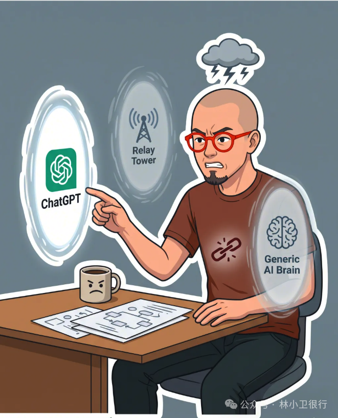
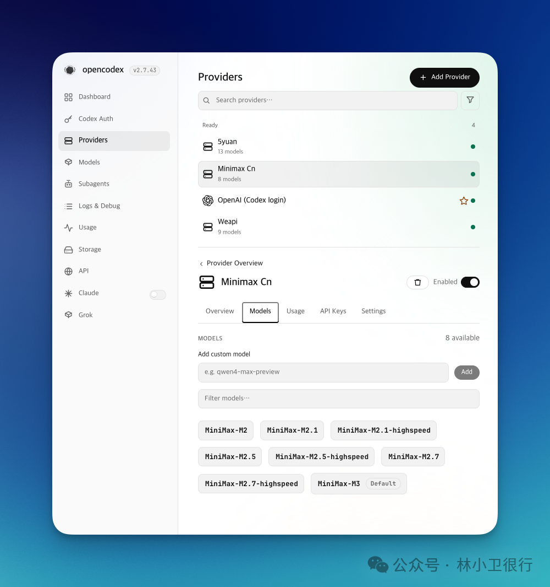
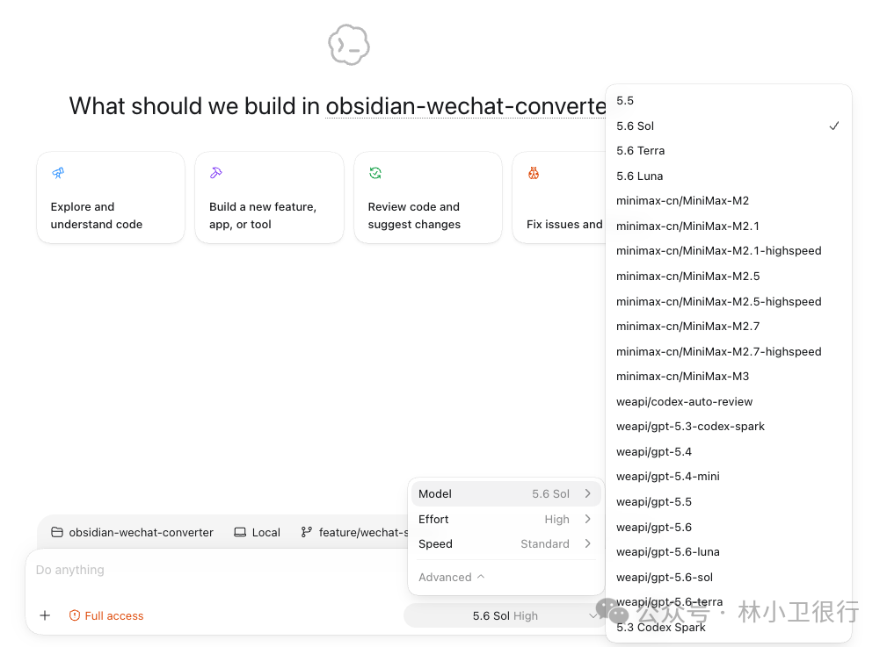
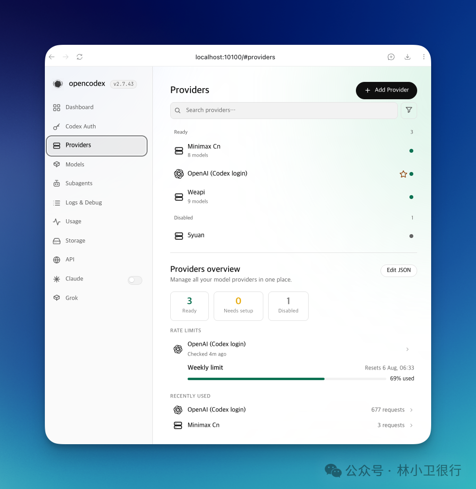
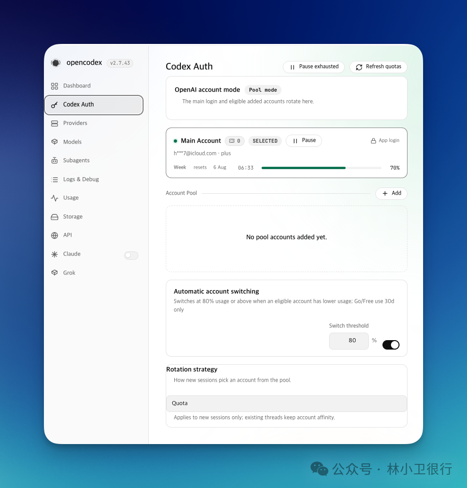

# 用 OpenCodex 统一管理 Codex 的模型切换

故事是这样的。我电脑上装了 CC Switch 和 CodeX++，都是帮 Codex 切模型的工具。一开始觉得挺好，但用久了发现一个麻烦：我需要在ChatGPT Plus 登录态、GPT 中转站、MiniMax / DeepSeek之间来回切。每次的流程都是：打开工具 → 切供应商 → 重启 Codex → session 丢了。特别是ChatGPT Plus 的额度用完了之后，要切换到中转站，额度重置后又要赶紧切回来。来来回回的，每次都得走上面这套流程，很繁琐。而且，CC switch 偶尔还会出现对话记录丢失的问题。来回切换模型的Codex界面所以我就想：能不能在 Codex 里面直接切换模型呢？Codex 只认一个入口后来找到了 OpenCodex。说白了就是在中间插一层本地代理。以前：我要换模型 → 打开切换工具 → 改配置 → 重启 Codex → 丢 session现在：Codex → http://127.0.0.1:10100/v1 → OpenCodex → 上游 providerCodex 固定指向 OpenCodex，所有上游在 OpenCodex 里统一管理。用的时候直接 Codex 的界面上模型的位置切换就行。思路本身不复杂，但恰好解决了我的核心问题。Codex 不用再重启了，session 也不会再丢了。第一次接触安装启动很简单：123npm install -g @bitkyc08/opencodexocx start --port 10100curl http://127.0.0.1:10100/healthz代理起来之后，日志提示了一句话，让我愣了一下：你的 Codex 配置使用的是 custom provider，所以 OpenCodex 没有自动接管 Codex。我当时脑子里几个问题同时冒出来：是不是因为用了 CC Switch？要先退出吗？Base URL 填了之后 Key 填什么？要不要把 CC Switch 的配置删掉？现在回头看都是基础问题，但恰恰是这种"基础问题"最值得写。很多文档默认你是有一定基础的，但是下载实际上很多人比方说我，其实还是小白一个。把链路搭通关键认知是：Codex 指向本地 OpenCodex 时，不需要填真实的上游 API key。在~/.codex/config.toml里把 custom provider 的 base_url 指向 OpenCodex，Key 填一个 placeholder 就行：123456[model_providers.custom]name="OpenAI"requires_openai_auth=truesupports_websockets=truewire_api="responses"base_url="http://127.0.0.1:10100/v1"Key 填ocx-local这种就行。真正的 API key 应该填在 OpenCodex 的 provider 配置里，不是填在 Codex 里。这个边界搞清楚之后，我的选择就很简单了：Codex 固定接 OpenCodex，不再用 CC Switch 和 CodeX++ 去动配置。那些工具如果只是安装着不动，一般问题不大。只要别继续改~/.codex/config.toml。配完 provider 回到 Codex 的模型列表，打开后没看到新加的。我后来直接查 OpenCodex 暴露的模型列表：OpenCodex模型列表结果已经在了。OpenCodex 没问题，只是 Codex App 的下拉列表没刷新。后来，重启一下 App 界面就好了。以后就直接切换就行了。Codex模型选择界面已生效日常OpenCodex 我顺手装成了系统服务（ocx service install），随系统启动，不用管它。日常只需要只需要上他的 GUI 界面添加供应商就行了OpenCodex Dashboard添加供应商如果有多个账号的话，还可以都添加进来，opencodex 可以根据用量自动切换。OpenCodex多账号管理界面最后这次折腾之后，最大的变化不是装了一个新工具，而是想清了一个边界：Codex 只负责用模型，OpenCodex 负责管模型从哪里来。以前我最烦的不是模型不够多，而是每次切换都要重启、重启就丢 session。现在 Codex 不再需要重启了，session 就不会丢。所以如果你也在多个模型和 provider 之间切来切去，我建议你先想一个问题：你希望谁来做唯一的入口？边界清晰了，很多事情就没那么纠结了。OpenCodex配置完成后更清爽附：命令速查12345678910111213141516171819202122232425262728# 安装npm install -g @bitkyc08/opencodex# 查看版本ocx --version# 启动ocx start --port 10100# 安装系统服务（macOS launchd，开机自启）ocx service install# 查看运行状态ocx status# 健康检查curl http://127.0.0.1:10100/healthz# 查看 OpenCodex 暴露的模型curl -s -H'Authorization: Bearer ocx-local'\http://127.0.0.1:10100/v1/models# Codex 指定模型codex -m weapi/gpt-5.5codex -m 5yuan/gpt-5.5# OpenCodex Web Dashboardopen http://localhost:10100/

故事是这样的。

我电脑上装了 CC Switch 和 CodeX++，都是帮 Codex 切模型的工具。一开始觉得挺好，但用久了发现一个麻烦：我需要在ChatGPT Plus 登录态、GPT 中转站、MiniMax / DeepSeek之间来回切。每次的流程都是：打开工具 → 切供应商 → 重启 Codex → session 丢了。

特别是ChatGPT Plus 的额度用完了之后，要切换到中转站，额度重置后又要赶紧切回来。

来来回回的，每次都得走上面这套流程，很繁琐。而且，CC switch 偶尔还会出现对话记录丢失的问题。

所以我就想：能不能在 Codex 里面直接切换模型呢？

## Codex 只认一个入口

后来找到了 OpenCodex。说白了就是在中间插一层本地代理。

以前：我要换模型 → 打开切换工具 → 改配置 → 重启 Codex → 丢 session

现在：Codex → http://127.0.0.1:10100/v1 → OpenCodex → 上游 provider

Codex 固定指向 OpenCodex，所有上游在 OpenCodex 里统一管理。用的时候直接 Codex 的界面上模型的位置切换就行。

思路本身不复杂，但恰好解决了我的核心问题。Codex 不用再重启了，session 也不会再丢了。

## 第一次接触

安装启动很简单：

123npm install -g @bitkyc08/opencodexocx start --port 10100curl http://127.0.0.1:10100/healthz

123npm install -g @bitkyc08/opencodexocx start --port 10100curl http://127.0.0.1:10100/healthz

123

1

2

3

npm install -g @bitkyc08/opencodexocx start --port 10100curl http://127.0.0.1:10100/healthz

npm install -g @bitkyc08/opencodexocx start --port 10100curl http://127.0.0.1:10100/healthz

代理起来之后，日志提示了一句话，让我愣了一下：

> 你的 Codex 配置使用的是 custom provider，所以 OpenCodex 没有自动接管 Codex。

你的 Codex 配置使用的是 custom provider，所以 OpenCodex 没有自动接管 Codex。

我当时脑子里几个问题同时冒出来：是不是因为用了 CC Switch？要先退出吗？Base URL 填了之后 Key 填什么？要不要把 CC Switch 的配置删掉？

现在回头看都是基础问题，但恰恰是这种"基础问题"最值得写。

很多文档默认你是有一定基础的，但是下载实际上很多人比方说我，其实还是小白一个。

## 把链路搭通

关键认知是：Codex 指向本地 OpenCodex 时，不需要填真实的上游 API key。

在~/.codex/config.toml里把 custom provider 的 base_url 指向 OpenCodex，Key 填一个 placeholder 就行：

123456[model_providers.custom]name="OpenAI"requires_openai_auth=truesupports_websockets=truewire_api="responses"base_url="http://127.0.0.1:10100/v1"

123456[model_providers.custom]name="OpenAI"requires_openai_auth=truesupports_websockets=truewire_api="responses"base_url="http://127.0.0.1:10100/v1"

123456

1

2

3

4

5

6

[model_providers.custom]name="OpenAI"requires_openai_auth=truesupports_websockets=truewire_api="responses"base_url="http://127.0.0.1:10100/v1"

[model_providers.custom]name="OpenAI"requires_openai_auth=truesupports_websockets=truewire_api="responses"base_url="http://127.0.0.1:10100/v1"

Key 填ocx-local这种就行。真正的 API key 应该填在 OpenCodex 的 provider 配置里，不是填在 Codex 里。

这个边界搞清楚之后，我的选择就很简单了：Codex 固定接 OpenCodex，不再用 CC Switch 和 CodeX++ 去动配置。那些工具如果只是安装着不动，一般问题不大。只要别继续改~/.codex/config.toml。

配完 provider 回到 Codex 的模型列表，打开后没看到新加的。我

后来直接查 OpenCodex 暴露的模型列表：

结果已经在了。OpenCodex 没问题，只是 Codex App 的下拉列表没刷新。后来，重启一下 App 界面就好了。以后就直接切换就行了。

## 日常

OpenCodex 我顺手装成了系统服务（ocx service install），随系统启动，不用管它。日常只需要只需要上他的 GUI 界面添加供应商就行了

如果有多个账号的话，还可以都添加进来，opencodex 可以根据用量自动切换。

## 最后

这次折腾之后，最大的变化不是装了一个新工具，而是想清了一个边界：Codex 只负责用模型，OpenCodex 负责管模型从哪里来。

以前我最烦的不是模型不够多，而是每次切换都要重启、重启就丢 session。现在 Codex 不再需要重启了，session 就不会丢。

所以如果你也在多个模型和 provider 之间切来切去，我建议你先想一个问题：你希望谁来做唯一的入口？

边界清晰了，很多事情就没那么纠结了。

## 附：命令速查

12345678910111213141516171819202122232425262728# 安装npm install -g @bitkyc08/opencodex# 查看版本ocx --version# 启动ocx start --port 10100# 安装系统服务（macOS launchd，开机自启）ocx service install# 查看运行状态ocx status# 健康检查curl http://127.0.0.1:10100/healthz# 查看 OpenCodex 暴露的模型curl -s -H'Authorization: Bearer ocx-local'\http://127.0.0.1:10100/v1/models# Codex 指定模型codex -m weapi/gpt-5.5codex -m 5yuan/gpt-5.5# OpenCodex Web Dashboardopen http://localhost:10100/

12345678910111213141516171819202122232425262728# 安装npm install -g @bitkyc08/opencodex# 查看版本ocx --version# 启动ocx start --port 10100# 安装系统服务（macOS launchd，开机自启）ocx service install# 查看运行状态ocx status# 健康检查curl http://127.0.0.1:10100/healthz# 查看 OpenCodex 暴露的模型curl -s -H'Authorization: Bearer ocx-local'\http://127.0.0.1:10100/v1/models# Codex 指定模型codex -m weapi/gpt-5.5codex -m 5yuan/gpt-5.5# OpenCodex Web Dashboardopen http://localhost:10100/

12345678910111213141516171819202122232425262728

1

2

3

4

5

6

7

8

9

10

11

12

13

14

15

16

17

18

19

20

21

22

23

24

25

26

27

28

# 安装npm install -g @bitkyc08/opencodex# 查看版本ocx --version# 启动ocx start --port 10100# 安装系统服务（macOS launchd，开机自启）ocx service install# 查看运行状态ocx status# 健康检查curl http://127.0.0.1:10100/healthz# 查看 OpenCodex 暴露的模型curl -s -H'Authorization: Bearer ocx-local'\http://127.0.0.1:10100/v1/models# Codex 指定模型codex -m weapi/gpt-5.5codex -m 5yuan/gpt-5.5# OpenCodex Web Dashboardopen http://localhost:10100/

# 安装npm install -g @bitkyc08/opencodex# 查看版本ocx --version# 启动ocx start --port 10100# 安装系统服务（macOS launchd，开机自启）ocx service install# 查看运行状态ocx status# 健康检查curl http://127.0.0.1:10100/healthz# 查看 OpenCodex 暴露的模型curl -s -H'Authorization: Bearer ocx-local'\http://127.0.0.1:10100/v1/models# Codex 指定模型codex -m weapi/gpt-5.5codex -m 5yuan/gpt-5.5# OpenCodex Web Dashboardopen http://localhost:10100/
