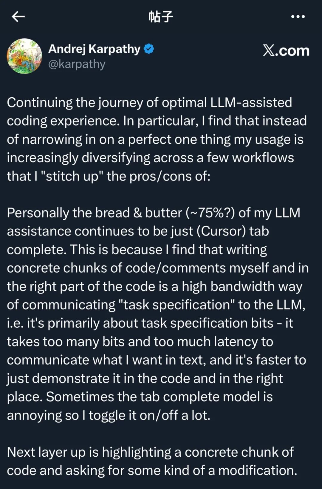

# 我这半年看过最好的 Vibe Coding 技巧

> Karpathy 的 Vibe Coding 2.0：后代码稀缺时代。Andrej Karpathy 在 X 上发布长推文阐述自己的三层 Vibe Coding 工作流——不要幻想万能 AI 工具，而应建立三层结构，让不同工具在不同场景各司其职，像接力赛一样完成开发任务。

<!-- more -->

## 作者信息

- **作者**：池建强
- **发布**：2025-09-01
- **来源**：解读 Karpathy 在 X 上的长推文

## 核心观点

> 不要幻想有一个万能的 AI 工具能解决所有编程问题，更可行的做法是建立一个三层结构，让不同的工具在不同场景各司其职，像接力赛一样完成开发任务。

## 三层 Vibe Coding 工作流

### 第一层：Cursor 自动补全（轻量需求）

Karpathy 日常开发中大约 **四分之三的时间**最依赖 Cursor 的自动补全。

**关键细节：用"演示"而非"自然语言"驱动模型**

Karpathy 不是用自然语言提示驱动 AI 写代码，而是更习惯在代码里写注释、写片段，用"演示"的方式告诉模型想要什么。

> 这种方式带宽更高、意图更明确，也避免了上下文缺失造成的偏差。

**Cursor 的缺点**：有时候太"热情"，会补全一大段不需要的内容，打断思路。所以他会频繁地开关这个功能，就像和一个"话痨搭档"保持距离。

### 第二层：Claude Code / Codex（中等规模功能）

遇到更大块的功能需求或不太熟悉的领域时，把舞台交给 Claude Code 或 Codex。

- 更适合快速生成一大段可用的代码实现
- 写 Rust、SQL 等复杂逻辑时可以立刻搭出来，调试和可视化也能很快跑通

**"后代码稀缺时代"**

生成和删除代码都变得轻而易举，代码从来不再是稀缺资源，实验和探索的成本被大幅降低。

> 你想尝试一个新思路？直接让 AI 写一版，跑不通就删掉，重新来过。

**AI 代码的缺点**：

- 喜欢堆砌复杂的抽象
- 滥用 try/catch
- 写得又长又冗余
- 缺乏工程品味

**AI 不擅长教学**

Karpathy 尝试让 Claude 在写代码的同时"上课"——解释为什么这么写，或帮忙做超参数调优，但这根本不起作用。

> 它真的想写代码，而不是解释任何东西。这从侧面也说明，AI 现在很擅长写东西，但讲解和教学还远没到位。

### 第三层：GPT-5 Pro（疑难问题）

当自动补全和 Claude 都不管用的时候，Karpathy 的"终极武器"是 GPT-5 Pro。

**做法**：把一整个疑难问题丢进去，让模型"沉思十分钟"，然后再看答案。

**GPT-5 Pro 擅长**：
- 发现人工难以发现的 bug 线索
- 抽象优化
- 文献综述中提供独到见解

> 这是他的"救火队长"。

## 工具组合哲学

这种三层结构让工作流更像一套生态：

| 层级 | 工具 | 场景 |
|------|------|------|
| 第一层 | Cursor 自动补全 | 轻量需求（4/5 的时间） |
| 第二层 | Claude Code / Codex | 大规模代码生成 |
| 第三层 | GPT-5 Pro | 疑难问题、bug 排查、抽象优化 |

> 相比依赖单一工具的思路，这更接近真实的开发场景，也更符合 AI 发展的现状。

## "周日胡思乱想"

Karpathy 还谈到"后代码稀缺时代"的焦虑。代码不再稀缺，但人的精力依旧有限。工具更新太快，总让人担心自己是不是落伍了，会不会错过了最前沿的可能性。他把这种状态称为 **"周日胡思乱想"**。

> 这正是当下许多开发者共同的心态。我们既兴奋于生产力的突飞猛进，又害怕自己无法驾驭这匹充满野性的骏马。

## 对普通开发者的启发

### 1. 放弃寻找完美工具的幻想，建立自己的工具组合

不同的任务难度需要不同的 AI，像调动一个虚拟团队一样，谁擅长什么就用谁。

> 一定要建立自己的工具组合，我现在就在这么干。

### 2. 用"代码里的意图"驱动模型

用注释和片段代替自然语言的空话，把注释和片段当作沟通语言，这样效率更高。

### 3. 不要忽视清理的过程

AI 生成的东西往往像半成品，需要你用工程师的直觉和审美去打磨。

## 结语

> 工欲善其事，必先利其器。只是到了今天，器不再是一把锤子、一个 IDE，而是多个快速迭代的 AI 工具。它们不再是静止的工具，而更像一群性格迥异的搭档。我们需要学会和它们合作，学会在噪音里保持判断，学会在洪流中找到自己的节奏。

## 关键洞察

1. **三层工具组合**：Cursor 自动补全（轻量）→ Claude/Codex（规模生成）→ GPT-5 Pro（疑难/救火），各司其职像接力赛
2. **"演示"优于"自然语言"**：用代码注释和片段驱动模型，比自然语言提示带宽更高、意图更明确
3. **Cursor 的"话痨"问题**：自动补全有时太热情，需要频繁开关，像和话痨搭档保持距离
4. **后代码稀缺时代**：生成和删除代码都变得轻而易举，实验成本大幅降低——新思路直接让 AI 写一版，跑不通就删
5. **AI 代码品质问题**：爱堆砌复杂抽象、滥用 try/catch、冗余、缺工程品味——需要人工像 code review 一样清理
6. **AI 不擅长教学**：让它解释为什么这么写根本不起作用，它只想写代码不想讲解——AI 写东西强但教学远没到位
7. **GPT-5 Pro 是救火队长**：疑难 bug、抽象优化、文献综述，丢进去沉思十分钟出答案
8. **"周日胡思乱想"**：后代码稀缺时代的焦虑——工具更新太快，担心落伍
9. **三个启发**：① 建立工具组合而非找完美工具 ② 用代码意图驱动模型 ③ 不要忽视清理过程
10. **AI 工具如搭档**：不再是静止的工具，更像一群性格迥异的搭档，需要学会合作和保持判断
