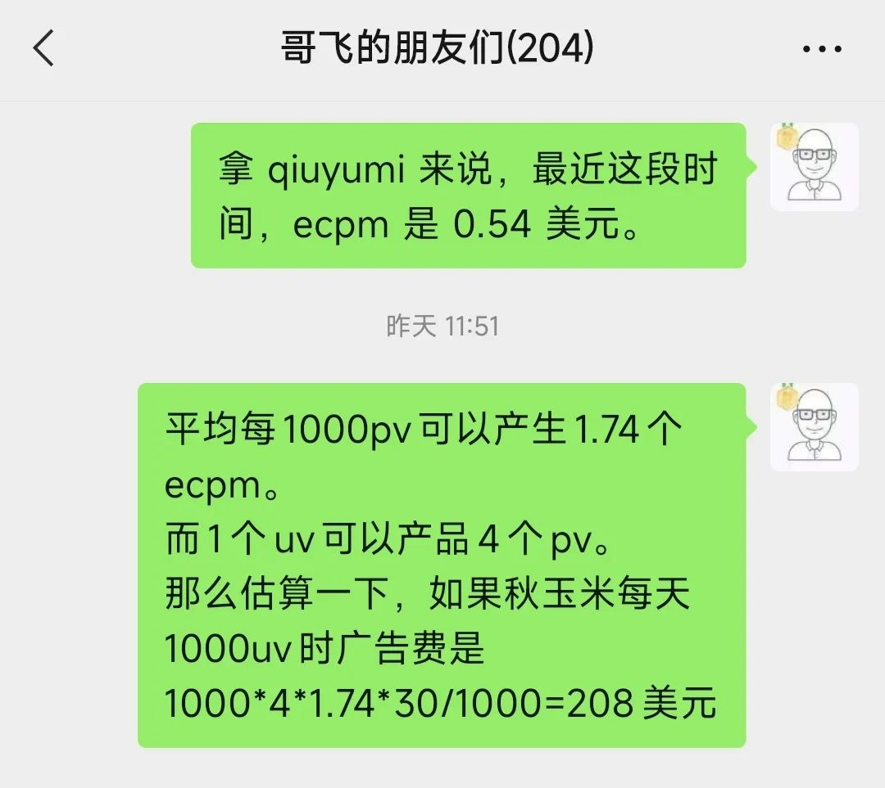
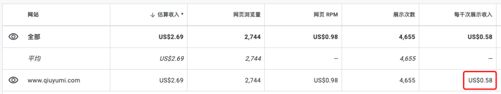
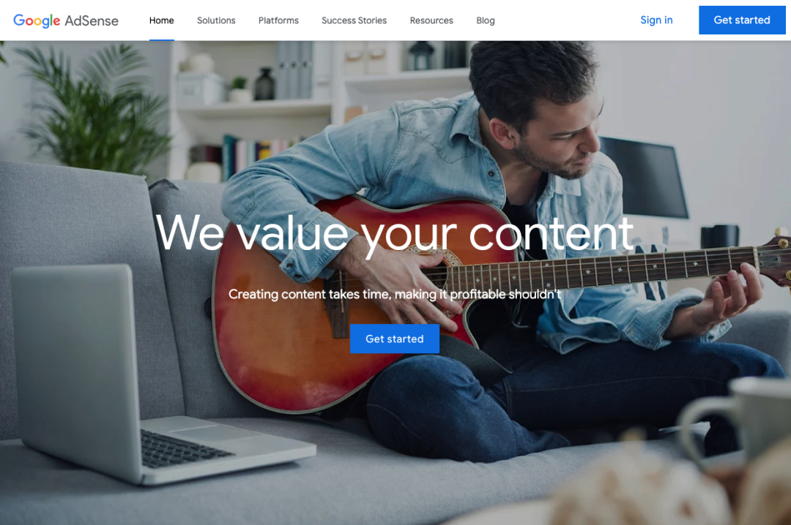
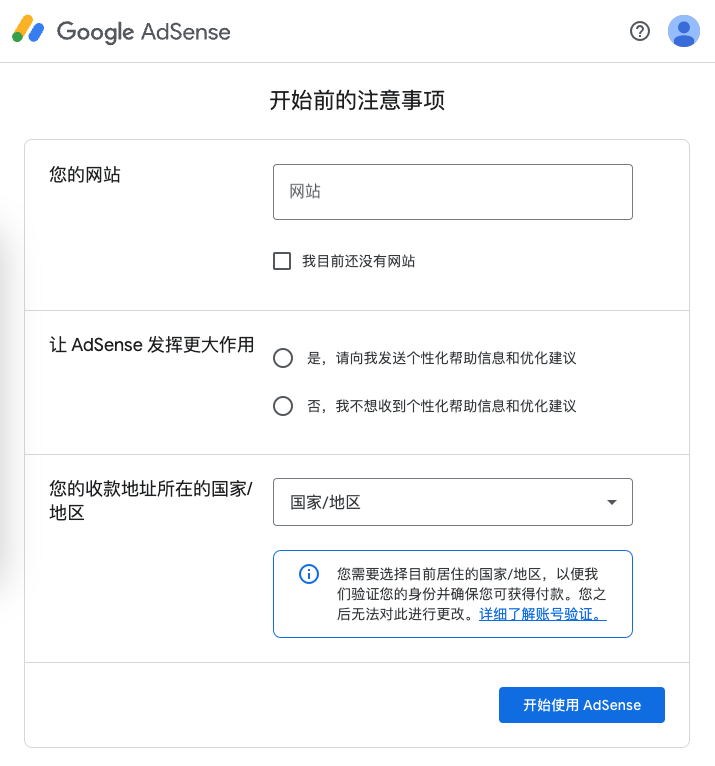
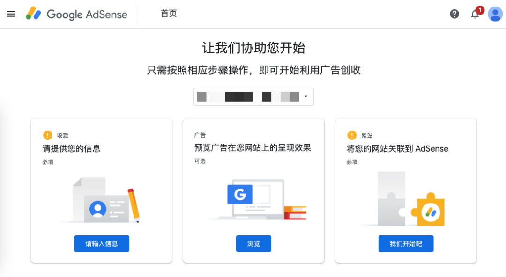
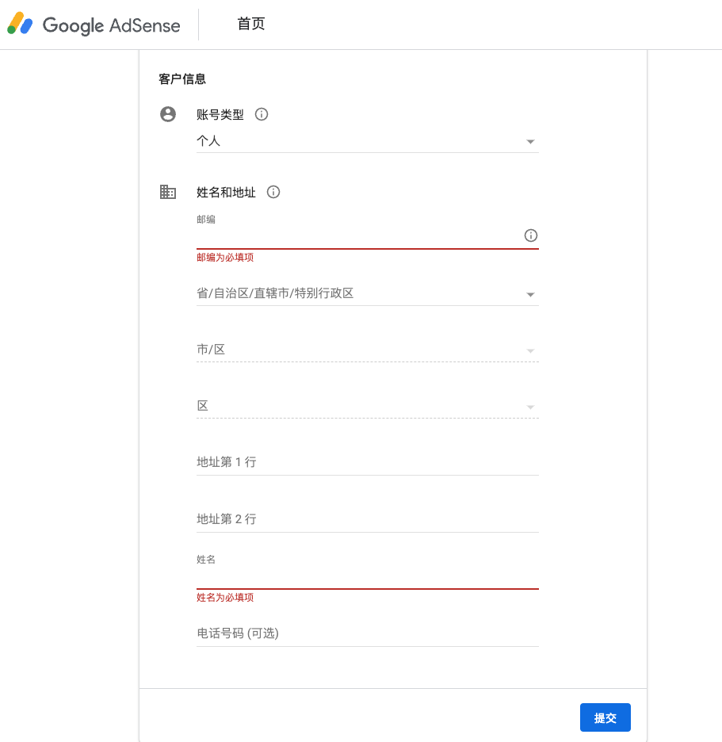
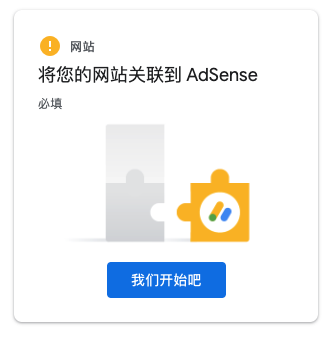
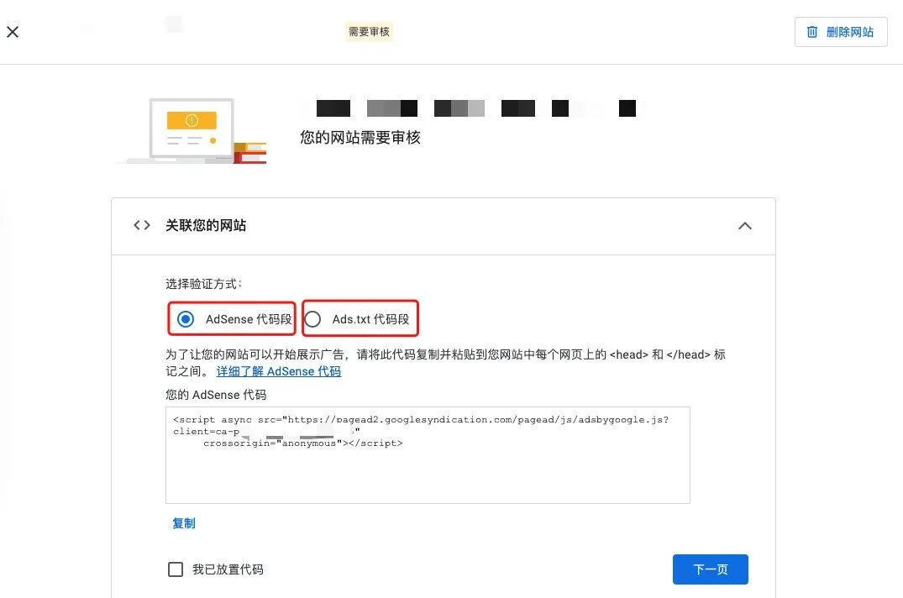
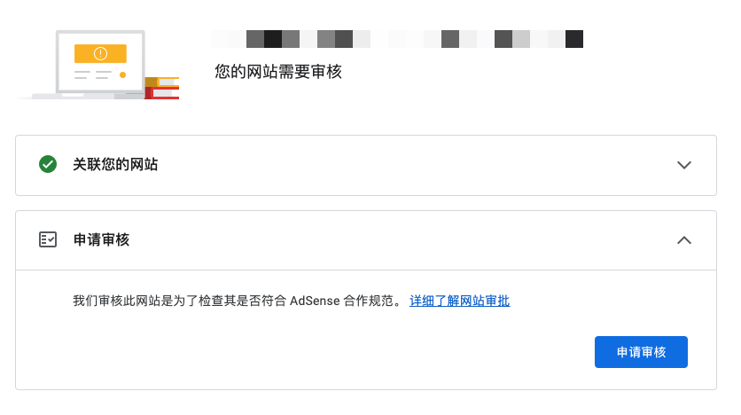
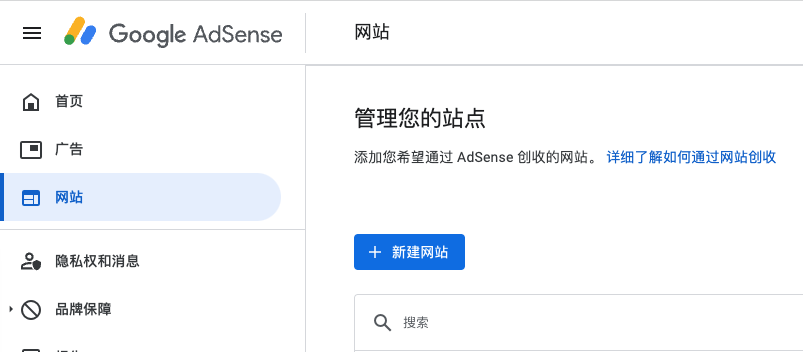

# Adsense 账号注册、审核、网站审核的一点经验分享

## Adsense 赚钱逻辑

Adsense 是谷歌推出的网站广告联盟。做好网站有流量之后，放 Adsense 广告代码，谷歌在网站显示广告，根据广告展示和效果给广告费。

每个网站情况不同，离钱越近的内容广告单价越高，发达国家流量广告单价更高。

## 中文站 vs 英文站 ECPM 对比

秋玉米（中文站）ecpm 为 0.54 美元，每天 1000 UV 每月赚 208 美元（约 1500 元人民币）。

而哥飞的英文站 ecpm 最高能达到 10 美元，是中文站的 18.5 倍。所以建议做海外网站，特别是给发达国家人民做网站。

## 账号注册步骤

### 准备工作

1. 需要有谷歌账号（Gmail），新注册的 Gmail 不建议立即注册 Adsense，先正常使用半个月一个月，养养号
2. 准备好其他海外账号

### 注册流程

1. 打开 [Adsense 官网](https://adsense.com/)，点击 Sign in 或 Get started

2. 添加一个用于账号审核的网站——如果你还没有网站，不建议注册 Adsense，先去做网站

3. 注册审核的网站要求有一定的流量。如果流量小，域名注册需大于 3 个月且有内容

4. 如果你还没有网站，建议先部署 Wordpress 博客，写原创博客，每天一到两篇，坚持半个月一个月再申请

5. 网站填顶级域名，不需要加 https 也不需要加路径，国家地区选择真实的中国（后续需要验证真实地址）

6. 填写真实个人信息，账号类型选择个人，姓名地址填中文

7. 获取广告代码放到网站里，审核期间不会真的显示广告

8. 关联网站，不仅需要复制广告代码，还需要在网站根目录添加 ads.txt 文件，两个验证方式都需要做

9. 验证通过后，点击"申请审核"

## 审核流程

第一次审核时间较长，流程：
1. 谷歌爬虫检查是否添加了广告代码和 ads.txt 文件
2. 统计一段时间网站流量
3. 爬虫抓取网站页面，看内容多少
4. 进入人工审核

如果流量少、内容少，大概率被打回。

## 关于域名注册时间的误区

网上的教程说域名一定要注册 3 个月以上才能申请 Adsense，但这是针对内容少流量小的网站。哥飞社群有朋友 7 月注册域名，8 月就通过审核，不到一个月，唯一原因就是谷歌知道他的网站有流量。

## 已有账号添加新网站

找到管理站点页面，点击"新建网站"，按步骤添加域名即可。

## 付款流程

1. 账号审核通过后开始显示广告
2. 满 100 美元才付款
3. 需填写真实地址，等待谷歌从美国邮寄 Pin 码信件
4. 收到 Pin 码后在后台输入，才算实名通过
5. 如果收不到信件可申请重发（最多 3 次）
6. 3 次都没收到，可申请线上实名认证，上传身份证信息，最好还上传站在地址旁标志性建筑旁拍摄的照片