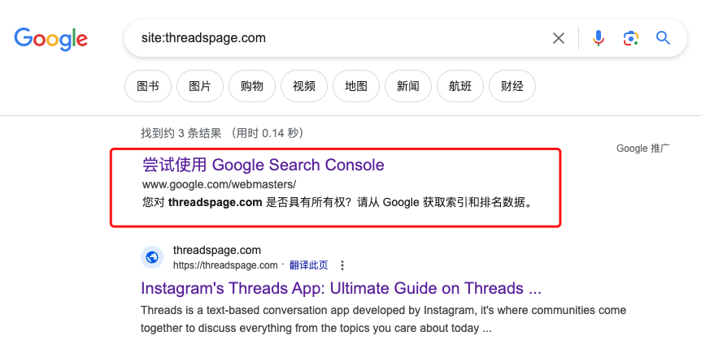
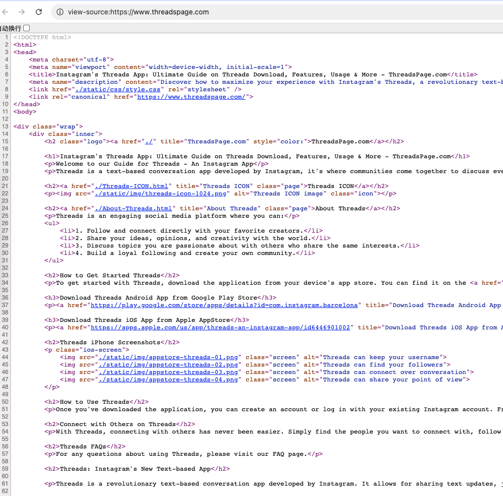

# 人人都能学会的英文网站 Adsense 赚钱入门

## 流量思维

创建网站的目的是从搜索引擎吸引流量。承接流量后就是转化。今天分享最简单的方法：直接用网站承接流量，通过 Adsense 广告赚取收入。

## ECPM 与收入计算

- 千次展示收入（ECPM）因网站内容、关键字、服务人群不同而异
- 高的接近 10 美元，低的 2 美元
- 一页放三个广告位，一个 PV 有三次展示
- 每 1000 次展示 ≈ 330 PV ≈ 110 人（假设每人浏览 3 页）
- 330 个 PV 就有 10 美元收入，每 11 个人就有 1 美元

数据好的网站每千次展示 10 美元，差的也有 2 美元。英文站收入高，中文站（如 ChatPlugin.top）ECPM 只有 0.2 美元，差 10 倍。所以建议做英文站（可加多语言支持）。

## 为什么做网站

赚钱有多种方式：向用户收费最直接（工具、服务、内容），但操作复杂。广告变现最简单：网站做好放那里不用管，放 10 年都有收入。

不能只依赖一个网站，需要创建更多网站才有更多收入。

## 网站类型选择

要放置 Adsense 代码，需要有网站。网站类型：

### 内容站
- 需要大量内容且持续更新
- 以前费精力，现在有 ChatGPT 后可批量生成
- 有批量生成能力就做内容站

### 工具站
分两种：
- **纯前端工具站**：json、base64、MD5 等，无需后端，静态页即可部署
- **后端工具站**：如域名查询（连 whois 服务器）、推特视频下载（解析网页），需要服务器

现在用 Vercel、Cloudflare Workers 等平台可免费部署后端。

**不懂编程就做纯前端工具站**：前端代码易调试，现在用 ChatGPT 生成即可。

## 如何找需求

1. 自己经常使用的工具（如字数统计）
2. 工具大全类网站看热门工具（tool.lu 等），模仿使用次数多的

字数统计示例：etest.com 月访问 30 万，wordcounter.net 月访问 700 多万。

## 单域名单站做单关键词策略

不能只做一个页面，因为别人有先发优势、权重更高。需要：

- **独立域名，一个域名只做一个工具**
- 不一定要全新注册，可买别人放弃的老域名（有搜索引擎权重）
- 以关键字为主注册域名

### 关键词扩展

一个工具扩展多个关键词，每个词做一个页面：
- IP 查询 → IP 查询、IP 转换、IP 位置查询等
- 每个页面有 title、h1、h2，增强关键词权重
- 一个页面只做一个关键词，避免权重分散
- 内页链接指向首页，把权重收回首页

### 首页索引

首页用 index.html（index 即索引），把所有关键词页面都索引进来：
- 首页添加所有内页链接
- 内页用关键字指向首页：`<a href="首页网址" title="关键字描述">关键字</a>`

## 页面 SEO 细节

### title
最重要的标签，搜索引擎判断页面主要内容。每个页面一个 title，一个关键词。

### description
搜索结果三行：链接、标题、描述。用关键词描述页面，吸引点击。

### H1/H2/H3 标签
每个页面只放一个 H1，H1 与页面开头权重几乎相同。H2、H3 进一步解释 H1。

### 图片
- 每个内页放一张大图，尺寸大于 A4 纸（不是 200×300 小图）
- 每张图片的 alt 和 title 写好
- 图片搜索引擎里 alt 权重高，能排到前面

## 让搜索引擎收录

收录是第一步，只有收录才有排名、流量。

### 快速收录方法

- 找高权重网站放链接（国内：知乎、掘金；国外：V2EX 等）
- 爬虫抓取新内容，顺链接找到你的网站
- 哥飞实验：在 V2EX 发链接，不到一小时被谷歌收录

### 主动提交

- 用 `site:域名` 命令，添加网站到站长工具
- 制作 sitemap.xml 网站地图，提交给谷歌，定期爬取

## 外链建设

外链重要性：
1. 吸引爬虫进入网站
2. 作为背书（高权重网站链接你的网站，搜索引擎认为可信）—— PageRank 核心原理

建外链方法：交换外链、内容新奇吸引媒体采访、提交到 Producthunt、YC Hackernews 等。不推荐黑帽 SEO 手法。

## 耐心等待

SEO 效果需要时间，可能一个月、半年才见效。做完后只能耐心等待。

## 其他流量来源

- **社交网络传播是获取流量最快的方法**
- 热门新 App 初期内容供不应求，积极上传内容跟随平台成长，可能百万千万粉丝
- 国内：抖音、小红书、知乎、掘金、V2EX、CSDN（CSDN 搜索引擎权重高）
- 国外：Tiktok、YouTube、Facebook
- 搜索引擎优化 SEO 是漫长过程，只能靠耐心等待

## 实操案例

一个工具大站 9% 流量来自关键词 "How to screen shot on windows"（如何在 Windows 截图）。

**思路**：开发工具费时间，但开发一个页面只要一两个小时。先做页面、完善层级结构、让搜索引擎收录，获得流量后再开发工具。

## GPT 辅助建站

- 所有内容和代码可用 GPT 实现
- 不做复杂框架，手写 HTML
- 让 GPT 生成 Markdown 再转换
- 让 GPT 分析有一定搜索量的关键词，找到可注册域名
- 让 GPT 针对每个关键词生成内容、做内页

## 关键词选择

- 一个关键词一个域名，每个域名投入几十块钱
- 寻找能做到的、有一定流量的关键词
- 每天一两百万搜索量的热词放弃（无法与竞争对手抗衡）

## 收入截图

网站的收录时间示例：

