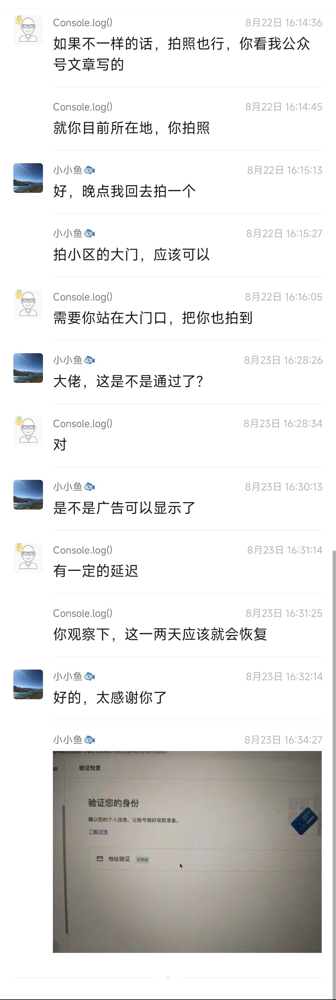

# Adsense 如何收取 Pin 码与实名认证

## Pin 码机制

当网站被审核通过、广告费满 10 美元后，谷歌会从美国邮寄一封实体信件（平信，非挂号信），内含 Pin 码。收到后在 Adsense 后台输入，证明实人实地信息，即可真正开始赚钱。

## 信件丢失处理

由于是跨国平信，丢失率较高。如果收不到信件：

1. 每次谷歌提示信件已寄出后两周，检查是否可以点击"再次发送 Pin"按钮
2. 凑满 3 次后，可点击链接进入人工审核申请：https://support.google.com/adsense/workflow/11033519
3. 上传身份证照片 + 在你填写的地址旁的地标旁拍摄的照片（你和地标名称需同时入镜）

按这个方法，有朋友昨天提交，今天就被提示审核通过了。

## 经验总结

- Pin 码信件是平信，从美国邮寄，丢失率较高
- 连续发送 3 次都没收到后才能进入人工申请
- 人工审核时上传身份证 + 地址旁地标照片，一次通过率很高