# 我如何通过SEO和Adsense优化，把一个网站广告收入从每月八百多美元提升到每月两千多美元

2016 年 6 月收入 874 美元，7 月翻倍到 1475 美元，11 月达到 2100 美元。关键时间点在 6 月底，哥飞做了三件事：

1. 重写网站前后端，优化网站速度
2. 着重做站内 SEO 处理
3. 优化 Adsense 广告位布局

## 改版前的网站状况

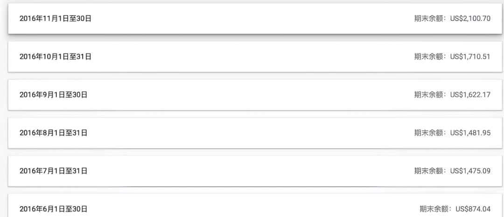

这是一个列表式网站，首页和分类页面都是列表，只有顶部一个广告位。

详情页也只有一个广告位。

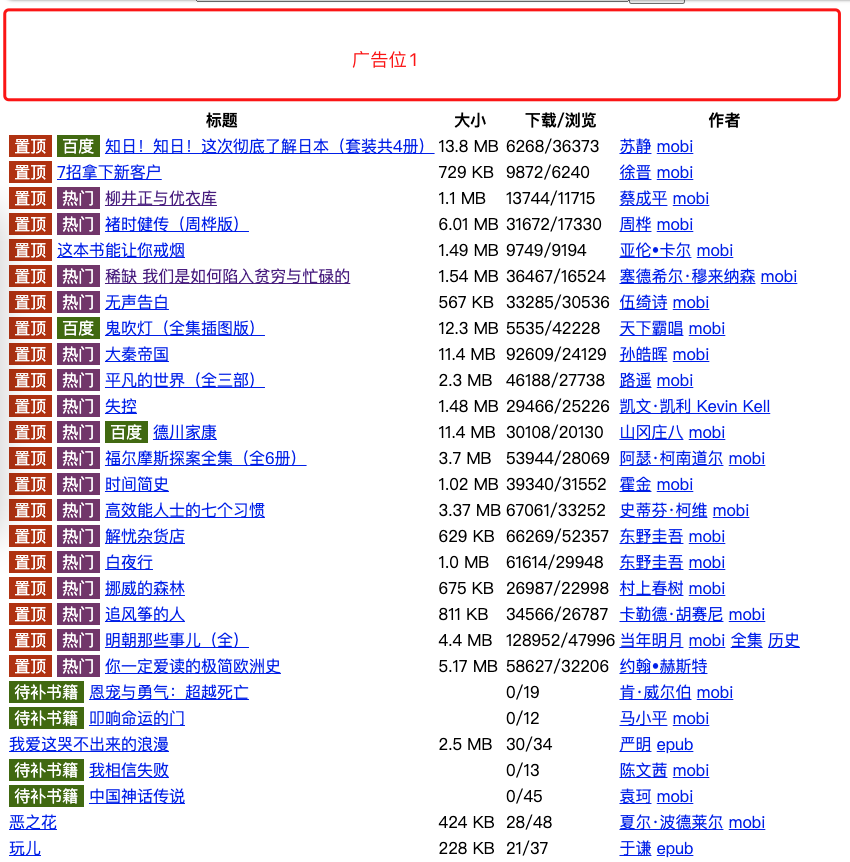

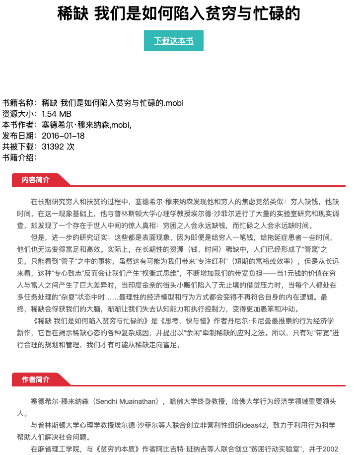

## 发现的问题

1. 网页打开速度慢，要加载好长时间
2. 下载服务器和网站服务器没分开，下载拖慢网页
3. 查找书籍不方便
4. 广告位太少，没有合理利用流量

## 改版方案

### 技术重写

原代码用 PHP 直接在渲染 HTML 时查询数据库，循环里继续查询。用 PHP CodeIgniter 框架重写，重新设计数据库表结构。6 月 25 号上线新版。

**关键**：改版时，新版 URL 必须与旧版一致（已被搜索引擎收录），如分类页 `domain.com/book/keji.html`、书籍页 `domain.com/book/view/9.html` 要保持不变。

### 新版 UI 设计

卡片式布局，一行放 4 本书，增加书籍封面，一页放 3 个广告位。

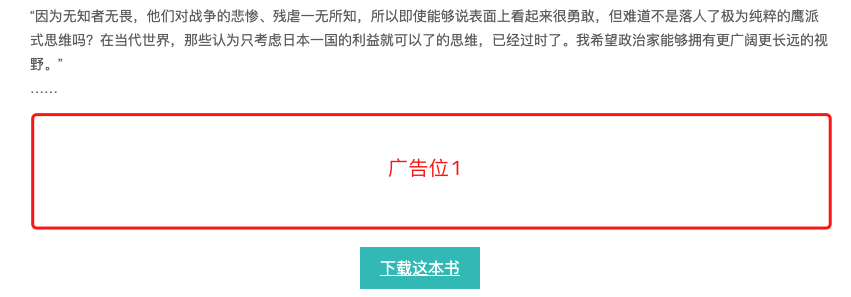

### 首页 SEO 优化

首页 title 和 description 编写：

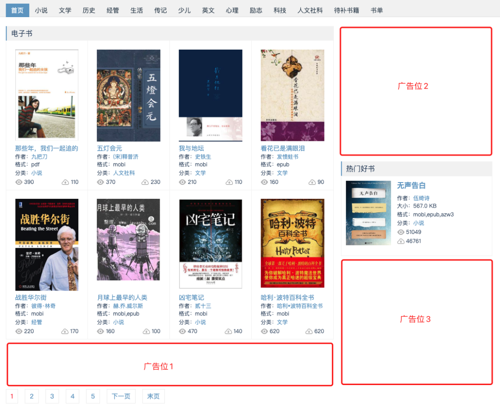

首页 h1 写网站名称和 slogan：

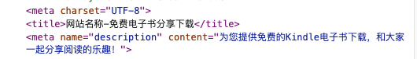

### 详情页 SEO 优化

一页三个广告位，标题格式为 `{书籍名称}-网站名称-通用关键字`，描述格式为 `{书籍名称}是{作者}的作品，网站名称为您提供{书籍名称}免费……`。

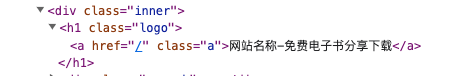

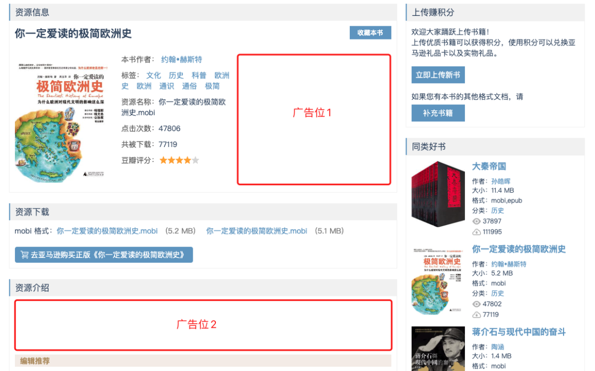

HTML 中，h1 标签放书籍名称：

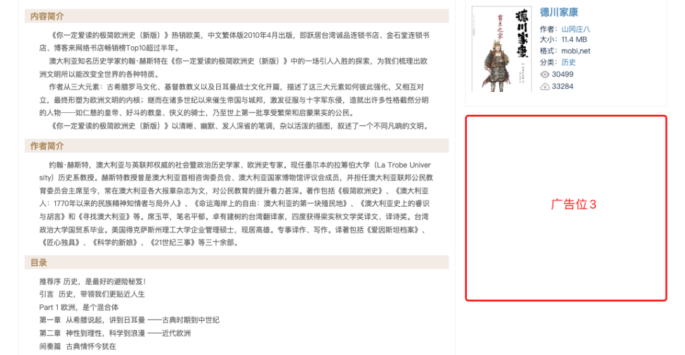

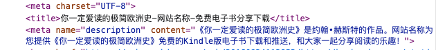

### 分类页 SEO 优化

分类页与首页 UI 类似，标题格式为 `{分类名称}-网站名称-slogan`，描述格式为 `{分类名称}类……，网站名称为您提供……`。

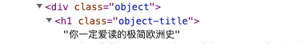

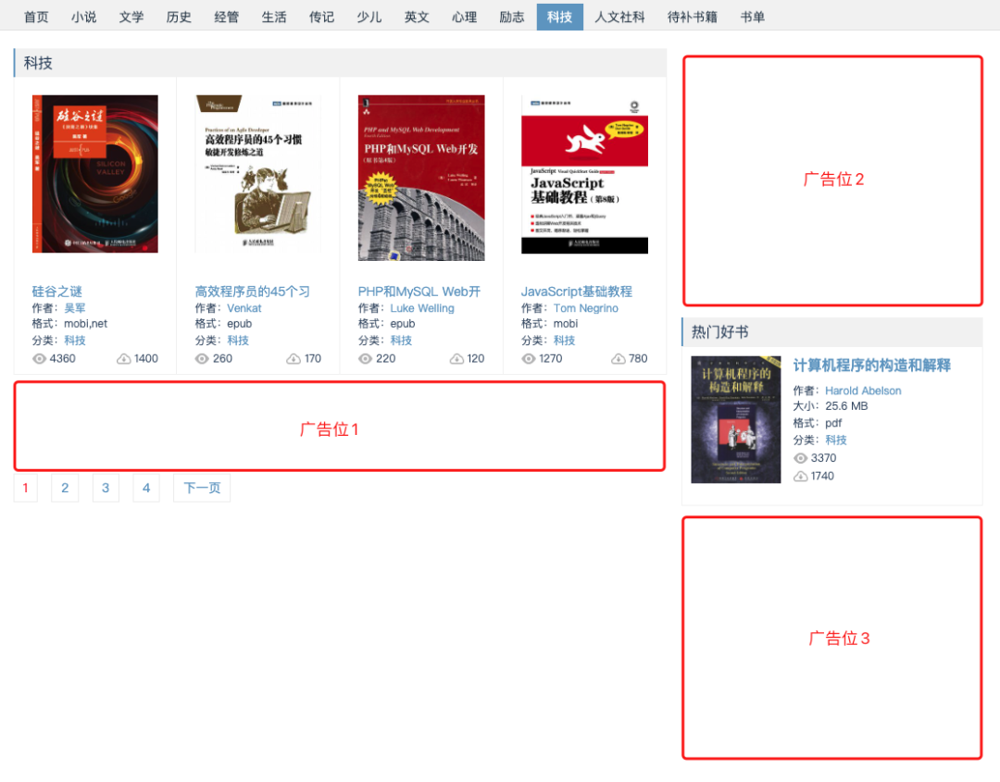

分类页 h1 直接是分类名称：

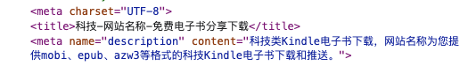

### 标签页

新增标签页面，聚合相同标签下的不同书籍，同样放三个广告位。

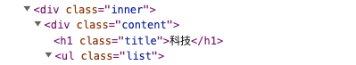

标签页标题格式为 `标签:{标签名称}-网站名称-slogan`，但当时忘记写描述：

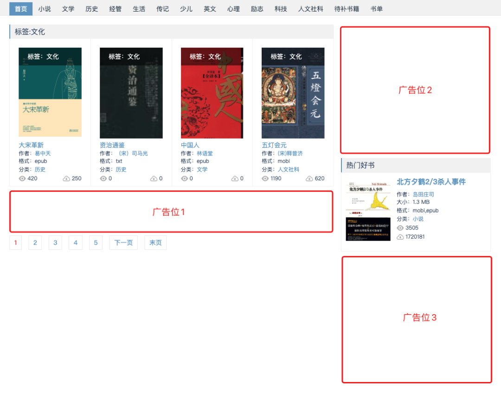

h1 直接写 `标签:{标签名称}`：

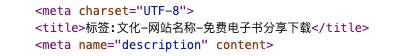

### 作者页

作者名称被当作特殊标签处理，聚合该作者的所有书籍。

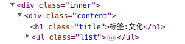

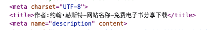

### 搜索功能

新增搜索功能，方便查找书籍。

## 每页广告位数量

所有页面都放满 3 个广告位，这是谷歌 Adsense 文档推荐的最大数量。

## 改版效果

### 次日效果

新版上线第二天，UV 和 PV 都比前一天涨了很多。原因：老代码运行太慢，用户发现搜索结果后要等很久才打开，直接关掉。新版解决性能问题，所有搜索引擎流量都能承接住。

### 持续增长

UV 涨 → PV 涨（新增标签页、搜索页，PV/UV 比例增加）→ 广告展示数量暴涨 → 广告费暴涨。

7 月广告费变为 6 月差不多两倍。8 月几乎没涨，9 月、10 月、11 月持续增长，因为新版对搜索引擎更友好，被收录更多页面，搜索排名持续上升，流量越来越高。

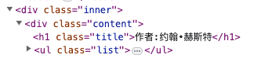

## 总结

优化一个网站的三个核心方向：
1. 技术性能优化（重写代码、分离下载服务器）
2. 站内 SEO 优化（title/description/h1 标签、URL 一致性、新增页面类型）
3. AdSense 广告位布局优化（每页 3 个广告位）

每个不同类型的页面，构造不同的网页标题格式和描述格式，是 SEO 的关键细节。