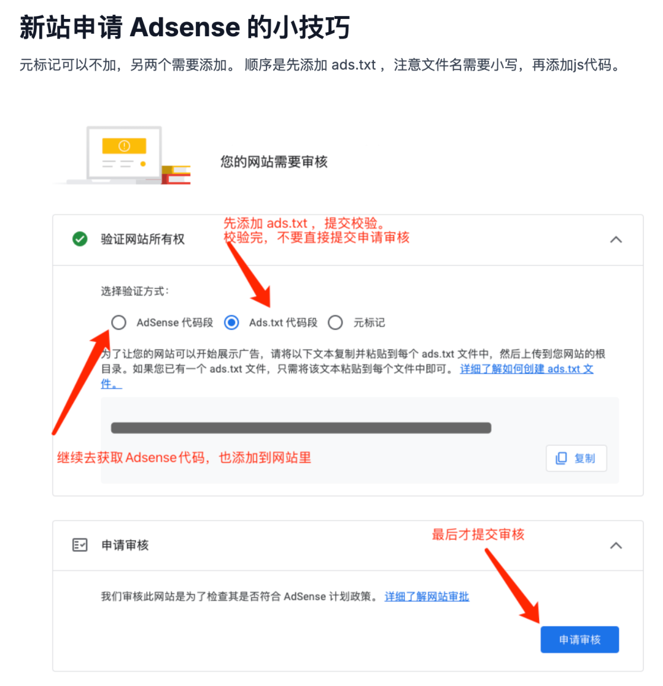
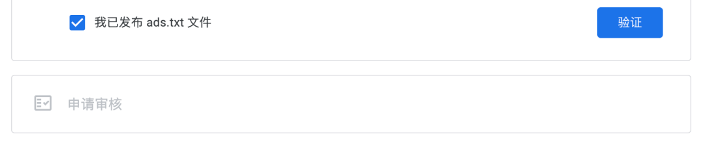
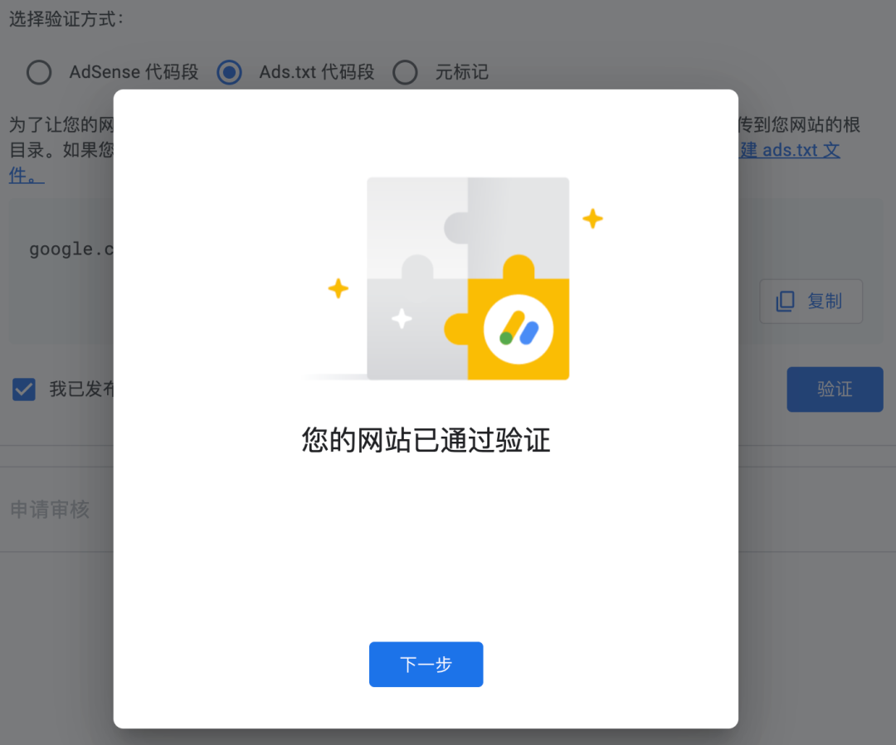
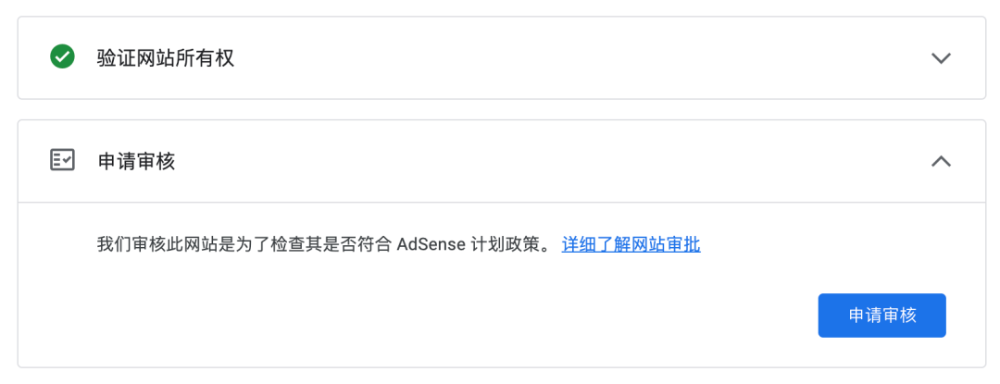
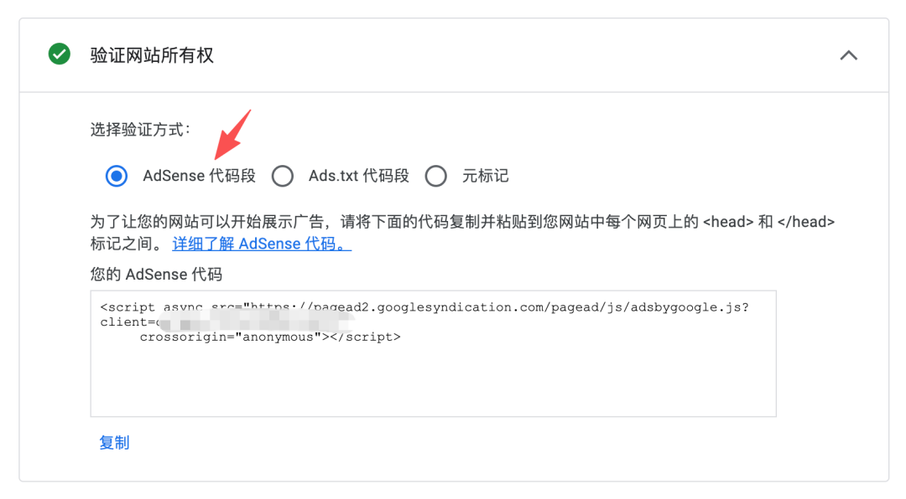
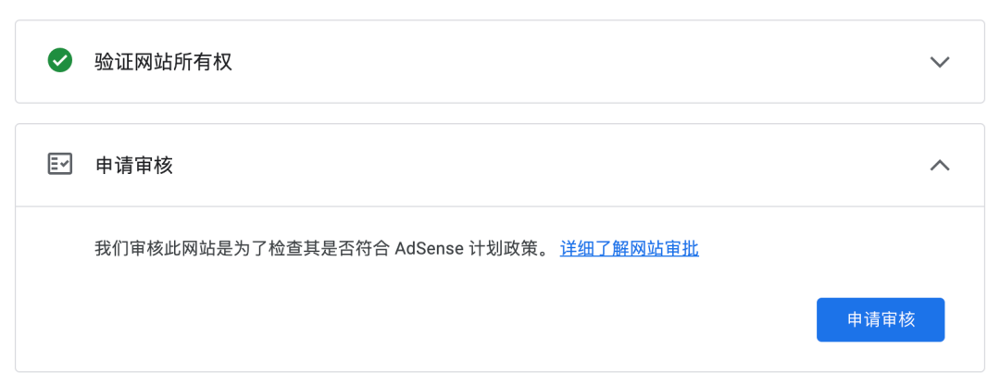
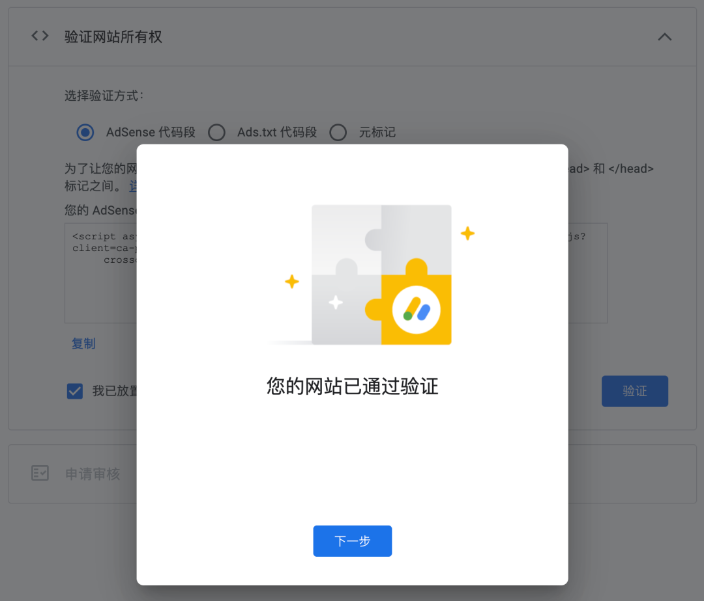
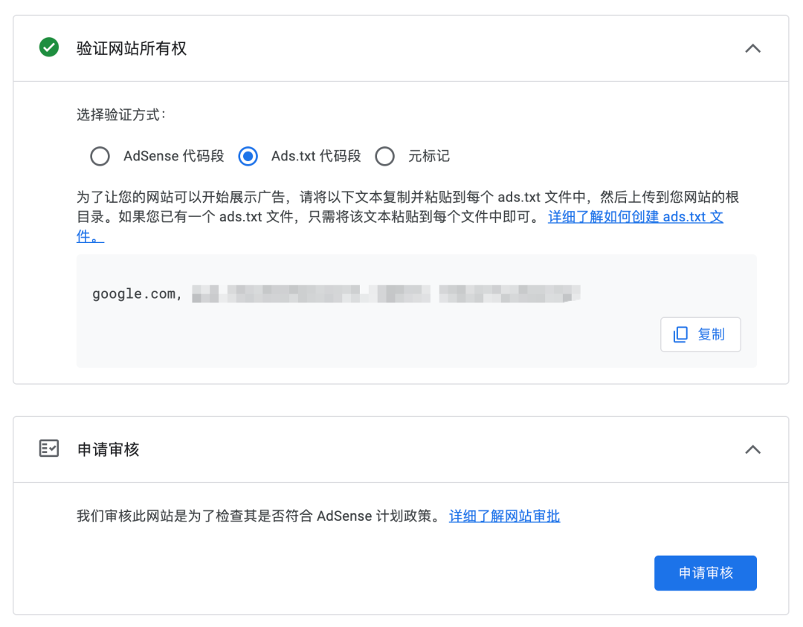
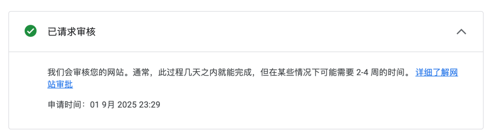

# Adsense 提交网站申请的小细节

哥飞给出的 Adsense 提交网站最佳实践：

## 三种验证网站所有权的方式

1. 网站里安装 Adsense 广告 js 代码
2. 网站根目录下增加一个 ads.txt 文件（注意不是 Ads.txt）
3. 网站首页 meta 里增加一行代码

## 最佳实践步骤

1. 先添加 ads.txt 文件，添加之后，确保浏览器里使用 `域名/ads.txt` 可以打开文件，看到里边的一行文字

2. 回到 Adsense 后台，选择 Ads.txt 验证方式，勾选底下的"我已发布 ads.txt 文件"，点击"验证"按钮进行校验

3. 如果正确放置了 ads.txt 文件，就会显示下面的验证通过提示

4. 这时候不要点击"申请审核"按钮，而是点击"验证网站所有权"那行文字右侧的向下箭头，展开下面界面

5. 切换到"Adsense 代码段"验证方式，获取 js 代码，放置到网站每一个网页 html 的 head 里去

6. 之后才是点击"申请审核"按钮，提交申请

## 为什么一定要先验证 ads.txt 文件？

如果三个都放了，但不先验证 ads.txt 文件，而是直接选择先验证 Adsense 代码段，之后点击下一步：

会发现展开之后，再想验证 ads.txt，已经没有"我已发布 ads.txt 文件"的选择框和"验证"按钮了。

直接点击"申请审核"按钮，提交审核虽然能成功：

但回到网站列表，会显示"ads.txt 状态"是"未找到"：

## 为什么选择验证代码片段而非 meta 标记？

两个好处：

1. **优先审核**：添加 js 代码到网站后，审核期间谷歌能监测到网站访问量。有流量的网站能优先被审核（前提是网站做得像一个正规、正式、完善的网站）

2. **无缝变现**：审核通过后，可以立马打开自动广告，不浪费一丝流量。而如果没提前准备，需要打开电脑、拿到 js 代码、部署更新，时间上可能来不及

## 核心要点

SEO 和 Adsense 审核都是细节活。在一处细节比别人做得好没多大作用，但如果处处细节都做好了，综合优势就会比竞争同一关键词的网页强，最终拿到靠前的排名。