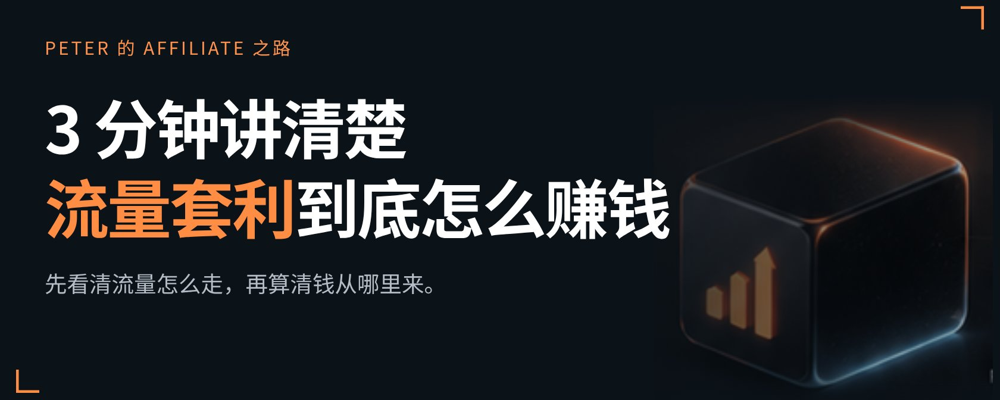
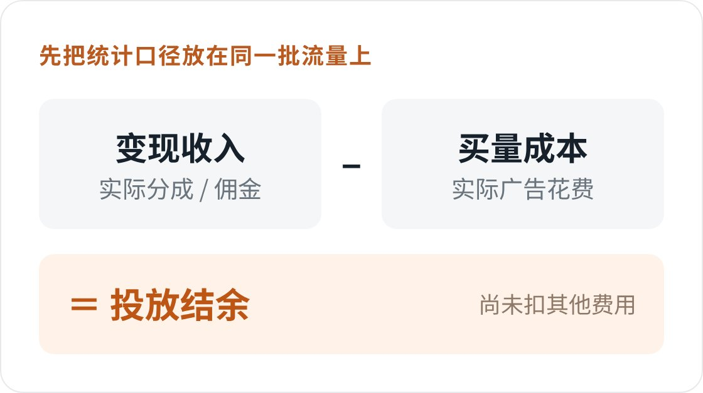
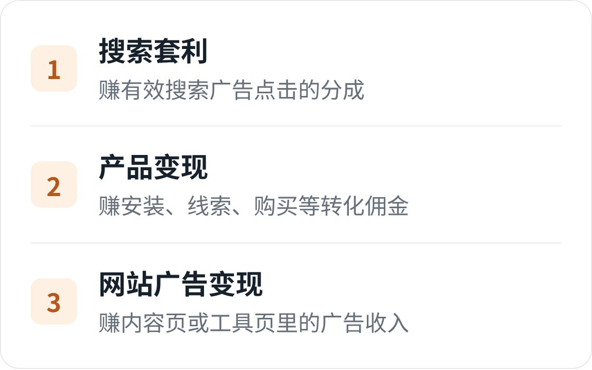
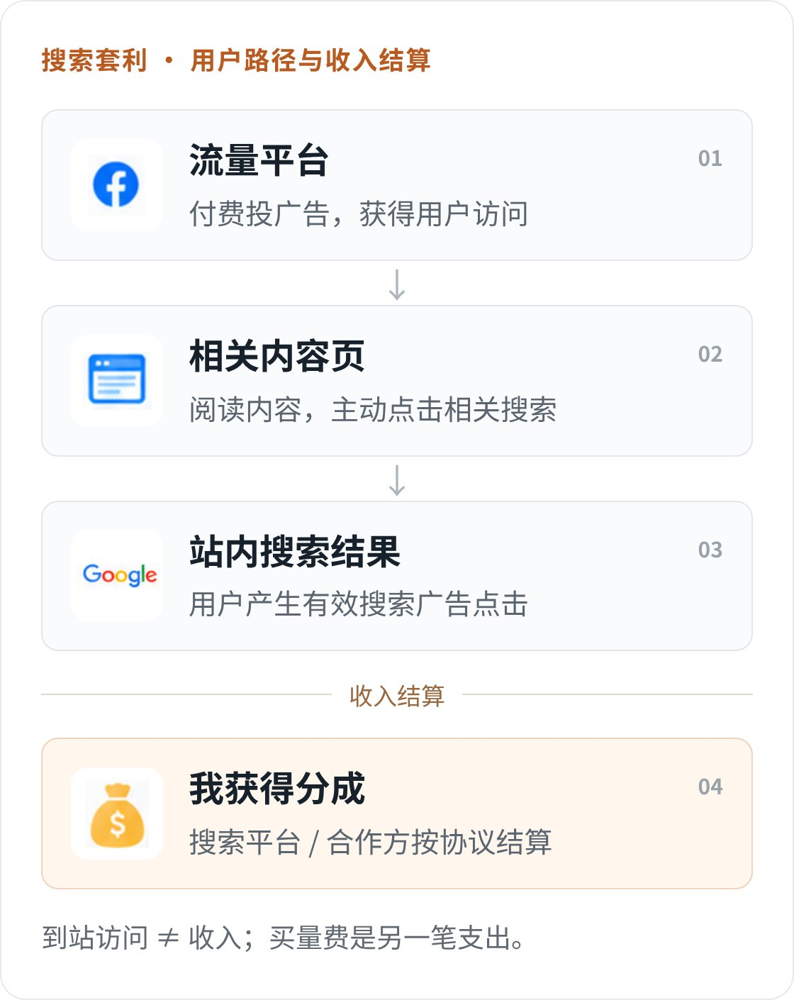
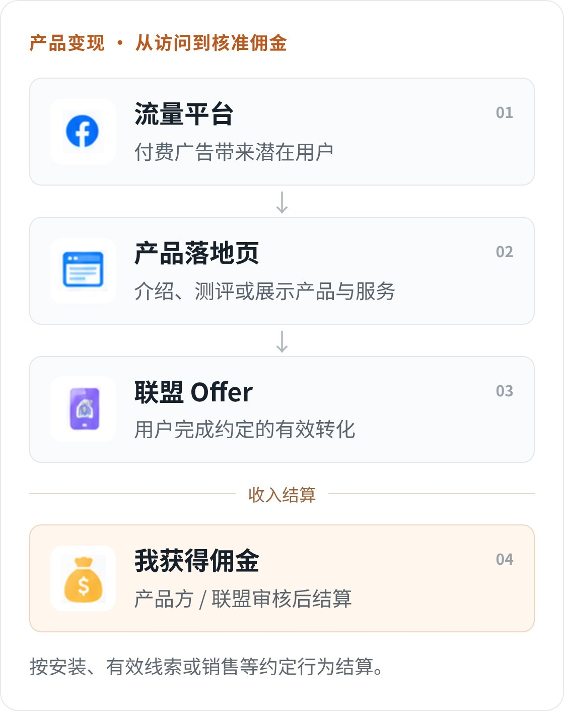
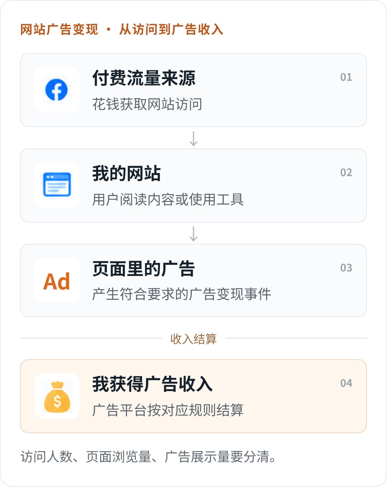
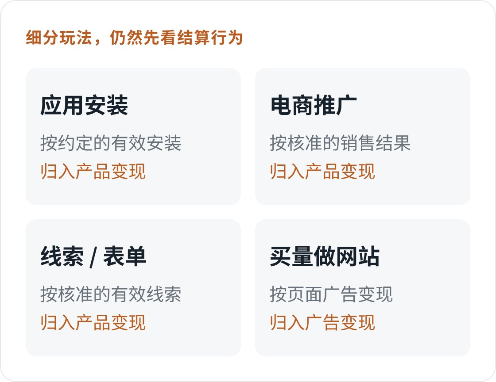

# 3 分钟讲清楚流量套利到底怎么赚钱

Hi，我是 Peter。

今天专门写一篇跟流量套利相关的文章，希望对感兴趣的朋友有帮助！

## 01 什么是流量套利？

流量套利，就是先花钱获取流量，再通过广告或产品变现，争取让收入超过获客成本。

听起来像"低买高卖"。但你不是把同一个人从 Facebook 搬到另一个平台，就自动赚到了差价。你买到的是一次触达、一次访问，最后拿到多少钱，要看用户接下来做了什么。

假设我花 100 美元投广告，这批流量最终带来 130 美元可结算收入，扣完广告费，剩下 30 美元。

这 30 美元是投放结余，还没扣工具、服务器等其他费用。按广告费计算，投放 ROI 是 30%，不是 130%，也不是"赚了 30 美元"这个金额本身。

名字叫套利，但不是无风险套利。成本先花出去，收入能不能回来、回来多少，要靠真实投放验证。

## 02 流量套利有哪些形式？

我把它拆成三个常见出口：搜索套利、产品变现、网站广告变现。 一个个看，钱从哪来就清楚了。

1. 搜索套利

先看一种常见路径：用户在 Facebook 看到我的广告，点击进入一篇相关内容；对某个问题感兴趣，再主动点击相关搜索词，进入站内搜索结果页。

页面里可以展示搜索广告，用户产生有效广告点击，才带来相应收入。

谁给我钱？最终是投搜索广告的广告主。 广告费经过搜索平台及合作方，按协议分成结算给我；我买 Facebook 流量的花费，则是另一笔支出。不能把广告主付出的整笔点击费，当成自己的收入。

假设我花 100 美元买来 1,000 次访问，其中产生 200 次有效搜索广告点击，每次分到我手里 0.60 美元。

一笔示例账：

收入：200 × 0.60 = 120 美元
扣广告费后：120 − 100 = 20 美元

这里最容易算错：买入一次访问只花 0.10 美元，卖出一次广告点击分到 0.60 美元，看起来差了六倍。但不是每个进来的人都会继续点击，最终只剩 20 美元。

它赚的是整条路径跑完后的差价，不是两个点击单价直接相减。

2. 产品变现

这一次，我不靠页面上的搜索广告赚钱，而是推广别人的产品或服务。用户完成约定行为，我拿佣金。这就是付费买量与 Affiliate 推广重叠的地方。

谁给我钱？产品方直接付，或者通过联盟结算。 他们买的不是"来过一次"，而是安装、有效线索、购买等具体结果。按安装结算常见 CPI，按线索是 CPL，按销售是 CPS；具体什么才算有效，必须看项目条件。

假设我花 100 美元推广一款软件，带来 10 笔最终核准的付费转化，每笔佣金 15 美元。

一笔示例账：

收入：10 × 15 = 150 美元
扣广告费后：150 − 100 = 50 美元

注意，我赚的是 15 美元佣金，不是软件卖价。假如同样花 100 美元，最后只有 4 笔核准转化，收入就变成 60 美元，亏 40 美元。

因此，佣金高不等于好做。每次转化的佣金、转化率、买量成本，要一起看。

之前聊过的"永久佣金"，讲的是佣金能分多久；这里讲的是为了拿到佣金，先花了多少获客成本。即使项目约定了续费分成，也不能把尚未发生的多年续费，当成今天已经赚到的钱。

3. 网站广告变现

第三种，我把流量带到自己的网站，让用户阅读文章、使用工具，再通过网站里的广告获取收入。以 AdSense 内容广告为例，发布商获得的是广告收入分成，不需要先卖出自己的产品。

谁给我钱？仍然是广告主的预算，经广告平台结算给网站。 与前面搜索套利的区别是，这里主要利用内容页面中的广告位变现，而不是专门把用户带入搜索广告点击路径。不同广告产品的结算方式不能混为一谈。

假设花 100 美元带来的访问，一共形成 10,000 次页面浏览，这批页面的 RPM 是 12 美元。页面 RPM 就是每千次页面浏览对应的收入。

一笔示例账：

收入：10,000 ÷ 1,000 × 12 = 120 美元
扣广告费后：120 − 100 = 20 美元

这里算的是页面浏览，不是用户人数，也不是买量平台的广告展示。一千次上游展示，可能只带来几十次访问；一次访问，又可能浏览多个页面。

所以，不能看到卖方 CPM 比买方 CPM 高，就认定有利润。先把统计口径对齐。

还有哪些细分玩法？

按这篇的分类，应用安装、电商推广、有效表单，都放在"产品变现"里理解；买访问再通过站内广告变现，则放在第三类。名字可以很多，先看钱到底因为什么行为结算。

Affiliate 也不一定要花钱买流量：通过文章、社群推广产品，同样可以拿佣金。Affiliate 讲合作与佣金，买量套利讲成本与回收。 两者有交集，不是完全同义。

## 03 普通人怎么开始？

建议不是先注册一堆平台，而是先跑通一笔完整的账。

先确认怎么收钱。选一个变现项目，搞清楚接受什么流量、什么行为才付钱、如何审核和结算。能充值买量，不等于流量被变现端接受。比如 Google 对流量来源、内容质量和真实点击都有要求，不能靠误导、诱导点击或虚假流量把账做绿。

再把数据接起来。用追踪工具关联广告、访问和转化，把广告费与对应的收入对上；别拿今天的成本，去减一笔日期或统计范围不同的收入。

然后才花钱测试。先设能承受的亏损上限，测一个流量来源、一个变现出口。先回答"这笔钱有没有赚回来"，再回答"能不能多投一点"。

最后才谈扩量。一小时变绿，不代表长期盈利；投 100 美元有利润，也不能直接推算投 1 万美元会按比例赚钱。

我现在让 AI 参与投放和优化，也是想把重复工作交出去。但收入怎么确认、最多能亏多少、什么情况下必须停，这些规则不能省。

对我来说，值得留下来的，不只是一条今天赚钱的广告，而是下一次仍知道怎么测试、怎么算账、什么时候停。
