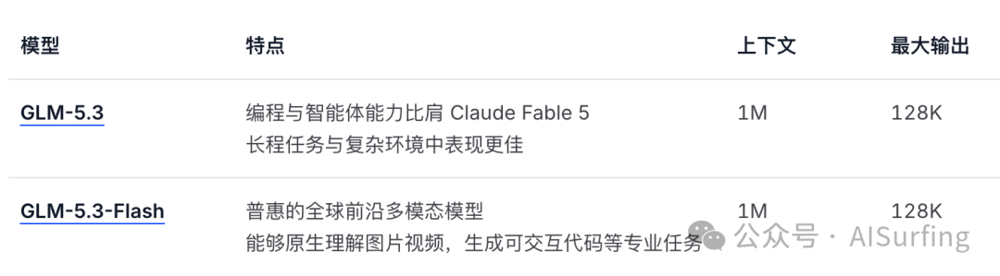
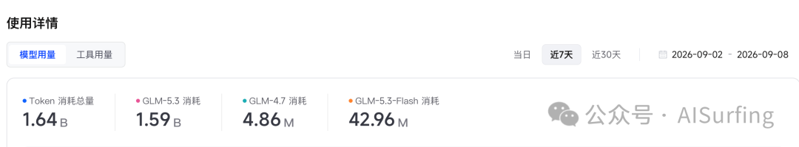
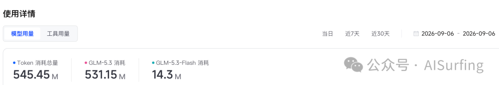
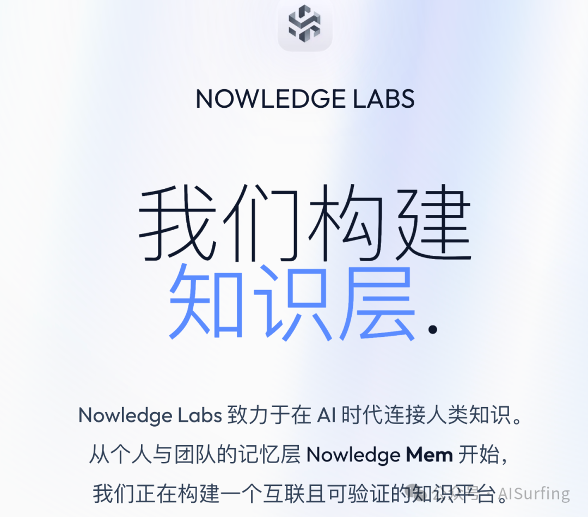
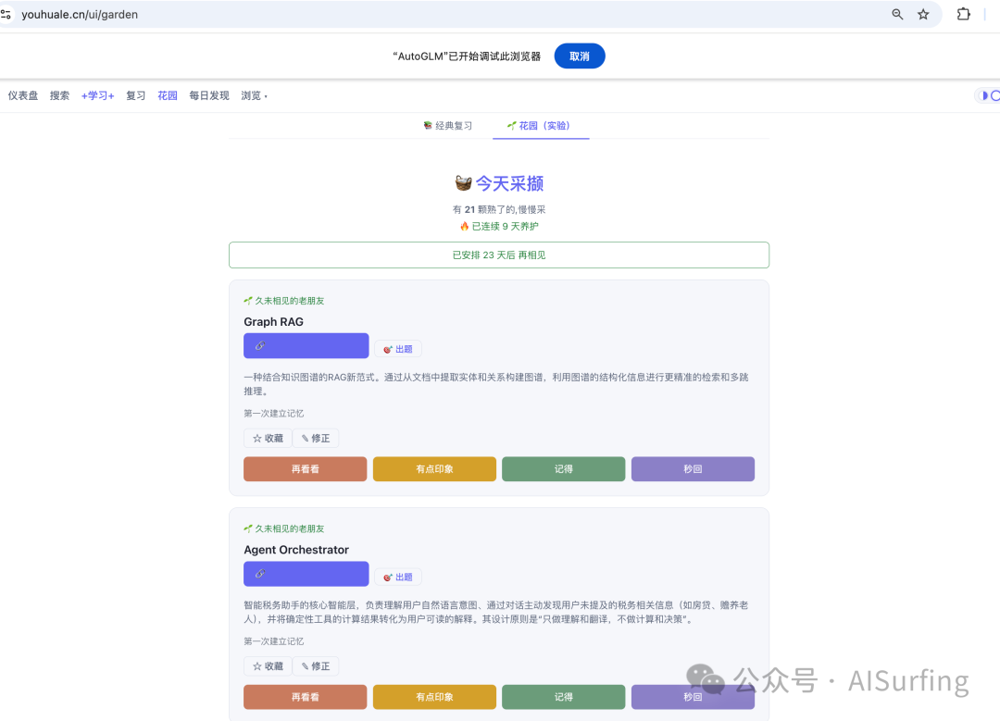
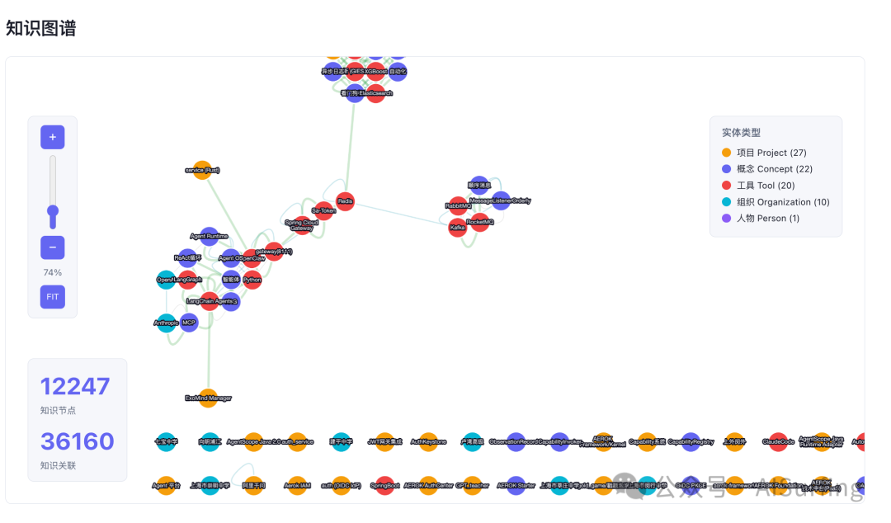

# Agent长记忆落地——会话越攒越多，我用的「摘要+检索+衰减」三层方案，效果还不错

先说结论：全量塞上下文这条路人走不通，我走了两周，被Token账单和注意力稀释双重毒打之后，才老老实实坐下来设计分层。

先说结论：

全量塞上下文这条路人走不通，我走了两周，被Token账单和注意力稀释双重毒打之后，才老老实实坐下来设计分层。

先讲我是怎么把上下文撑爆的

我有一个跑了快一年的个人助手Agent，每天帮我处理周报、公众号选题、代码审查。到今年六月，它的会话历史已经攒了三千多条。

一开始我的做法特别朴素：把所有历史记忆一股脑塞进system prompt。

反正模型上下文窗口大，1M呢，怕什么。

怕什么？账单来了你就不这么说了。

七月上旬我拉了一下数据：单次请求的prompt稳定在11万token上下，一天跑两百多次请求，光输入Token平均每天烧掉两三百多万。更伤心的是回答质量在肉眼可见地变差——我上周三问它"上个月那个公众号选题的规则"，它给我回了一段驴唇不对马嘴的东西，因为关键记忆被埋在十万token的噪声里，注意力早就稀释没了，模型就抓不住真正关键信息。

大上下文窗口是个 marketing 话术，不是工程方案。窗口越大，你越舍不得扔，越扔不动，最后就是又贵又傻。难道"Less is more"也适用于此处

死路确认。那就分层。

三层方案：摘要、检索、衰减

我的设计思路很简单：不同年龄、不同相关性的记忆，价值完全不同。三个月前"今天天气不错"的闲聊，和昨天刚定下的发布规范，凭什么用同一种方式存？

所以我按生命周期把记忆拆成三层。

第一层：滚动摘要压旧对话。

超过最近20轮的会话，不再保留原文，而是用一个便宜模型（我用的是deepseek-chat，便宜是硬道理）滚动生成摘要。注意"滚动"两个字——不是每次全量重新摘要，而是旧摘要+新增对话→新摘要，增量更新。

def roll_summary(old_summary: str, new_turns: list[str]) -> str:prompt = ("以下是助手记忆的旧摘要和新对话，""合并为一份不超过500字的摘要，""保留事实、决策、用户偏好，丢弃寒暄和过程性内容：\n"f"旧摘要：{old_summary}\n"f"新对话：{'\\n'.join(new_turns)}")return llm.chat(prompt, model="deepseek-chat")

def roll_summary(old_summary: str, new_turns: list[str]) -> str:prompt = ("以下是助手记忆的旧摘要和新对话，""合并为一份不超过500字的摘要，""保留事实、决策、用户偏好，丢弃寒暄和过程性内容：\n"f"旧摘要：{old_summary}\n"f"新对话：{'\\n'.join(new_turns)}")return llm.chat(prompt, model="deepseek-chat")

这一层做完，记忆体积直接从11万token压到8000以内，压缩率93%。是的，会丢细节，我一开始也肉疼——但丢的细节里有90%是"好的""收到""我再看看"这种废话，真丢了也不心疼。

第二层：向量检索捞相关记忆。

摘要解决的是"背景"，解决不了"精准回忆"。用户问"那个Embedding选型的结论是什么"，靠摘要肯定捞不出来，得靠检索。

每条重要记忆（决策、偏好、项目事实）单独存成结构化条目，向量化后进SQLite+余弦相似度（我的场景数据量小，pgvector都嫌重）。每次请求前，拿当前用户输入做query，捞top 5条最相关的记忆拼进prompt。

def recall(query: str, top_k: int = 5) -> list[MemoryItem]:q_vec = embed(query)hits = sorted((item for item in store.all()),key=lambda m: cosine(q_vec, m.vec),reverse=True,)return hits[:top_k]

def recall(query: str, top_k: int = 5) -> list[MemoryItem]:q_vec = embed(query)hits = sorted((item for item in store.all()),key=lambda m: cosine(q_vec, m.vec),reverse=True,)return hits[:top_k]

这一步是质量的分水岭。加上检索层之后，那个"上个月选题规则"的问题，回答准确率从我体感的六成拉回九成以上——数字是我拿30个历史问题回测的，样本不大，但方向不会骗人。

第三层：时间衰减淘汰过期记忆。

前两层只进不出，三个月后照样爆炸。所以每条记忆带一个score，每次被检索命中就+1（说明还有用），随时间指数衰减，score低于阈值就归档移出向量库。

def decay(item: MemoryItem, now: float) -> float:days = (now - item.last_hit_at) / 86400return item.score * math.exp(-days/30)#半衰期约21天

def decay(item: MemoryItem, now: float) -> float:days = (now - item.last_hit_at) / 86400return item.score * math.exp(-days/30)#半衰期约21天

半衰期我设的30天。调参过程挺玄学的：设14天太激进，把"我住哪个城市"这种低频但关键的记忆衰减掉了；设90天则淘汰几乎不生效。30天+命中加成，实测最平衡。

记忆条目的数据结构

三层是骨架，真正的灵魂是记忆条目本身。我踩过最大的坑就是早期存的是自由文本段落，检索出来一大坨没法拼prompt。后来强制结构化：

@dataclassclass MemoryItem:id: strkind: str#decision|preference|fact|eventcontent: str#一句话，不超过100字source: str#来源会话idcreated_at: floatlast_hit_at: floatscore: floatvec: list[float]

@dataclassclass MemoryItem:id: strkind: str#decision|preference|fact|eventcontent: str#一句话，不超过100字source: str#来源会话idcreated_at: floatlast_hit_at: floatscore: floatvec: list[float]

两个设计决策说一下。

一是kind字段。

decision（拍板过的结论）、preference（用户偏好）、fact（客观事实）、event（发生过的事）四类分开存，检索时可以按类型加权——用户问流程问题时decision权重拉高，闲聊时event优先。不加这个字段之前，捞出来的记忆一半是没法用的。

二是content强制一句话。

摘要归摘要层管，单条记忆必须是原子的事实，"一句话说清、不依赖上下文也能懂"。这条约束让检索结果的可用率翻了一倍。

说实话，做完这套之后我回头看，最值钱的不是三层架构本身，而是"每条记忆必须原子化"这个规范。架构谁都能抄，规范抄不来——你的记忆库里躺着五百条"用户说了句话但没人知道重点"的垃圾时，什么检索算法都救不了你。什么是规范？哪些东西要存、哪些坚决不存、存之前必须提炼核心、无效噪声直接丢弃，不能什么原始对话都一股脑塞进去。

说实话，做完这套之后我回头看，最值钱的不是三层架构本身，而是"每条记忆必须原子化"这个规范。

架构谁都能抄，规范抄不来——你的记忆库里躺着五百条"用户说了句话但没人知道重点"的垃圾时，什么检索算法都救不了你。

什么是规范？哪些东西要存、哪些坚决不存、存之前必须提炼核心、无效噪声直接丢弃，不能什么原始对话都一股脑塞进去。

⚠️ 踩坑提醒：

别一上来就上Milvus这类重量级向量库。个人级Agent的记忆量撑死几万条，SQLite+暴力余弦检索毫秒级返回，等真到了瓶颈再迁移，迁移本身也就是个导出导入的事。

值不值得自己做

可能有朋友要问：Mem0这些现成方案不香吗？

香，我想说的是：自己搓一遍三层，你才知道记忆系统的复杂度藏在哪——不在算法，在数据结构和使用规范上。有了这层理解，用任何现成工具你都知道该盯哪些指标。

我这套方案全加起来不到400行Python，没有框架，没有外部服务，一个SQLite文件跑天下。它不优雅，衰减参数还带着玄学味道，但它让我的Token账单降了70%，回答质量反而上去了。

工程就是这样，能用的高于完美的。先跑起来，再等数据告诉你哪里该重构——记忆系统尤其如此，它本来就该跟你的Agent一起进化。

💡 一句话带走：

能查到的才是知识。记忆不是存得越多越好，是取得越准越好。

你的Agent记忆是怎么管的？也是全量塞上下文吗？卡在哪一步了，评论区拆一拆。

上周六听古老师分享Nowledge Labs的理念和发展方向时，收获了不少洞察，把好多脑子里有，但找不到词汇表达的信息都讲出来了。为什么有感触呢？是因为我也在做类似的一个东西，有共性也有不同。我做这个是因为有了AI加持，信息过载，很多东西脑子里都知道但讲不出来，原因是新名词多，相互之间在大脑中被稀释，然后就想着要不要手搓了什么工具来解决一下，在几个月前看到K神的Wiki LLM的方案后，就手搓了一下。还挺好用。

感觉兴趣的小伙伴可以试用一下。我现在主要是这样用的，安装cli，然后Claude Code和Codex与AI讨论和做项目时，把知识存到wiki llm中，然后再通过页面上的"花园"来复习。复习的数据也会再迭代wiki llm中的信息，如何往复。

也有图谱，会偶尔看看：

也会时不时看看洞察，有时候会有种打开了的感觉：

“原来这些知识点之间都是相通的”
