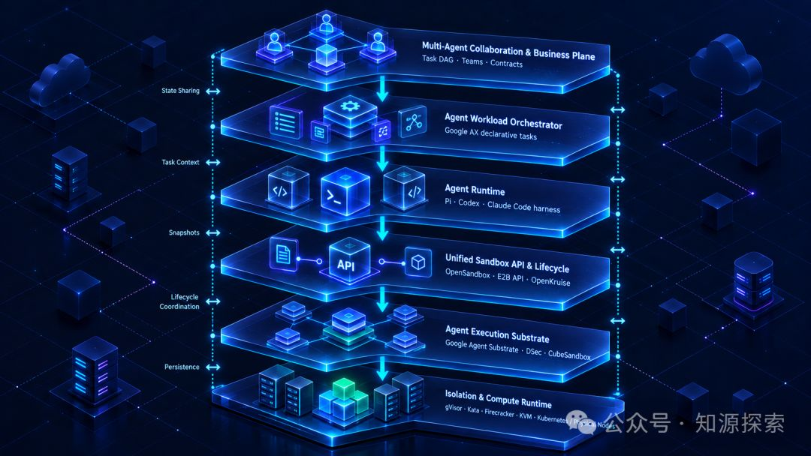
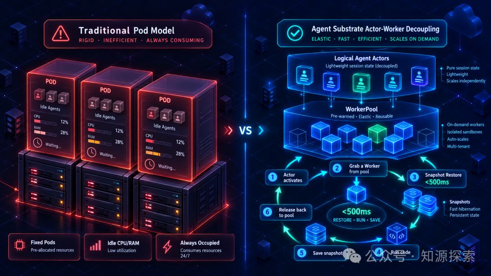
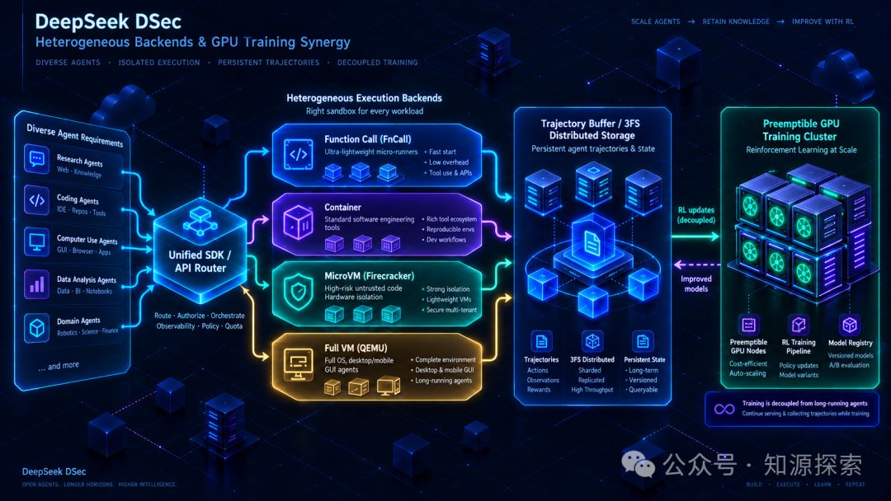
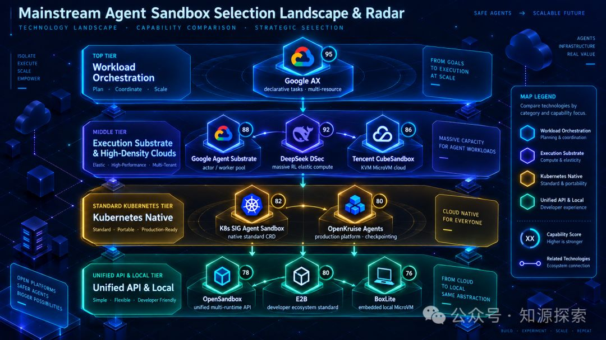

# Agent Sandbox｜智能体任务沙箱调研与选型

> 如果说 2025 年的 Agent 基础设施关键词是 Tool、Memory、Skill 和 Harness，那么进入 2026 年后，一个越来越无法绕开的基础设施正在独立出来：**Agent Sandbox**。随着 Google AX、Agent Substrate 以及 DeepSeek DSec 相继公开，智能体计算基础设施的认知正在发生质的跃迁——沙箱不再只是"给 Agent 一台安全的临时电脑"，而是演进为"为海量有状态、长生命周期、频繁休眠与恢复的 Agent，提供一套独立的工作负载编排、状态解耦与弹性计算基础设施"。



<!-- more -->

## 一、为什么 Agent 需要一套新的计算基础设施

传统 Web 应用的执行模型相对稳定且无状态：HTTP 请求 → 无状态服务进程 → 数据库 / 缓存 / RPC 调用。

而一个 Coding Agent 或 Research Agent 的生命周期与工作负载模型截然不同：收到复杂任务 → 拉取 Git 仓库代码 → 调用大模型分析 → 等待模型推理由此停顿数秒 → 在环境执行 Shell 脚本 / 安装依赖 → 再次调用模型分析输出 → 等待外部工具返回 → 启动本地测试套件 → 挂起等待用户确认输入 → 数十分钟甚至数小时后被唤醒并恢复工作。

从系统架构角度看，这里呈现出三个传统应用极少同时具备的核心特征：

1. **执行大量不可信与动态生成代码**：代码可能来自大模型幻觉与生成、终端用户即时输入、第三方未审计 Git 仓库或网络爬取内容，存在高危命令注入与容器逃逸风险。
2. **强会话状态与长生命周期**：Agent 在运行过程中安装的系统依赖、修改的文件系统、Git 暂存区、后台长驻守护进程（Daemon）和工具执行上下文，必须能够跨多轮对话完整保留。
3. **极低且碎片化的 CPU 有效占用率**：Agent 表面上看似持续运行数小时，但大部分时间其实处于"等待大模型推理、等待外部 API、等待网络 I/O、等待人类反馈"的空闲挂起状态，实际占用 CPU 计算指令的时间往往不足 5%。

这也解释了为什么 Google 在推出 Agent Substrate 时，将"闲置 Agent 毫秒级暂停与按需恢复"作为架构核心：业界已经明确将 Agent 视为一种与传统无状态 Web 服务、批处理大数据作业完全不同的新型云原生计算工作负载。

## 二、用了 Docker，不代表已经有 Agent Sandbox

在工程实践中，Agent Sandbox 最容易被误解为"找个机器，用 Docker 跑一个能执行 bash 的容器不就行了吗？"但这两者在架构抽象上完全不在一个维度。

我们不妨将执行环境划分为清晰的五个技术层级：

| 层级 | 核心能力描述 | 架构定义与对应技术 |
|------|-------------|-------------------|
| **L0** | 受控本地进程 | subprocess、工作目录沙盒、系统调用权限降权 |
| **L1** | 容器化执行环境 | Docker、标准 Kubernetes Pod |
| **L2** | 强隔离安全沙箱 | gVisor、Kata Containers、Firecracker、KVM |
| **L3** | 智能体环境沙箱 | 安全隔离 + 虚拟文件系统 + Shell 会话 + 网络隔离 + 生命周期绑定（Agent Sandbox） |
| **L4** | 生产级 Agent 算力平台 | L3 + 内存/文件快照 + 毫秒级暂停恢复 + 预热资源池 + 多租户调度 + 全链路可观测 |

真正的技术分水岭并不单纯在于底层到底使用 Docker、Firecracker 还是 KVM。而在于系统设计上：**是否把"Agent 的工作环境与会话状态"抽象成了一种可以独立创建、绑定、暂停、恢复、快照迁移和销毁的弹性计算资源。**

一个标准的生产级 Agent Sandbox 生命周期流转应当如下：

```
创建 Sandbox → 分配唯一 sandbox_id 并绑定 session_id
→ 执行代码 / 修改依赖与文件系统
→ Agent 等待模型返回或人类确认
→ 暂停 Sandbox（Suspend）
→ 内存与磁盘快照持久化，释放底层 CPU / 内存算力
→ 接收到新的用户输入或事件驱动唤醒
→ 极速恢复 Sandbox（Resume）
→ 无缝还原所有文件、进程与环境变量继续执行
```

一旦做到这一点，它就不再是普通的容器运维，而是一个真正面向 Agent 认知生命周期重新定义的计算资源调度系统。

## 三、AX 和 DSec 出现后，需要重新画一次 Agent 基础设施分层

过去，我们通常把智能体系统粗略地划分为：Agent Runtime → Sandbox Provider → Kubernetes / MicroVM。这种两三层的简易模型在管理几十、几百个单机 Agent 时勉强适用。但在 Google AX、Agent Substrate 以及 DeepSeek DSec 等系统涌现后，更严谨、更具扩展性的分层应当扩展为完整的**六层架构模型**：



理解这张架构全景图至关重要，因为许多常被拿来对比的项目，在本质上根本不在同一个层级：
- **Google AX 与 Firecracker 无法直接横向对比**：AX 是第二层的工作负载编排器，而 Firecracker 是第六层的轻量微虚拟机技术；
- **OpenSandbox 与 Kubernetes SIG Agent Sandbox 并非零和博弈**：OpenSandbox 处于第四层，专注于提供统一、多语言的 Agent-facing API；而 Kubernetes SIG Agent Sandbox 处于第四/五层，专注定义 K8s 内部的沙箱原生资源模型（CRD）。

## 四、Google AX：解决的不是 Sandbox，而是 Agent Workload

Google AX（Agent Executor）给自己的定位非常清晰：**高吞吐、声明式的自主 Agent 工作负载编排器（Workload Orchestrator）**。

在传统模式下，工程师要运行一个 Agent，往往需要写各种胶水代码去拉起容器、注入 Git Token、配置环境依赖、绑定模型路由。而 Google AX 希望让开发者像使用 Kubernetes Pod 一样声明式地定义一个 Agent Task：

| AX 核心资源 | 职责与能力边界 |
|------------|---------------|
| **Task** | 声明需要执行的自主 Agent 任务、执行镜像、计算配额与超时策略 |
| **Workspace** | 挂载 Git 仓库代码、预装 Skill 工具包、MCP 服务等执行上下文 |
| **Gateway** | 严格定义 Agent 与外界网络通讯的安全访问边界与审计代理 |
| **Model** | 声明模型提供方路由、凭据密钥及负载均衡策略 |

因此，一个完整的自主任务被解构为正交的声明式规格：

```
Agent Task = 基础镜像 + CPU/内存配额 + 代码工作空间(Workspace)
           + 技能集合(Skill) + MCP协议服务 + 模型路由(Model)
           + 网络策略(Network Policy) + 底层沙箱(Sandbox)
```

AX 还提供了类似 `kubectl` 的全套 CLI 操作体验：`ax apply -f task.yaml`、`ax get tasks`、`ax watch task-id`、`ax suspend task-id`、`ax resume task-id`、`ax ssh task-id`。

AX 建立在 Google Agent Substrate 之上，专为极高吞吐的自主 Agent 设计。截至 2026 年 10 月初，AX 开源版本演进到了 **v0.3.1**。需要指出的是，该项目目前核心协议和规格仍处于快速迭代期，**非常适合作为前沿架构参照，但不建议直接作为企业现阶段关键生产系统的核心骨架**。

## 五、AX 最重要的设计判断：不要让 Kubernetes 管每一个 Agent Turn

对比 Kubernetes 原生生态下的方案（如 Kubernetes SIG Agent Sandbox），Google AX 带来了极其深刻的系统级反思。

Kubernetes SIG Agent Sandbox 的传统实现模型仍然遵循经典的控制器哲学：Sandbox CRD → Controller 调谐 → Kubernetes API Server 写入 etcd → Scheduler 调度 → Kubelet 启动 Pod。

在几百、几千个沙箱的规模下，这种架构非常直观，能够完美复用已有 Kubernetes 监控和网络基础设施。

**然而，当系统规模跃升至数十万 Agent、数百万会话时，这个链路便会遭遇严峻挑战：** 智能体在多轮迭代中频繁执行短暂的 Shell 命令、工具调用，伴随长达数分钟的推理等待。如果智能体的每一次启动、休眠、唤醒、调度都要向 Kubernetes API Server 发起读写并由 Kubelet 调谐 Pod，**Kubernetes 的控制面（尤其是 etcd 写入吞吐与调度延迟）将迅速沦为系统瓶颈。**

Google Agent Substrate 的核心解法，就是彻底打破"一个 Agent 对应一个静态 Pod"的教条，将逻辑状态与物理算力彻底剥离。

## 六、Agent Substrate：Google 真正的高密度 Sandbox 执行层

比 AX 更值得系统工程师深入推敲的，是 Google 专门打造的执行基座：**Agent Substrate**。

Substrate 提炼出了四个极其关键的抽象概念：

| 核心抽象概念 | 含义与系统角色 |
|-------------|---------------|
| **Actor** | 逻辑智能体实例（持久存在的状态实体，包含会话历史与工作空间） |
| **ActorTemplate** | 运行环境模板，定义依赖、工具集与规格 |
| **Worker** | 真正执行代码的物理安全微环境（短暂存在，用完即还） |
| **WorkerPool** | 节点本地常驻的预热工作池，预先维持热备 Worker 实例 |

**核心杀手锏：Actor 与 Worker 彻底解耦。**

一个 Agent 逻辑上可以持续运行数周，但在无代码需要执行的空闲等待阶段，它仅仅是一份存放在轻量级存储中的内存和状态快照，完全不占用 CPU 与主存配额：

```
Agent Actor 收到新输入
→ 从本地 WorkerPool 极速领取预热 Worker
→ 毫秒级挂载并恢复内存与文件系统快照（< 500ms）
→ 执行工具或代码片段
→ 进入闲置等待状态
→ 捕获微快照并持久化
→ 立即解绑并释放 Worker 归还给 WorkerPool
```

Google 公开的技术指标显示，Agent Substrate 相比传统专用容器方案能够提供高达**10 倍的实例部署密度**，实现**低于 500ms 的唤醒恢复时延**以及**每秒数百次暂停/恢复吞吐**。目前 Agent Substrate 已开源并支持标准 Kubernetes 基础设施，而在 GKE 云平台上目前处于评估与 Private GA 白名单阶段。

## 七、DeepSeek DSec：它不是通用 Coding Agent 沙箱

2026 年下半年，DeepSeek 在其论文中公开了名为 **DSec（DeepSeek Elastic Compute）** 的自研弹性计算架构。这让行业清晰地意识到：

> 面向人类交互的在线 Agent Sandbox，与面向大规模强化学习（RL）的 Agent Training Sandbox，在工程指标上是两个截然不同的场景。

DSec 的使命不是为了支持单体 IDE 中的辅助写代码插件，而是为了支撑**极其庞大的智能体强化学习交互（Rollout）与自动化评估（Evaluation）**。

其论文披露的生产集群运行指标令人震撼：
- 单个标准生产单元约包含 160 个计算节点；
- 每日调度并处理超过**300 万个 Sandbox 实例**；
- 生产环境维持高达**38 万并发 Sandbox**；
- 峰值具备每秒持续创建**超过 5000 个 Sandbox** 的极高吞吐。

因此，绝不能把 DSec 简单理解为"DeepSeek 版的 E2B"，它本质上是**一套专为智能体强化学习闭环深度定制的极大规模弹性计算云**。

## 八、DSec 最值得借鉴的设计：一种 Sandbox Runtime 远远不够

很多沙箱框架往往试图"一招鲜吃遍天"：E2B 全面押注 Firecracker，CubeSandbox 自研 RustVMM + KVM，传统云平台依赖标准容器。

然而 DeepSeek 在面对真实异构任务时给出了不同的回答：**Agent 任务在安全边界、启动性能与环境完整度上的差异过大，单一的沙箱技术根本无法兼顾成本与性能。**

DSec 在统一的开发者接口之下，分层提供了四类异构后端：

| DSec 异构后端 | 底层支撑技术 | 资源与时延特征 | 适用任务场景 |
|--------------|-------------|---------------|-------------|
| **FnCall** | 极轻量进程函数执行 | 极微秒级响应、超低开销 | 单步数学计算、LeetCode 题解评测、纯算法检验 |
| **Container** | 标准 Linux 容器 | 秒级启动、兼容标准 OCI 镜像 | 常见工具调用、受信任的开源项目编译与构建 |
| **MicroVM** | Firecracker 微虚拟机 | 毫秒级启动、强硬件虚拟化隔离 | 执行不可信代码、高风险 Python 解释器执行 |
| **Full VM** | QEMU 完整虚拟机 | 包含完整 Linux/Android 内核与图形栈 | 复杂操作系统桌面任务、移动端 GUI Agent 交互 |

这为所有企业在规划自建沙箱平台时带来了极富价值的启发：**切忌在底层把某种单一隔离技术写死，而应在 Sandbox Provider 层保留面向不同任务画像的异构接入能力。**

## 九、DSec 真正特殊的是：训练与沙箱生命周期的解耦

在大规模 Agent 强化学习训练中，系统通常分为两个高度交织的阶段：Agent 在 Sandbox 中执行动作轨迹 (Rollout) → 收集 Trajectory 轨迹数据与奖励信号 (Reward) → GPU 集群进行梯度更新与模型训练 (Training)。

传统架构最大的痛点在于：**昂贵的高性能 GPU 计算资源本身会被抢占、调度或动态扩缩容。** 如果沙箱的生命周期与 GPU 训练任务强绑定，一旦 GPU 节点被抢占或发生容错转移，沙箱中运行了数小时、交互了数十步的有状态 Agent 轨迹就会彻底丢失，造成昂贵的算力浪费。

DSec 的核心突破之一就是：**利用自研的 3FS 高性能分布式存储，将有状态的交互轨迹（Stateful Rollout）与动态可抢占的 GPU 训练彻底解耦。**



这与在线 Agent 领域中"Agent Session 会话状态绝不能与具体物理执行进程绑定"的设计准则不谋而合。

## 十、DSec 的定位：P0 级设计参考，而非现阶段部署候选

必须严谨区分**论文公开发表**与**开源可交付代码**：DeepSeek 披露了极其详实的 DSec 论文报告，揭示了完整的系统拓扑、异构运行时设计、3FS 存储协同与高密度内存复用方案。但截至 2026 年 10 月初，在 DeepSeek 官方 GitHub 开源组织下，**尚未释出可开箱部署的 DSec 开源系统工程**。

因此，对于绝大多数企业来说：
- **DSec 是 P0 级的架构思想宝库**（尤其是异构后端设计与状态解耦理念）；
- **但它不是企业今天直接下载 Helm Chart 就能跑起来的现成产品**。

## 十一、重新理解 OpenSandbox：统一沙箱 API 与生态胶水

在梳理完 AX 与 DSec 之后，开源界著名的 **OpenSandbox** 项目的生态定位反而变得更加清晰且不可替代。

OpenSandbox 的终极目标不是重新发明底层的虚拟化引擎，而是**在开发者现有的基础设施之上，提供一套兼具完备性与一致性的标准沙箱控制层（Unified Sandbox API）**。

OpenSandbox 的核心优势体现在：
- **全语言 SDK 覆盖**：原生提供 Python、TypeScript、Go、Java/Kotlin、C# 等多语言 SDK，配套 CLI 工具以及标准的 MCP Server；
- **底层基础设施灵活解耦**：上层对接同一套沙箱接口，底层 Workload Provider 可以按需挂接 Docker、单机系统，或者直接驱动 Kubernetes；
- **强隔离兼容能力**：原生支持在底层无缝切换 gVisor、Kata Containers 以及 Firecracker 运行时；
- **拥抱标准**：OpenSandbox 已经能够原生将 Kubernetes SIG Agent Sandbox 纳为其底层的工作负载驱动。

在未来的企业架构中，OpenSandbox 极其适合扮演承上启下的枢纽角色：**向上承接自研或第三方 Agent 的调度请求，向下屏蔽异构虚拟化基础设施的复杂性。**

## 十二、Kubernetes SIG Agent Sandbox：最纯正的 K8s 标准路线

如果企业技术栈以云原生为主，且核心诉求是"尽量遵循 Kubernetes 原生标准、不引入黑盒编排器"，那么由社区主导的 **Kubernetes SIG Agent Sandbox** 是首选基础基石。

该项目并不试图重造一个自成一体的沙箱云，而是专注于在 Kubernetes 体系内精准定义：一个具备稳定身份凭据、单实例（Singleton）、有状态的 Agent Sandbox 在 K8s 内部到底该如何规范表达。

目前其核心 API 已演进至 `agents.x-k8s.io/v1beta1`，公开版本发布至**v1.0.2**，定义了高度清晰的声明式资源组：
- **Sandbox**：核心沙箱资源抽象；
- **SandboxTemplate**：沙箱运行配置与环境规格模板；
- **SandboxClaim**：面向任务的沙箱申领与租约机制；
- **SandboxWarmPool**：预热资源池管理，用于压降冷启动时延。

在安全隔离层面，它完全遵循标准的 Kubernetes `RuntimeClass` 机制，将隔离交由底层的**gVisor（进程级内核虚拟化）**或**Kata Containers（微虚机级硬件隔离）**承接。

**它的定位清晰笃定：简单、透明、极致的 Kubernetes Native。对于千级别沙箱规模的中大型企业自建平台，这是一条阻力最小、最易维护的坚实路径。**

## 十三、OpenKruise Agents：面向生产场景的深度强化平台

阿里巴巴开源的 **OpenKruise Agents** 则显露出更具工程务实色彩的生产级增强取向。

如果说 Kubernetes SIG 给出的是一张极简的基础蓝图，那么 OpenKruise Agents 则是直接面向复杂业务场景打磨的增强战斗机。它在 Kubernetes 之上原生提供了：
1. **深度状态快照（Checkpointing）**：不仅能够保存本地磁盘数据，更在官方规划与实现中支持**主存（RAM）、容器只读与可写层、甚至 GPU 显存（GPU VRAM）状态的深度保存与快速还原**；
2. **细粒度弹性休眠（Hibernation）**：在空闲阶段智能释放物理资源，降低算力空转成本；
3. **完善的企业级服务配套**：内置动态资源调整（In-place Scaling）、会话路由代理、用户身份认证，并向上原生兼容**E2B API**。

特别值得肯定的是，OpenKruise Agents 并未与标准路线背道而驰，而是明确宣称兼容 Kubernetes SIG Agent Sandbox 的底层能力。企业完全可以将其视为一个**"开箱即用、带生产级状态加速与 E2B API 兼容的 Kubernetes 增强平台"**。

## 十四、CubeSandbox：目前最完整的专用 MicroVM 路线之一

腾讯云团队开源的 **CubeSandbox** 是本轮调研中极具硬核技术代表性的独立微虚拟机路线。

与依赖"Kubernetes Pod + RuntimeClass"的技术路径截然不同，CubeSandbox 完全自研了一套独立的 MicroVM 控制面与高效轻量调度引擎：
- **技术内核**：深度基于 **RustVMM + Linux KVM** 技术栈打造；
- **极致轻量**：官方实测单沙箱冷启动时延低于**60ms**，单实例物理主机额外内存开销控制在**5MB**以内；
- **跨节点快照恢复**：最新 v0.7 版本突破性支持了**跨节点的 Pause/Resume** 能力。沙箱在物理节点 A 暂停后，内存快照可直接同步至对象存储（如 S3/COS），并在节点 A 异常时直接在节点 B 毫秒级满血复活；
- **广泛兼容**：在协议层主动兼容 E2B SDK，降低上层应用迁移改造成本。

对于对"**硬件级物理安全隔离、高并发秒级启动、微虚机极低驻留开销**"有极严苛要求的场景，CubeSandbox 是一套非常成熟且值得重点对照验证的纯自研路线。

## 十五、E2B 与 BoxLite：两个维度的重要参考坐标

在整个 Agent 沙箱版图中，还有两个项目分别在开发者生态与边缘嵌入端树立了重要标杆：

### 1. E2B Runtime：事实上的行业开发 API 标准

E2B Runtime 凭借优异的开发者体验，已经实质上成为了 Agent Sandbox 的标准协议代名词。其全套实现基于 Firecracker MicroVM，提供了覆盖控制面、节点编排、VM 内部守护进程、边缘路由及构建器的完整 Apache 2.0 开源方案。

需要特别说明的是：E2B 官方提供的自托管方案（E2B Embed）更偏向于单机功能验证与本地评估，并不鼓励直接照搬到超大规模的 Kubernetes 生产编排中。因此：
- **学协议与交互体验，首看 E2B**；
- **做底层大规模集群调度，优先参考 OpenSandbox / SIG Agent Sandbox / OpenKruise / CubeSandbox**。

### 2. BoxLite：本地与嵌入式运行的极佳解法

BoxLite 则走向了另一个极端：它完全不追求 Kubernetes 调度与集群化，而是专注于**将超轻量 MicroVM 深度嵌入单机应用与桌面端**。

BoxLite 在 Linux 上调用 KVM，在 Apple Silicon macOS 上直接调用原生的 `Hypervisor.framework`，能够让单机运行的桌面 Agent（如个人 Coding 助手、本地自动化机器人）在安全隔离的微小虚拟机中直接启动 OCI 镜像，并支持回滚（Rollback）、分叉（Fork）与凭据注入。它解答的是："如何在个人电脑或单机边缘节点上，以极低开销给 Agent 分配一台虚拟小电脑。"

## 十六、横向全景坐标系：九大主流方案选型矩阵

为了帮助技术团队拨开选型迷雾，我们将业界最核心的九种方案统一汇总到一张对比矩阵中：



| 方案名称 | 核心层级定位 | 最突出技术亮点 | K8s 自建支持度 | 最佳适用场景 |
|---------|-------------|---------------|---------------|-------------|
| **Google AX** | 智能体工作负载编排 | 声明式 Task/Workspace/Gateway/Model | 依赖 K8s + Substrate | 超大规模自主 Agent 任务调度 |
| **Agent Substrate** | 智能体执行基座 | Actor/Worker 解耦、亚秒级休眠恢复 | 原生支持 K8s (评估期) | 高并发、高密度、长生命周期 Agent 托管 |
| **DeepSeek DSec** | 训练与评估弹性计算云 | 4 级异构后端、3FS 存储、RL 轨迹解耦 | 暂无官方完整开源项目 | 智能体大规模强化学习、万级评测平台 |
| **K8s SIG Agent Sandbox** | K8s 原生沙箱模型 | 标准 Sandbox CRD、RuntimeClass 适配 | ✅ 完全原生 | 云原生企业自建通用沙箱底座 |
| **OpenKruise Agents** | K8s Agent 生产平台 | 内存/显存快照、资源池化、E2B API 兼容 | ✅ 生产级支持 | 企业生产环境增强、追求快速落地与兼容 |
| **OpenSandbox** | 统一沙箱服务层 (API) | 多语言统一 SDK、多后端路由、MCP 支持 | ✅ 良好支持 | 构建自建沙箱平台中台、屏蔽多底层技术 |
| **CubeSandbox** | 专用 MicroVM 平台 | RustVMM + KVM、< 60ms 启动、跨节点恢复 | ✅ 独立控制器支持 | 极端追求低启动时延与硬件级强隔离 |
| **E2B Runtime** | 沙箱应用与开发者规范 | 成熟的 SDK 生态、Firecracker 深度绑定 | ✅ (K8s Embed 偏评估) | 对标行业主流 API、轻量验证或商业托管 |
| **BoxLite** | 嵌入式单机微虚机 | 零依赖嵌入应用、支持 macOS 原生虚拟化 | ❌ 聚焦单机与边缘 | 桌面级 Coding Agent、单机个人助手、边缘计算 |

## 十七、如果现在建设企业 Agent 平台，该如何决策落地？

脱离业务体量谈架构选型就是空中楼阁。结合当下的技术成熟度，我们建议企业分步骤、分阶段演进：

### 第一阶段（当前主线）：稳健落地，解决 80% 真实生产问题

如果企业当前的诉求是搭建一个能够支撑数十至上千并发、稳定运行各类开源或商用 Agent Runtime（如 Pi、Codex、Claude Code）的云原生平台：

**强烈推荐的技术选型组合：**
```
上层 Agent Runtime (Pi / 业务应用)
    ↓
统一接口层 (OpenSandbox 统一 SDK 与 API)
    ↓
K8s 原生控制器 (Kubernetes SIG Agent Sandbox 或 OpenKruise Agents)
    ↓
容器级安全隔离 (gVisor 或 Kata Containers)
```

**为什么推荐这条路线？**
1. **架构风险最低**：完全建立在成熟的 Kubernetes 生态中，运维体系无缝复用；
2. **能力完备闭环**：通过 OpenSandbox 屏蔽接口，直接具备 Shell 交互、多会话、文件传输、网络出向控制；
3. **保留后续演进灵活性**：上层代码面向 OpenSandbox 编写，底层随时可由 gVisor 替换为微虚机，业务层无需修改一行代码。

### 第二阶段（性能增强）：若对隔离与启动时延有极致诉求，对照验证 CubeSandbox

如果随着业务增长，发现基于 Kubernetes 的普通 Pod 方案在以下维度遇到瓶颈：代码执行涉及高度不可信的第三方任意漏洞利用，对内核共享存在合规担忧；秒级启动无法满足即时代码交互体验（需要 < 100ms 响应）；多租户单机部署密度受容器开销压制。此时，**切入验证 CubeSandbox 作为底层专有运行时**，通过其 RustVMM 架构和内存快照能力突破性能边界。

### 第三阶段（前瞻预研）：将 AX / Agent Substrate 设为 P0 级架构跟踪目标

尽管我们建议当前不要在生产环境中盲目上线 Google AX，但系统架构师必须保持紧密跟踪。一旦企业内部的长驻 Agent 数量突破 **10,000+** 级别："一个会话占用一个固定 Pod" 将彻底拖垮集群基础设施；AX 与 Substrate 的"**Actor（状态）与 Worker（物理算力）彻底解耦，按需领取、用完休眠**"模型将成为必由之路。

### 第四阶段（算法孵化）：将 DSec 理念引入 Agent 评测与强化学习闭环

当业务开始涉及大模型后训练、自动化代码评测（Eval）或者大规模并行轨迹探索（RL Rollout）时：汲取 DSec 的**异构后端理念**，避免对 LeetCode 简单评测使用重型虚拟机；建立**有状态轨迹存储与可抢占 GPU 计算相解耦**的基础设施，保护宝贵的训练成果。

## 十八、结语：Agent Sandbox 已经不再只是一层沙箱

回望云计算的发展历程，我们经历了从"物理裸机"到"全虚拟化虚拟机"，再到"轻量容器"与"Kubernetes 编排"的持续演变。

而在大模型时代，面向智能体的计算体系正在长出一条全新的、清晰的技术栈分层：

```
业务协同层 (Multi-Agent Team Orchestration)
    ↓
工作负载编排层 (Agent Workload Orchestrator: AX)
    ↓
智能体运行时 (Agent Runtime: Pi / Codex)
    ↓
统一沙箱服务接口 (Unified Sandbox API: OpenSandbox / E2B)
    ↓
执行基座与状态管理 (Execution Substrate: Substrate / Kruise)
    ↓
硬件强隔离与底层算力 (Isolation & Compute: MicroVM / Container)
```

**未来最优秀的企业级智能体平台，绝不应该让 Agent Runtime 自己去手工操作容器或虚机。**

- **Agent Runtime 负责思考与决策**：维护思考循环、上下文窗口、工具选择与 Prompt 策略；
- **Sandbox 层负责安全与执行**：划定安全围栏，忠实承载每一次文件修改与命令执行；
- **Execution Substrate 负责弹性与资源映射**：实现逻辑会话与底层硬件资源的动态绑定、挂起、快照与复原；
- **Workload Orchestrator 负责海量任务的可靠投递**。

对于当下的技术决策者而言，最重要的并非一次性押注某一个具体的开源项目，而是**在自己的系统设计中率先划清这三道至关重要的架构防线**：
1. **Agent Runtime 与 Sandbox 执行解耦**；
2. **Sandbox API 与具体的虚拟化技术实现解耦**；
3. **Agent 逻辑状态与物理计算资源的生命周期解耦**。

只要建立了这三层清晰的解耦边界，未来无论算力形态如何更迭、调度框架如何推陈出新，你的智能体系统都能从容迭代，稳健前行。

---

## 延伸阅读与参考资料

> 本文所涉及的代表性开源项目、核心技术论文及官方技术博客整理汇总如下，供深度技术研读查阅：

### 1. Google AX / Agent Substrate
- Google AX（Agent Executor）官方开源代码仓库：https://github.com/google/ax
- Google Cloud 官方博客：Introducing Agent Executor, Google's distributed Agent Runtime
- Google Cloud 官方博客：Agent Substrate available on GKE
- Google Cloud 官方技术文档：About Agent Substrate on Kubernetes Engine

### 2. DeepSeek DSec
- DeepSeek Elastic Compute（DSec）技术论文 (arXiv:2609.22978)
- DeepSeek 官方开源组织 GitHub 主页：https://github.com/deepseek-ai

### 3. Kubernetes SIG Agent Sandbox
- 官方开源仓库：https://github.com/kubernetes-sigs/agent-sandbox
- 官方文档站点：https://agent-sandbox.sigs.k8s.io/
- 快速入门指南 (Quickstart)
- 演进技术路线图 (Roadmap)

### 4. OpenSandbox
- 官方开源仓库与全套 SDK：https://github.com/opensandbox-group/OpenSandbox
- Kubernetes 部署与集成指南
- 结合 Kubernetes SIG Agent Sandbox 实操案例

### 5. OpenKruise Agents
- 官方开源仓库：https://github.com/openkruise/agents
- 技术演进路线图 (Roadmap)
- 官方站点：https://openkruise.io/

### 6. Tencent CubeSandbox
- 官方开源仓库：https://github.com/TencentCloud/CubeSandbox
- 快速上手与架构文档
- Kubernetes 部署运行指南

### 7. E2B Runtime
- 官方开源代码仓库：https://github.com/e2b-dev/runtime
- 底层核心架构剖析 (Architecture)
- 官方站点

### 8. BoxLite
- 官方开源仓库：https://github.com/boxlite-ai/boxlite
- 官方技术文档中心
- 官方站点

### 9. 产业界相关代表性沙箱方案
- OpenAI Agents 官方沙箱指南：Sandboxes
- Cloudflare Sandbox 官方文档
- Vercel Sandbox 官方指南
- Modal Sandbox 架构与指南
- Daytona Sandboxes 官方文档
