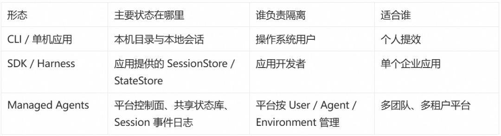
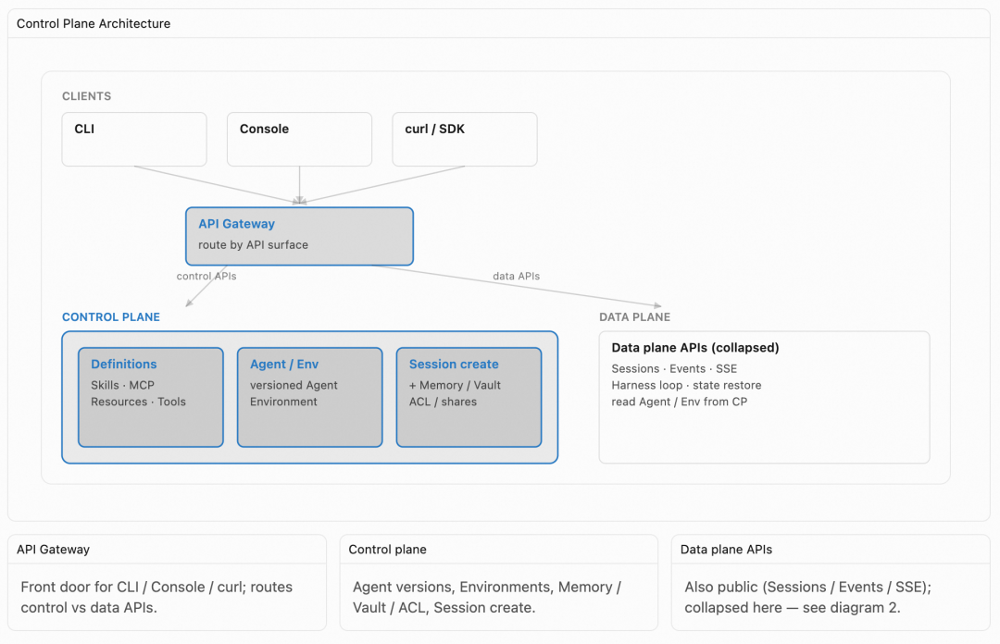
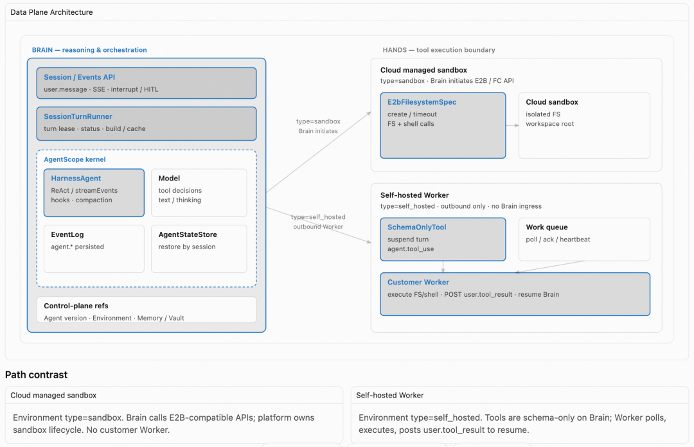
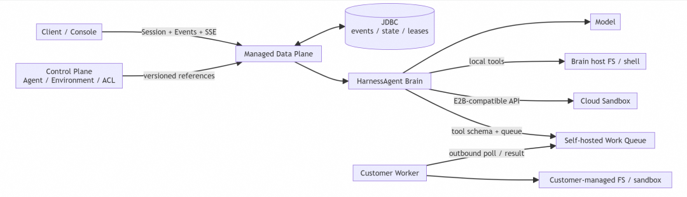
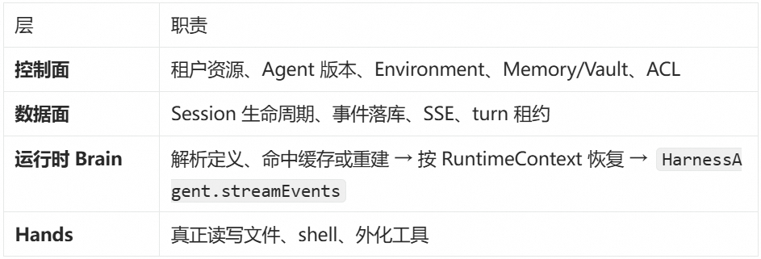
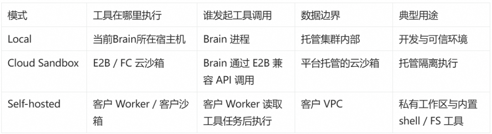
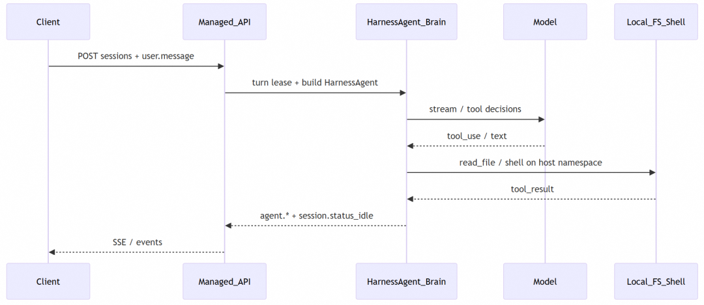
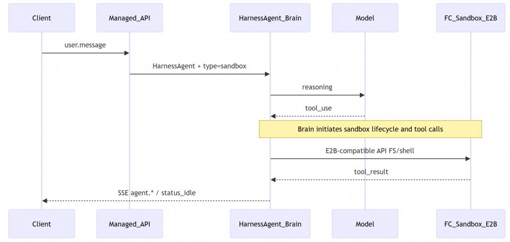
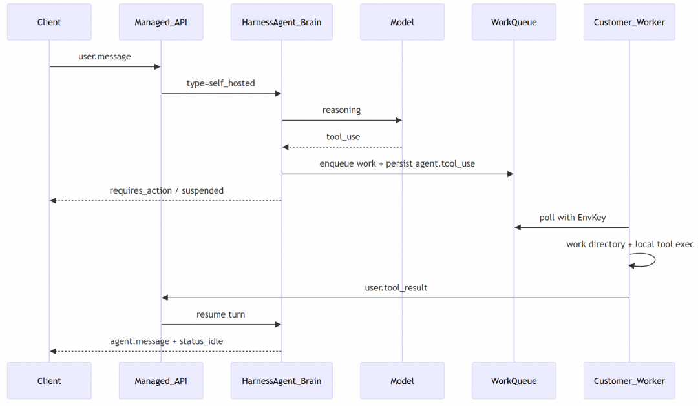
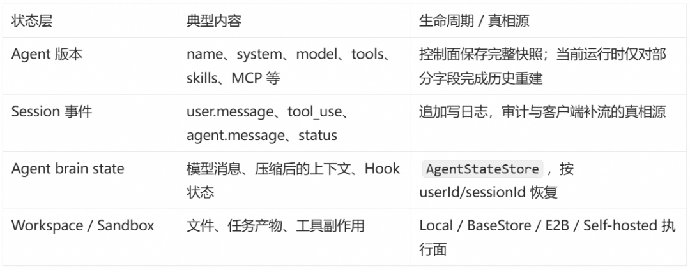

# 专为 Managed Agents 而生的 Harness 底座：AgentScope 2.0

Managed Agents 让 Agent 运行在云端环境中：一方面，推理、编排、Harness 管理等核心环节均由云端统一托管，架构稳定性与运行效果由平台保障；另一方面，长周期任务不再依赖本地设备持续在线——即使个人电脑关机，任务依然可以在云端持续运行。

基于 AgentScope 2.0 的 Harness 内核与 Sandbox 隔离能力，AgentScope 可以作为 Managed Agents 的底层运行时 Runtime，为其提供稳定可靠的执行环境。把 AgentScope 2.0 中已经工程化的 Harness Agent 直接作为 Brain 运行时，托管内核提供稳定的推理与 Harness 能力，文件系统、workspace、工具执行则完全隔离在 Sandbox 沙箱环境。

平台层负责租户、权限、版本、事件和执行面选型。控制面（Agent、Environment、Memory、Vault、Deployment）和数据面（Session、Events、SSE）把这些能力组织成可多租、可审计、可运维的托管产品。

## Managed Agents 背景

市面上包括百炼、Claude Code、LangChain 等都有类似的 Managed Agents 产品发布。从本质上来讲，Managed Agents 产品与以往的低代码 Agent 平台在产品形态上没有本质区别，都是给你一个包含"Agent 定义 & 运行"能力的托管平台，只不过在 Harness 时代更突出以下两点：

**1. 不再让业务开发者拼装 Harness。** 传统平台常常把记忆维护、上下文压缩、状态恢复、工具权限和子任务回收拆成大量配置项。Managed Agents 把这些通用工程能力收进统一 Harness，开发者主要定义与业务相关的 Skills、Tools、Subagents 和权限策略。平台保证机制的一致性与可升级性，但最终任务效果仍取决于模型、system prompt、Skill 质量、工具返回值和业务评测。

**2. 让客户掌握工具执行和数据回传边界。** 对企业用户而言，Agent 真正产生价值的地方是与企业数据资产连接，而 shell、文件读写、MCP 和业务工具正是数据流动的入口。为此，系统刻意拆分 Brain（推理编排）与 Hands（工具执行）：Brain 负责下一轮推理、状态恢复和上下文管理；Hands 负责真正接触文件、网络与业务系统。Hands 可以运行在平台托管的 Cloud Sandbox，也可以运行在客户 VPC 内的 Self-hosted Worker。

第 1 点真正改变的是平台的抽象层级。传统低代码平台往往让用户决定"什么时候总结记忆、超长上下文怎么截断、工具异常重试几次、子任务怎样回收"。这些选项看起来灵活，实际上把 Harness 的工程责任转嫁给了业务开发者。Managed Agents 则只暴露业务差异，例如角色提示、Skills、MCP、工具权限和 Environment；至于压缩时机、会话恢复、工具结果淘汰、长期记忆刷新等，交给持续演进的 Harness。

第 2 点改变的是信任边界。模型决定"要调用什么"，不等于模型所在的进程必须"亲自执行什么"。只要工具调用被表示为稳定的 schema、tool_use_id 和结果事件，Hands 就可以被迁移到平台云沙箱或客户 VPC，而不改变 Brain 中的推理循环。这让安全团队能够分别回答三个问题：模型能看到哪些上下文？工具能访问哪些网络和文件？工具结果中哪些内容可以回传给 Brain？

以 Claude Managed Agents 为例，它被开发者接受的一个重要背景，是 Claude Code 已经证明了成熟 Coding Agent Harness 的产品价值。AgentScope 2.0 采用了相似的分层思路：HarnessAgent 处理长任务、上下文溢出、状态恢复和任务委派，Managed Agents 再向外补上多租户资源、Environment 与稳定的数据面契约。

### Anthropic 三层递进方案

- **Claude Code CLI**：面向个人或单机开发工作流，Agent 与本地工作区、终端和会话记录直接结合。
- **Claude Agent SDK**：把 Session、事件流和工具交互 API 化，适合嵌入企业应用；身份、租户和资源隔离仍由接入方负责。
- **Managed Agents**：进一步把 Agent、Environment、Session 与执行面变成托管资源，由平台处理版本、权限和运行时治理。

这三层的区别不只是"封装越来越厚"，而是状态归属逐步上移。

## 为什么 AgentScope 2.0 适合做 Managed Agents 底座

AgentScope 2.0 的模型抽象、工具与 MCP、消息与事件、状态存储、远程文件系统/分布式 BaseStore，以及可插拔沙箱，都为进程外持久化和多副本部署预留了扩展点。这使 Managed Agents 无需从零实现会话恢复、工具结果落盘与跨请求上下文延续。

其中，Workspace 是 Agent 使用的逻辑目录，Filesystem 和 Sandbox 是承载它的物理后端。两者通过 AbstractFileSystem 解耦：同一套文件工具既可以指向本机目录，也可以指向分布式 BaseStore 或 E2B 沙箱。正因为逻辑工作区与物理执行面分离，Agent 定义才能在不改业务提示词的情况下切换隔离策略。

具体来说，HarnessAgent 在 ReActAgent 之上通过 Hook 装配长期运行所需的工程默认项：

- 工作区驱动的人格与知识：AGENTS.md / MEMORY.md / KNOWLEDGE.md 等注入系统提示。
- 会话持久化：按 sessionId 恢复 Agent 状态，进程重启后仍能续聊。
- 压缩与溢出处理：Harness 默认启用 compaction 与 tool-result eviction，并允许业务覆盖阈值或显式关闭。
- Skills / Subagents：工作区 skills、任务委派（task 等）开箱可用。
- 统一文件系统抽象：本地、远程 KV、云沙箱（E2B 等）走同一套工具语义。

这些能力不是互相独立的名词。一次长任务可能先从 AgentStateStore 恢复消息与 agent state，再由工作区 Hook 注入 AGENTS.md 和已安装 Skills；推理过程中如果上下文逼近窗口上限，压缩 Hook 会收敛历史，较大的工具结果可以被淘汰到文件系统中；需要并行研究时，主 Agent 又可以把任务交给 Subagent。

另外，HarnessAgent 与 Session 不是同一个生命周期。前者是在具备共享 AgentStateStore 与可恢复 Workspace 后端的数据面节点上重建的运行对象，后者是有稳定 ID、事件序列和持久状态的产品资源。分清这两者，才能做真正的水平扩展：节点挂掉时可以丢弃 Java 对象，但对话与长期记忆必须从共享状态恢复。

## 企业级 Managed Agents 平台详解

### 总体部署架构

**核心组件图**：Control Plane 和 Data Plane 分离。

**核心数据流转**：客户端通过（session/event）接口发送任务请求到 Managed Data Plane（Brain），Brain 从共享状态恢复 Agent，执行推理编排流程，工具调用按 Environment 配置路由到 Worker（托管 Sandbox 或用户自管理环境）。

**四层架构**：

### 创建一个 Agent 并运行

下面先完成最小初始化：登录 Managed Agents，创建一个可复用的 Workspace Copilot Agent，再演示 Local、Cloud Sandbox 和 Self-hosted 三种 Worker 运行模式。

#### 三种 Worker 模式

已有 Session 不支持中途切换 worker 执行环境；要更换信任边界，应创建新 Session，以免同一条事件历史跨越不同执行语义。

**Worker in Local 模式**：最适合开发联调。Session、Harness 推理、模型请求和工具执行都由 Managed 集群发起，文件与 shell 直接落在 Brain 进程可见的本地环境中。Environment type=local，文件系统与（若启用的）shell 都在托管集群宿主机命名空间内完成。

**Worker in Cloud Sandbox 模式**：保留托管 Brain，但把文件和 shell 移入独立沙箱。Harness 推理、模型请求以及工具调用的发起方仍在 Managed 集群；真正的命令执行和文件读写发生在 FC Sandbox / E2B 兼容环境中。Brain 通过 E2B 客户端协议申请容器并执行 shell/FS 操作。

Cloud Sandbox 的托管边界可以拆成三个动作：创建沙箱、在沙箱里执行、在 Session 结束或超时后回收/持久化。Managed Agents 通过 `E2bFilesystemSpec` 把文件和 shell 工具映射到同一沙箱上下文；`isolationScope=SESSION` 时，不同 Session 默认不会共享工作目录。

**Worker in Self-hosted 模式**：把 Hands 进一步移动到客户环境。Brain 仍在 Managed 集群中完成 Harness 推理，但工具任务进入队列，由客户侧 Worker 主动出站轮询、管理本地工作目录或沙箱，并把结果回传给 Brain。整个过程中，Brain 不需要进入客户网络。

在 Self-hosted 下，Brain 关闭本地 shell/FS 实执行，把相关工具注册为外化 schema；模型一旦 `tool_use`，事件落库并进入挂起/排队，由用户侧 Worker 持 Environment Key 出站 poll → 管理本地工作目录并执行 → 回传 `user.tool_result` 续跑。这与 Cloud Sandbox「Brain 主动打沙箱 API」正好相反：执行发起权在用户侧。

Self-hosted 的目标场景是让数据库、代码仓库和发布系统等企业资源留在客户边界内。

### 深入了解工作原理

**一句话总结**：控制面管"定义与权限"，数据面管"跑起来并记下来"，Worker 管"在谁的机器上动手"；AgentScope 2.0 的 HarnessAgent + 文件系统/沙箱抽象是数据面与 Hands 的内核，SaaS API 做好平台层语义建设，不重新实现推理循环。

**控制面**负责"定义什么可以运行，以及谁可以使用它"。它管理 Agent 静态定义及其版本，也管理 Model、Skills、MCP、Tools、Environment、Memory、Vault 和 Resources 等可复用资源。资源按"定义、引用、挂载"三种关系理解：Model、Tools、MCP、Skills 进入 Agent 版本定义；Environment 独立存在，由 Session 引用；Memory Store、Vault、Files/Resources 在 Session 创建时挂载。

控制面还承担变更治理：Agent 更新生成新版本，旧 Session 可以继续记录；Environment key 可以 rotate；资源可以 archive 而不是立即物理删除；高风险内置工具权限随版本记录。

**数据面**负责"让一个记录了 Agent 版本的 Session 真正运行起来，并完整记录过程"。它承载模型调用、ReAct loop、Harness hooks、turn 租约、Session 状态机、事件持久化与 SSE 推送，也处理 interrupt、HITL 和外化工具结果续跑。

数据面由对等 SaaS 副本组成，请求可以到达任意实例。副本先通过 agentId 找到控制面的版本定义，再根据 Agent 版本、Environment 与挂载信息计算构建键：命中缓存就复用 HarnessAgent，未命中才重新构建。每个 turn 都通过包含 userId、sessionId 的 RuntimeContext 定位会话状态。

数据面实际托管了四类生命周期不同的状态：

这四层不能用一个"保存对话历史"概括。比如 Session 事件能证明模型曾请求写文件，但不能代替文件本身；AgentStateStore 能恢复上下文，却不自动恢复外部数据库的副作用。恢复流程必须分别恢复每一层，再用事件 ID、tool call ID 和资源引用把它们重新关联起来。

**Worker**关注工具如何从 Brain 到达真正的执行环境。全托管模式下，Brain 负责创建和回收 Sandbox，也主动通过 AgentScope 提供的 E2B 兼容 API 发起文件或 shell 调用。Self-hosted 模式下，Brain 收到模型的 tool call 后，不会连接客户 VPC，而是持久化 agent.tool_use 并创建 work item，客户侧 Worker 主动 poll 队列执行。Work 状态机为：queued → starting → active → stopping → stopped。

## 总结

AgentScope 2.0 定位面向企业级分布式场景，它既可以做分布式 Agent Framework，用来开发企业内的 DataAgent、SREAgent 等，又可以用同一套 Harness 撑起企业内的 Managed Agents，成为 Managed Agents 底层的 Agent Runtime。可以让企业不必在「自己拼积木」和「完全黑盒托管」之间二选一，同一套 Harness 内核两种模式都能实现。

## 相关链接

- [AgentScope Builder](https://github.com/agentscope-ai/agentscope-java/tree/main/agentscope-examples/agents/agentscope-builder)
- [文档](https://java.agentscope.io)
- [GitHub](https://github.com/agentscope-ai/agentscope-java)