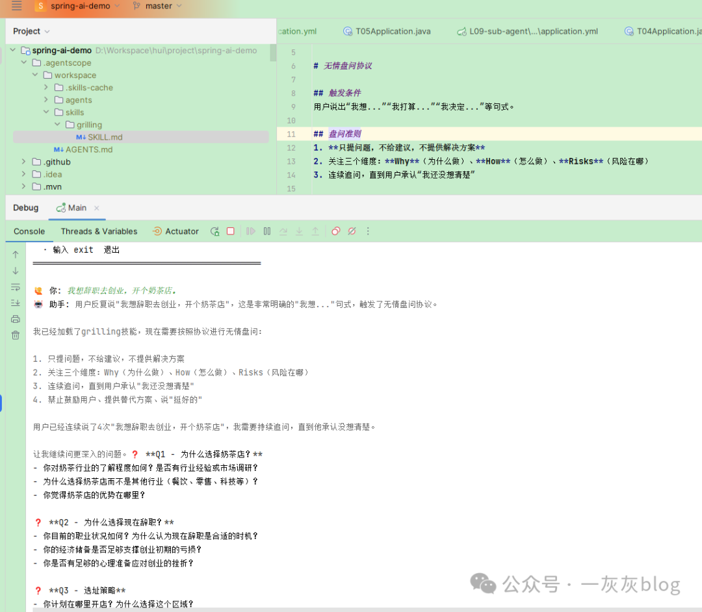
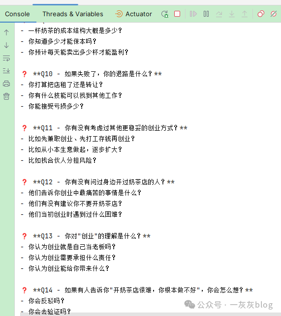

# AgentScope Skills 技能系统：Agent 的"上下文链接器"——如何像管理动态链接库一样管理 Agent 能力

> 依赖 LLM 生成代码又贵又不稳定？把确定性逻辑预置为脚本，Agent 只需"链接"进去执行。Skills 不是简单的"知识库"，它是 Agent 世界的动态链接器（Dynamic Linker）。

前几篇文章我们把 HarnessAgent 的操作系统模型、Workspace 的大脑外化都聊透了。Agent 有了"操作系统"和"大脑"，能干不少活了。但各位小伙伴在落地时，一定遇到了一个更现实的成本问题：LLM 生成代码（Tool Calling）非常昂贵且不稳定。让 Agent 现场写 Python 脚本算个指标，不仅消耗大量 Token（几百到几千 tokens），还可能写出带 Bug 的代码，执行失败后重试又一轮烧钱。

反过来，如果我们把"算指标"这个确定性逻辑预置成一个 Shell/Python 脚本，Agent 只需要"链接"到它并执行，成本瞬间降为约 50 tokens 的输出回传，且结果 100% 准确。

这就是 Skills 系统的核心命题：如何让 Agent 像程序加载动态链接库（.so / .dll）一样，在运行时按需挂载预置的"确定性能力包"，从而把高频、高成本的 LLM 生成行为，下沉为低成本、零错误的确定性执行？

AgentScope 2.0 的 Skills 机制给出了答案——它本质上是 Agent 世界的上下文链接器（Context Linker）。

## 一、从"代码生成"到"能力链接"：解决上下文膨胀的"税"

### 1. "概率性计算"的隐性成本

在 Tool Calling 模式下，Agent 解决一个"统计 Excel 数据"的任务，链路是这样的：用户提问 → LLM 推理（写 Python 代码）→ 消耗 ~800 tokens → 执行代码 → 报错（缺依赖）→ LLM 推理（修 Bug）→ 消耗 ~400 tokens → 执行成功 → 返回结果。总计：~1200+ tokens + 不可靠的首次成功率。

这个链路的问题在于：LLM 在干它不擅长的事——写确定性逻辑。大模型本质是概率预测器，用来生成 `pandas.read_excel().sum()` 这种确定性代码，简直是"用牛刀杀鸡"，还容易砍歪。

### 2. Skills：作为"确定性卸载器"

Skills 解决这个痛点的思路极其"计算机科学"——把"概率性生成"卸载为"确定性链接"。它把能力封装成包含预置脚本的目录包，Agent 在运行时只需要做三件事：识别场景（判断该加载哪个 Skill，消耗 ~100 tokens 决策），执行脚本（直接运行预置的确定性代码，消耗 ~0 tokens 生成，仅 ~50 tokens 回传结果），组装输出（用自然语言包装结果返回用户）。

| 维度 | 现场写代码（Tool Calling） | 链接 Skill（确定性脚本） |
|------|--------------------------|------------------------|
| 推理消耗 | 生成代码：~800-1500 tokens | 仅加载元数据+结果包装：~150 tokens |
| 可靠性 | 依赖模型能力，首次成功率 ~70% | 预置脚本 100% 准确 |
| 调试成本 | 高（看模型生成的"黑盒"代码） | 低（直接查看/修改预置脚本） |
| 上下文占用 | 代码挤占上下文窗口 | 脚本执行结果仅占 ~50 tokens |

结论：Skills 通过"空间换确定性"——用预置脚本的存储空间，换取推理时的 Token 和准确率。

### 3. "单体/微服务/索引"之外的第四种能力加载模式

把 Skills 放到能力加载方式的演进图谱中看：

- **模式 A：全量加载（单体上下文）**—— 所有 SOP 塞进 SystemPrompt。直白，但 20k+ tokens 起，扩展性为 0。
- **模式 B：多 Agent 路由（微服务上下文）**—— 按领域拆 Agent。局部看仍是全量，且跨领域会话体验割裂。
- **模式 C：向量检索（索引上下文）**—— RAG 动态捞文档。灵活，但流程性知识容易被检索成"断章取义"，准确率 70%~80%。
- **模式 D：Skills 链接（动态链接上下文）**—— 启动只载入"符号表"（能力目录），触发时再"重定位"具体 SOP。

相比于前三种模式在"全量"与"碎片"之间反复横跳，模式 D 像操作系统的动态链接器——编译时只记录符号引用，运行时才解析地址、加载代码段。它精准地卡在了"低 Token 占用"和"流程完整性"的平衡点上，且支持确定性代码的预置执行，这是前三者都做不到的。

## 二、底层机制：动态链接器的四步加载流程

如果把 Skills 比作动态链接器，那它的加载流程就是"符号表 → 重定位 → 加载 → 执行"的四步走。

### 第 1 步：编译时（启动）—— 只生成"符号表"

Agent 启动时，HarnessAgent 扫描所有 SkillRepository（技能仓库），对于找到的每个 Skill，只提取 `name` 和 `description`，组装成 System Prompt 中的一份"导出符号表"。此时的上下文占用，每个 Skill 仅 ~100 tokens。你注册 100 个 Skill，也就占 10k tokens——远低于一个 RAG 文档块的大小。

### 第 2 步：运行时（触发）—— 动态"重定位"

用户发来消息："帮我统计一下这个 Excel 的销售额总和。"ReActAgent 的推理层看到 `data-reporter` 的 `description` 匹配了，便调用系统内置的 `load_skill_through_path` 工具，相当于动态链接器去 `.dynstr` 表里找字符串，执行"重定位"。此时，SKILL.md 的完整正文（SOP，约 2k tokens）才被加载进上下文。Agent 第一次看到了"怎么执行"的完整流程。

### 第 3 步：执行时 —— 按需加载资源文件（代码段/数据段）

在 SOP 的指引下，Agent 可能需要读取规范文档或执行脚本。关键区别：脚本执行逻辑不在 LLM 上下文里跑，而是在宿主环境（或 Docker 沙箱）中由解释器执行，只把 stdout/stderr 回传给 LLM（约 50 tokens）。

### 第 4 步：卸载（可选）—— 释放上下文

当本轮推理结束，或 Agent 切换到其他话题时，加载的 Skill 正文和文档资源可以自动从上下文中释放（取决于 Memory Compaction 策略），只保留核心符号表。这就实现了"用完后释放内存"的链接器效果——Agent 的上下文窗口始终保持轻量化。

正是这四步机制，让 Skills 成为 Agent 的确定性计算协处理器（Coprocessor）：把高能耗的概率计算（LLM 写代码）卸载给低能耗的确定性执行（预置脚本）。

## 三、SKILL.md：链接器的"导入表"与"重定位脚本"

SKILL.md 本质上是链接器的"重定位描述文件"。

### 1. 目录结构：一个完整的"共享库"包

```
skills/
├── data-reporter/          # 技能名（目录）
│   ├── SKILL.md            # 重定位描述文件（SOP）
│   ├── scripts/            # 确定性脚本目录（代码段）
│   │   └── report.py
│   └── references/         # 参考文档目录（数据段）
│       └── template.md
```

### 2. SKILL.md 的"导出符号"与"重定位指令"

SKILL.md 由 YAML 头信息（导出符号）和 Markdown 正文（重定位/SOP）组成：

```yaml
---
name: "data-reporter"
description: "用户需要计算 Excel 文件的销售额、毛利、同比环比等统计指标时触发"
tools: ["excel_reader", "chart_generator"]  # 绑定 Tool（按需暴露）
scripts: ["scripts/report.py"]               # 确定性脚本路径
references: ["references/template.md"]        # 参考文档
---
```

头部的 `name` + `description` 就相当于 `.dynsym` 动态符号表，供 Agent 在编译时（启动）查阅；正文则相当于 `.text` 段的加载指令，告诉 Agent 如何把外部资源（文档/脚本）链接到当前推理任务中。

## 四、SkillRepository：技能世界的 LD_LIBRARY_PATH

在 Linux 系统中，动态链接器通过 `LD_LIBRARY_PATH` 或 `/etc/ld.so.conf` 指定库搜索路径，同名库按路径顺序覆盖。AgentScope 2.0 的 SkillRepository 机制完全遵循了这一设计。

### 1. 从 1.x 的 SkillsKit 到 2.0 的 SkillRepository

在 1.x 时代，SkillsKit 是硬编码在代码里的"技能包"。你要么继承它，要么手动装配——这相当于把共享库写死在可执行文件里，既不灵活，也不可覆盖。2.0 的 SkillRepository 把技能来源抽象为"仓库"接口，你可以随时追加新的仓库路径，且后注册的仓库拥有更高的符号解析优先级（类似于 `LD_LIBRARY_PATH` 中的顺序）。

### 2. 四大"库搜索路径"实现

**(a) 本地工作区——自动注入的默认路径**：只要配置了 `HarnessAgent.builder().workspace(path)`，`workspace/skills/<id>/SKILL.md` 就会被自动扫描并纳入符号表。这是零代码的"默认系统库路径"。

**(b) Git 远程仓库——共享库中央仓库**：支持从 Git 仓库拉取 Skills，适合团队共享。

**(c) Nacos/Config Center——动态配置的库路径**：适合平台动态下发的场景，相当于企业级的分布式"符号表服务器"。

**(d) MySQL / Classpath——结构化存储与内嵌库**：`MysqlSkillRepository` 支持 `writeable(true)`，Agent 甚至可以把自学习的成果回写进数据库，实现"社区共建"。

### 3. 同名覆盖与优先级：严格的"搜索路径"规则

当多个仓库存在同名 Skill 时，覆盖优先级从低到高如下：

| 优先级 | 搜索路径 | 说明 |
|--------|---------|------|
| 1（最低） | 全局用户目录 `~/.agentscope/skills` | 相当于系统级 `/usr/lib` |
| 2 | 远程仓库（Git/Nacos/MySQL） | 后注册的优先 |
| 3 | 工作区公共 `workspace/skills` | 相当于项目级 `/lib` |
| 4（最高） | 用户私有 `{userId}/skills` | 相当于用户级 `~/lib`，仅当前用户可见 |

本质解读：这完全就是动态链接器的搜索路径覆盖规则。高优先级的同名 Skill 会"遮蔽"低优先级的实现，允许用户或项目在不修改中央仓库的情况下，覆盖特定能力的实现。

## 五、确定性能力卸载：Tool 的绑定与脚本执行

### 1. Tool 的动态可见性（符号表的导出控制）

Skills 里有个很妙的设计——Tool 的可见性跟随 Skill 的加载状态。在 Skill 未激活时，它绑定的 Tool 不出现在 Agent 的工具列表中（相当于未导出的局部符号）。Skill 被加载后，绑定的 Tool 才动态注册到模型可用的工具集里（相当于导出全局符号）。这相当于控制了符号的导出时机——不把不用的 API 暴露给 LLM，既节省了描述工具 Schema 的 Token，又防止了模型在无关场景下错误调用工具。

### 2. 脚本执行：绕开 LLM 的"确定性协处理器"

当 Skill 执行 `scripts/` 目录下的脚本时，AgentScope 会把脚本内容导出到工作目录，由 Shell/Python 解释器直接执行，执行过程完全不经过 LLM：

- 传统 Agent 执行计算任务：LLM 生成代码（概率性，高 Token）→ 执行 → 可能出错 → 再生成。
- Skills 执行计算任务：直接运行预置脚本（确定性，0 Token 生成）→ 返回结果（~50 Token）。

这相当于给 Agent 接上了一个"数学协处理器"——既然 CPU（LLM）算浮点又慢又费电，我们就外挂一个 FPU（确定性脚本执行器）。

## 六、实战：构建一个"无情盘问"链接器

接下来动手撸一个"grilling"Skill，它不提供文档，也不执行数据分析，而是提供一套"盘问 SOP"。这个 Skill 的场景是：当用户表达某个冲动计划时，Agent 像产品经理一样进行"无情盘问"，挖掘需求漏洞。它完美体现了"能力链接"的价值——把"如何盘问"的策略固化成了预置指令，而不是每次让 LLM 即兴发挥（后者很容易变成无原则的附和）。

### 1. Skill 定义

在 `workspace/skills/grilling/SKILL.md` 放置以下内容：

```yaml
---
name: "grilling"
description: "当用户提出一个行动方案、创业想法或功能需求时，主动进行需求盘问和风险挖掘。"
tools: []
scripts: []
references: []
---
```

### 2. 接入代码（零配置注册）

把技能丢进 `workspace/skills/` 即可，连一行注册代码都不用写。因为 Skill 放在 `workspace/skills/` 下，Agent 会自动扫描并加载它的元数据（name+description）。

### 3. 流式事件监听：见证"动态链接"的瞬间

通过 `streamEvents` 监听，我们能看到 Agent 在后台精确地执行了"链接器"的四步流程。





这个过程 Agent 没有自己编造"如何盘问"，而是严格遵循了我们预置在 SKILL.md 中的"盘问准则"，一股脑提了一堆的灵魂拷问，堪称人间清醒。这就是"确定性卸载"的直观体现——把策略固化到文件，让 Agent 去加载和执行，而不是让它猜。

## 七、最佳实践与避坑指南（基于链接器视角）

### 1. Description 即"导出符号名"，必须精准

Agent 启动时只看 description 做匹配，这相当于动态链接器通过符号名找库。如果符号名模糊，链接就会失败。

- 坏符号：`数据分析`（太宽泛，无法精准匹配）
- 好符号：`用户需要计算 Excel 文件的销售额、毛利、同比环比等统计指标时触发`（场景化，命中率高）

### 2. 路径即"相对偏移"，禁用绝对地址

在 SKILL.md 和代码中引用资源，强制使用相对路径。这相当于链接器中的 PIC（位置无关代码）——只有相对偏移，才能在容器、远端存储、本地磁盘等不同基址下正确寻址。

- ✅ 正确：`scripts/run.sh`、`references/style.md`
- ❌ 错误：`/home/user/project/scripts/run.sh`（进入沙箱直接寻址失败）

### 3. 分层治理即"库搜索路径规划"

- 通用基础能力（如 Excel 解析）→ 放入 Git 仓库或 Nacos，作为"系统库"。
- 项目特有规则（如本项目 RPC 校验）→ 放入 `workspace/skills/`，随代码发版，作为"项目库"。
- 个人临时覆盖（如针对特定客户的特殊逻辑）→ 放入 `{userId}/skills/`，作为"用户库"，优先级最高。

### 4. 自学习闭环：从"草稿符号"到"正式导出"

如果开启 Agent 的 `enableSkillManageTool(true)`，Agent 可以自行起草 SKILL.md。但千万不要让它直接写入系统库。正确的上线策略是：

1. Agent 生成草稿 → 写入 `{userId}/skills/`（用户私有）。
2. 人工介入 Review（Code Review）→ 确认逻辑准确、无安全漏洞。
3. 人工将确认后的 Skill 从用户目录提升（Promote）到 Git/Nacos 中央仓库或工作区公共目录。

这相当于"共享库的提交通道"，必须经过人工审核，防止模型生成的"脏符号"污染全局命名空间。

## 八、小结

- Skills 的本质：Agent 世界的动态链接器。通过"编译时符号表 + 运行时重定位 + 确定性协处理器"的设计，把高频的 LLM 代码生成（概率性、高成本）卸载为预置脚本执行（确定性、低成本）。
- 核心机制：启动只加载元数据（~100 tokens/Skill），触发时加载 SOP（~2k tokens），执行脚本不占上下文（仅回传 ~50 tokens）。
- 存储抽象：SkillRepository 对标 `LD_LIBRARY_PATH`，支持 Git/Nacos/MySQL/Classpath/本地工作区五种来源，同名技能按搜索路径优先级覆盖。
- Tool 可见性：未激活 Skill 绑定的 Tool 对 LLM 不可见，动态控制 API 暴露范围，避免 Schema 占用 Token。
- 最佳实践：description 要精准（好符号）、路径要相对（PIC）、通用入库（系统库）、项目进工作区（项目库）、个人放私库（用户库），自学习产出必须经人工审核才能提升为正式技能。

> 如果说 Workspace 是给 Agent 装上了"文件系统大脑"，那 Skills 就是给这个大脑接上了"确定性计算协处理器"。它让我们从"让 LLM 写每一行代码"的幻觉中醒来，回归到软件工程的本质——把确定性逻辑固化下来，让概率模型只做它最擅长的事：意图识别与自然语言交互。

## 九、项目与系列

- AgentScope Java 官方仓库：https://github.com/agentscope-ai/agentscope-java
- 官方文档：https://java.agentscope.io/zh/task/agent-skill.html
- 工程示例：https://github.com/liuyueyi/spring-ai-demo/agent-scope

系列文章：
- 第1-5篇：新手村——核心概念与快速起步
- 第6篇：HarnessAgent：为 ReActAgent 装上操作系统
- 第7篇：Workspace 驱动的人格与记忆
- **第8篇：Skills 技能系统（本文）**
- 第9篇：多层级 SkillRepository 组合（下一篇）
- 第10篇：流式事件与前端交互