# AI Agent 时代，需要的不是更多数据，而是一个语义层

一句话省流版本Cloud NativeAI Agent 时代，真正缺的不是更多数据，而是一张开放的系统地图。UModel 作为一套面向企业 AI 的对象图语义运行时，用对象和关系描述企业世界，让这些描述可以被查询、被验证、被 Agent 编程调用。它不是另一个可观测工具、CMDB 或知识图谱。它站在这些系统之上，把它们中已有的事实组织成统一的对象图。将相应能力组合在一起，让企业数据从“被各系统分别记录”变成“围绕对象被统一组织、查询、验证和调用”。UnifiedModel[1]是面向 Agent 的开源数字孪生语义层，把企业资产、运行数据和系统关系组织成可查询对象图；在 DataAgentBench 对照实验中，接入语义层后 4 个旗舰模型均提升 10-20 个百分点，GLM-5.2 达到 50.2% pass@1。它让 Agent 不再面对孤立数据碎片，而是能按对象读数、沿关系定位根因，真正看懂复杂系统。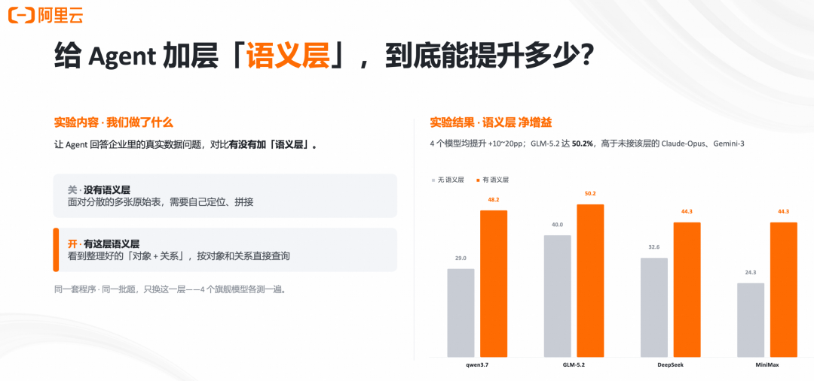01问题不是模型不聪明，而是它没有系统结构Cloud Native过去一年，Agent 的能力提升非常快。它会写代码，会调用工具，会做多步规划，也能在日志、指标、Trace、变更单之间来回检索。但只要把它放进一个真实生产系统，问一句“payment-gateway现在到底怎么了”，它仍然很容易给出一个看似专业、实际却危险的答案。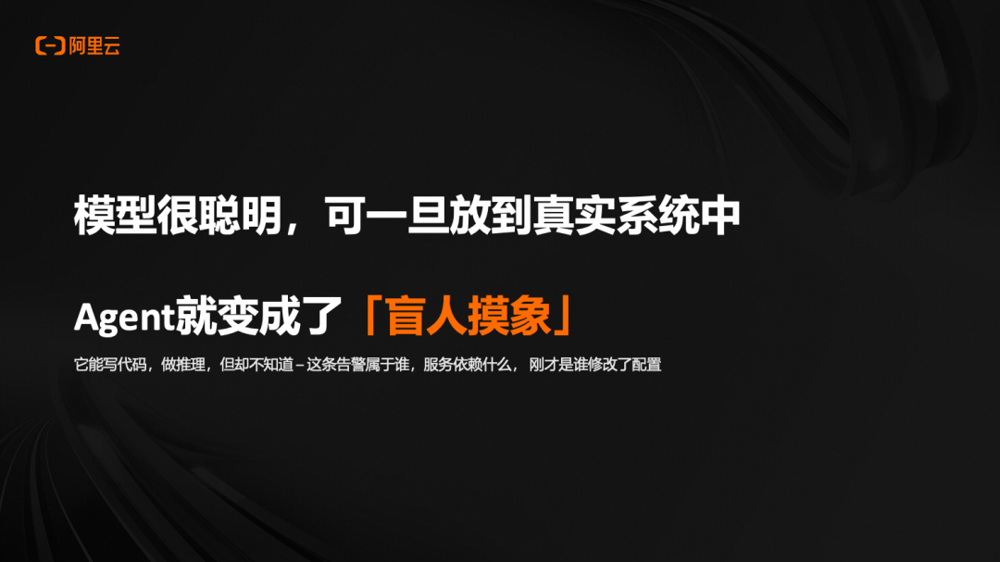原因不在单个工具给的信息错了。CPU 88% 是对的，P99 2150ms 是对的，某条 Trace 变慢也是对的。问题在于这些都只是“现象”。Agent 知道很多碎片，却不知道这些碎片属于哪个对象、对象之间怎么连接、谁依赖谁、刚刚哪个上游配置发生过变化。这就是“盲人摸象”在工程系统里的版本：指标、日志、Trace、工单、代码仓库各自都摸到了一块真实局部，但没有一个统一结构告诉 Agent “这整头象长什么样”。于是我们常见的第一反应，是继续给 Agent 加能力：换更强的模型，让它推理更久。给更长上下文，把更多日志和文档塞进去。加 RAG，让它能检索更多片段。加记忆，让它能保留历史对话和经验。接更多 MCP 工具，甚至开多智能体协作。这些方向都合理，但它们解决的是“更多能力”和“更多数据”的问题，不直接解决“系统结构”的问题。接得上所有系统，不等于看得懂系统。上下文里有所有片段，也不等于知道片段之间的关系。真正缺的是一层语义层：一层能把真实系统里的对象、关系、字段、证据和行动上下文沉淀下来的结构。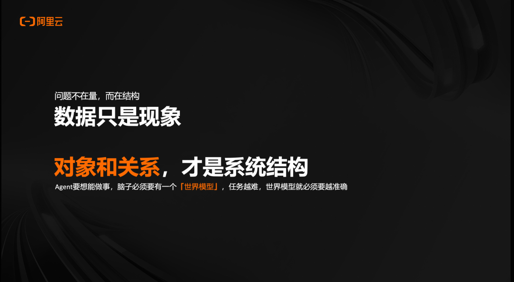02语义层的技术本质：外置的世界模型Cloud Native对 Agent 来说，一个复杂系统不是一堆表、一堆 API、一堆日志文件，而应该是一张可查询的“世界模型”：有哪些对象：服务、主机、数据库、配置、部署、团队、告警。对象之间怎么连：服务调用服务、服务运行在主机上、部署影响服务、配置作用于链路。每类对象有哪些字段：状态、负责人、SLO、生命周期、主键、标签。哪些观测证据挂在哪个对象上：指标、日志、Trace、事件、Runbook。哪些行动可以在什么条件下执行：回滚、限流、扩容、重试调整。信息学里，这件事的根叫本体论（Ontology）。它研究的是一个领域里有哪些类型的事物，以及这些事物之间如何关联。UnifiedModel 把这套思想落到工程系统里，用一组很小的统一原语描述数字孪生对象图。语义层不是把所有数据复制到一个新数据库里，也不是把文档切片后塞进向量库。它更像是给 Agent 一张系统地图：Agent 仍然可以调用 Prometheus、SLS、Elasticsearch、MySQL、Kubernetes、CMDB，但它不再从物理数据源出发，而是从“对象”出发，沿关系找到证据，再生成可执行查询或操作计划。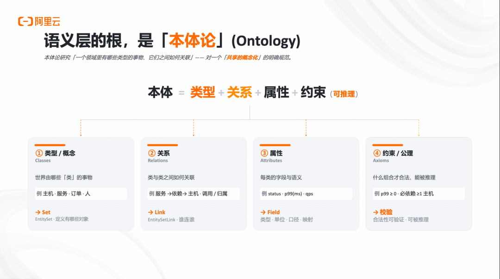03UnifiedModel 设计 & 能力Cloud Native▍3.1 UnifiedModel 的最小原语：Set + Link + FieldUnifiedModel 把对象图收敛到三个核心原语：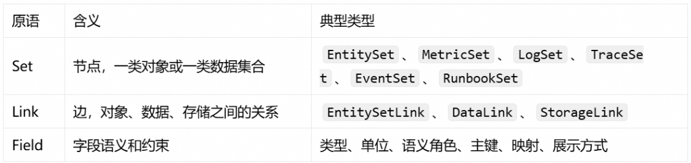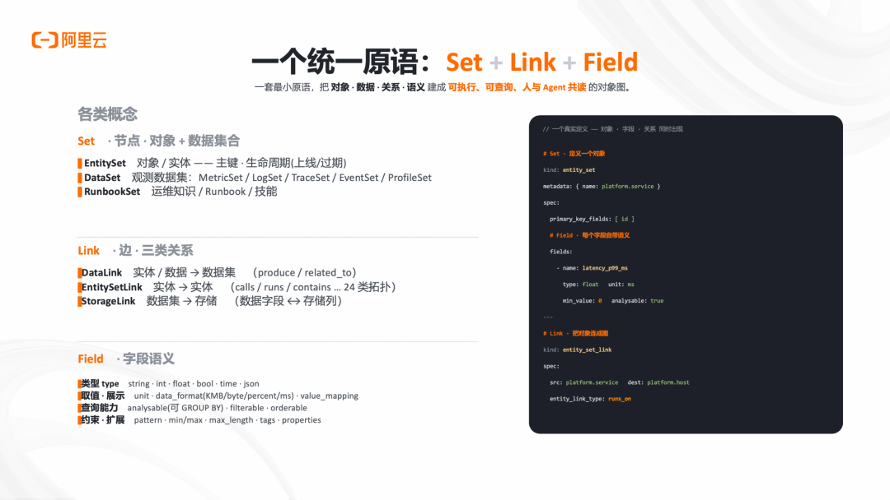这三个原语拼起来，就能表达“实体 - 数据 - 存储”的完整链路：EntitySet──DataLink──> DataSet ──StorageLink──> Storage│└──EntitySetLink──> EntitySet举一个可观测场景里的最小例子：platform.service是一个EntitySet，表示服务这一类实体。platform.host是另一个EntitySet，表示主机。服务和主机之间有runs_on关系，这是EntitySetLink。服务的延迟、错误率、QPS 挂在一个MetricSet上，这是DataLink。这个MetricSet实际落在 Prometheus 或 SLS 里，这是StorageLink。latency_p99_ms是一个Field，它不只是列名，还包含类型、单位、语义和查询映射。这套建法的关键不在于“画了一张图”，而在于这张图可以被查询、被校验、被 Agent 发现和调用。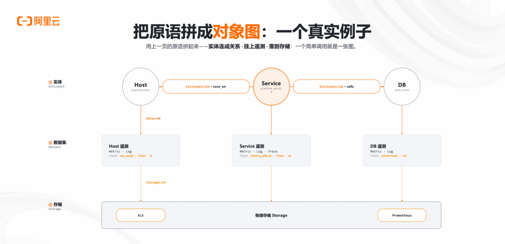▍3.2 类与实体：模型定义一次，运行时持续写入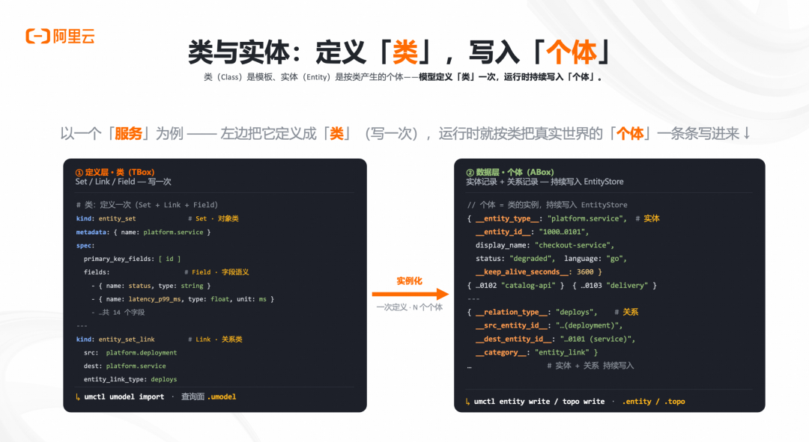对象图里有两个层次很容易混在一起：类和个体。类是定义层。比如“服务”这一类对象有什么字段、主键是什么、能关联哪些数据集、能和哪些实体建立关系。这个层次在 UnifiedModel 里主要由EntitySet、DataSet、Link、Field描述。它类似本体论里的 TBox。个体是运行时数据。比如checkout-service、payment-gateway、catalog-api是一条条真实服务实体；payment-gateway calls risk-control是一条真实关系；它们会随着系统运行持续写入、更新、过期。这个层次类似本体论里的 ABox。一个简化的定义层可以长这样：kind: entity_setdomain: platformname: platform.servicepk:-idfields:- name:idtype: stringsemantic_role: entity_id- name: statustype: string- name: latency_p99_mstype: doubleunit: ms运行时则持续写入实体和关系：{"entity_set":"platform@entity_set@platform.service","entity_id":"payment-gateway","fields": {"status":"degraded","latency_p99_ms":2150}}这种分层很重要。类让 Agent 知道“世界有哪些类型和方法”，个体让 Agent 看到“此刻真实世界里发生了什么”。前者稳定，后者动态，两者合起来才是一张活的对象图。▍3.3 Runtime：让对象图成为人和 Agent 共用的查询面UnifiedModel Runtime 的目标不是再造一个孤立平台，而是在既有系统之上加一层语义运行时。从上到下可以拆成四层：1. 接入层：Web UI、CLI、Skill、MCP Gateway。人可以查，Agent 也可以查。2. 运行时服务：Workspace、定义校验、实体写入、关系写入、查询服务、Agent Gateway。3. 图抽象层：统一封装对象、关系、方法、数据集和存储映射。4. 存储层：内存、文件、图数据库、以及 Prometheus、SLS、ES、MySQL 等外部数据源。▍3.4 查询统一：用 SPL 覆盖定义、实体、拓扑和数据计划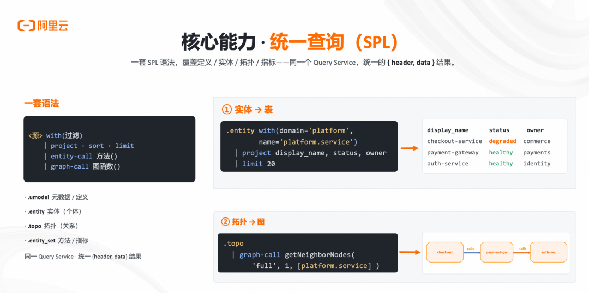对象图必须能被稳定查询，否则只是文档。UnifiedModel 用一套 SPL 查询面覆盖几个视角：查询面用途.umodel查询模型定义和元数据.entity查询具体实体.entity_set面向某类实体调用方法，比如列数据集、生成指标计划、生成日志计划.topo查询拓扑关系和邻居.runbook_set查询与对象绑定的运维知识和动作建议一个实体查询可以很直接：.entity with(domain='platform', name='platform.service')| projectid, display_name, status, owner|limit20一个拓扑查询则可以从对象出发看邻居：.topo| graph-callgetNeighborNodes('platform@entity_set@platform.service','payment-gateway',2)更关键的是方法调用。Agent 可以先问一个 EntitySet “你有哪些方法”，再按签名调用。例如服务对象可以暴露get_metrics、get_logs、list_data_set等方法。调用结果不是把全量数据倒给模型，而是返回可执行计划：.entity_setwith(domain='platform',name='platform.service',ids=['payment-gateway'])| entity-callget_metrics('latency_p99_ms','5m')返回可以是 PromQL、SLS 查询、ES DSL，或者一个结构化的查询计划。Agent 拿到计划后再执行，既减少幻觉，也降低误查底层数据源的风险。▍3.5 AI 友好：自描述、渐进式披露、MCP 和 Skill“Agent 友好”不是把文档塞给模型，而是让运行时具备可发现能力。UnifiedModel 为 Agent 做了三件事。第一，自描述和渐进式披露。Agent 不需要提前知道完整 schema，它可以先调用__list_method__，知道当前 EntitySet 有哪些方法、参数是什么、返回什么，再决定下一步。这样上下文不会被一次性塞满，Agent 也不用靠猜。第二，MCP Gateway。通过标准协议把查询、解释、示例、校验等能力暴露给任意 Agent。读工具默认可用，写工具默认关闭或需要显式授权，资源只暴露元数据，所有访问都经过 Query Service。第三，Skills。把常用能力包装成可加载技能，比如对象图查询、RCA 排障、影响面分析。这样 Claude Code、Cursor、Codex 等工具可以用同一套语义能力，而不是每个 Agent 单独写一套适配。这三点背后的设计原则是：让 Agent 先发现，再调用；先拿计划，再执行；先走语义层，再落底层工具。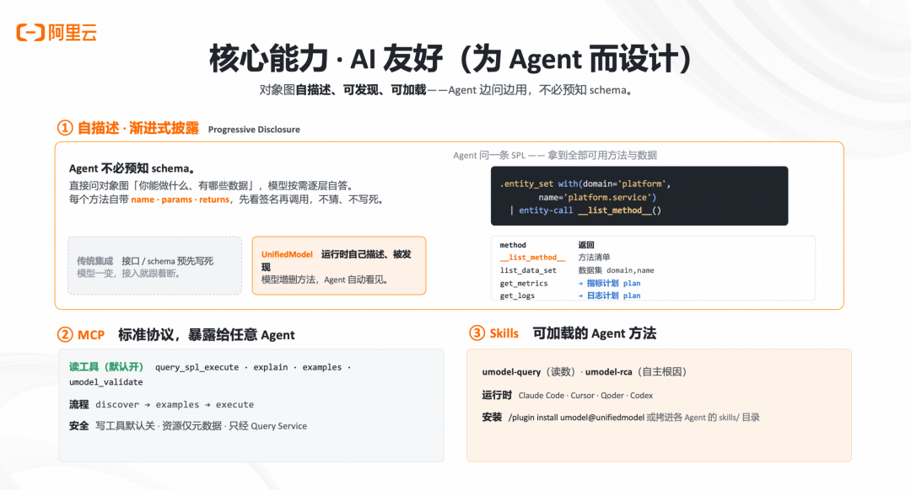04UnifiedModel 实战Cloud Native▍4.1 接入流程：从真实系统到可查询对象图把一个真实系统接入 UnifiedModel，可以拆成三步。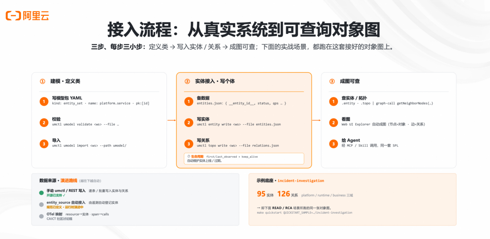第一步，建模。写模型包 YAML，定义实体、字段、关系、数据集和存储映射。然后用校验工具保证模型合法。umctl umodel validate \1 --filemodel-pack.yamlumctl umodel import \1 --filemodel-pack.yaml第二步，写入运行时个体。实体、关系、生命周期、状态、观测证据持续写入。实体可以来自 CMDB、Kubernetes、OpenTelemetry Resource、服务目录、部署系统；关系可以来自调用链、配置系统、代码依赖、人工登记。umctl entity write \1 --fileentities.jsonumctl topo write \1 --filerelations.json第三步，成图可查。人用.entity和.topo查，Explorer 自动可视化；Agent 通过 MCP 和 Skill 发现方法、生成查询计划、执行排障流程。这个流程今天可以手动写模型和数据，后续可以通过自动登记、OTel 映射、服务发现、代码扫描继续降低接入成本。重点是：建模不是一次性大工程，而是可以从一个场景、一个 domain、一个服务链路开始增量生长。▍4.2 实战一：按对象读数，而不是手写 PromQL回到演讲里的问题：有人问 Agent，“payment-gateway现在怎么样？”没有语义层时，Agent 需要自己判断：payment-gateway对应哪个服务对象？指标在哪个系统里？P99 的指标名是什么？label 应该用service、service_id还是app？单位是秒还是毫秒？这些细节任何一个错了，结果都可能看似合理但实际不可用。有对象图后，流程变成：1. 用.entity定位platform.service/payment-gateway。2. 沿DataLink找到它关联的MetricSet和LogSet。3. 调用get_metrics生成查询计划，自动代入实体 id、窗口、单位换算和指标语义。最后 Agent 可以回答：状态：degradedQPS：4200错误率：14.8%P99：2150ms副本：5/5关键不在这些数字本身，而在于它们是“按对象”取到的。Agent 不需要先理解 PromQL 方言，也不需要猜 label。对象图把“那个服务”翻译成了精确查询。已关注关注重播分享赞关闭观看更多更多退出全屏切换到竖屏全屏退出全屏阿里云云原生已关注分享视频，时长01:300/000:00/01:30切换到横屏模式继续播放进度条，百分之0播放00:00/01:3001:30倍速全屏倍速播放中0.5倍0.75倍1.0倍1.5倍2.0倍超清流畅您的浏览器不支持 video 标签继续观看AI Agent 时代，需要的不是更多数据，而是一个语义层观看更多转载,AI Agent 时代，需要的不是更多数据，而是一个语义层阿里云云原生已关注分享点赞在看已同步到看一看写下你的评论视频详情▍4.3 实战二：RCA 不是猜最近发布，而是沿关系链定位第二个场景是根因定位：payment-gateway为什么 P99 破了 SLO？对象图提供了一条可遍历的关系链：FlashSale 大促└─triggers─> cfg-checkout-retry└─affects─> checkout-service└─calls─> payment-gateway这条链把业务事件、配置变化、上游服务、受影响服务连在一起。Agent 不再只是看到payment-gateway慢了，而是能沿关系往上走，定位到“上游 checkout 的重试配置被大促触发后放大了流量”。它还可以排除红鲱鱼。比如 12 小时前payment-gatewayv3.2.1有一次部署，看起来很可疑；但关系和证据显示它只改了日志格式，不解释 P99 破 SLO。于是 Agent 不会机械地把锅甩给最近发布。4000QPS ×3.5倍大促流量 × (5/2) 重试放大 =35000QPS35000/4000=8.75x结论就变成：根因不是那次部署，而是上游重试从 2 调到 5 后遇到大促流量。过载约为原容量的 8.75 倍。建议动作是把重试回滚到 2，并增加限流。已关注关注重播分享赞关闭观看更多更多退出全屏切换到竖屏全屏退出全屏阿里云云原生已关注分享视频，时长01:400/000:00/01:40切换到横屏模式继续播放进度条，百分之0播放00:00/01:4001:40倍速全屏倍速播放中0.5倍0.75倍1.0倍1.5倍2.0倍超清流畅您的浏览器不支持 video 标签继续观看AI Agent 时代，需要的不是更多数据，而是一个语义层观看更多转载,AI Agent 时代，需要的不是更多数据，而是一个语义层阿里云云原生已关注分享点赞在看已同步到看一看写下你的评论视频详情结语：先建模真实世界，再组织数据Cloud NativeAgent 时代，我们真正需要补的不是更多碎片，而是一层能把碎片组织起来的结构。数据只是现象，对象和关系才是系统结构。UnifiedModel 的核心尝试，是用Set + Link + Field把真实系统建成一张可查询、可遍历、可执行的对象图；用 SPL、Runtime、MCP 和 Skill 把这张图交给人和 Agent 共用；再通过数据、知识、行动的闭环，让 Agent 不只是“看见指标”，而是能沿真实关系理解系统。一句话：先建模真实世界，再组织数据。语义层，是 Agent 时代的基础设施。相关链接：[1]UnifiedModelhttps://github.com/alibaba/UnifiedModel

一句话省流版本Cloud Native

一句话省流版本Cloud Native

一句话省流版本Cloud Native

一句话省流版本

一句话省流版本

Cloud Native

Cloud Native

AI Agent 时代，真正缺的不是更多数据，而是一张开放的系统地图。

UModel 作为一套面向企业 AI 的对象图语义运行时，用对象和关系描述企业世界，让这些描述可以被查询、被验证、被 Agent 编程调用。它不是另一个可观测工具、CMDB 或知识图谱。它站在这些系统之上，把它们中已有的事实组织成统一的对象图。将相应能力组合在一起，让企业数据从“被各系统分别记录”变成“围绕对象被统一组织、查询、验证和调用”。

UnifiedModel[1]是面向 Agent 的开源数字孪生语义层，把企业资产、运行数据和系统关系组织成可查询对象图；在 DataAgentBench 对照实验中，接入语义层后 4 个旗舰模型均提升 10-20 个百分点，GLM-5.2 达到 50.2% pass@1。它让 Agent 不再面对孤立数据碎片，而是能按对象读数、沿关系定位根因，真正看懂复杂系统。

01问题不是模型不聪明，而是它没有系统结构Cloud Native

01问题不是模型不聪明，而是它没有系统结构Cloud Native

01问题不是模型不聪明，而是它没有系统结构Cloud Native

01问题不是模型不聪明，而是它没有系统结构

01

问题不是模型不聪明，而是它没有系统结构

问题不是模型不聪明，而是它没有系统结构

Cloud Native

Cloud Native

过去一年，Agent 的能力提升非常快。它会写代码，会调用工具，会做多步规划，也能在日志、指标、Trace、变更单之间来回检索。但只要把它放进一个真实生产系统，问一句“payment-gateway现在到底怎么了”，它仍然很容易给出一个看似专业、实际却危险的答案。

原因不在单个工具给的信息错了。CPU 88% 是对的，P99 2150ms 是对的，某条 Trace 变慢也是对的。问题在于这些都只是“现象”。Agent 知道很多碎片，却不知道这些碎片属于哪个对象、对象之间怎么连接、谁依赖谁、刚刚哪个上游配置发生过变化。

这就是“盲人摸象”在工程系统里的版本：指标、日志、Trace、工单、代码仓库各自都摸到了一块真实局部，但没有一个统一结构告诉 Agent “这整头象长什么样”。

于是我们常见的第一反应，是继续给 Agent 加能力：

换更强的模型，让它推理更久。

给更长上下文，把更多日志和文档塞进去。

加 RAG，让它能检索更多片段。

加记忆，让它能保留历史对话和经验。

接更多 MCP 工具，甚至开多智能体协作。

这些方向都合理，但它们解决的是“更多能力”和“更多数据”的问题，不直接解决“系统结构”的问题。接得上所有系统，不等于看得懂系统。上下文里有所有片段，也不等于知道片段之间的关系。

真正缺的是一层语义层：一层能把真实系统里的对象、关系、字段、证据和行动上下文沉淀下来的结构。

02语义层的技术本质：外置的世界模型Cloud Native

02语义层的技术本质：外置的世界模型Cloud Native

02语义层的技术本质：外置的世界模型Cloud Native

02语义层的技术本质：外置的世界模型

02

语义层的技术本质：外置的世界模型

语义层的技术本质：外置的世界模型

Cloud Native

Cloud Native

对 Agent 来说，一个复杂系统不是一堆表、一堆 API、一堆日志文件，而应该是一张可查询的“世界模型”：

有哪些对象：服务、主机、数据库、配置、部署、团队、告警。

对象之间怎么连：服务调用服务、服务运行在主机上、部署影响服务、配置作用于链路。

每类对象有哪些字段：状态、负责人、SLO、生命周期、主键、标签。

哪些观测证据挂在哪个对象上：指标、日志、Trace、事件、Runbook。

哪些行动可以在什么条件下执行：回滚、限流、扩容、重试调整。

信息学里，这件事的根叫本体论（Ontology）。它研究的是一个领域里有哪些类型的事物，以及这些事物之间如何关联。UnifiedModel 把这套思想落到工程系统里，用一组很小的统一原语描述数字孪生对象图。

语义层不是把所有数据复制到一个新数据库里，也不是把文档切片后塞进向量库。它更像是给 Agent 一张系统地图：Agent 仍然可以调用 Prometheus、SLS、Elasticsearch、MySQL、Kubernetes、CMDB，但它不再从物理数据源出发，而是从“对象”出发，沿关系找到证据，再生成可执行查询或操作计划。

03UnifiedModel 设计 & 能力Cloud Native

03UnifiedModel 设计 & 能力Cloud Native

03UnifiedModel 设计 & 能力Cloud Native

03UnifiedModel 设计 & 能力

03

UnifiedModel 设计 & 能力

UnifiedModel 设计 & 能力

Cloud Native

Cloud Native

▍3.1 UnifiedModel 的最小原语：Set + Link + Field

▍3.1 UnifiedModel 的最小原语：Set + Link + Field

### ▍3.1 UnifiedModel 的最小原语：Set + Link + Field

UnifiedModel 把对象图收敛到三个核心原语：

这三个原语拼起来，就能表达“实体 - 数据 - 存储”的完整链路：

EntitySet──DataLink──> DataSet ──StorageLink──> Storage│└──EntitySetLink──> EntitySet

举一个可观测场景里的最小例子：

platform.service是一个EntitySet，表示服务这一类实体。

platform.host是另一个EntitySet，表示主机。

服务和主机之间有runs_on关系，这是EntitySetLink。

服务的延迟、错误率、QPS 挂在一个MetricSet上，这是DataLink。

这个MetricSet实际落在 Prometheus 或 SLS 里，这是StorageLink。

latency_p99_ms是一个Field，它不只是列名，还包含类型、单位、语义和查询映射。

这套建法的关键不在于“画了一张图”，而在于这张图可以被查询、被校验、被 Agent 发现和调用。

▍3.2 类与实体：模型定义一次，运行时持续写入

▍3.2 类与实体：模型定义一次，运行时持续写入

### ▍3.2 类与实体：模型定义一次，运行时持续写入

对象图里有两个层次很容易混在一起：类和个体。

类是定义层。比如“服务”这一类对象有什么字段、主键是什么、能关联哪些数据集、能和哪些实体建立关系。这个层次在 UnifiedModel 里主要由EntitySet、DataSet、Link、Field描述。它类似本体论里的 TBox。

个体是运行时数据。比如checkout-service、payment-gateway、catalog-api是一条条真实服务实体；payment-gateway calls risk-control是一条真实关系；它们会随着系统运行持续写入、更新、过期。这个层次类似本体论里的 ABox。

一个简化的定义层可以长这样：

kind: entity_setdomain: platformname: platform.servicepk:-idfields:- name:idtype: stringsemantic_role: entity_id- name: statustype: string- name: latency_p99_mstype: doubleunit: ms

运行时则持续写入实体和关系：

{"entity_set":"platform@entity_set@platform.service","entity_id":"payment-gateway","fields": {"status":"degraded","latency_p99_ms":2150}}

这种分层很重要。类让 Agent 知道“世界有哪些类型和方法”，个体让 Agent 看到“此刻真实世界里发生了什么”。前者稳定，后者动态，两者合起来才是一张活的对象图。

▍3.3 Runtime：让对象图成为人和 Agent 共用的查询面

▍3.3 Runtime：让对象图成为人和 Agent 共用的查询面

### ▍3.3 Runtime：让对象图成为人和 Agent 共用的查询面

UnifiedModel Runtime 的目标不是再造一个孤立平台，而是在既有系统之上加一层语义运行时。

从上到下可以拆成四层：

1. 接入层：Web UI、CLI、Skill、MCP Gateway。人可以查，Agent 也可以查。

2. 运行时服务：Workspace、定义校验、实体写入、关系写入、查询服务、Agent Gateway。

3. 图抽象层：统一封装对象、关系、方法、数据集和存储映射。

4. 存储层：内存、文件、图数据库、以及 Prometheus、SLS、ES、MySQL 等外部数据源。

▍3.4 查询统一：用 SPL 覆盖定义、实体、拓扑和数据计划

▍3.4 查询统一：用 SPL 覆盖定义、实体、拓扑和数据计划

### ▍3.4 查询统一：用 SPL 覆盖定义、实体、拓扑和数据计划

对象图必须能被稳定查询，否则只是文档。UnifiedModel 用一套 SPL 查询面覆盖几个视角：

查询面

用途

.umodel

查询模型定义和元数据

.entity

查询具体实体

.entity_set

面向某类实体调用方法，比如列数据集、生成指标计划、生成日志计划

.topo

查询拓扑关系和邻居

.runbook_set

查询与对象绑定的运维知识和动作建议

一个实体查询可以很直接：

.entity with(domain='platform', name='platform.service')| projectid, display_name, status, owner|limit20

一个拓扑查询则可以从对象出发看邻居：

.topo| graph-callgetNeighborNodes('platform@entity_set@platform.service','payment-gateway',2)

更关键的是方法调用。Agent 可以先问一个 EntitySet “你有哪些方法”，再按签名调用。例如服务对象可以暴露get_metrics、get_logs、list_data_set等方法。调用结果不是把全量数据倒给模型，而是返回可执行计划：

.entity_setwith(domain='platform',name='platform.service',ids=['payment-gateway'])| entity-callget_metrics('latency_p99_ms','5m')

返回可以是 PromQL、SLS 查询、ES DSL，或者一个结构化的查询计划。Agent 拿到计划后再执行，既减少幻觉，也降低误查底层数据源的风险。

▍3.5 AI 友好：自描述、渐进式披露、MCP 和 Skill

▍3.5 AI 友好：自描述、渐进式披露、MCP 和 Skill

### ▍3.5 AI 友好：自描述、渐进式披露、MCP 和 Skill

“Agent 友好”不是把文档塞给模型，而是让运行时具备可发现能力。

UnifiedModel 为 Agent 做了三件事。

第一，自描述和渐进式披露。Agent 不需要提前知道完整 schema，它可以先调用__list_method__，知道当前 EntitySet 有哪些方法、参数是什么、返回什么，再决定下一步。这样上下文不会被一次性塞满，Agent 也不用靠猜。

第二，MCP Gateway。通过标准协议把查询、解释、示例、校验等能力暴露给任意 Agent。读工具默认可用，写工具默认关闭或需要显式授权，资源只暴露元数据，所有访问都经过 Query Service。

第三，Skills。把常用能力包装成可加载技能，比如对象图查询、RCA 排障、影响面分析。这样 Claude Code、Cursor、Codex 等工具可以用同一套语义能力，而不是每个 Agent 单独写一套适配。

这三点背后的设计原则是：让 Agent 先发现，再调用；先拿计划，再执行；先走语义层，再落底层工具。

04UnifiedModel 实战Cloud Native

04UnifiedModel 实战Cloud Native

04UnifiedModel 实战Cloud Native

04UnifiedModel 实战

04

UnifiedModel 实战

UnifiedModel 实战

Cloud Native

Cloud Native

▍4.1 接入流程：从真实系统到可查询对象图

▍4.1 接入流程：从真实系统到可查询对象图

### ▍4.1 接入流程：从真实系统到可查询对象图

把一个真实系统接入 UnifiedModel，可以拆成三步。

第一步，建模。写模型包 YAML，定义实体、字段、关系、数据集和存储映射。然后用校验工具保证模型合法。

umctl umodel validate \1 --filemodel-pack.yamlumctl umodel import \1 --filemodel-pack.yaml

第二步，写入运行时个体。实体、关系、生命周期、状态、观测证据持续写入。实体可以来自 CMDB、Kubernetes、OpenTelemetry Resource、服务目录、部署系统；关系可以来自调用链、配置系统、代码依赖、人工登记。

umctl entity write \1 --fileentities.jsonumctl topo write \1 --filerelations.json

第三步，成图可查。人用.entity和.topo查，Explorer 自动可视化；Agent 通过 MCP 和 Skill 发现方法、生成查询计划、执行排障流程。

这个流程今天可以手动写模型和数据，后续可以通过自动登记、OTel 映射、服务发现、代码扫描继续降低接入成本。重点是：建模不是一次性大工程，而是可以从一个场景、一个 domain、一个服务链路开始增量生长。

▍4.2 实战一：按对象读数，而不是手写 PromQL

▍4.2 实战一：按对象读数，而不是手写 PromQL

### ▍4.2 实战一：按对象读数，而不是手写 PromQL

回到演讲里的问题：有人问 Agent，“payment-gateway现在怎么样？”

没有语义层时，Agent 需要自己判断：

payment-gateway对应哪个服务对象？

指标在哪个系统里？

P99 的指标名是什么？

label 应该用service、service_id还是app？

单位是秒还是毫秒？

这些细节任何一个错了，结果都可能看似合理但实际不可用。

有对象图后，流程变成：

1. 用.entity定位platform.service/payment-gateway。

2. 沿DataLink找到它关联的MetricSet和LogSet。

3. 调用get_metrics生成查询计划，自动代入实体 id、窗口、单位换算和指标语义。

最后 Agent 可以回答：

状态：degraded

QPS：4200

错误率：14.8%

P99：2150ms

副本：5/5

关键不在这些数字本身，而在于它们是“按对象”取到的。Agent 不需要先理解 PromQL 方言，也不需要猜 label。对象图把“那个服务”翻译成了精确查询。

已关注关注重播分享赞关闭观看更多更多退出全屏切换到竖屏全屏退出全屏阿里云云原生已关注分享视频，时长01:300/000:00/01:30切换到横屏模式继续播放进度条，百分之0播放00:00/01:3001:30倍速全屏倍速播放中0.5倍0.75倍1.0倍1.5倍2.0倍超清流畅您的浏览器不支持 video 标签继续观看AI Agent 时代，需要的不是更多数据，而是一个语义层观看更多转载,AI Agent 时代，需要的不是更多数据，而是一个语义层阿里云云原生已关注分享点赞在看已同步到看一看写下你的评论视频详情

0/0

继续观看

AI Agent 时代，需要的不是更多数据，而是一个语义层

▍4.3 实战二：RCA 不是猜最近发布，而是沿关系链定位

### ▍4.3 实战二：RCA 不是猜最近发布，而是沿关系链定位

第二个场景是根因定位：payment-gateway为什么 P99 破了 SLO？

对象图提供了一条可遍历的关系链：

FlashSale 大促└─triggers─> cfg-checkout-retry└─affects─> checkout-service└─calls─> payment-gateway

这条链把业务事件、配置变化、上游服务、受影响服务连在一起。Agent 不再只是看到payment-gateway慢了，而是能沿关系往上走，定位到“上游 checkout 的重试配置被大促触发后放大了流量”。

它还可以排除红鲱鱼。比如 12 小时前payment-gatewayv3.2.1有一次部署，看起来很可疑；但关系和证据显示它只改了日志格式，不解释 P99 破 SLO。于是 Agent 不会机械地把锅甩给最近发布。

4000QPS ×3.5倍大促流量 × (5/2) 重试放大 =35000QPS35000/4000=8.75x

结论就变成：

根因不是那次部署，而是上游重试从 2 调到 5 后遇到大促流量。

过载约为原容量的 8.75 倍。

建议动作是把重试回滚到 2，并增加限流。

已关注关注重播分享赞关闭观看更多更多退出全屏切换到竖屏全屏退出全屏阿里云云原生已关注分享视频，时长01:400/000:00/01:40切换到横屏模式继续播放进度条，百分之0播放00:00/01:4001:40倍速全屏倍速播放中0.5倍0.75倍1.0倍1.5倍2.0倍超清流畅您的浏览器不支持 video 标签继续观看AI Agent 时代，需要的不是更多数据，而是一个语义层观看更多转载,AI Agent 时代，需要的不是更多数据，而是一个语义层阿里云云原生已关注分享点赞在看已同步到看一看写下你的评论视频详情

0/0

继续观看

AI Agent 时代，需要的不是更多数据，而是一个语义层

结语：先建模真实世界，再组织数据Cloud Native

结语：先建模真实世界，再组织数据Cloud Native

结语：先建模真实世界，再组织数据Cloud Native

结语：先建模真实世界，再组织数据

结语：先建模真实世界，再组织数据

Cloud Native

Cloud Native

Agent 时代，我们真正需要补的不是更多碎片，而是一层能把碎片组织起来的结构。数据只是现象，对象和关系才是系统结构。

UnifiedModel 的核心尝试，是用Set + Link + Field把真实系统建成一张可查询、可遍历、可执行的对象图；用 SPL、Runtime、MCP 和 Skill 把这张图交给人和 Agent 共用；再通过数据、知识、行动的闭环，让 Agent 不只是“看见指标”，而是能沿真实关系理解系统。

一句话：先建模真实世界，再组织数据。语义层，是 Agent 时代的基础设施。

相关链接：

[1]UnifiedModel

https://github.com/alibaba/UnifiedModel
