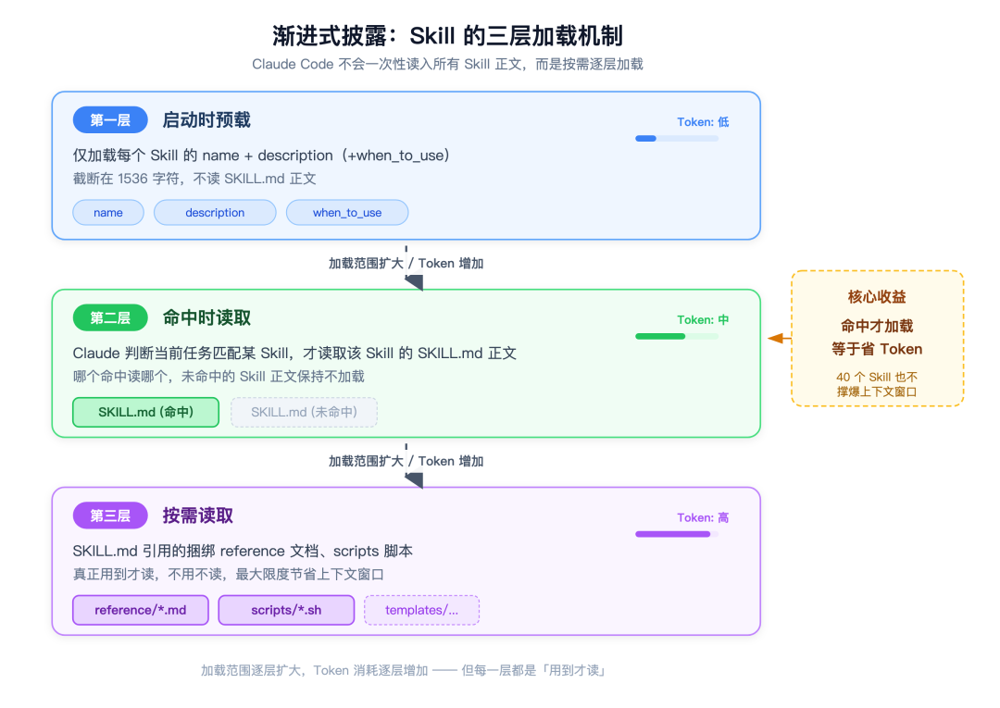
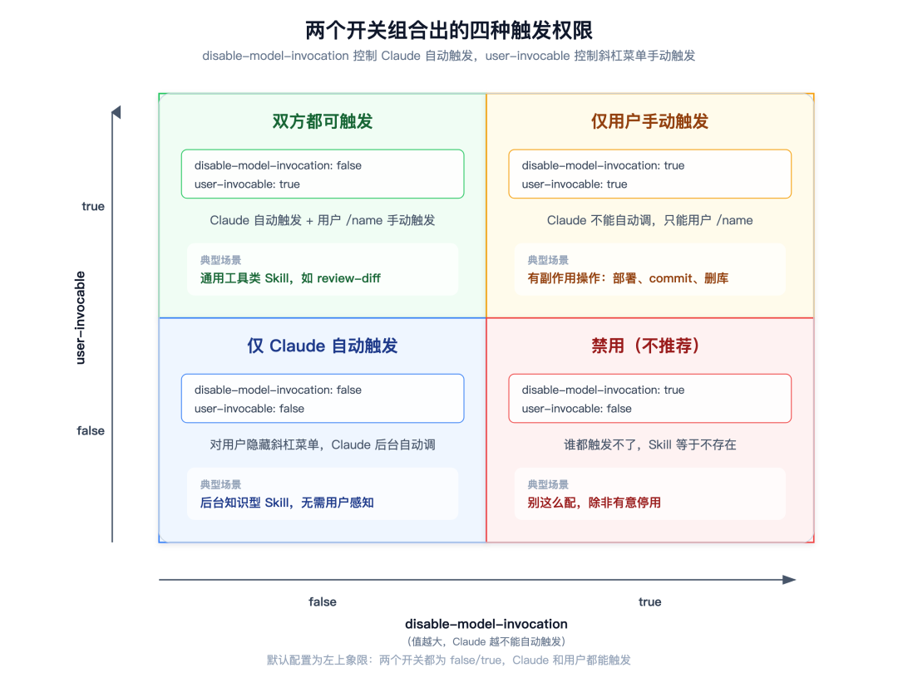

# 2026 AI Agent 必备 Skills 大全：从心智模型到实战清单

> 裸用 Claude Code 就像雇了个聪明但啥都不懂的新人。装好 skill，你雇的是一个带全套 SOP 上岗的熟手。



## 核心洞察

这篇文章是码哥的 Claude Code Skills 实战指南。核心观点：**谁把自己的经验沉淀成 skill，谁的杠杆就比别人大一个数量级**。模型是大家共用的脑子，skill 是你私有的肌肉记忆。

### Skill 与 MCP、Hook、Plugin、CLAUDE.md 的本质区别

| 组件 | 本质 | 一句话 |
|------|------|--------|
| **MCP** | 接手脚和数据 | 连数据库、连外部系统 |
| **Hook** | 事件点自动脚本 | 提交前自动格式化 |
| **Plugin** | 打包分发单位 | 里面能装 skill、命令、MCP |
| **CLAUDE.md** | 每次全量进上下文的记忆 | 项目背景、全局约定 |
| **Skill** | 命中才加载的流程和专长 | 「遇到这种事该这么干」的程序性知识 |

关键就在「**命中才加载**」五个字。

## 一、渐进式披露：三层加载模型

官方文档把这套机制叫渐进式披露（Progressive Disclosure），分三层：

1. **启动时**：只把每个 skill 的 `name` + `description`（外加 `when_to_use`）预载进系统提示，不读正文。截断在 1536 字符，几十个 skill 摊开也就几 KB。

2. **命中时**：Claude 判断当前任务该用哪个 skill，这才去读对应的 `SKILL.md` 正文。这就是为什么 description 写得烂，skill 永远不触发。

3. **按需读**：`SKILL.md` 里引用了捆绑的 reference 文档、scripts 脚本，真用到了才去读。

> **省 token 是核心设计动机。** 把所有规则塞进 CLAUDE.md，每次对话全量进上下文，又长又贵还稀释注意力。Skill 等于让 Claude 随身揣着一套书，但只在需要时翻开对应那一本。

## 二、精选 Skill 清单（带 star 验证）

Agent Skills 是开放标准（2025-12-18 发布），Claude Code、Claude.ai、Agent SDK 都支持，标准站点 [agentskills.io](https://agentskills.io)。

### 官方仓库

| 仓库 | Stars | 内容 |
|------|-------|------|
| anthropics/skills | 169,874 | 17 个官方示范 skill：frontend-design、docx、pdf、pptx、xlsx、mcp-builder、skill-creator、webapp-testing |

**skill-creator** 尤其推荐——它本身就是教你写 skill 的，递归套娃，建议第一个装。

### 第三方精选

| 仓库 | Stars | 干什么 | 适合谁 |
|------|-------|--------|--------|
| obra/superpowers | 273,037 | agentic skills 框架 6.0.3，SDD 子 agent 驱动开发 | 想让 Claude 自主拆解执行任务 |
| JuliusBrussee/caveman | 98,659 | 省 token，号称砍掉 65% | token 账单肉疼的 |
| alirezarezvani/claude-skills | 24,552 | 345 个 skill 合集，30+ agents | 想一次性囤一堆挑着用的 |
| virgiliojr94/book-to-skill | 22,429 | 把技术书 PDF 转成 skill | 有藏书想喂给 Claude 的 |
| op7418/Humanizer-zh | 15,476 | 中文去 AI 味 | 写中文内容嫌 AI 腔的 |
| trailofbits/skills | 6,625 | 安全研究 | 做安全审计的 |
| zazhangrui/codebase-to-course | 5,405 | 代码库转互动课程 | 做内部培训和 onboarding 的 |

**obra/superpowers** 单独说一句：它是现在最火的 agentic 框架，stars 比官方仓库还高。里面 brainstorming、dispatching-parallel-agents、subagent-driven-development、systematic-debugging、test-driven-development 这一套，是把「先想清楚再动手」的工程纪律硬编码进了 Claude 的工作流。

> ⚠️ **安全提醒**：一个 skill 能让 Claude 跑 Bash，你等于给了它 shell 权限。只装可信来源的 skill，装第三方之前先审计它的捆绑文件、代码依赖、有没有外联网络。

### Claude Code 自带的 Bundled Skills

/doctor、/code-review、/batch、/loop、/verify 等 9 个，不用装就能用。除了 /doctor 关不掉，其余能用 `disableBundledSkills` 配置关。建议先把自带的用熟，再装第三方。

## 三、10 分钟写第一个 Skill：review-diff

### 创建目录

```bash
mkdir -p ~/.claude/skills/review-diff
```

### 写入 SKILL.md

```yaml
---
name: review-diff
description: 审查当前git diff，总结改动逻辑并标出潜在风险，包括空指针、SQL注入、吞错误、并发问题。当用户说「review一下改动」「看看这次diff有没有问题」「帮我codereview」「审一下这次提交」时使用。
---
```

```markdown
# review-diff
你是一个资深代码审查员。按下面步骤工作，不要跳过。

## 步骤
1. 先运行 `git diff --stat` 看改了哪些文件
2. 再运行 `git diff` 拿完整改动
3. 按文件输出审查结果：改动摘要、风险点、建议
4. 风险点按严重程度从高到低排

## 重点盯这些
- 空指针和数组越界
- error 返回值被吞没处理
- SQL 字符串拼接和未转义的用户输入
- 并发下的共享可变状态
- 该补但漏写的单测

## 输出格式
用中文，简洁。不要复述整段代码，只引用关键行加行号。结尾给一句总体评价。
```

### 测试两种触发方式

1. **自然语言触发**：「帮我 review 一下这次的改动」→ description 命中，自动读正文
2. **手动触发**：`/review-diff` → 强制调用，不走自动判断

### 迭代方法

像带新人一样带你的 skill——跑几次后发现它漏看了某类风险或跳了步骤，把这些信号直接回写进 `SKILL.md`。

## 四、让 Skill 听话的高级开关

### description 是触发器，不是说明书

见太多人栽在这点上。随便写「一个有用的代码审查工具」，结果 Claude 永远不自动调它。**要把「做什么」+「什么时候用」写具体，关键用例放前 1536 字符。**

### 调用控制的 2×2 矩阵

| disable-model-invocation | user-invocable | 效果 |
|--------------------------|----------------|------|
| 不写（默认） | 不写（默认） | Claude 自动 + 用户手动都能触发 |
| `true` | 不写 | 只允许用户手动触发（**有副作用的 skill 必开**） |
| 不写 | `false` | 只允许 Claude 自动触发，对用户隐藏 |
| `true` | `false` | 谁都触发不了（别这么干） |

> **铁律**：部署、提交代码、删资源这类有副作用的 skill，一定开 `disable-model-invocation: true`。有人写了自动部署 skill 没开这个，Claude 自己触发了部署，吓得连夜回滚。

### allowed-tools：免授权跑脚本

```yaml
---
name: db-migrate
description: 运行数据库迁移脚本。用户说「跑迁移」「migrate」时使用。
allowed-tools:
  - Bash(${CLAUDE_SKILL_DIR}/scripts/migrate.sh*)
---
```

`${CLAUDE_SKILL_DIR}` 是内置变量。这样 Claude 跑这个目录下的 `migrate.sh` 不弹框，跑别的 Bash 命令照样要授权。**最小权限原则。**

### 子 Agent 隔离执行

```yaml
context: fork
agent: auto
```

让 skill 在隔离子 agent 里跑，不污染主对话上下文。适合「读一大堆文件然后给结论」的任务。

### 动态上下文注入

在 `SKILL.md` 正文里用反引号+感叹号：

```markdown
当前工作区相对于 main 的改动如下。
!`git diff --stat main`
```

每次触发，实时输出就被嵌进来，skill 正文永远是活的。

### paths：按文件类型触发

填 glob 模式，比如 `**/*.go`。配后只有操作 Go 文件时才自动加载，进一步省 token。

### ⚠️ 跨平台坑

如果打算上传到 claude.ai 或走 Skills API 打包，只认 6 个标准字段：`name`、`description`、`license`、`compatibility`、`metadata`、`allowed-tools`。本地用的扩展字段（`argument-hint`、`when_to_use`、`context`、`agent`）打包时会硬报错。

## 五、码哥的 40 个 Skill 技能栈

分四拨：

1. **superpowers 6.0.3 套件（12 个）**：subagent-driven-development、dispatching-parallel-agents、systematic-debugging。把资深工程师的工程纪律变成 Claude 不会偷懒跳过的流程。

2. **自研内容生产链**：it-article-producer、paid-column-writer、video-producer、tech-hv-research。每周更新量至少砍掉一半。

3. **图表和前端**：fireworks-tech-graph、excalidraw-diagram、frontend-slides。一句话描述，SVG 直接出。

4. **官方和通用**：docx、pdf、pptx、xlsx、mcp-builder、skill-creator。随用随取。

> 这 40 个 skill 不是一天装的，是这大半年遇到一个重复痛点就沉淀一个。**不是囤货，是把踩过的坑、走过的流程，一个个变成 Claude 的肌肉记忆。**

## 六、六条避坑清单

1. **description 别含糊**：写笼统要么不触发要么乱触发。做什么 + 什么时候用，具体说法列出来。
2. **Skill 不替代 MCP**：MCP 接工具和数据（手脚），Skill 教流程和专长（脑子）。两者互补，未来 Skill 会教 agent 怎么编排 MCP 工具。
3. **别把所有规则塞 CLAUDE.md**：程序性的、按需用的东西做成 skill。
4. **有副作用的 skill 开 `disable-model-invocation: true`**：别给 Claude 自作主张的机会。
5. **跨平台分发收敛字段**：只留 6 个标准字段。
6. **注意作用域优先级**：企业级 > 个人级 `~/.claude/skills/` > 项目级 `.claude/skills/`。同名被高优先级覆盖是常见坑。

## 常见问题

**Q: Skill 和 MCP 先学哪个？**
A: 先学 Skill。写 markdown 今天就能上手。发现需要连数据库、调内部接口了再上 MCP，skill 还能反过来教 Claude 怎么用 MCP 工具。

**Q: 个人 skill 还是项目 skill？**
A: 跨项目通用的放个人级，跟具体项目绑定的放项目级（可提交 git 跟团队共享）。

**Q: skill 装多了会拖慢费 token 吗？**
A: 不会。启动只加载 name + description，几十上百个也就几 KB。真正费 token 的是把所有规则塞 CLAUDE.md。

**Q: 不会写代码能做 skill 吗？**
A: 能。skill 本体是 markdown，纯文本的 check list 也是 skill。「我们团队 code review 要检查这 10 项」就是一个 skill。

**Q: 团队怎么共享 skill？**
A: 轻量的直接提交到项目 `.claude/skills/`；正规的用 plugin 打包走 `/plugin marketplace add`。

## 写在最后

> 裸用 Claude Code 就像雇了个聪明但啥都不懂的新人，每次都得从头教。装好 skill，你雇的是一个带全套 SOP 上岗的熟手。这件事越早开始越划算。

今天就从你最烦的那件重复劳动下手，写你自己的第一个 skill。



---

> 💡 **原文链接**：[2026 AI Agent 必备 Skills 大全](https://mp.weixin.qq.com/s/zYBKVUq7aGNGhzt78GJxlQ)
> 
> 👤 **作者**：码哥
