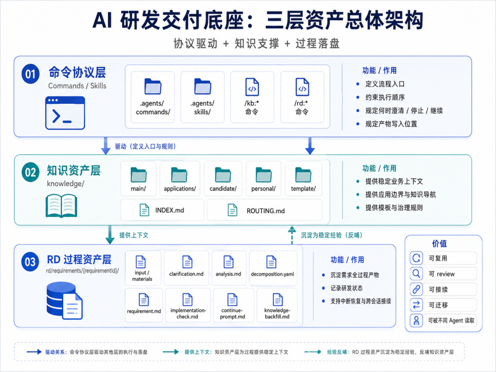
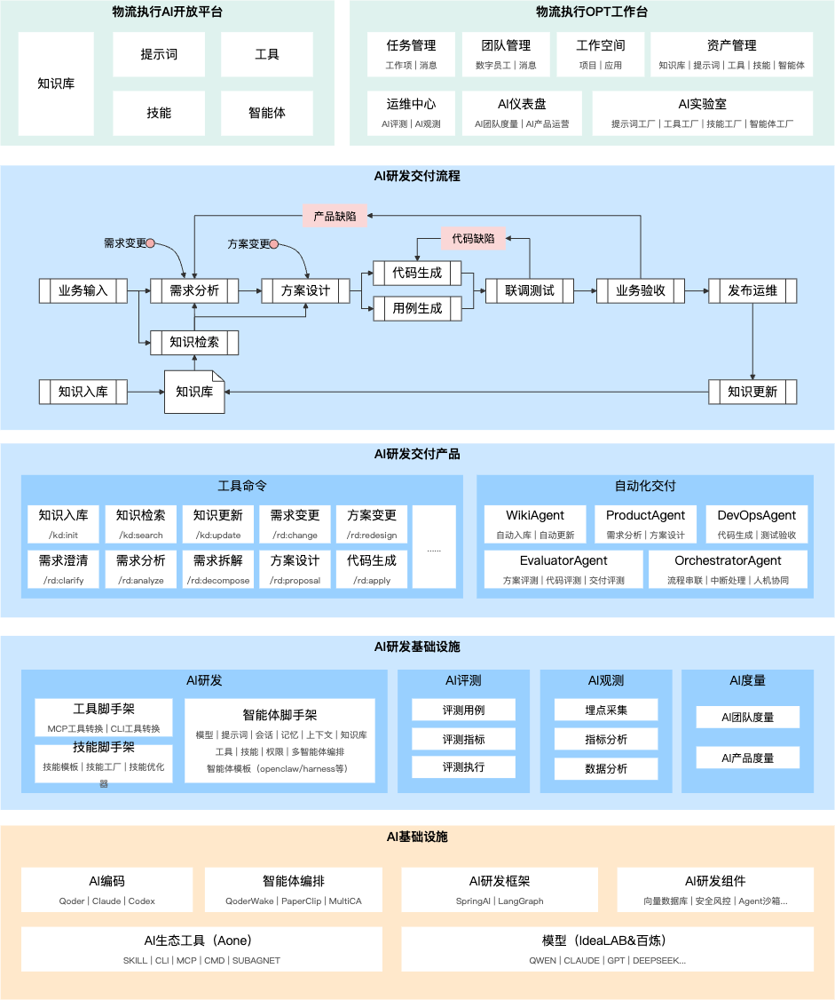
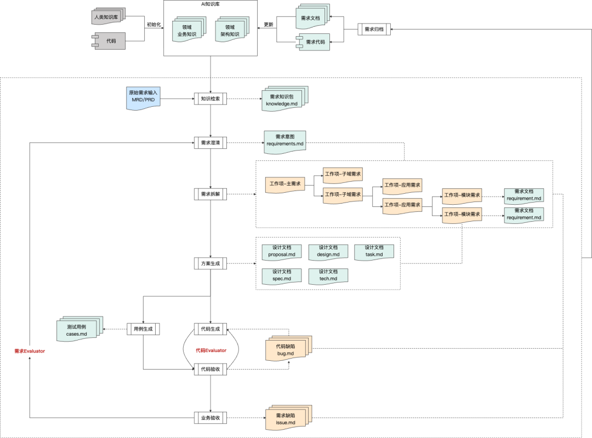
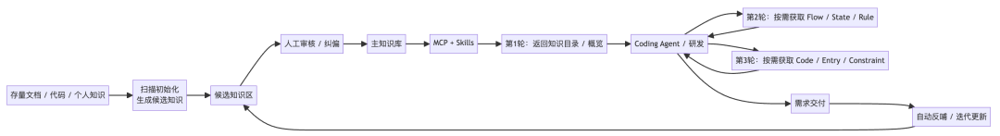
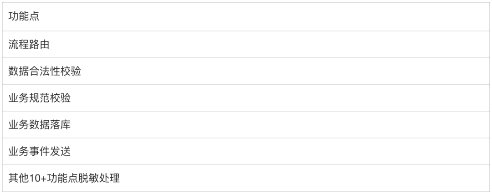

# 复杂业务团队的 AI Coding 交付实践：知识库、RD 流程和质量门禁

> 复杂业务团队落地 AI 研发交付的核心策略：**不追求 100% 全 AI 交付，通过分层知识库 + 文件化 RD 流程 + 前置质量门禁，让 AI 负责分析和实现，人聚焦关键判断。**

<!-- more -->

## 整体背景

复杂业务场景下的 AI 研发交付，逐渐形成了一些共识：通过 Wiki 补齐团队上下文，通过 skills 和研发模板约束 AI 的分析、拆解和编码过程，再通过知识回补把需求里的经验沉淀下来。

但每个团队的具体问题不同——业务复杂度不同，应用数量不同，历史包袱不同，组织分工不同，发布和质量要求也不同。Wiki 怎么建、skills 怎么写、研发模板怎么拆、review 点放在哪里，最终都会有差异。

## 三阶段落地策略

考虑到复杂业务团队的特性，文章作者没有一开始就奔着"短时间全自动化"去做，而是把 AI 研发流程的落地分成了三个阶段：

1. **第一阶段（打底）**：建设知识库，沉淀团队上下文；用 Coding Agent CLI + skills + Markdown 模板，把需求分析、应用拆解、实现校验和知识回补链路跑通（本文重点）
2. **第二阶段**：把更多流程动作交给 Agent 自动推进
3. **第三阶段**：更完整的协同交付，包括开发、测试、发布、观测、回滚等生产链路



## 核心设计：三层资产

当前系统分为三层：

- **命令协议层** (`.agents/commands/` + `.agents/skills/`)：定义 `/kb:*` 和 `/rd:*` 命令的工作方式
- **知识资产层** (`knowledge/`)：沉淀正式知识、候选知识、个人经验、模板、路由规则
- **RD 过程资产层** (`rd/requirements/{requirementId}/`)：每个需求的全过程产物

### 命令协议层

RD 流程的核心命令链：

```
需求 / PRD / Bug / 变更
  → /rd:verify-prd       (产品质量门禁)
  → /rd:work              (通用路由命令，自动引导下一步)
  → /rd:clarify           (需求澄清)
  → /rd:analyze           (需求分析，产出模块摘要)
  → /rd:decompose         (需求拆解，生成按应用的 requirement)
  → /rd:verify-requirement(需求确认门禁)
  → 业务应用仓库开发
    → /rd:apply           (代码实现)
    → /rd:validate        (对比需求与代码，更新实现状态)
    → /rd:code-review     (结合原始需求与研发规范进行 CR)
    → /rd:release-plan    (生成发布计划)
  → 发布 → 知识回补
```

`/rd:work` 作为路由命令，Agent 会根据用户输入和当前上下文自动推断意图并给出下一步引导，用户只需输入这一个命令即可。



## 知识库设计：分层知识资产

### 目录结构

```
knowledge/
├── main/           # 跨应用通用知识（术语、全局约束、跨应用流程）
├── applications/   # 应用级知识（每个应用自己的文档）
├── candidate/      # 候选知识暂存区（待确认）
├── personal/       # 个人经验（踩坑记录、排查思路）
├── template/       # 知识模板强约束
├── INDEX.md
├── README.md
├── KNOWLEDGE-RULES.md
└── ROUTING.md      # 知识路由入口
```



### main/：全局业务知识

沉淀跨应用、跨系统、跨业务线的通用知识：核心术语、跨应用流程、通用状态定义、全局技术约束、多应用都应遵守的业务规则。这些知识不能归到单个应用下，否则其他应用检索时容易遗漏。

### applications/：应用级知识

每个应用目录的结构：

```
knowledge/applications/application-xxx/
├── application-xxx.md   # 应用总览（职责、边界、上下游）
├── INDEX.md             # 应用内导航
├── domain/
│   ├── product/         # 产品能力知识（主干流程）
│   ├── solution/        # 解决方案知识（差异化扩展）
│   └── base/            # 基础索引（API、消息、模型、Repository）
└── tech/                # 技术知识（规范、架构约束、异常处理）
```

关键原则：**KB 提供稳定上下文，当前代码仍然是实现事实**。接口签名、DTO 字段、Topic 配置等易变内容，知识库只提供定位入口，改代码前必须回到仓库核对。

### candidate/：候选知识暂存区

需求执行过程中，AI 会分析出很多有价值的信息。这些内容不应直接写入正式知识库——有些结论来自当前需求上下文，有些只是推断，未经 owner 确认。通过 candidate 暂存区承接，标清来源、证据、可信度，经 review 确认后再合并到正式知识库。

### personal/：个人经验

存放个人踩坑记录、排查经验、理解草稿。不直接代表团队结论，但可作为知识入库的素材来源。

### template/：强约束模板

模板不是建议格式，而是强约束。YAML Front Matter 中的字段让 AI 能判断：知识类型、证据来源、可信度、是否需要回到代码核对。解决 AI 写知识时常见的问题：粒度漂移（今天写成流程总结，明天写成代码笔记）。

### ROUTING.md：知识路由

AI 收到需求后，不应全量读取知识库，而是通过 ROUTING 渐进式定位：

```
关键词/业务身份/Topic/接口名/状态名
  → ROUTING 定位候选业务域
  → 候选应用
  → 应用职责地图
  → 知识入口
  → 本地仓库路径
```

## RD 流程：用 Markdown 承载研发状态

需求的所有关键过程全部落盘到文件：

```
rd/requirements/{requirementId}/
├── source/
│   ├── input.md
│   ├── input.summary.md
│   ├── changes.md
│   ├── materials.yaml
│   └── materials/
├── clarification.md
├── execution-plan.md
├── analysis.md
├── analysis/
│   ├── application-a.md
│   └── application-b.md
├── decomposition.yaml
├── requirement-model.yaml
├── status.md
├── knowledge-backfill.md
└── applications/
    ├── application-a/
    │   ├── requirement.md
    │   ├── implementation-check.md
    │   └── continue-prompt.md
    └── application-b/
        └── requirement.md
```



这样做的好处：

1. **长会话可拆开**：大需求不需要在一个会话里从 PRD 写到代码
2. **新会话可接续**：上下文不依赖聊天历史，依赖落盘文件
3. **人可 review**：每个阶段的关键判断都在文件里
4. **工具可切换**：任何 Coding Agent 只要能读 Markdown，就能接入同一套研发协议

## 质量门禁：前置 fail-fast

核心哲学：**能在 PRD 阶段暴露的问题，不拖到 requirement；能在 requirement 阶段暴露的问题，不拖到编码；能在方案阶段暴露的问题，不拖到联调。**

### /rd:verify-prd

检查 PRD 或需求输入的明显缺口：
- 图片是否有文本化说明
- 状态码是否明确
- 上下游协议是否确认
- 验收标准是否可验证
- 是否与知识库已有结论冲突

### /rd:verify-requirement

进入编码前的最终确认：
- 当前应用的目标与非目标
- 影响的接口、消息、状态、字段、规则
- 应读的知识文件与代码入口
- 需要兼容的历史逻辑
- 验收标准是否可执行



## 知识回补

知识库最怕的不是不完整，而是错误知识长期存在。知识流转路径：

```
personal 个人经验
  → candidate 候选知识（标注来源、证据、可信度）
    → owner review
      → official 正式知识库
        → 需求执行中被引用
          → 代码或业务变化后更新/deprecated
```

## 核心理念

1. **不追求 100% 全 AI 交付**：AI 负责分析、拆解、实现，人聚焦关键判断和 review
2. **工具可换，沉淀不可换**：不值得长期押注某个工具形态，真正值得打磨的是业务知识、应用边界、研发规范、质量门禁
3. **渐进式上下文加载**：AI 在正确阶段读取正确粒度的上下文，避免被不重要的信息影响实现
4. **错误知识比没有知识更危险**：所有知识必须有明确的证据来源和 owner 确认
5. **RD 不适用于所有需求**：适用于跨应用、复杂业务、高发布风险的场景；小修复、样式调整、一次性脚本可直接用 Agent 修改后人工 review